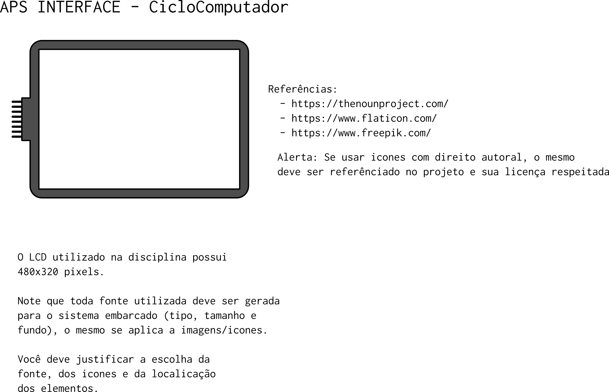

# APS - 2 - Design 

A equipe de novos produtos disponibilizou alguns requisitos funcionais do protótipo
(requisitos mínimo). 

O hardware a ser utilizado é um LCD de 320x480px colorido e touch, que faz parte
do kit: [maXTouch Xplained Pro Extension
Kit](https://www.microchip.com/DevelopmentTools/ProductDetails/ATMXT-XPRO) e que
integra com o nosso kit SAM-E70.

Na etapa de design, você deve apresentar uma especificação de interface,
ilustrada no inkscape, um documento referência é fornecido:
[ComputacaoEmbarcada/APS-2/](https://github.com/Insper/ComputacaoEmbarcada/tree/master/APS-2)
e ilustrado a seguir:

# Requisitos

Os requisitos mínimos estão listados a seguir:

#### Relógio

Indicação da hora atual, no formato: **HH:MM:SS**. Deve ser atualizado a cada
segundo.

#### Velocidade instantânea

Deve ser o componente principal da interface, medido em km/h

#### Indicação da aceleração

Deve ser um componente gráfico que indica a aceleração atual da bicicleta
(positiva/ negativa ou constante)

#### Velocidade média

Indicação em km/h da velocidade média no percurso

#### Distância do percurso

Indicação em km da distância percorrida no percurso

#### Tempo no percurso

Indicação em **HH:MM** do tempo gasto em um percurso

#### Start/ Stop/ Reset

Botões (**touch**) que permitem: Iniciar a contagem de um novo percurso, parar a
contagem desse percurso e reiniciar o percurso.

Quando o sistema estiver no módo **Stop**, o sistema deve exibir a
  velocidade instanânea, mas não pode atualizar outras informações referentes
ao percurso (velocidade média/ distância no percurso/ tempo no percurso).

A tela deve possuir um indicador se a contagem da parte referente ao percurso
está ou não ativada (Start/Stop).

## Extras

Além dessas funcionalidades, a interface a ser projetada deve ser tal que o
usuário consigo operar com apenas uma mão (lembre que é algo para ser usado na
bike) e que as informações devem ser exibidas de forma clara, considerando uma
leitura e operação em movimento.

A equipe identificou funcionalidades extras que seriam interessante ao projeto:

- Possibilitar criar vários 'Percursos'
- Exibir inclinação da bike (aclive/ plano)
- Elevação total do percurso 
- Tema Light/Dark
- Cadência do pedal
- Batimento cardíaco/ oximetria 
- Interface com GPS
e velocidade.

