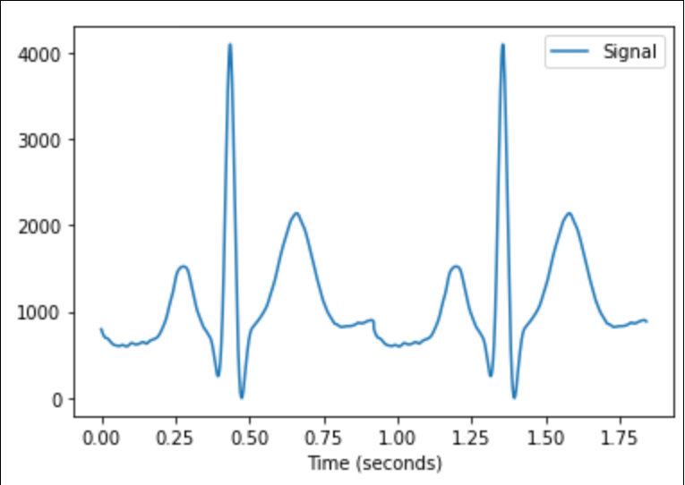

# APA 2 - Oxímetro

!!! warning ""
    Não estamos desenvolvendo um equipamento médico, mas sim um protótipo acadêmico.

Desenvolver um protótipo de um oxímetro, dispositivo médico para medir indiretamente a quantidade de oxigênio no sangue. O dispositivo será composto por um display de LCD colorido sensível ao toque (touchscreen), a interface com o usuário será através do display.

{width=300}

> fonte: https://pt.wikipedia.org/wiki/Ox%C3%ADmetro_de_pulso

## firmware

O projeto deve ser desenvolvido usando um [ RTOS](https://www.mddionline.com/software/rtos-medical-devices-101), no desenvolvimento devem isolar as tarefas de processamento de dados das de exibicão (LCD).

!!! info
    O freeRTOS não possui certificação na FDA, neste caso deveríamos optar por um RTOS que possui a aprovacão, na maioria dos casos são sistemas com licença comercial, tal como:
    
    - [SafeRTOS](http://www.highintegritysystems.com/safertos/)
    - [vxworks](https://lp.windriver.com/)

O plano original era utilizar o sensor [max30100](https://www.filipeflop.com/produto/sensor-de-batimento-cardiaco-e-oximetro-max30100/) (incluso no kit de vocês), mas após muito tempo tentando não conseguimos fazer o sensor funcionar com nossa placa, acreditamos que o mesmo veio com problema de hardware que impossibilitou o seu uso. 
    
Por conta disso iremos simular os dados que seriam lidos pelo sensor (oxigenação e batimento cardíaco). Os dados serão gerados como indicado a seguir.

### task_aps2

A `task_aps2` é a tarefa responsável gerenciar e gerar os sinais de batimento cardíaco e oximetria. 

```c
static void task_aps2(void *pvParameters) {...}
```

==Vocês não devem mexer nesta tarefa.==

### ECG

!!! tip
    - Para ter acesso ao batimento cardíaco leia o valor analógico que sai do pino PB13
    - Range do dado: 0..4095
    - Faça a leitura analógica em uma frequência de 500Hz

O electrocardiograma (ECG) será um valor analógico gerado pelo próprio microcontrolador, uma tabela do pulso elétrico foi gerado usando o pacote [neurokit2](https://pypi.org/project/neurokit2/), trado e exportado para um vetor (`aps2/ecg.h`). 

{width=300}

!!! tip
    Se tiver curiosidade de como o dado foi gerado consulte o jupyter notebook na pasta `APS2` do repositório da disciplina.

O TC0 foi configurado para operar a 1kHz onde a cada interrupção gera no pino um novo dado referente ao batimento.

```
┌───────────────────┐
│           ┌─────┐ │
│           │afec │◄├────┐
│           └─────┘ │    │
│                   │    │ ecg 
│  ┌─────┐  ┌─────┐ │    │
│  │ tc0 ├─►│dac  ├─x────┘
│  └─────┘  └─────┘ │ PB13
└───────────────────┘
```
 
Tudo acontece na interrupção do TCO:

```c
void TC0_Handler(void) {

    ...
    ...

    dacc_write_conversion_data(DACC_BASE, ecg[ecgCnt], DACC_CHANNEL);
}
```

### Oximometria

!!! tip
    - Para ter acesso ao dado de oxiometria leia o dado na fila 'xQueueOx'.
    - Range do dado: 88-99
    - Um dado a cada 2s

A oxiometria é gerada na tarefa `task_aps2` de forma artificial o dado gerado é enviado para a fila `xQueueOx` como um char. O valor gerado está dentro do range `85 .. 100` e é enviada para uma fila a cada 1 segundo, inserimos erros artificialmente no dado, se o valor não estiver no range correto vocês devem desconsiderar.

## Rubrica

A interface deve possuir identidade visual com o logo da empresa que escolheram, os recursos mínimos e extras do projeto estão listados a seguir.

### C

Deve exibir:

- Logo da empresa
- Valalor instantâneo da Oximetria
- Valor instantâneo do batimento cardíaco (bpm)
- Gráfico batimento cardíaco
- Valor salvo de oxigenação/batimento
- Alarme caso o valor de oximetria abaixe de 90
- Relógio (HH:MM)

O usuário deve ser capaz de:

- Iniciar/Parar coleta de dados
- Salvar o valor em um instante de oxigenação e batimento
- Desligar alarme

### Extras

- Possibilita ajustar relógio
- Permite que o usuário escolha novo nível de alarme para a oxigenação
- Possibilita alterar o gráfico temporal entre oxigenação e batimento cardíaco
- Salva e exibir mais de um valor (histórico)
- Indicação visual da tendência da oxigenação (seta, cor, ...).
- Animações
- Modo simplificado: Aumenta fonte e mostra apenas valores instantâneos.
