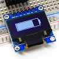

# Simulado Avaliação prática 1

Esse é um simulado de como será a avaliação prática aplicada na disciplina de Computação Embarcada. Sugerimos você fazer como se fosse a avaliação de verdade, assim terá uma ideia de como está indo na disciplina. Essa avaliação cobre os objetivos de aprendizagem da disciplina:

1.	Criar softwares para microcontroladores utilizando suas especificidades;
2.	Avaliar e melhorar soluções embarcadas integrando hardware/software levando em conta adequação a uma aplicação;
3.	Integrar em um protótipo hardware, software básico, sistema operacional de tempo real e módulos de interfaceamento com usuários, de comunicação e de alimentação.

Secundários: 

4.	Compreender as limitações de microcontroladores e seus periféricos;
5.	Buscar e analisar documentação (datasheet) e extrair informações relevantes.

!!! note "Regas"
    - Consulta a colegas/ internet constituirão violações ao Código de Ética e de Conduta e acarretarão sanções nele previstas. **Faça o seu trabalho de maneira ética!**
    - **A cada 15 minutos você deverá fazer um commit no seu código!**
        - Códigos que não tiverem commit a cada 15min ou que mudarem drasticamente entre os commits serão descartados (conceito I) !!
        - Você deve inserir mensagens condizentes nos commits!
    - **Duração: 2h**

## AV1-Simulado

!!! note "Começando"
    - Atualize o `SAME70-examples`
        - Atualize o arquivo `ALUNO.json` com seu nome e e-mail e faça um **commit** imediatamente.

Nessa avaliação iremos trabalhar com o módulo OLED1 (botões/ LEDs e Display), para isso, copie o projeto `same70-examples/screens/OLED-Xplained-Pro/SPI` para o repositório criado para entregar a avaliação. 

Para começar a trabalhar na entrega, você deve pegar o projeto recém copiado e adicionar as seguintes propriedades:

- Configurar os três botões do OLED1 com interrupção e função de callback, sendo:
    - Button0: Subida
    - Button1: Subida e Descida
    - Button2: Subida
- Configurar os três LEDs do módulo OLED1 como saída
- Fazer o microcontrolador entrar em sleepmode
  

## C

Agora com o projeto inicializado vamos começar a implementar. A ideia é de que o display do kit OLED1 exiba um bargraph que representa a frequência atual em que os 3 LEDs da placa estarão piscando. Para isso será necessário utilizar interrupções (IRQ) na leitura dos botões. 

Resumo:

- Efetuar a leitura dos botões para controlar a frequência com que os LEDs da placa piscam
- Implementar pause/play através de um dos botões
      

## C+

- Controlar a frequência dos LEDs através dos botões
- Mostra a  frequência com que os LEDs estão piscar no OLED

## B

- Utilizar IRQ para ler os botões
- Utiliza TC para piscar os LEDs.

## B+

- Implementar pause/play através dos botões

## A

- Exibir a frequência atual do LED por meio de um Bargraph no OLED: 

 
