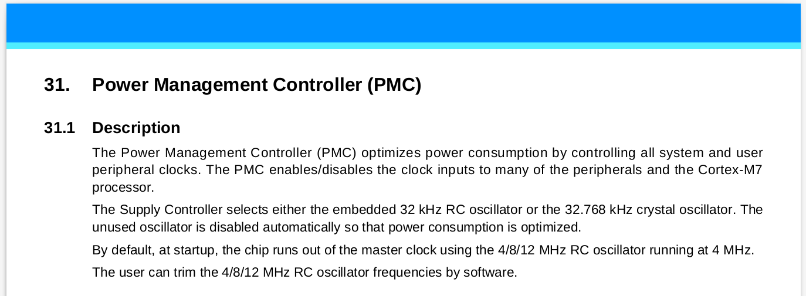
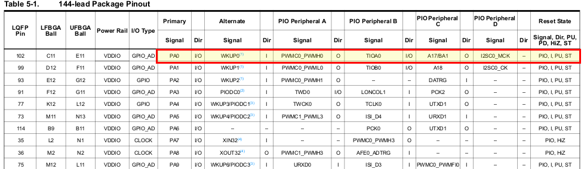
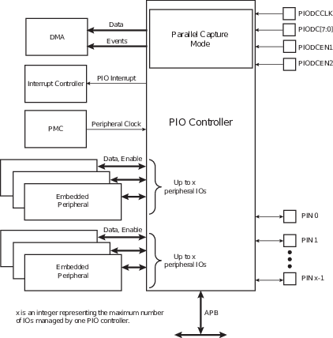

# Lab 1 - Digital IO 

!!! note "Leitura extra ecomendada"
    - [Renesas - GPIO](https://www.renesas.com/in/en/support/technical-resources/engineer-school/mcu-programming-peripherals-01-gpio.html)
    - [ARM](https://www.arm.com/products/silicon-ip-cpu)

## Periféricos

!!! note "Leitura Manual"
    Utilize o manual encontrado em: [Manuais/SAME70](https://github.com/Insper/ComputacaoEmbarcada/blob/master/Manuais/SAME70.pdf) para mais informações nesse assunto.

Periféricos são hardwares auxiliares encontrados no microcontrolador (uC) que fornecem 
funcionalidades extras tais como: gerenciador de energia (SUPC), 
comunicação serial UART (UART), comunicação USB/ Ethernet/ Bluetooth ...,
controlador de saída e entrada paralela (PIO), dentre muitos outros.

Os periféricos são configuráveis via escrita/leitura nos registradores
do microcontrolador, cada periférico possui um endereço único mapeado em
memória.

## Controlando um pino

Vamos imaginar uma aplicação comum de um microcontrolador: controlar um pino digital (Ligado/ Desligado). Esse pino pode estar conectado a um LED, por exemplo. Nosso objetivo é conseguirmos escrever um software que seja capaz de colocar energia (VCC/ ligado) no pino, ou desligar o pino (GND/ desligar). Como ilustrado no diagrama a seguir:

Dois periféricos serão utilizados para que possamos controlar os pinos do uC de forma digital (liga/ desliga),
são eles o Power Manager Contoller (**PMC**) e o Parallel Input Output (**PIO**). 
O PMC é o periférico responsável por "gerenciar" a energia dos demais periféricos do 
uC SAME70 e o PIO é o periférico responsável por controlar um pino digital desse uC. 
Como demonstrado a seguir:

!!! note
    Pense nos periféricos como pequenos hardwares auxiliares ao microprocessador, esses periféricos fazem parte
    do chip.

!!! info
    Os termos técnicos podem variar entre fabricantes, porém o conceito é o mesmo. Por exemplo,
    é comum o uso de General Propose I/O (GPIO) no lugar de PIO.
    
!!! note
    Nesse exemplo, a memória do uC é omitida. Nesse 
    caso seriam adicionados mais dois periféricos, um para a memória de programa (flash) e outra para a memória
    de dados (SRAM)

### Power Manager Contoller - PMC 

!!! example "Leitura datasheet"
    Seção 31 do [datasheet SAME70](https://github.com/Insper/ComputacaoEmbarcada/blob/master/Manuais/SAME70.pdf)

O Power Management Controller (PMC) é um periférico responsável por
gerenciar a energia e clock dos demais periféricos. Para utilizarmos um
periférico é necessário primeiramente ativarmos o mesmo no PMC.

Cada periférico é referenciado no PMC via um número único (ID), esse ID
também será utilizado para o gerenciamento de interrupções. Os IDs estão
listados na Tabela: **13.1 do datasheet SAM-E70**.

### Parallel Input Output (PIO)  

!!! note "Leitura datasheet"
    Secção 32 do datasheet. **Leitura necessária**

No ARM-Atmel os pinos são gerenciados por um hardware chamado de
**Parallel Input/Output Controller (PIO)**, esse dispositivo pode
gerenciar até 32 diferentes pinos (I/Os).

Além do controle direito do pino pelo PIO, cada I/O no ARM-Atmel pode
ser associado a uma função diferente (periférico), por exemplo: o I/O
`PA20`  pode ser controlador pelo periférico do PWM enquanto o `PA18`
e pela UART.

Isso fornece flexibilidade ao desenvolvimento de uma aplicação, já que
os I/Os não possuem uma funcionalidade fixa. Existe uma tabela que informa quais I/Os cada periféricos
podem controlar.

Podemos interpretar a tabela como: o pino `102` do microcontrolador
identificado como `PA0` (PIOA_0) pode ser utilizado como `WKUP0`
(wakeup) ou mapeado para um dos três periféricos:

  - Periférico A: PWM (Pulse width modulation)
  - Periférico B: TIOA0 (Timer 0)
  - Periférico C: I2C_MCL (I2C master clear)

A tabela na página 16 do datasheet (Table 5-1) ilustra quais periféricos
podem ser associados aos respectivos pinos, a Fig. Mux PIOA mostra as opções para o PIOA0 até
PIOA9.

O SAME70 possui internamente 5 PIOs: PIO **A**, PIO **B**, PIO **C**, 
PIO **D** e PIO **E**. Cada um é responsável por gerenciar até 32 pinos.

Os I/Os são classificados por sua vez em grandes grupos: A, B,C …. (exe:
PA01, PB22, PC12) e cada grupo é controlado por um PIO (PIOA, PIOB,
PIOC, …).

Cada PIO possui controle independente de energia via o PMC, sendo necessário
ativar o clock de cada PIO para que o periférico passe a funcionar.

#### Configurações

O PIO suporta as seguintes configurações:

  - Interrupção ao nível ou borda em qualquer I/O
  - Filtragem de "glitch"
  - Deboucing
  - Open-Drain
  - Pull-up/Pull-down
  - Capacidade de trabalhar de forma paralela

Iremos ver para que serve algumas dessas configurações ao longo do curso.

#### Funcionalidade

O diagrama de blocos do PIO é ilustrado no diagrama de blocos (Block Diagram)

onde:

1.  Peripheral DMA (direct memmory access) controller (PDC): O P/IO
    pode receber dados via DMA.

    - DMA é uma forma automática de transferência de dados.

2.  Interrupt Controller: Já que o PIO suporta interrupções nos I/Os o
    mesmo deve se comunicar com o controlador de interrupções para
    informar a CPU (NVIC) que uma interrupção é requisitada.

3.  PMC: A energia e clock desse periférico é controlado pelo PMC
    (Power management controller).

4.  Embedded peripheral: O acesso aos pinos pelos periféricos do uC é realizado
    via PIO.
    
Um diagrama lógico mais detalhado pode ser encontrado no datasheet (I/O Line Control Logic), esse diagrama mostra as funções dos registradores e seu impacto no PIO.

 
