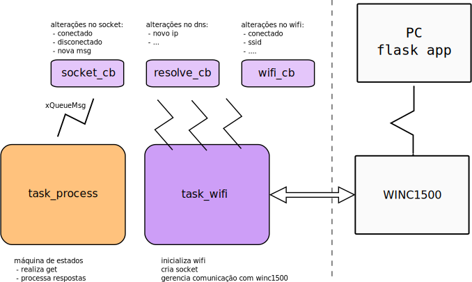

# RTOS - WIFI


Nesse lab iremos modificar o exemplo RTOS-WIFI, que realiza uma requisição GET em um webserver (Flask) rodando em seu computador, onde o mesmo após receber essa requisição retorna um dado `JSON`. 

!!! note "Preencher ao finalizar o lab"
    <iframe src="https://docs.google.com/forms/d/e/1FAIpQLSfanTEVc7BZ5gc7bTSkB7ICCUjANdb8cnKjqtQm7eFZoXL1tQ/viewform?embedded=true" width="640" height="520" frameborder="0" marginheight="0" marginwidth="0">Carregando…</iframe>

## Lab    

| Exemplo base                                                     | LAB                 |
| ------------------------------------------------------------     | ------------------- |
| `SAME70-Examples/RTOS/WIFI-WINC1500-get-RTOS-EXT1` :arrow_right: | `Labs/11-RTOS-WIFI` |

!!! warning "Código exemplo"

    - Vamos modificar o código exemplo `RTOS/RTOS-WIFI`, faça uma cópia do seu lab para a nova pasta no seu repositório `Labs/11-RTOS-WIFI`

!!! note "Terminal"
    Esse exemplo faz uso da comunicação UART para debug de código (via printf), para acessar o terminal no atmel estúdio clique em:  :arrow_right: View :arrow_right: Terminal Window
    
    Configure o terminal para a porta que (COM) correta (verificar no windows) e para operar com um BaudRate de `115200`.

### IoT	

IoT (Internet of Things) é um conceito que tem como objetivo a conexão entre objetos e a internet, ela faz parte da revolução da Industria 4.0 e está cada vez mais presentes em nossas vidadas. Desenvolver sistemas embarcados muitas vezes envolvem conectar esses sistemas na internet, e isso pode se dar de diversos meios possíveis:

1. Cabo de rede (ethernet)
1. Conexão WIFI
1. 3G/4G/GSM
1. Sistemas de comunicação de baixa energia:
   - LoRa/ ...
1. Sistema de comunicação proprietário 
   - AM/FM/...

Para cada aplicação existe uma forma de comunicação ideal, e vocês como engenheiro de computação
devem estar cientes dessas formas e saber interagir com elas.

Nesse laboratório iremos explorar um pouco a comunicação WIFI em sistemas embarcados, para isso iremos conectar um módulo externo a nossa placa que servirá como 'placa de rede' do nosso microcontrolador, esse módulo é o WINC 1500.


### WINC1500

Existem inúmeros módulos wifi para serem utilizados em sistemas embarcados, existe até microcontroladores que possuem toda a parte wifi integrada no chip (exemplo: [STM32](https://www.st.com/en/microcontrollers-microprocessors/stm32-wireless-mcus.html)), nesses casos não é necessário conectar um módulo externo, tudo está integrado no chip (tirando a antena)!

O módulo que iremos utilizar é desenvolvido pela microchip e chama [Winc1500](http://ww1.microchip.com/downloads/en/DeviceDoc/70005266B.pdf)

<div style="text-align: center;" class="no-print"><embed src="http://ww1.microchip.com/downloads/en/DeviceDoc/70005266B.pdf" width="650" height="500"></div>

Esse módulo possui comunicação SPI (similar a UART, porém desenvolvida para comunicação entre chips), para nosso uC enviar/ receber um dado wifi, temos que nos comunicar com esse módulo. Essa parte está feita nos exemplos fornecidos, e é chamada de comunicação M2M: [Machine-to-Machine](https://en.wikipedia.org/wiki/Machine_to_machine).

## Exemplo 

Esse laboratório faz uso do exemplo disponível no repositório `SAME70-Examples/RTOS/WIFI-WINC1500-get-RTOS-EXT1` que possui duas partes:

- `python-server`: servidor em flask que possui um forms e uma página de status que retorna um valor em json 
- `WIFI-RTOS-get`: firmware a ser executado na nossa placa.

### python-server

O servidor em flask é simples e permite que alteremos uma variável `led` via um form:

-  (http://localhost:5000)

{width=300}

E uma página de status, que exibe o valor enviado no forms em json:

- http://localhost:5000/status

{width=300}

#### Preparando o WebServer

Acesse a pasta `python-server` que contém o script `server.py`, instale o flask via pip e execute o programa:

```bash
pip install -r requirements.txt --user
python server.py --host=0.0.0.0
```

O resultado esperado deve ser o seguinte:

```bash
➜  python-server git:(master) ✗ python server.py
 * Serving Flask app "server" (lazy loading)
 * Environment: production
   WARNING: This is a development server. Do not use it in a production deployment.
   Use a production WSGI server instead.
 * Debug mode: on
 * Running on http://0.0.0.0:5000/ (Press CTRL+C to quit)
 * Restarting with stat
 * Debugger is active!
 * Debugger PIN: 278-674-158
```

Para validar, conecte **seu celular** na mesma rede wifi e acesse o ip da sua máquina na porta 5000 e valide se o webserver está funcionando.

!!! info
    Deixe o servidor rodando, vamos fazer o embarcado se conectar nele.

!!! tip
    Para descobrir seu IP abra outro terminal e execute o comando `ipconfig`, aqui para mim eu tive que acessar:
    
    http://192.168.0.138:5000
    
    **Anote esse IP, iremos usar mais para frente**
    
!!! example "Tarefas"
    1. Instalar `requirements.txt`
    1. Subir o servidor flask
    1. Validar local (`http://localhost:5000`)
    1. Validar de outro dispositivo (exemplo: `http://192.168.0.138:500`)
        - isso testa se o seu windows está permitindo acesso externo ao seu server, precisamos disso já que queremos que o embarcado se conecte a esse servidor.
    1. Mantenha o servidor em execução.
    ==NÃO SIGA SEM QUE TODOS OS PASSOS ANTERIORES ESTIVEREM FUNCIONANDO==
 
###  `WIFI-RTOS-get`
 
 Vamos agora explorar e executar o nosso firmware.
 
#### Conectando o hardware

Conecte o módulo `WINC1500` no EXT-1 do kit de desenvolvimento.

| Diagrama                               | Conexão                          |
| --                                     | ---                              |
| {width=300} | {width=300} |

#### Entendendo o firmware

Vamos relembrar um pouco de camada física e tec-web agora, toda vez que você acessa uma página da internet um socket e criado, esse socket e um canal de comunicação TCP/UDP entre dois pontos via internet. Uma vez estabelecido o socket o client (no nosso caso o embarcado) pode fazer uma requisição (get) ou um envio de informação (post). Nesse exemplo iremos fazer um `get` no servidor que está rodando no seu computador.


Nosso firmware irá Seguindo os passos a seguir:

- WIFI:
    1. Conecta no roteador
    1. Busca IP no DCHP

- Socket (loop)
    1. Cria novo socket
    1. Realiza get
    1. Lê ack
    1. Lê mensagem

#### tasks

O firmware exemplo possui duas tarefas: `task_wifi` e `task_process`, a primeira é responsável por realizar toda a comunicação com o módulo WINC1500 e fazer a inicialização da comunicação socket com o webserver em python, a segunda é responsável por gerenciar as mensagens que serão enviadas para o servidor.



A `task_wifi` gerencia alguns `callbacks` de software, que são eventos gerados do módulo wifi, existem vários callbacks que podem ser utilizados, nesse exemplo usamos:

- `wifi_cb`: callback de eventos relacionado a camada física do wifi ( conexão, ssid list, ...)
- `resolve_cb`: callback relacionado a resolução de nome no DNS, se quisermos acessar um HOST_NAME e não um ip (google.com -> 10.21.3.12).
- `socket_cb`: eventos de socket (conexão/ nova mensagem/ erro/ ...)

A `task_process` aguarda um socket ter sido criado na `task_wifi` e quando isso for verdadeiro faz um envio de um comando do tipo `get` e aguarda por dois pacotes de retorno, o `ack` e a `msg`, que contém o payload requisitado (no nosso caso um json).

Essa tarefa foi implementada com a máquina de estados a seguir em mente, usando o operador [`switch case`](https://blogs.itemis.com/en/how-to-use-state-machines-for-your-modelling-part-3-the-big-switch-statement)

```c
 enum states {
    WAIT = 0,
    GET,
    ACK_REQ,
    ACK,
    MSG_REQ,
    MSG,
    TIMEOUT,
    DONE,
  };
```

{width=400}

## Lab

!!! info
    Abra o projeto no Atmel Studio

Vamos agora começar o lab para valer, primeiro vamos executar o exemplo. Mas para isso é necessários configurarmos o módulo wifi para acessar a rede que está disponível ai na sua casa.

### Preparando o firmware

Devemos configurar o `main.h` do exemplo adicionando as informações do roteador na qual ele deve se conectar, edite o arquivo com as configurações da sua rede:

A configuração da rede:

``` C
/** Wi-Fi Settings */
#define MAIN_WLAN_SSID    "LabArqComp" /**< Destination SSID */
#define MAIN_WLAN_PSK     "s4m370xpld" /**< Password for Destination SSID */
```

IP e porta do servidor (seu computador):

``` h
#define MAIN_SERVER_PORT  5000
#define MAIN_SERVER_NAME  "192.168.42.42"
```

!!! warning
    - O sistema embarcado e o webserver devem estar na mesma rede!
    - O modulo winc1500 só se conecta em rede de 3Ghz

!!! example "Tarefa"
    - Conecte o WINC1500 no EXT1
    - Adicione informações do SSID da sua rede
    - Modifique o IP do servidor com o IP da sua máquina
    - Programe o uC

#### Resultados esperados

Terminal Window (Atmel Studio):

{width=300}

Terminal do flask:

```bash
192.168.0.107 - - [26/May/2020 16:51:07] "GET /status HTTP/1.1" 200 -
192.168.0.107 - - [26/May/2020 16:51:17] "GET /status HTTP/1.1" 200 -
```

!!! info "Breve descrição do funcionamento"

    Nosso embarcado envia uma requisição GET através do `MAIN_PREFIX_BUFFER` definido dentro do `main.h`:

    ```c
    /** Send buffer of TCP socket. */
    #define MAIN_PREFIX_BUFFER                  "GET /status HTTP/1.1\r\n Accept: */*\r\n\r\n"
    ```

    Nosso webserver (Flask) recebe essa requisição e verifica o que foi recebido, nesse caso ele recebe o "/status" após o GET e responde com o seguinte JSON `{led' : '1'}`:

    ```py
    @app.route('/status', methods = ['POST', 'GET'])
    def status():
      global led
      if request.method == 'POST':
          status = request.form
          led = status['LED']
          return render_template("status.html", status = status)
      else:
          return jsonify({'led' : led}), 200
    ```

### Acionando LED conforme `led:status`

Vamos agora acionar o LED da placa conforme o status recebido no comando `get`, se valor igual a `0` apagamos o LED da placa e se valor igual a `1` acendemos o LED da placa.

!!! warning
    Você deve inicializar o pino do LED da placa como saída! Isso não está feito.

Para isso, será necessário realizar o parse da mensagem HTML que é enviada pelo servidor, isso deve ser feito dentro da `task_process`. Lembre que nessa tarefa implementamos uma máquina de estados, e é no estado `msg` que possuímos a mensagem com o status do nosso LED.

??? info "case msg"
    ```c
      case MSG:
      printf("STATE: MSG \n");
      memset(g_receivedBuffer, 0, MAIN_WIFI_M2M_BUFFER_SIZE);
      recv(tcp_client_socket, &g_receivedBuffer[0], MAIN_WIFI_M2M_BUFFER_SIZE, 0);

      if(xQueueReceive(xQueueMsg, &p_recvMsg, 5000) == pdTRUE){
        printf(STRING_LINE);
        printf(p_recvMsg->pu8Buffer);
        printf(STRING_EOL);  printf(STRING_LINE);
        state = DONE;
      }
      else {
        state = TIMEOUT;
      };
      break;
    ```

A mensagem com o conteúdo (head + json) é salva no buffer `p_recvMsg->pu8Buffer)`. 

!!! info "Exemplo do conteúdo do buffer"
    ```
    Content-Type: application/json
    Content-Length: 15
    Server: Werkzeug/1.0.1 Python/3.6.9
    Date: Tue, 26 May 2020 20:23:04 GMT

    {
      "led": 0
    }
    
    ```

É necessário processar esse buffer e encontrar o valor que está associado ao `led`. A forma mais 'fácil' de se fazer isso com C é utilizando a função [`strstr`](https://www.tutorialspoint.com/c_standard_library/c_function_strstr.htm), que retorna um ponteiro para o local de onde foi encontrado a substring.

> The C library function char *strstr(const char *haystack, const char *needle) function finds the first occurrence of the substring needle in the string haystack. The terminating '\0' characters are not compared.
> 
> Fonte: https://www.tutorialspoint.com/c_standard_library/c_function_strstr.htm

!!! tip
    Busque no buffer a substring `"led": `.

!!! example "Tarefas"
    1. Inicialize o led da placa como saída
    1. Modificar o estado `get` para encontrar o valor do led
    1. modifique o status do led:
       - status = 1: acende
       - status = 0: apaga

== até aqui é C.==     

### B - melhorando

Podemos melhorar várias coisas nesse projeto, mas vamos por partes. A primeira coisa que podemos fazer é adicionar o botão da placa e fazer ele também controlar o LED.

!!! example "Tarefa"
    - Adicione o botão da placa  -> callback -> semáforo 

### A - post

- post do botão -> LED


