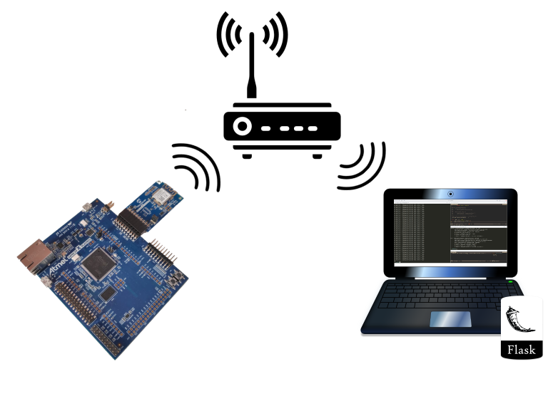

# RTOS - WIFI



Nesse lab iremos modificar o exemplo RTOS-WIFI, que realiza uma requisição GET em um webserver (Flask) rodando em seu computador, onde o mesmo após receber essa requisição retorna um dado JSON. 

!!! note "Preencher ao finalizar o lab"

    Criar FORMs

## Lab    

| Exemplo base                                                 | LAB                 |
| ------------------------------------------------------------ | ------------------- |
| `SAME70-Examples/RTOS/WIFI-WINC1500-get-RTOS-EXT1` :arrow_right: | `Labs/11-RTOS-WIFI` |

!!! warning "Código exemplo"

    - Vamos modificar o código exemplo `RTOS/RTOS-WIFI`, faça uma cópia do seu lab para a nova pasta no seu repositório `Labs/1-RTOS-WIFI`

!!! note "Terminal"
    Esse exemplo faz uso da comunicação UART para debug de código (via printf), para acessar o terminal no atmel estúdio clique em:  :arrow_right: View :arrow_right: Terminal Window
    

    Configure o terminal para a porta que (COM) correta (verificar no windows) e para operar com um BaudRate de `115200`.

### IoT	

IoT (Internet of Things) é um conceito que tem como objetivo a conexão entre objetos, como por exemplo objetos onde é para acionamento como lâmpadas, motores, etc... Ou pontos de aquisição de dados utilizando sensores como os de temperatura, nível, etc... 

#### Webserver - Flask

Um webserver fica responsável por receber requisições de clientes HTTP e gerar uma respostas a partir dessa requisição. Nesse lab utilizamos o [Flask](https://flask.palletsprojects.com/en/1.1.x/) para criar esse webserver em python que assim que receber um GET responde um Hello World na seguinte formatação:

```
HTTP/1.0 200 OK
Content-Type: application/json
Content-Length: 25
Server: Werkzeug/1.0.1 Python/3.7.3
Date: Fri, 08 May 2020 15:00:42 GMT

{
    "hello": "world"
}
```


#### Preparando o WebServer

Acesse a pasta `Labs/11-RTOS-WIFI/WIFI-WINC1500-get-RTOS-EXT1/python-server` que contém o script `server.py`, instale o flask via pip e execute o programa:

```bash
pip install -U Flask --user
pip install flask-restful
python server.py
```

O resultado esperado deve ser o seguinte:


Após isso seu servidor estará rodando, basta descobrir qual o IP local da sua máquina. Abra outro prompt e digite `ipconfig` e pressione enter:


Nesse caso o IP é o `192.168.42.104`  que é mesmo onde está rodando o webserver.


#### Preparando o Firmware

Devemos configurar o `main.h` do exemplo, editando:

A configuração da rede:

```c
/** Wi-Fi Settings */
#define MAIN_WLAN_SSID                    "LabArqComp" /**< Destination SSID */
#define MAIN_WLAN_AUTH                    M2M_WIFI_SEC_WPA_PSK /**< Security manner */
#define MAIN_WLAN_PSK                     "s4m370xpld" /**< Password for Destination SSID */
```

IP e porta do servidor (seu computador):

```c
#define MAIN_SERVER_PORT                    (5000)
#define MAIN_SERVER_NAME                    "192.168.42.42"
```

!!! warning

​    O sistema embarcado e o webserver devem estar na mesma rede!

#### Resultados esperados

Terminal Window (Atmel Studio):


Prompt onde foi iniciado o `server.py`:


#### Breve descrição do funcionamento

- Nosso embarcado envia uma requisição GET através do `MAIN_PREFIX_BUFFER` definido dentro do `main.h`:

```c
/** Send buffer of TCP socket. */
#define MAIN_PREFIX_BUFFER                  "GET / HTTP/1.1\r\n Accept: */*\r\n\r\n"
```

-  Nosso webserver (Flask) recebe essa requisição e verifica o que foi recebido, nesse caso ele recebe o "/" após o GET e responde com o seguinte JSON `{'hello' : 'world'}`:

  

  


### C Botão > GET > WebServer

Vamos criar um botão que quando pressionado envia uma mensagem para o servidor e quando solto envia outra.

Primeiramente temos que conseguir alterar o que será enviado para o servidor, então vamos aproveitar o código já existente:

- Altere o `main.h` e separe o #define do MAIN_PREFIX_BUFFER , fazendo com que seja possível alterar a parte que será enviada: 

```diff
/** Send buffer of TCP socket. */
-	//#define MAIN_PREFIX_BUFFER                  "GET / HTTP/1.1\r\n Accept: */*\r\n\r\n"
+	#define MAIN_PREFIX_BUFFER                  "GET "
+	char bufferSend[128] = "/";
+	#define MAIN_SUFIX_BUFFER                  " HTTP/1.1\r\n Accept: */*\r\n\r\n"
```

- No `main.c` configure o botão para alterar a variável `bufferSend` quando pressionado

!!! example "Modifique"
    Inclua os defines do botão e também uma flag para verificarmos seu estado   
    ```c
    #define BUT1_PIO			PIOA
    #define BUT1_PIO_ID			ID_PIOA
    #define BUT1_PIO_IDX		11
    #define BUT1_PIO_IDX_MASK	(1u << BUT1_PIO_IDX)
	
	int flag_but1 = 0;
	```

!!! example "Modifique"
    Configure o botão
    ```c
	pmc_enable_periph_clk(BUT1_PIO_ID);
	pio_configure(BUT1_PIO, PIO_INPUT, BUT1_PIO_IDX_MASK, PIO_PULLUP);
	pio_handler_set(BUT1_PIO, BUT1_PIO_ID, BUT1_PIO_IDX_MASK, PIO_IT_FALL_EDGE, but1_callback);
	pio_enable_interrupt(BUT1_PIO, BUT1_PIO_IDX_MASK);
	NVIC_EnableIRQ(BUT1_PIO_ID);
	NVIC_SetPriority(BUT1_PIO_ID, 4); // Prioridade 4
    ```

!!! note 
    Utilizando o `PIO_IT_FALL_EDGE` quando pressionado o botão entra na interrução e quando solto ele entra novamente.
	
!!! example "Modifique"
    Inclua a função de callback para alterar a variável bufferSend
    ```c
	flag_but1 = !flag_but1;
	if(flag_but1) sprintf(bufferSend, "%s", "/");
	else sprintf(bufferSend, "%s", "/but1");
    ```

!!! note 
	O botão deverá mandar "/but1" para o WebServer quando pressionado e "/" quando não pressionado.
	
- No `server.py` devemos incluir o código e tratar a mensagem que será enviada pelo botão:

```diff
from flask import Flask, request
from flask_restful import Resource, Api

app = Flask(__name__)
api = Api(app)

todos = {}

class HelloWorld(Resource):
    def get(self):
        return {'hello' : 'world'}
		
+class TrataBotao1(Resource):
+   def get(self):
+       return {'Botao1' : 'Pressionado'}

#class TodoSimple(Resource):
#    def get(self, todo_id):
#        return {todo_id: todos[todo_id]}
#
#    def put(self, todo_id):
#        todos[todo_id] = request.form['data']
#        return {todo_id: todos[todo_id]}

#api.add_resource(TodoSimple, '/<string:todo_id>')
api.add_resource(HelloWorld, '/')
+api.add_resource(TrataBotao1, '/but1')

if __name__ == '__main__':
    app.run(host='0.0.0.0',debug=True)
    #app.run(debug=True)
```

#### Resultados esperados

Enquanto o botão estiver pressionado o WebServer deverá responder com {'Botao1' : 'Pressionado'}:


Quando não pressionado deverá responder com {'hello' : 'world'}:


