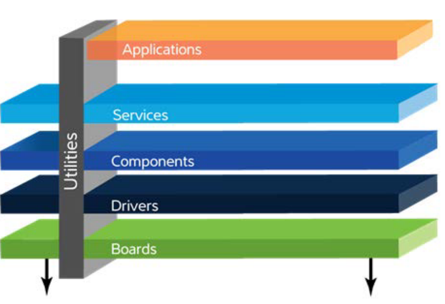

# Driver - Teoria

Para que nosso `firmware` atue corretamente sobre o hardware será necessário ampliarmos nossos conhecimentos sobre o mesmo. O `PIO` é um dos periféricos mais utilizados durante um projeto, e aparentemente o mais simples desse nosso uC (só que não!) com ele temos o controle de praticamente todos os pinos digitais do uC. O entendimento de como o mesmo funciona e como ele é configurado irá possibilitar que utilizemos outros periféricos mais para frente.

Não existe segredo! Será necessário abrirmos o [manual do uC](https://pt.scribd.com/document/398420674/SAME70) de mais de 1000 páginas e lermos as informações que o fabricante disponibiliza, lá teremos detalhado o que deve ser feito para ativarmos uma determinada função ou realizar uma configuração no periférico (isso vale para todos os [microcontroladores](http://www.ti.com/lit/ds/symlink/msp430g2553.pdf)). Cada chip e cada fabricante opta por implementar uma solução diferente, mais o formato do documento é mais ou menos o mesmo. 

As soluções não são tão distintas assim, com a prática conseguimos aos poucos ir pegando o linguajar e os truques, mas isso não diminui a necessidade de ler e reler o manual (e muitos manuais...) até encontrar a informação que busca.

Os periféricos são controlados por registradores. Registradores são pequenas unidades de armazenamento que se comportam como uma memória quando alinhados (bem parecido com elementos, na construção da memória RAM). É pelos registradores que podemos ler e/ou escrever uma informação do periférico.

Se tiver curiosidade de como esse lab seria realizado para outro uC, dê uma lida nesse [post do EmbeddedFM](https://www.embedded.fm/blog/2016/5/16/ese101-peripherals-part-1)

## Registradores

!!! note "8. Memory Map and Registers"

    [Coursera: Embedded Software and Hardware Architecture]( https://pt.coursera.org/lecture/embedded-software-hardware/8-memory-map-and-registers-aQV4p)

Os registradores podem ser utilizados no hardware de diversas maneiras: Cada bit do registrador (de 32 bits) pode fazer uma ação diferente no periférico; os 32 bits podem representar um número; cada bit pode configurar uma parte do periférico.

No caso do PIO temos ao todo 89 registradores, e cada um tem um papel nesse periférico. Na documentação do PIO temos um diagrama que mostra alguns desses registradores e seus papeis no HW:

## Estrutura de software

Sistemas embarcados tendem a possuir softwares muito complexos: Conectividade (wifi/ethernet/bluetooth), interface com usuário ( LCD / teclados /...), requisitos de tempo real, bateria, segurança de dados e para ajudar tudo isso miniaturizado em um hardware dedicado. 

Como estamos trabalhando com baixo nível, muitas vezes precisamos configurar todas essas funcionalidades na 'unha', para isso, iremos utilizar uma estrutura de softwares que possui uma série de abstrações que facilitam a vida do desenvolvedor, diminui o tempo de desenvolvimento e minimiza erros.

Essa estrutura é formada por: Drivers, HAL e Sistema Operacional, conforme detalhado a seguir:

## Driver

Um driver (framework/ api) são funções que possibilitam acessar o baixo nível sem se preocupar muito de como acessar o hardware, as funções fornecem uma forma direita de manipular registradores e core. 

No nosso caso, iremos utilizar um framework chamado de [Advanced Software Framework Version 4](https://www.microchip.com/mplab/avr-support/advanced-software-framework), ele e fornecido e mantido pelo fabricante do microcontrolador que usamos no curso (SAME70) e serve para várias famílias de uC ARM (SAMD20 / SAMV71 / SAMG54 /...). Foi com o ASF que fomos capazes de realizar o LAB1, onde configuramos pinos como entrada e saída e fomos capazes de ler e escrever nesses pinos.

{width=500}

> fonte: http://asf.atmel.com/docs/latest/architecture.html

## HAL

[Hardware Abstraction Layer (HAL)](https://en.wikipedia.org/wiki/HAL_(software)) é uma camada de abstração mais alta, fica geralmente entre o sistema operacional e o driver. Ela é criada para facilitar o desenvolvimento dos OS, que necessita acessar e configurar hardwares de tipos diferentes. Essa abstração estabelece um padrão de acesso (via chamada de funções) para o sistema operacional.

A ARM tem tentando criar um HAL universal para os seus microcontroladores, mas ainda não possui muita adesão da industria e dos desenvolvedores. Esse movimento se deu para possibilitar que um firmware seja portável entre diferentes fabricantes (o que não é possível de forma direta hoje em dia, cada fabricante disponibiliza o seu próprio HAL). O [*Cortex Microcontroller Software Interface Standard* (cmsis)](https://developer.arm.com/embedded/cmsis) é essa biblioteca que está sendo desenvolvido pela ARM.

> Fonte: https://arm-software.github.io/CMSIS_5/Driver/html/index.html

Já parou para pensar por que o Arduino é tão popular? Por que ele venceu essa batalha e não outro kit de desenvolvimento? (existem muitossss kits de desenvolvimento, de uma olhada nessa [lista da digikey](https://www.digikey.com/products/en/development-boards-kits-programmers/evaluation-boards-embedded-mcu-dsp/786).

Na minha visão é devido a ele possuir um ótimo HAL, você se importa com qual Arduino está trabalhando? UNO, DUE? ... Não! As funções que utiliza para configurar os pinos com saída/entrada/ PWM/ AD são as mesmas, não importa o Arduino que esteja usando. 

Como as funções são as mesmas se o chip muda? Devido ao HAL que o Arduino fornece que abstrai o acesso ao hardware pela chamada de funções. As funções são simples e intuitivas! Elas escodem tudo que é de complexo do hardware.

!!! note "Curiosidade"
    Curiosidade: De uma olhada no código fonte da popular função do arduino: [`pinMode()`](https://github.com/arduino/ArduinoCore-avr/blob/0e7fae85bdfbab43242374c0289cdd806d13b0bc/cores/arduino/wiring_digital.c#L29). Ela usa o ASF da microchip para ser implementada.
