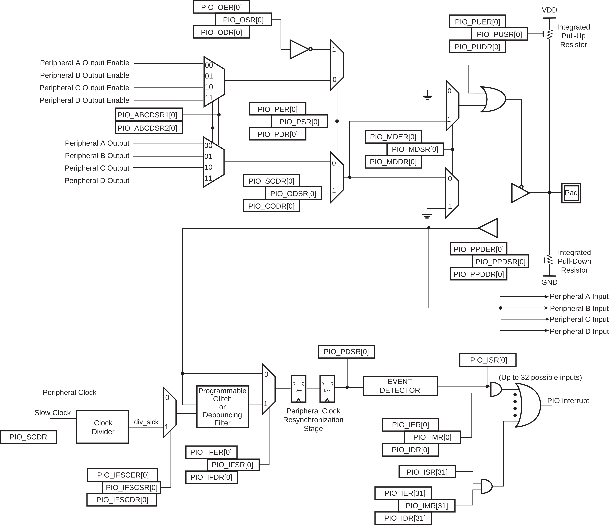

Para que nosso `firmware` atue corretamente sobre o hardware será necessário ampliarmos nossos conhecimentos sobre o mesmo. O `PIO` é um dos periféricos aparentemente mais simples do uC (só que não) e ao mesmo tempo mais importante pois é por ele que temos o controle de praticamente todos os pinos digitais do uC. O entendimento de como o mesmo funciona e como ele é configurado irá possibilitar que utilizemos outros periféricos mais para frente.

Não existe um segredo! Será necessário abrirmos o [manual do uC](https://pt.scribd.com/document/398420674/SAME70) e lermos as informações que o fabricante disponibiliza, lá teremos detalhado o que deve ser feito para ativarmos uma determinada função ou realizar uma configuração no periférico (isso vale para todos os [microcontroladores](http://www.ti.com/lit/ds/symlink/msp430g2553.pdf)). Cada chip e cada fabricante opta por implementar uma solução diferentes. 

As soluções não são tão distintas assim, com a prática da para aos poucos ir pegando o linguajar e os truques, mas isso não diminui a necessidade de ler o manual (e muitos manuais.....).

Os periféricos são controlados por registradores. Registradores são pequenas unidades de armazenamento de uma palavra que se comportam como uma memória quando alinhados (bem parecido com elementos, na construção da memória RAM). Eles são pertencentes aos periféricos e conforme programados (escrita) modificam o seu comportamento, ligando ou desligando uma *feature*. 

Se tiver curiosidade de como esse lab seria realizado para outro uC, de uma lida nesse [post do EmbeddedFM](https://www.embedded.fm/blog/2016/5/16/ese101-peripherals-part-1)

## HAL

Hardware Abstraction Layer (HAL) é uma camada de abstração entre o software e o hardware. Ela é criada para facilitar o desenvolvimento de firmwares que necessitam acessar e configurar o hardware, estabelecendo um padrão de acesso (via chamada de funções). O HAL, que pode ser chamado de Driver/ framework/ API (dependendo do fabricante) é geralmente fornecido pelo desenvolvedor do chip, que utiliza as mesmas funções em diversos chips (o que facilita a portabilidade).

A ARM tem tentando criar um HAL universal para os seus microcontroladores, mas ainda não possui muita adesão da industria e dos desenvolvedores. Esse movimento se deu para possibilitar que um firmware seja portável entre diferentes fabricantes (o que não é possível de forma direta hoje em dia, cada fabricante disponibiliza o seu próprio HAL). O [*Cortex Microcontroller Software Interface Standard* (cmsis)](https://developer.arm.com/embedded/cmsis) é essa biblioteca que está sendo desenvolvido pela ARM.

Já parou para pensar por que o Arduino é tão popular? Por que ele venceu essa batalha e não outro kit de desenvolvimento (SIM, existem muitossss kits de desenvolvimento, de uma olhada nessa [lista da digikey](https://www.digikey.com/products/en/development-boards-kits-programmers/evaluation-boards-embedded-mcu-dsp/786)? Na minha visão é devido a ele possuir um ótimo HAL, você se importa com qual Arduino está trabalhando? UNO, DUE? ... Não! As funções que utiliza para configurar os pinos com saída/entrada/ PWM/ AD são as mesmas. 

Como as funções são as mesmas se o chip muda? Devido ao HAL que o Arduino fornece que abstrai o acesso ao hardware pela chamada de funções. As funções são simples e intuitivas! Elas escodem tudo que é de complexo do hardware.

!!! note "Curiosidade"
    Curiosidade: De uma olhada no código fonte da na famosa função [`pinMode()`](https://github.com/arduino/ArduinoCore-avr/blob/master/cores/arduino/wiring_digital.c). Ela usa o ASF da atmel para ser implementada [(no caso do Due)](https://github.com/arduino/ArduinoCore-sam/blob/c893c62ec9953ed36a256b5243272fda2e473c14/system/libsam/source/pio.c).

### Registradores

Os registradores podem ser utilizados no hardware de diversas maneiras: Cada bit do registrador (de 32 bits) pode fazer uma ação diferente no periférico; os 32 bits podem representar um número; ....

No caso do PIO temos ao todo 89 registradores, e cada um tem um papel nesse periférico. Na documentação do PIO temos um diagrama que mostra alguns desses registradores e seus papeis no HW:

