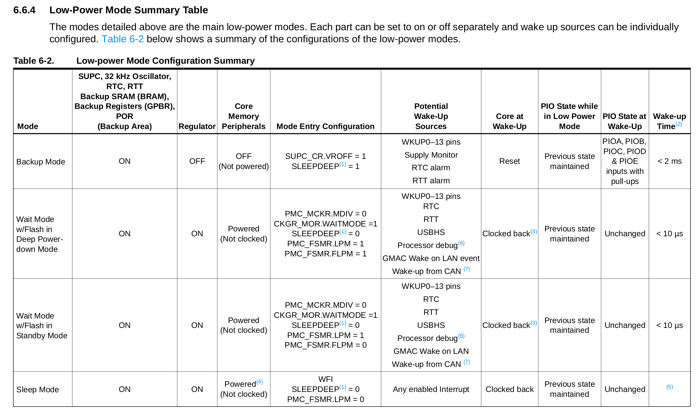

# PIO - IRQ

| Pasta          |
|----------------|
| `Labs/PIO-IRQ` |

- LAB PIO IRQ: 
    1. Executa exemplo e entende exemplo `PIO-IRQ`
    1. Modificar exemplo para trabalhar com `flag`
    1. Entrar em `sleep mode`
    1. Integrar exemplo `PIO-IRQ` no exemplo do `OLED`
    1. Configurar 3 novos botões externos a placa em modo leitura e com interrupção
    1. Implementar lógica de controle da frequência do LED
    1. Exibir no LCD a frequência do LED


O código exemplo [`SAME70-exemples/PIO-IRQ`](https://github.com/Insper/SAME70-examples/tree/master/Perifericos-uC/PIO-IRQ) demonstra como configurar o botão da placa e utilizar a interrupção em um pino do PIO. Vamos trabalhar com esse código de base para esse laboratório.

!!! example "Entenda e execute"
    1. Copie [esse exemplo (SAME70-examples/PIO-IRQ)](https://github.com/Insper/SAME70-examples/tree/master/Perifericos-uC/PIO-IRQ) para a pasta do seu repositório.
    1. Estude o [README](https://github.com/Insper/SAME70-examples/blob/master/Perifericos-uC/PIO-IRQ/README.md) desse exemplo!
    1. Execute o exemplo na placa!

!!! warning
    Não continue sem ter feito a etapa anterior


## Melhorando o exemplo

Vamos entender melhor e melhorar o código fornecido.

### Bordas

Vamos agora modificar o código um pouco, o exemplo está funcionando com interrupção em borda de descida no pino, vamos modificar para ele operar com borda de subida.

!!! example "Modifique e teste"
    1. Mude a função que configura a interrupção do pino para operar em `PIO_IT_RISE_EDGE`. 
    1. Teste na placa.

### IRQ - Keep it short and simple 

O tempo que um uC deve ficar na interrupção deve ser o mais rápido possível, não é uma boa prática gastar muito tempo dentro de uma interrupção, a interrupção só deve executar códigos críticos o resto deve ser processado no loop principal (`while(1)`) pelos principais motivos a seguir:

1. Outras interrupções de mesma prioridade irão aguardar o retorno da interrupção. O firmware irá deixará de servir de maneira rápida a diferentes interrupções se gastar tempo nelas.
2. Nem todas as funções são reentrantes. Funções como `printf` podem não operar corretamente dentro de interrupções (mais de uma chamada por vez).
3. RTOS: As tarefas devem ser executadas em tasks e não nas interrupções, possibilitando assim um maior controle do fluxo de execução do firmware (vamos ver isso mais para frente).


#### FLAG

A solução a esse problema é realizar o processamento de uma interrupção no loop principal (`while(1)`), essa abordagem é muito utilizada em sistemas embarcados. E deve ser feita da forma a seguir:

- Define-se uma variável global que servirá como `flag` (`true` ou `false`) (**essa variável precisa ser do tipo `volatile`**)
- Interrupção muda status da `flag`
- `while(1)` verifica status da `flag` para realizar ação.
- `while(1)` zera `flag` (acknowledge) 

Exemplo

``` c
/* flag */
volatile char but_flag;

/* funcao de callback/ Handler */
void but_callBack(void){
 but_flag = 1;
}

void main(void){
  /* inicializacao */

  while(1){
  
   // trata interrupção do botão
   if(but_flag){
     /* ....   */
     // zera flag
     but_flag = 0;
   }
  }
}
```

!!! note "volatile"
    Sempre que uma interrupção alterar uma variável global, essa deve possuir o 'pragma' (modificador) [`volatile`](https://barrgroup.com/Embedded-Systems/How-To/C-Volatile-Keyword). Exemplo: `volatile int valADC;`. Esse pragma serve para informar o compilador (no nosso caso GCC) que essa variável será modificada sem que ele saiba. 

    Compiladores são projetados para otimizar nosso código e remover trechos ou variáveis desnecessárias. Como a função de `Handler` (interrupção) nunca é chamada diretamente pelo programa, o compilador pode achar que essa função não vai ser executada nunca e pode optimizar a variável que nela seria atualizada (já que não é chamada diretamente!). 

    - Leia mais sobre [volatile](https://barrgroup.com/Embedded-Systems/How-To/C-Volatile-Keyword)

!!! example "Modifique e teste"
    1. Modifique o exemplo para piscar o led no `while(1)` utilizando `flag` vindo da interrupção. 
        - Dentro do callback do botão não pode ter a função `pisca_led`!
    1. Programe e teste no HW

### Low power modes

Trabalhar por interrupção possui duas grandes vantagens: 

1. Responder imediato a um evento 
2. Possibilitar o uC entrar em modos de baixo gasto energético (`sleep modes`).

No caso do uC utilizado no curso são 4 modos distintos de lowpower, cada um com sua vantagem / desvantagem.

- Active Mode: Active mode is the normal running mode with the core clock running from the fast RC oscillator, the main crystaloscillator or the PLLA. The Power Management Controller can be used to adapt the core, bus and peripheral frequencies and to enable and/or disable the peripheral clocks.

- Backup mode: The purpose of Backup mode is to achieve the lowest power consumption possible in a system which is performing periodic wake-ups to perform tasks but not requiring fast startup time.

- Wait mode: The purpose of Wait mode is to achieve very low power consumption while maintaining the whole device in a powered state for a startup time of less than 10 us.

- Sleep Mode: The purpose of sleep mode is to optimize power consumption of the device versus response time. In this mode, only the core clock is stopped. The peripheral clocks can be enabled. The current consumption in this mode is application-dependent:

!!! note ""
    Mais informações na secção 6.6 do datasheet
    
!!! note "Informações importantes"
    - Não é qualquer interrupção que consegue tirar o uC de modos de sleep mais profundos
    - Quanto mais profundo o sleep, mais tempo o uC leva para 'acordar'
    - Alguns modos podem perder informações da memória RAM
    
    
    

####  Adicionando lowpower mode (ASF Wizard)

Para termos acesso as funções da atmel que lidam com o `sleep mode` devemos adicionar a biblioteca no Atmel Studio:

- `ASF` :arrow_right: `ASF Wizard` :arrow_right: 

Agora basta adicionar a biblioteca **Sleep manager (service)** ao projeto.

#### Entrando em lowpower

Agora podemos usar as funções de low power, primeiramente iremos utilizar somente o modo `sleep mode` via a chamada da função `pmc_sleep()` conforme exemplo a seguir:

``` c
void main(void){ 
  while(1){
     // Entra em sleep mode
     // Código 'trava' aqui até ser
     // 'acordado' 
     pmc_sleep(SAM_PM_SMODE_SLEEP_WFI);
      
     ...
  }
}
```

Uma vez chamada essa função o uC entrará em modo sleep WFI (WaitForInterrupt), essa função age como "blocante" onde  execução do código é interrompida nela até que uma interrupção "acorde" o uC.

!!! example "Modifique e teste"
    1. Modifique o exemplo para entrar em modo sleep
    1. Programe e teste no HW

## Código exemplo OLED

| Pasta             |
|-------------------|
| `Labs/OLED-PIO` |

Copie o projeto localizado no repositório exemplos: [`SAME70-examples/Screens/OLED-Xplained-Pro-SPI/`](https://github.com/Insper/SAME70-examples/tree/master/Screens/OLED-Xplained-Pro-SPI/OLED-Xplained-Pro-SPI) para a pasta do seu repositório da disciplina `Labs/OLED-PIO`.

Iremos trabalhar com esse exemplo que configura o OLED (que deve ser conectado na placa no **EXT1**) e incorporando o exemplo da interrupção aqui (vamos ampliar sua funcionalidade!).

 A entrega final deve possuir três botões externo a placa que irão configurar a frequência na qual o LED irá piscar (via interrupção é claro). Um dos botões irá aumentar a frequência do piscar do LED e o outro irá diminuir a frequência que o LED irá piscar. O OLED deverá exibir a frequência atual do LED. 

- O código deve funcionar por interrupção nos botões **e sempre que possível, entrar em sleep mode**.

!!! example "Entrega Final"
    A entrega final deve possuir as funcionalidades a seguir:

    - Três botões externos a placa
      - Botão 1: aumenta frequência do LED
      - Botão 3: diminui frequência do LED
      - Botão 2: para pisca LED
    - OLED deve exibir a frequência do LED
    - Entrar em `sleep mode` sempre que possível

    - Consumo medido da placa nos modos:
      - Piscando/ Parado
    - Diagrama de blocos que especifica quais periféricos e pinos foram usados no projeto e como cada pino é lido.

!!! warning "Desafios extras"
    - Faça os LEDs piscarem com o [TimerCounter](https://github.com/Insper/SAME70-examples/tree/master/Perifericos-uC/TC-RTC-IRQ/TC-RTC-IRQ)!
    - Faça um gráfico temporal da frequência do LED
    - Entre em um modo de sleep mais profundo
