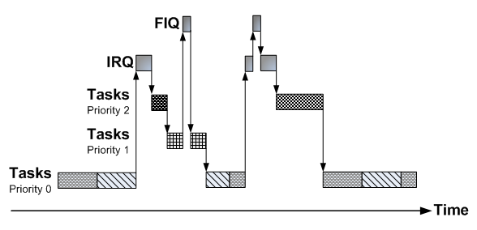
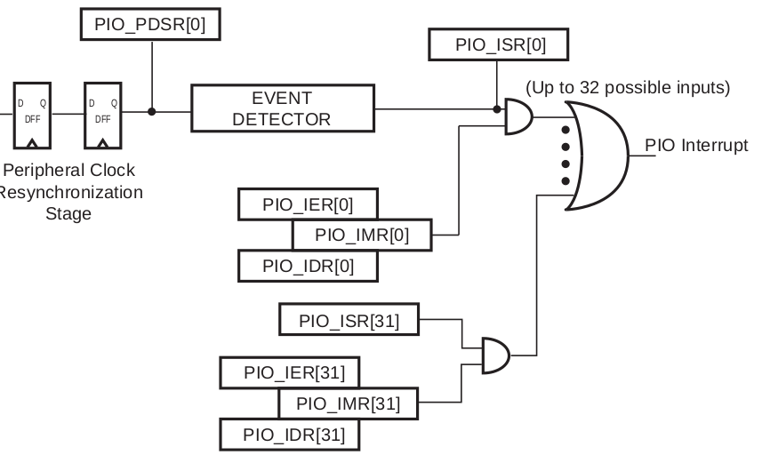

Em computação é comum a necessidade de realizar ações com base em
eventos. Eventos podem ser classificados como internos ou externos ao
processador/microcontrolador. O término de um cálculo realizado por um
dos núcleos de um processador multicore ou a detecção de um overflow de
memória são exemplos eventos interno ao CORE (processador). Já a
notificação de um novo pacote oriundo da comunicação Ethernet é um
exemplo de um evento externo ao CORE.

A estruturação de um programa orientada a eventos[^1] dá uma série de
vantagens ao programador :

1.  independência entre as diferentes partes do programador

2.  facilmente modificável e escalável

3.  definição de prioridades

4.  facilita a correlação entre o código e a documentação

Nesse paradigma de programação define-se funções para determinados
eventos e essas funções são executada quando um evento é detectado. As
funções/eventos podem possuir diferentes níveis de prioridades, o que
possibilita ao programador definir o que deve ser executado caso dois
eventos ocorram simultaneamente.

Por exemplo, podemos definir uma função que é acionada toda vez que
chega um dado pela porta Ethernet, e outra função que é executada toda
vez que um botão for pressionado, podemos também definir eventos
periódicos, tais como : execute uma função a cada **X** segundos.

Embarcados
----------

Em computadores os eventos são em geral tratados pelo sistema
operacional (OS) (linux/ windows, \....) porém em sistemas embarcados
nem sempre possuímos um sistema operacional ou não podemos tolerar a
latência entre a troca de contexto do OS. Existe para isso as
interrupções de hardware, que são chamadas de funções (eventos)
realizados pelo uC para eventos detectados pelos periféricos (no computador também tem, mas o OS toma conta de tudo).

Podemos configurar o uC para que toda vez que um botão for pressionado
(no nosso caso, mudança de HIGH para LOW) uma função (handler) seja
executada. Evitando a necessidade de checarmos pela mudança de estado no
while(1). Isso abre portas para uma série de otimizações sendo uma da
principal a questão energética.

O estilo de programação que fica checando por uma mudança é chamado de
**polling**, o mesmo utilizado nos lab realizados até agora:

``` c
while(1){
  /**
  * @Brief Verifica constantemente o status do botao
  * 1 : nao apertado
  * 0 : apertado
  */
  if(BUT_PIO->PIO_PDSR & (BUT_PIN_MASK))
  {
     LED_PIO->PIO_CODR = LED_PIN_MASK;
  }
  else
  {
     LED_PIO->PIO_SODR = LED_PIN_MASK;
  }
};
```

Nesse código fica-se constantemente checando por alterações
no registrador do PIO responsável pelo botão a fim de decidirmos se o
LED ficará acesso ou apagado. O CORE está constantemente trabalhando a
fim de executar essas operações, o que ele faz constantemente é:

1.  busca o valor do registrador `PIO_PDSR`

2.  aplica a máscara ao valor

3.  checa se o resultado da máscara é verdadeiro ou falso

4.  executa uma das duas ações diferentes

O CORE Cortex M7 com ponto flutuante operando a 300MHz fica realizado
uma simples ação de comparar o valor de um registrador com uma máscara
para detectarmos uma mudança no botão. E se, o código fosse alertado
dessa alteração e uma função específica chamada para tratar essa mudança
? O CORE poderia estar em um modo de baixo consumo energético (sleep
mode) e configurado para acordar dado um determinado evento (exe.
mudança de estado do botão).

Deve-se ponderar a utilização do modo de baixo consumo energético já que
esse tipo de ação (sleep mode -\> wakeup) implica em um atraso entre o
evento e a retomada plena do CORE e início da execução do código. Esse
atraso (pode variar no caso do SAME70 entre 10us e 2ms dependendo do
modo de powerdown) pode ser crítico para sistemas que devem agir de
forma ágil a uma determinada ação.

O trecho de código a seguir ilustra a possível solução utilizando
interrupção para executar uma ação quando o botão é alterado. No
while(1) o processador entra em modo sleep (função blocante) e só é
"acordado" dado uma mudança no valor digital do pino que o botão está
conectado.

``` c

/**
*  Funcao responsavel por tratar a mudanca de
*  estado do botao.
*  E' chamada sempre que houver uma transicao
*  de High -> Low (falling_egde).
*/
void but_Handler(void){
  if(BUT_PIO->PIO_PDSR & (BUT_PIN_MASK)){
     LED_PIO->PIO_CODR = LED_PIN_MASK;
  }
  else{
     LED_PIO->PIO_SODR = LED_PIN_MASK;
  }
}

void main(){
 /* inicializacoes */
  ...
 
 /**
  * Superloop em modo sleep
  */
 while(1){
   pmc_sleep(SLEEPMGR_SLEEP_WFI);
 };
}
```

Exceções
========

Exceções [^2] são eventos que causam uma mudança no fluxo de execução do
programa, quando ocorridas levam a unidade de processamento a
executar uma parte específica do código chamada de: **exception
handler**. Depois do término da execução da exceção o programa principal
volta a ser executado normalmente.


O hardware responsável por gerenciar as exceções no ARM é chamado de
**Nested vectored interrupt controller** (NVIC). O NVIC pode suportar de 1
à 240 diferentes exceções, sendo elas classificadas basicamente em
quatro grupos:

-   System Exceptions

-   Fault Detection

-   Non-Maskable Interrupt (NMI)

-   Interrupt Requests (IRQ)

Exceções numeradas de -15 até -1 são consideradas exceções do sistema (reset,
overflow, bus fault, \...), exceções de número superior a 15 são
consideradas interrupções. No CortexM não existe exceção 0 (quem executa nesse nível é o `main`)

Exemplos
--------

-   O PIO pode gerar uma interrupção quando acontecer uma mudança de
    nível em uma entrada;

-   O periférico do USB pode gerar uma interrupção quando um dado novo
    chegar; ou quando a transmissão de um dado finalizar;

-   O *timer* pode gerar uma interrupção quando atingido um determinado
    valor;

Interrupção
===========

No ARM interrupções são um tipo de exceção, normalmente geradas pelos
periféricos do microcontrolador.

Quando um periférico impõem um sinal de interrupção ao NVIC, o seguinte
acontece:

1.  uma interrupção é acionada (IRQ);

2.  O processador suspende a execução do código;

3.  O processador executa o serviço de rotina da interrupção (**Interrupt
    Service Routine** - ISR );

4.  O processador retoma a execução do código para o estado anterior da
    interrupção acontecer.

Devemos notar que o processador deve salvar os contextos (registradores
do core) na primeira passagem (1 -> 2) e após executar o ISR,
recarregar os valores na passagem (2 -> 3).

Prioridades
-----------

No ARM, podemos classificar as interrupções por prioridade sendo a de
número menor considerada de MAIOR prioridade e de número maior de MENOR
prioridade. O ARM permite que tenhamos uma gama de 256 níveis de
prioridades distintas porém fica a cargo do fabricante decidir a
quantidade de níveis.

Quando duas interrupções acontecem (não necessariamente simultaneamente)
o NVIC verificará qual é a de maior prioridade e a executará primeiro,
após sua execução é chamada o ISR da interrupção de menor prioridade.

A figura a seguir ilustra o que acontece quando uma interrupção é
ativada quando um sistema operacional está em uso, nesse caso existem
dois tipos distintos de interrupção : IRQ e FIQ (**Fast Interruption
Routine**).



Interrupt Requests - IRQ
------------------------

As interrupções do tipo IRQs, geradas pelos periféricos são
"mascaradas", ou seja, devemos ativar em em um registrador (de configuração do CORE) quais
serão as interrupções que estarão ativas.

Além de ativarmos a interrupção do periférico específico, precisamos
definir sua prioridade. Na inicialização do uC o ARM configura todas as
prioridades para o nível 0 (mais alto). Esse controle é realizado via
acesso aos registradores especiais do NVIC, especificamente o .

### Sinais de interrupção vindo dos periféricos

Os periféricos geram um sinal de interrupção para o NVIC, esse sinal
fica ativo até ser limpo manualmente pelo CORE e é utilizado pelo NVIC a
fim de gerar a interrpução no CORE.

É de responsabilidade do programador (código) em dizer ao periférico que
a interrupção foi resolvida, isso é feito acessando um registrador
específico do periférico.

O NVIC trata as interrupções de maior prioridade antes das de menor
prioridade, nesse meio termo os periféricos de menor prioridade devem
manter sua requisição de interrupção ao NVIC. Os periféricos não possuem
uma maneira direta de saber que a interrupção já foi tratada, por isso
mantém em alto a requisição até receberem um mensagem dizendo que podem
baixar o sinal da interrupção. Isso é feito via acesso do CORE a um
registrador do periférico, todos os periféricos que geram interrupções
possuem um registrador específico para isso.

!!! note "Podemos tomar por exemplo o PIO:"
    **31.5.10 Input Edge/Level Interrupt**
    
    When the software reads PIO\_ISR, all the interrupts are automatically
    cleared. This signifies that all the interrupts that are pending when
    PIO\_ISR is read must be handled. When an Interrupt is enabled on a
    "level", the interrupt is generated as long as the interrupt source is
    not cleared, even if some read accesses in PIO\_ISR are performed.

Interrupt Service Routine - ISR
-------------------------------

Após uma interrupção ser detectada pelo NVIC, o CORE salva os contextos
e aponta a execução do código para uma região específica. Uma função
especial para cada periférico chamada de Handler é utilizado a fim de
tratar as interrupções em nível de software.

Uma interrupção no uC pode estar nos seguintes estados :

-   Cada interrupção pode estar desativada (padrão) ou ativada;

-   Cada interrupção pode estar pendente (esperando para ser executada)
    ou não pendente;

-   Cada interrupção pode estar ativada (em execução) ou inativada.

Podemos fazer diferentes combinações dos atributos listados
anteriormente, por exemplo, enquanto estivermos lidando com uma
interrupção (ativada) podemos desativar lá para que a mesma interrupção
não seja chamada novamente quando a interrupção acabar de ser executada.

Para uma interrupção ser aceita, devemos ter o seguinte cenário :

-   A interrupção está em pendência,

-   A interrupção está ativada, e,

-   A prioridade da interrupção é maior (menor valor) do que o nível
    atual.

Software - CMSIS
================

Utilizaremos as funções definidas no **Cortex Microcontroller Software
Interface Standard** (CMSIS) [^3] para configurar o NVIC e o CORE, essas
funções são de uso geral do ARM Cortex e são independentes do fabricante
(Atmel, Texas, ...).

As funções utilizadas serão :

``` c
    //Set the priority grouping
    void NVIC_SetPriorityGrouping(uint32_t priority_grouping)
    
    //Enable IRQn
    void NVIC_EnableIRQ(IRQn_t IRQn) 
    
    // Disable IRQn
    void NVIC_DisableIRQ(IRQn_t IRQn) 
    
    // Set priority for IRQn
    void NVIC_SetPriority (IRQn_t IRQn, uint32_t priority) 
```

Essas funções apenas configura o NVIC + CORE, devemos também configurar
o periférico que será responsável por gerar a interrupção.

O parâmetro IRQn das funções de configuração do NVIC é o ID do
periférico em questão (o mesmo utilizado no PMC).

PIO - Interrupção
=================

A interrupção no PIO é gerenciada por meio de registradores e pode ser
configurada para detectar:

-   Rising edge detection
-   Falling edge detection
-   Low-level detection
-   High-level detection

Uma visão geral do hardware responsável por gerenciar as interrupções é
demonstrado a seguir:



O texto a seguir foi extraído do datasheet do SAME70 e descreve a
operação dessa parte do PIO:

!!! note "31.5.10 Input Edge/Level Interrupt"

    ... is controlled by writing the Interrupt Enable Register () and the
    Interrupt Disable Register (), which enable and disable the input change
    interrupt respectively by setting and clearing the corresponding bit in
    the Interrupt Mask Register (PIO\_IMR). , the peripheral clock must be
    enabled. The Input Change interrupt is available regardless of the
    configuration of the I/O line, i.e., configured as an input only,
    controlled by the PIO Controller or assigned to a peripheral function.

    By default, the interrupt can be generated at any time an edge is
    detected on the input.

    and Additional Interrupt Modes Disable Register (PIO\_AIMDR). The
    current state of this selection can be read through the Additional
    Interrupt Modes Mask Register (PIO\_AIMMR).

    **These additional modes are:**
    -   **Rising edge detection**
    -   **Falling edge detection**
    -   Low-level detection

    -   High-level detection

    In order to select an additional interrupt mode:

    -   must be selected by writing in the Edge Select Register () and Level
        Select Register () which select, respectively, the edge and level
        detection.

    -   The current status of this selection is accessible through the
        Edge/Level Status Register (PIO\_ELSR).

    must be selected by in the Falling Edge/Low-Level Select Register () and
    Rising Edge/High-Level Select Register () which allow to select falling
    or rising edge (if edge is selected in PIO\_ELSR) edge or high- or
    low-level detection (if level is selected in PIO\_ELSR). The current
    status of this selection is accessible through the Fall/Rise - Low/High
    Status Register (PIO\_FRLHSR).

    , the corresponding in the Interrupt Status Register () is . If the
    corresponding bit in , the PIO Controller interrupt line is asserted.

    . This signifies that all the interrupts that are pending when PIO\_ISR
    is read must be handled. When an Interrupt is enabled on a "level", the
    interrupt is generated as long as the interrupt source is not cleared,
    even if some read accesses in PIO\_ISR are performed.

    

## Referências

 -[^1]https://en.wikipedia.org/wiki/Event-driven_programming
 - https://www.ece.umd.edu/class/enee447.S2016/ARM-Documentation/ARM-Interrupts-1.pdf
 - http://www.arm.com/products/processors/cortex-m/cortex-microcontroller-software-interface-standard.php
