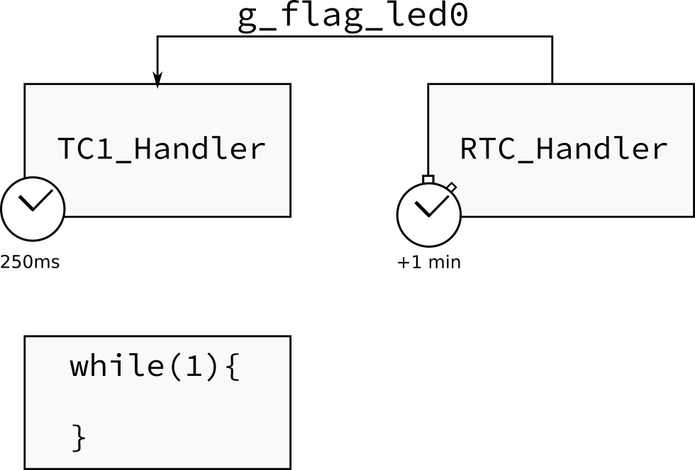

## Entrega

| Pasta              |
|--------------------|
| `Labs/TC-RTC-IRQ/` |

- Parte 1: 
    - [ ] Entra em sleep mode
    - [ ] Led pisca mais rápido
    - [ ] Pisca Pisca 
- Parte 2:
    - [ ] Corrigido uso de flag para parar o pisca pisca
    - [ ] Usar placa OLED
    - [ ] Para cada LED um TC diferente
    - [ ] Cada LED é controlado por um botão
    - [ ] Exibir hora atual no OLED1 

# Entenda o código

O firmware disponível no repositório de exemplos chamado de [`TC-RTC-IRQ`](https://github.com/Insper/SAME70-examples/tree/master/Perifericos-uC/TC-RTC-IRQ) configura o TimerCounter (TC) e o RTC do mircontrolador. O TC0 canal 1 é configurado para gerar uma interrupção (**TC1_Handler**) a cada 250ms (f=1/T -> de 4Hz) já o RTC é configurado para operar em modo de alarme, gerando uma interrupção (**RTC_Handler**) em um determinado momento. Inicialmente o RTC está configurado para gerar uma interrupção um minuto após o início do microcontrolador.

O TimerCounter faz com o o led pisque na frequência de 4Hz enquanto não ocorrer o alarme do RTC, após o acontecimento do alarme (interrupção do RTC) o piscar do led é desligado.



!!! note "Entenda e execute"
    1. Copie esse exemplo para a pasta do seu repositório.
    1. Leia o [README](https://github.com/Insper/SAME70-examples/tree/master/Perifericos-uC/TC-RTC-IRQ)) desse exemplo!
    1. Execute o exemplo na placa!
    1. Responda:
        - Quais periféricos são utilizados?
        - O que o firmware faz?
        - Quantas interrupções são usada, quais são elas?

# Programando...

Vamos agora trabalhar com o código exemplo, modificando e incorporando novas funcionalidades. 

!!! warning ""
    Nesse laboratório, não é permitido utilizar funções de delay por software:  `delay_s()` / `delay_ms()` / ...

#### 1. Sleep 

!!! example "Modifique e teste"
    Faça o exemplo fazendo com o que o uC entre em modo sleep enquanto estiver ocioso.

Para isso utilize a função `pmc_sleep(..)`: 

```c
// trecho de codigo a ser executado antes de dormir
// ...

// entra em sleep
pmc_sleep(SAM_PM_SMODE_SLEEP_WFI);

// trecho de codigo a ser executado depois de acordar
// ...
```

O modo **Wait for Interrupt** WFI é um dos modos de powersave mais básicos e menos eficientes do SAME70. Nele o CORE ainda é mantido energizado porém sem clock. A grande vantagem desse modo é que qualquer interrupção pode acordar o core, diferente de outros modos mais agressivos que desabilita complemente o CORE implicando em um menor gasto energético.

Toda vez que essa função for chamada o CORE entrará em modo sleep e ficará "bloqueada" esperando por alguma interrupção. Após detectada a interrupção, o CORE irá acordar e resolver todas as interrupções que estão pendentes e então irá liberar essa função, ou seja, continuará a executar o código.

#### 2. Mais rápido !

!!! example "Modifique e teste"
    Faça com que o LED pisque ainda mais rápido! Escolha uma frequência que achar adequado.

#### 3. Piscar durante 1 minuto e parar durante 1 minuto - cíclico

!!! example "Modifique e teste"
    Faça com que o led pisque durante um minuto e fique um minuto sem piscar eternamente, faça isso de forma cíclica como na ilustração a baixo:

    
    
    Dicas:
        - Use o alarme do RTC para isso!
        - utilize a função `rtc_get_time()`
        - Cuidado ao mudar de Hora/ Dia/ Mês

#### 4. Flag é a melhor maneira ?

A tomada de decisão se o LED está em modo "pisca pisca" é feita por uma variável global `flag_led0`:

``` c
/************************************************************************/
/* VAR globais                                                          */
/************************************************************************/
uint8_t flag_led0 = 1;
```

Dentro da interrupção do TC1 verificamos a flag:

``` c
void TC1_Handler(void){
    ....

	/** Muda o estado do LED */
    if(flag_led0)
        pin_toggle(LED_PIO, LED_PIN_MASK);
```

O problema aqui é que a interrupção do TC1 continua ocorrendo mesmo com o piscar do LED desativado, o que pode ter um impacto no consumo e performance do projeto.

!!! example "Modifique e teste"
    Proponha e implemente uma solução para essa questão.

#### 5. Várias frequências

!!! example "Modifique e teste"
    Utilizando a placa OLED1 conectada ao kit de desenvolvimento, faça com que cada LED pisque nas frequências determinadas na tabela a baixo, utilize para cada LED um TC diferente.

    | LED OLED1 | Frequência  (Hz) |
    |-----------|------------------|
    | LED 1     | 8                |
    | LED 2     | 11               |
    | LED 3     | 17               |


#### 6. Botões

!!! example "Modifique e teste"
    Faça com que os botões (relacionados a cada LED) pare ou inicialize o piscar dos LEDs, utilize para isso interrupção do PIO.

    - Não use flags para isso!

#### 7. OLED1 - Exibir hora

!!! example "Modifique e teste"
    Utilize o `OLED1` para exibir a hora atual no display!

    - Dica: 
        - Ative a interrupção de segundos do RTC (além da de alarme)
        - No handler, verifique o motivo de entrar na interrupção
        - Trabalhe com flags, atualize o LCD no `while(1){}`

    Para verificar se a interrupção foi referente a segundos (precisa ativar antes!):

    ```
      // Second increment interrupt
      if ((ul_status & RTC_SR_SEC) == RTC_SR_SEC)
      {
      /* limpa interrupcao segundos */
          rtc_clear_status(RTC, RTC_SCCR_SECCLR);
      }
```
