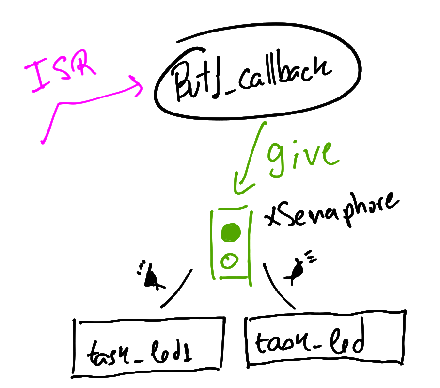
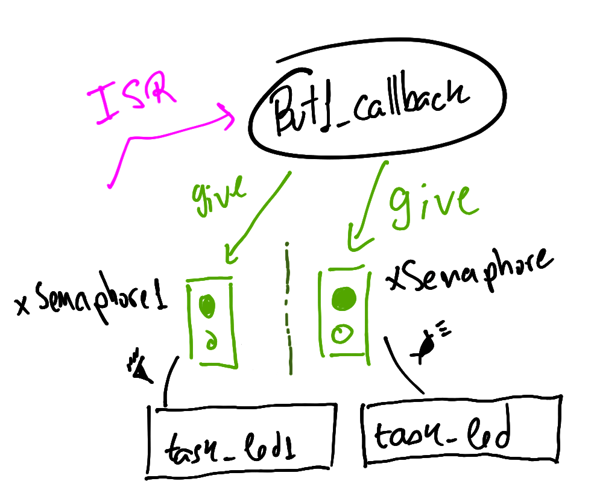

# Lab 5 - RTOS - Dicas

Notei alguns erros e dificuldades neste laboratório que
pretendo retomar aqui. Vale notar que este exemplo foi extraído dos exemplos fornecidos pelo fabricante do microcontrolador e possui algumas coisas diferentes do que estamos acostumados.

## `UNUSED(pvParameters)`

Isso aparece na função que define a tarefa `task_led` e
serve apenas para remover warning do gcc que indica que um argumento da função não foi usado na sua implementação.

- https://stackoverflow.com/questions/3599160/how-to-suppress-unused-parameter-warnings-in-c/12891181

Mas professor não podemos remover esse argumento já que não estamos usando? **NÃO** pois o freeRTOS espera que a função que implementa uma tarefa tenha um argumento, da documentação:


```c
// A task should have the following structure:
    void vATaskFunction( void *pvParameters )
    {
        for( ;; )
        {
            -- Task application code here. --
        }

        /* Tasks must not attempt to return from their implementing
        function or otherwise exit.  In newer FreeRTOS port
        attempting to do so will result in an configASSERT() being
        called if it is defined.  If it is necessary for a task to
        exit then have the task call vTaskDelete( NULL ) to ensure
        its exit is clean. */
        vTaskDelete( NULL );
    }
```

- https://www.freertos.org/implementing-a-FreeRTOS-task.html 

## `LED_Toggle(LED0)`

Muitas pessoas empacaram aqui ou não entenderam
essa função, o código exemplo é original do fabricante
do microcontrolador e é comum aparecerem coisas que 
não conhecemos, mas sem muito alarde né? O próprio 
nome da função diz o que faz: **LED TOGGLE** ou: 
**INVERTE LED**.

A função não faz o LED piscar, ela apenas inverte o 
estado do LED toda vez que for chamada, o uso dessa
função com o `vTaskDelay(1000)` faz o LED piscar.

Essa função é muito específica e não ajuda muito porque não podemos usar em outros pinos (LEDs), só funciona para o LED0 que foi definido em um include muito específico do projeto. 


Podemos no lugar ousar esta outra implementação que faz a mesma coisa, mas recebe como parâmetro o PIO e a máscara e inverte o valor do pino (1 --> 0 --> 1) toda vez que a função for chamada, a função a seguir implementa isso:

```c
void pin_toggle(Pio *pio, uint32_t mask){
   if(pio_get_output_data_status(pio, mask))
    pio_clear(pio, mask);
   else
    pio_set(pio,mask);
}
```

!!! info
    Mas professor daria para fazer de outra forma, sem usar esse `pin_toggle` ou a `LED_Toggle`? Da sim, mas temos que usar uma variável local para isso (no lugar de acessar o PIO):
    
    ```c
    static void task_led(void *pvParameters) {
        UNUSED(pvParameters);
        char f_led = 0
        for (;;) {
            f_led = !f_led;
            if (f_led)
                pio_set(LED_PIO, LED_IDX_MASK);
            else
                pio_clear(LED_PIO, LED_IDX_MASK);
            
            
            vTaskDelay(1000);
        }
    }
    ```

## `task_led1`

!!! tip "Códigos originais"
    Vamos ter que ter esses trechos de código em mente:
    
    1. Callback do botão 1
    
    ```c
    void but1_callback(void){
        printf("but_callback \n");
        BaseType_t xHigherPriorityTaskWoken = pdFALSE;
        xSemaphoreGiveFromISR(xSemaphore, &xHigherPriorityTaskWoken);
    }
    ```
    2. task led
    
    ```c
    static void task_led(void *pvParameters) {
        xSemaphore = xSemaphoreCreateBinary();
        
        /* ... init but1 .... */
        
        for (;;) {
            if( xSemaphoreTake(xSemaphore, ( TickType_t ) 500 / portTICK_PERIOD_MS) == pdTRUE ){
                LED_Toggle(LED0);
            }
        }
    }
    ```
Essa tarefa deveria ser executada sempre que o botão 1 da placa OLED fosse pressionado, mas isso não deveria impedir que a `task_led` de também ser executada, o que muitos fizeram foi usar o mesmo semáforo que já estava sendo usado pela `task_led` nesta task, da seguinte maneira:

```c
static void task_led1(void *pvParameters) {
    for (;;) {
        if( xSemaphoreTake(xSemaphore, 500/portTICK_PERIOD_MS)){
            for (int i=0;i<n;i++){
                pio_clear(LED1_PIO, LED1_IDX_MASK);
                vtaskDelay(500);
                pio_set(LED1_PIO, LED1_IDX_MASK);
                vtaskDelay(500);
            }
        }
    }
}
```

O problema disso é que tanto a `task_led` quanto a `task_led1` estão compartilhando o mesmo semáforo, e o semáforo usado aqui é do tipo binário, ou seja, pode ser `0` ou `1` a primeira tarefa que **consumir** o semáforo vai o tornar `0` e a segunda tarefa não vai ser executada corretamente, conforme diagrama a baixo:

{width=500}

Existem duas soluções para esse problemas, a primeira seria a de usar um [Counting Semaphores](https://www.freertos.org/Real-time-embedded-RTOS-Counting-Semaphores.html) a outra é a de usar um outro semáforo para indicar para a nova tarefa que ela deve ser executada, para isso:

1. Definir uma variável global para o novo semáforo:
1. Fazer a função `but1_callback` liberar dois semáforos
1. Criar o semáforo dentro da `task_led1`
1. Usar o semáforo novo na `task_led1`

{width=500}

```diff
SemaphoreHandle_t xSemaphore;
+SemaphoreHandle_t xSemaphore1;

void but1_callback(void){
    printf("but_callback \n");
    BaseType_t xHigherPriorityTaskWoken = pdFALSE;
    xSemaphoreGiveFromISR(xSemaphore, &xHigherPriorityTaskWoken);
+   xSemaphoreGiveFromISR(xSemaphore1, &xHigherPriorityTaskWoken);
}

static void task_led1(void *pvParameters) {

+   xSemaphore1 = xSemaphoreCreateBinary();

    for (;;) {
+       if( xSemaphoreTake(xSemaphore1, 500/portTICK_PERIOD_MS)){
            for (int i=0;i<n;i++){
                pio_clear(LED1_PIO, LED1_IDX_MASK);
                vtaskDelay(500);
                pio_set(LED1_PIO, LED1_IDX_MASK);
                vtaskDelay(500);
            }
        }
    }
}
```
