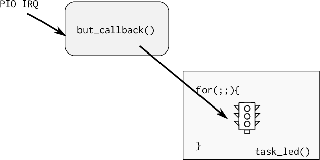

# RTOS

Nesse Handout iremos trabalhar com o uso de um sistema operacional de tempo real (RTOS) para gerenciarmos três LED e três botões (vamos refazer a entrega do `tickTackTock` porém agora com o uso do SO).

O sistema operacional a ser utilizado é o [FreeRtos (www.freertos.org)](http://freertos.org), um sistema operacional muito utilizado pela industria, sendo o segundo sistema operacional (**20%**) mais utilizado em projetos embarcados, perdendo só para o [Linux embarcado](https://m.eet.com/media/1246048/2017-embedded-market-study.pdf).

## LAB


| Pasta           |
|-----------------|
| `Labs/RTOS-LED` |

1. Executar um demo de RTOS
1. Entender e modificar o exemplo
1. Criar uma task que controla o LED1 do OLED
1. Criar um semáforo que é liberado pelo botão do OLED1

### Início 

(45 minutos)

**Objetivo: Entender as tarefas de um RTOS e fazer pequenas modificações no código**

!!! note "OLED1"
    Plugue a placa OLED1 no EXT1, vamos usar seus botões e LEDs.

Iremos trabalhar com o exemplo do [`FreeRTOS`](https://www.freertos.org) que a Atmel disponibiliza para a placa SAME70-XPLD, esse exemplo já inclui um projeto com as configurações iniciais do OS e um código exemplo que faz o LED da placa piscar a uma frequência determinada.

!!! warning "Código exemplo"
    - Copie o código exemplo `Same70-Examples/RTOS/RTOS-LED` para a pasta da entrega do seu repositório `Labs/RTOS-LED`
    - Vamos modificar esse código exemplo.

### Terminal

Esse exemplo faz uso da comunicação UART para debug de código (via printf), para acessar o terminal no atmel estúdio clique em:

!!! note ""
    No atmel studio:
    :arrow_right: View :arrow_right: Terminal Window

*(você deve ter instalado o [pacote extra do atmel](https://gallery.microchip.com/packages/EFC4C002-63A3-4BB9-981F-0C1ACAF81E03/2.8.4)*

Configure o terminal para a porta que (COM) correta (verificar no windiows) e para operar com um BaudRate de 115200.

!!! example "Tarefa"
    1. Compile e grave o código no uC
    2. Abra o terminal e analise o output (baudrate 115200).
    1. Veja o LED piscar! Mágico

### Entendendo o exemplo

Esse exemplo cria inicialmente 2 tarefas: `task_monitor` e `task_led`. A primeira serve como monitor do sistema (como o monitor de tarefas do Windows/Linux), enviando via `printf` informações sobre o estado das tarefas do sistema embarcado. A segunda serve para gerenciar o LED e o faz piscar a uma taxa de uma vez por segundo.

#### task_led

A `task_led` possui a implementação a seguir (limpei a parte que não é referente ao SAME70):

``` c
/**
 * \brief This task, when activated, make LED blink at a fixed rate
 */
static void task_led(void *pvParameters)
{
	UNUSED(pvParameters);
	for (;;) {
		LED_Toggle(LED0);
		vTaskDelay(1000);
	}
}
```

Notem que a função possui um laço infinito (`for (;;){}`), tasks em um RTOS não devem retornar, elas executam como se estivessem exclusividade da CPU (assim como um código bare-metal que não deve retornar da função `main`). A função `LED_Toggle` é na verdade um macro que faz o LED piscar, usando uma série de funções do PIO-ASF que não usamos no curso (podemos aqui usar a nossa função de pisca led). 

A função [vTaskDelay()](https://www.freertos.org/a00127.html) faz com que a tarefa fique em estado de **blocked** (permitindo que outras tarefas utilizem a CPU) por um determinado número de **ticks**. Essa função é diferente da `delay_ms()` que bloqueia a CPU para sua execução. Deve-se evitar o uso de funções de delay baseadas em "queimar" clocks na tarefas de um RTOS, já que elas agem como um trecho de código a ser executada.

A função `vTaskDelay()` faz com que o RTOS libere processamento para outras tarefas durante o tempo especificado em sua chamada. Esse valor é determinado em `ticks`. Podemos traduzir ticks para `ms`, usando o define `portTICK_PERIOD_MS` como no exemplo a seguir que faz os leds piscarem a cada 2 segundos:

``` c
/**
 * \brief This task, when activated, make LED blink at a fixed rate
 */
static void task_led(void *pvParameters)
{
    /* Block for 2000ms. */
    const TickType_t xDelay = 2000 / portTICK_PERIOD_MS;
    
	for (;;) {
		LED_Toggle(LED0);
		vTaskDelay(xDelay);
	}
}
```

!!! example "Modifique"
    1. Modifique o firmware com o código exemplo anterior
    1. Programe o uC.
    1. Analise o resultado.

O Tick de um RTOS define quantas fezes por segundo o escalonador irá executar o algoritmo de mudança de tarefas, no ARM o tick é implementado utilizando um timer do próprio CORE da ARM chamado de `system clock` ou [`systick`](http://infocenter.arm.com/help/index.jsp?topic=/com.arm.doc.dai0179b/ar01s02s08.html), criado para essa função.

Por exemplo, um RTOS que opera com um tick de 10ms irá decidir pelo chaveamento de suas tarefas 100 vezes por segundo, já um tick configurado para 1ms irá executar o escalonador a uma taxa de 1000 vezes por segundo. Trechos de código que necessitam executar a uma taxa maior que 1000 vezes por segundo (tick = 1ms) não devem ser implementados em tasks do RTOS mas sim via interrupção de timer.

A configuração da frequência do tick assim como o mesmo é implementando está no arquivo do projeto: `config/FreeRTOSConfig.h`:

``` c
....
#define configTICK_RATE_HZ						( 1000 )
....
#define xPortSysTickHandler SysTick_Handler
```

!!! note
    - O impacto do tick na função vTaskDelay é que a mesma só pode ser chamada com múltiplos inteiros referente ao tick.
    
    - Não temos uma resolução tão boa quanto o TimerCounter ou RTT.
    
    - Quanto maior a frequência de chaveamento mais vezes/segundo o OS necessita salvar e recuperar o contexto, diminuindo assim sua eficiência.
    
    - Frequência máxima recomendada para o freertos em uma ARM e a de 1000 Hz

#### Task Monitor 

Essa task é responsável por enviar pela serial (terminal) informações sobre o estado interno do sistema operacional e suas tarefas, ela possui um formato semelhante ao da `task_led` porém na sua execução (que acontece 1 vez por segundo já que nosso `TICK_RATE_HZ` é **1000**) coleta o número de tarefas e suas listas e faz o envio via printf [2].

- [2] : https://www.freertos.org/a00021.html

!!! note
    Note que a função também está em um laço infinito! Nunca terminando de executar.

``` c
/**
 * \brief This task, when activated, send every ten seconds on debug UART
 * the whole report of free heap and total tasks status
 */
static void task_monitor(void *pvParameters)
{
	static portCHAR szList[256];
	UNUSED(pvParameters);

	for (;;) {
		printf("--- task ## %u", (unsigned int)uxTaskGetNumberOfTasks());
		vTaskList((signed portCHAR *)szList);
		printf(szList);
		vTaskDelay(1000);
	}
}
```

Essa tarefa produz uma saída como a seguir [3]:

```
--- task ## 4 Monitor  	R	0	77	1
IDLE     	  R	        0	110	3
Led      	  B	        0	231	2
Tmr Svc  	  B	        4	225	4
```

Com a seguinte estrutura :

```
taskName Status Priority WaterMark Task ID
```

- taskName : nome dado a task na sua criação
- Status : status da task [3]:
     - Suspended
     - Ready
     - Running
     - Blocked


!!! tip
    
    
    - fonte: https://www.freertos.org/RTOS-task-states.html

!!! example "Tarefa"
    - Modifique a task monitor para executar uma vez a cada 3 segundos
    - Programe o uC com essa modificação
    - Valide


### Criando tarefas

Criar uma tarefa é similar ao de inicializar um programa em um sistema operacional, mas no caso devemos indicar para o RTOS quais "funções" irão se comportar como pequenos programas (tarefas). Para isso devemos chamar a função `xTaskCreate` que possui a seguinte estrutura:

- https://docs.aws.amazon.com/freertos/latest/lib-ref/group__x_task_create.html

```c
/**
 * task. h
 *
 BaseType_t xTaskCreate(
							  TaskFunction_t pvTaskCode,
							  const char * const pcName,
							  uint16_t usStackDepth,
							  void *pvParameters,
							  UBaseType_t uxPriority,
							  TaskHandle_t *pvCreatedTask
						  );
 *
 * Create a new task and add it to the list of tasks that are ready to run.
 *
 * xTaskCreate() can only be used to create a task that has unrestricted
 * access to the entire microcontroller memory map.  Systems that include MPU
 * support can alternatively create an MPU constrained task using
 * xTaskCreateRestricted().
 *
*/
```

A criação das tasks monitor e LED são feitas da seguinte maneira (na função `main`):

```c
xTaskCreate(task_monitor, "Monitor", TASK_MONITOR_STACK_SIZE, NULL,
            TASK_MONITOR_STACK_PRIORITY, NULL);

xTaskCreate(task_led, "Led", TASK_LED_STACK_SIZE, NULL,
            TASK_LED_STACK_PRIORITY, NULL);
```

O primeiro parâmetro da `xTaskCreate` é o ponteiro da função que será lidada como uma task. A segunda é o nome dessa tarefa, a terceira é o tamanho da stack que cada task vai possuir, o quarto seria um ponteiro para uma estrutura de dados que poderia ser passada para a task em sua criação, o quinto a sua prioridade e o último é um ponteiro e retorna uma variável que pode ser usada para gerencias a task (deletar, pausar).

O tamanho da stack da tarefa e sua prioridade estão definidos no próprio `main.c`:

``` c
#define TASK_MONITOR_STACK_SIZE            (2048/sizeof(portSTACK_TYPE))
#define TASK_MONITOR_STACK_PRIORITY        (tskIDLE_PRIORITY)
#define TASK_LED_STACK_SIZE                (1024/sizeof(portSTACK_TYPE))
#define TASK_LED_STACK_PRIORITY            (tskIDLE_PRIORITY)
```

A cada tarefa pode ser atribuída uma prioridade que vai de **0** até `configMAX_PRIORITIES - 1`, onde `configMAX_PRIORITIES` está definido no arquivo de configuração `FreeRTOSConfig.h`, **0 é menor prioridade**.

!!! note "taskIDLE_PRIORITY"
    É a menor prioridade!

    - `#define tskIDLE_PRIORITY			( ( UBaseType_t ) 0U )`

!!! note
    Uma das dúvidas mais comum no uso de RTOS é o quanto de espaço devemos alocar para cada tarefa, e essa é uma pergunta que não existe um resposta correta, caso esse valor seja muito grande podemos estar alocando um espaço extra que nunca será utilizado e caso pequena, podemos ter um stack overflow e o firmware parar de funcionar. 

    A melhor solução é a de executar o programa e analisar o consumo da stack pelas tasks ao longo de sua execução, tendo assim maiores parâmetros para a sua configuração.


#### Piscando LED1 OLED

Vamos agora criar uma nova tarefa e fazer ela controlar o LED1 da placa OLED, nessa tarefa vocês devem fazer o LED1 piscar por 5 vezes e então ficar 3 segundos em piscar, depois voltar a piscar novamente!

!!! example "Tarefa"
    1. Crie uma função simular a task LED só que com nome: `task_led1`
        - não esqueça do `while(1)` e nem de usar o `vTaskDelay()`
        - faça essa função iniciar o pino do LED1 como saída (`PA0`)
        - faça essa função piscar o LED 3 vezes a cada 3 segundos
            - usar `vTaskDelay()`
    1. Criei os defines:
        - `#define TASK_LED1_STACK_SIZE  (1024/sizeof(portSTACK_TYPE))`
        - `#define TASK_LED1_STACK_PRIORITY (tskIDLE_PRIORITY)`
    1. E então criei a task no rtos, no `main(){}`
        - `xTaskCreate(task_led1, "Led1", TASK_LED1_STACK_SIZE, NULL, TASK_LED1_STACK_PRIORITY, NULL);`
    
!!! tip "Solução"
    - [`main.c` implementando com a tarefa anterior](https://github.com/Insper/SAME70-examples/blob/master/RTOS/RTOS-LED/src/task_led1.c.c)


### Power Save mode ?

Uma forma muito simples de conseguirmos diminuir o consumo energético de um sistema embarcado com RTOS é o de ativar os modos de baixo consumo energético (powersave/ sleep mode) quando o SO estiver na tarefa `idle`. A tarefa idle é aquela executada quando nenhuma outra tarefa está em execução. Sempre que essa tarefa idle for chamada a o RTOS irá executar a função a seguir já definida no `main.c`: 


``` c
/**
 * \brief This function is called by FreeRTOS idle task
 */
extern void vApplicationIdleHook(void)
{
}
```

Porém ainda devemos ativar essa funcionalidade no arquivo de configuração, via o define: `configUSE_IDLE_HOOK`.

---


!!! example ""
    - No arquivo de configuração `FreeRTOSConfig.h` modifique:

    ```diff
    - #define configUSE_IDLE_HOOK	0
    + #define configUSE_IDLE_HOOK	1
    ```

---

Com isso podemos controlar o modo sleep na função `vApplicationIdleHook`.

---

!!! example "Tarefa"
    - Entre em sleepmode quando em idle
    - Dentro da função `vApplicationIdleHook` chame `pmc_sleep(SAM_PM_SMODE_SLEEP_WFI)`

---

Note que devemos entrar em um modo de sleep que o timer utilizado pelo tick consiga ainda acordar a CPU executar, caso contrário o RTOS não irá operar corretamente já que o escalonador não será chamado. O timer usado pelo escalonador é o [System Timer, SysTick](http://infocenter.arm.com/help/topic/com.arm.doc.dui0552a/Babieigh.html).

###  API - Comunicação entre task / IRQ

(30 minutos)

**Objetivo : Comunicar a tarefa do LED para ser executada via a interrupção (callback) do botão da placa .**

Uma das principais vantagens de usar um sistema operacional é o de usar ferramentas de comunicação entre tarefas ou entre ISR e tarefas, em um código baremetal fazemos esse comunicação via variáveis globais (buffers, flags, ...), essa implementação carece de funcionalidades que o RTOS irá suprir, tais como :

- Semáforo (semaphore) É como uma flag binária, permitindo ou não a execução de uma task, funciona para sincronização de tarefas ou para exclusão mútua (multual exclusion), sem nenhum tipo de prioridade.

- Mutex: Similar aos semáforos porém com prioridade de execução (mutex alteram a prioridade da tarefa)
  
- MailBox ou Queues: Usado para enviar dados entre tarefas ou entre ISR e Tasks

[5] : https://www.freertos.org/Embedded-RTOS-Binary-Semaphores.html

#### Botão / semaphore

Iremos implementar um semáforo para comunicação entre o callback do botão 1 do OLED e a tarefa que faz o controle do LED (da placa), o callback do botão irá liberar o semáforo para a tarefa do LED executar em um formato: produtor-consumidor.



Inclua o código a seguir no seu projeto (modifique a função `task_led`)

 - Consulta: [xSemaphoreGiveFromISR](https://www.freertos.org/a00124.html)

!!! example "Modifique"
    Inclua os defines do botão
    
    ```c
    #define BUT1_PIO			PIOD
    #define BUT1_PIO_ID			16
    #define BUT1_PIO_IDX		28
    #define BUT1_PIO_IDX_MASK	(1u << BUT1_PIO_IDX)
    ```

!!! example "Modifique"
    Inclua a variável global a seguir que será o semáforo.
    > (no começo do arquivo main.c)

    ``` c
    /** Semaforo a ser usado pela task led 
        tem que ser var global! */
    SemaphoreHandle_t xSemaphore;
    ```

!!! example "Modifique"
    Inclua a função de callback do botão

    ```c
    /**                                                               
    * callback do botao                                               
    * libera semaforo: xSemaphore                                    
    */
    void but1_callback(void){
        BaseType_t xHigherPriorityTaskWoken = pdFALSE;
        printf("but_callback \n");
        xSemaphoreGiveFromISR(xSemaphore, &xHigherPriorityTaskWoken);
        printf("semafaro tx \n");
    }
    ```

!!! example "Modifique"
    Agora vamos fazer a leitura do semáforo nessa task:

    ``` c
    static void task_led(void *pvParameters) {
      /* We are using the semaphore for synchronisation so we create a binary
      semaphore rather than a mutex.  We must make sure that the interrupt
      does not attempt to use the semaphore before it is created! */
      xSemaphore = xSemaphoreCreateBinary();
    
      /* devemos iniciar a interrupcao no pino somente apos termos alocado
      os recursos (no caso semaforo), nessa funcao inicializamos 
      o botao e seu callback*/
      /* init botão */
      pmc_enable_periph_clk(BUT1_PIO_ID);
      pio_configure(BUT1_PIO, PIO_INPUT, BUT1_PIO_IDX_MASK, PIO_PULLUP);
      pio_handler_set(BUT1_PIO, BUT1_PIO_ID, BUT1_PIO_IDX_MASK, PIO_IT_FALL_EDGE, but1_callback);
      pio_enable_interrupt(BUT1_PIO, BUT1_PIO_IDX_MASK);
      NVIC_EnableIRQ(BUT1_PIO_ID);
      NVIC_SetPriority(BUT1_PIO_ID, 4); // Prioridade 4
    
      if (xSemaphore == NULL)
        printf("falha em criar o semaforo \n");
    
      for (;;) {
        if( xSemaphoreTake(xSemaphore, ( TickType_t ) 500) == pdTRUE ){
          LED_Toggle(LED0);
        }
      }
    }
    ```

!!! tip "Entendo"
    Para implementarmos um semáforo precisamos primeiramente definir uma variável global que será utilizada pelo sistema operacional para definir o endereço desse semáforo (global):

    ``` c
    SemaphoreHandle_t xSemaphore;
    ```
    
    Devemos antes de usar o semáforo, fazermos sua criação/inicialização :
    
    ``` c
    /* Attempt to create a semaphore. */
    xSemaphore = xSemaphoreCreateBinary();
    ```
    
    Uma vez criado o semáforo podemos esperar a liberação do semáforo via a função:
    
    ``` c
    xSemaphoreTake(xSemaphore, Tick);
    ```
    
    - xSemaphore  O semáforo a ser utilizado
    - Tick : timeout (em ticks) que a função deve liberar caso o semáforo não chegue. Se passado o valor 0, a função irá bloquear até a chegada do semáforo.
    
    Para liberarmos o semáforo devemos usar a função de dentro da interrupção/callback:
    
    ``` c
    xSemaphoreGiveFromISR(...);
    ```

!!! note 
    Note o ISR no final da função, isso quer dizer que estamos liberando um semáforo de dentro de uma interrupção. Caso a liberação do semáforo não seja de dentro de uma interrupção, basta utilizar a função `xSemaphoreGive`

    


## Entrega extra (A/B)

Para os próximos passos vocês devem criar um semáforo por botão e um callback por botão.

### B

- Faça o mesmo para o LED2:
    - criar task que faz o LED2 piscar
    - botão do LED2 libera semáforo para a task_led2

### A

- Faça o mesmo para o LED3:
    - criar task que faz o LED3 piscar
    - botão do LED3 libera semáforo para a task_led3
