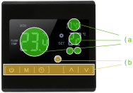
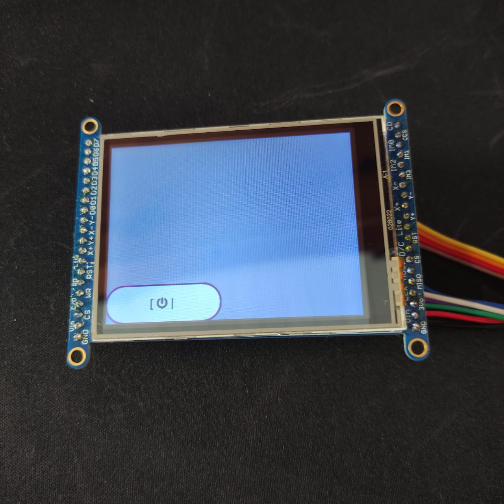

# LAB

Agora vamos começar mexer com o LVGL e criar nossa interface. A ideia é recriar uma interface de um termostato inspirado no produto a seguir:

!!! info ""
     KKmoon LCD Touch Screen Termostato Sistema de Aquecimento de Piso Elétrico Aquecimento de Água Termorregulador AC85-240 V Controlador de Temperatura Preto 
    
     - https://www.amazon.com.br/KKmoon-Aquecimento-Termorregulador-Controlador-Temperatura/dp/B07X3CDM83

{width=500}

## Etapas

Quando começamos projetar uma [interface homem máquina (IHM)](https://en.wikipedia.org/wiki/Human%E2%80%93computer_interaction) é necessário analisarmos várias frentes:

- Usabilidade
- Acessibilidade
- Branding
- Implementação

A usabilidade irá indicar como as funções do produto estarão disponíveis e serão exibidas aos usuários, isso deve estar atrelada aos conceitos da marca do produto. O público alvo deve ser analisado e o produto deve ser acessível, para isso, muitos testes de usabilidade devem ser feitos para validar o conceito.

Muitas vezes o protótipo da interface esbarra em problemas técnicos e de implementação, muitas imagens e fontes impactam no tamanho total do firmware que pode impossibilitar a implementação da interface proposta, ou necessitar a adição de formas alternativas de armazenamento de dados. Microcontroladores de forma geral não possuem GPU (alguns sim, exemplo: [STM32MP157](https://www.st.com/en/microcontrollers-microprocessors/stm32mp157.html) ) e isso impacta na performance da interface e muito provavelmente no gasto energético.

## Implementando

!!! tip
    Vamos usar muito a documentação do lvgl é importante que você tenha o site aberto e a consulte sempre:
    
    - https://docs.lvgl.io/latest/en/html/overview/index.html
    
O LVGL possui vasta documentação e muitos bons exemplos (testamos vários e todos funcionaram no embarcado), neste laboratório iremos usar alguns widgets do LVGL e aos poucos vamos customizando eles.

### preparando firmware

Vamos criar uma nova função chamada de `void lv_termostato(void){ }` onde iremos fazer a implementação da interface do termostato. Além de criarmos esta função, teremos que modificar a `task_lcd` para chamar a nova função.

!!! example "Tarefa"
    Modifique o fimrware original incluindo a função e modificando a `task_lcd`:
    
    ```diff
    
    +void lv_termostato(void) {
    +
    +}
    
    
    static void task_lcd(void *pvParameters) {

    -  lv_ex_btn_1();
    +  lv_termostato();
    
      ....
      ....
    }
    ```

## Identificando widgets

A primeira etapa após ter a interface definida é identificar quais widgets podem ser utilizados para montar a interface. 

!!! question short
    Identifique quais widgets você usaria para reconstruir a imagem a seguir:
    
    {width=400}

    !!! details ""
        O correto é:
        
        - (a): lv_label
        - (b): lv_button
        
!!! progress
    Click para continuar....
    
### Botões

!!! info ""
    https://docs.lvgl.io/latest/en/html/widgets/btn.html

O `lv_button` permite que criemos um ou mais botões, os botões podem ou não ter label, podemos associar para cada botão uma função de handler que será chamada assim que um evento neste botão for detectado, os eventos disponíveis são:

- `LV_BTN_STATE_RELEASED`
- `LV_BTN_STATE_PRESSED`
- `LV_BTN_STATE_CHECKED_RELEASED`
- `LV_BTN_STATE_CHECKED_PRESSED`
- `LV_BTN_STATE_DISABLED`
- `LV_BTN_STATE_CHECKED_DISABLED`

O exemplo fornecido na função (`lv_ex_btn_1`) cria um botão chamado `btn1` e o alinha no centro da tela, a função `event_handler` foi associada como callback deste widget, assim que um evento ocorrer a mesma será executada.

``` c
lv_obj_t * btn1 = lv_btn_create(lv_scr_act(), NULL);
lv_obj_set_event_cb(btn1, event_handler);
lv_obj_align(btn1, NULL, LV_ALIGN_CENTER, 0, -40);
```

Depois cria um `label` e o associa ao botão:

``` c
lv_obj_t * label;
label = lv_label_create(btn1, NULL);
lv_label_set_text(label, "Button");
```

Conforme a [documentação do lvgl para objetos](https://docs.lvgl.io/latest/en/html/widgets/obj.html) Podemos alinhar um objeto em vários locais diferentes na tela. Isso é feito pela função `lv_obj_align(obj, obj_ref, LV_ALIGN_..., x_ofs, y_ofs)` que recebe como parâmetro:

- `obj` is the object to align.
-  `obj_ref` is a reference object. obj will be aligned to it. If `obj_ref = NULL`, then the parent of `obj` will be used.
-  The third argument is the type of alignment. These are the possible options: 

{width=500}

> Extraído da documentação.

!!! progress
    Click para continuar....

#### Power

Agora vamos criar os botões da interface proposta, primeiro iremos criar o botão de **power**, para isso iremos alinhar-lho no canto inferior esquerdo, conforme figura a seguir:

{width=500}

A implementação será realizada dento da função `lv_termostato` conforme indicado a seguir:

```c
void lv_termostato(void) {
    lv_obj_t * label;

    lv_obj_t * btnPower = lv_btn_create(lv_scr_act(), NULL);
    lv_obj_set_event_cb(btnPower, event_handler);
    lv_obj_align(btnPower, NULL, LV_ALIGN_IN_BOTTOM_LEFT, 0, 0);

```

E então vamos criar um label para ele, no LVGL podemos utilizar alguns símbolos já pré definidos, os detalhes estão na [documentação de fonts](https://docs.lvgl.io/latest/en/html/overview/font.html), mas serão listados aqui:

{width=500}

Podemos usar o símbolo `LV_SYMBOL_POWER` para recriar o botão da interface planejada:

```c
    label = lv_label_create(btnPower, NULL);
    lv_label_set_text(label, "[ " LV_SYMBOL_POWER " | ");
```

Com isso obtemos o seguinte resultado:

!!! warning
    
    
!!! tip
    Você pode utilizar a função ** lv_obj_set_width(obj, new_width);** para alterar o comprimento do botão:
    
    ``` c
    lv_obj_t * btn1 = lv_btn_create(lv_scr_act(), NULL);
    lv_obj_set_event_cb(btn1, event_handler);
    +lv_obj_set_width(btnPower, 40);
    lv_obj_align(btn1, NULL, LV_ALIGN_CENTER, 0, -40);
    ```

Com isso obtemos o seguinte resultado:

!!! warning
    
    
!!! example "Tarefa: Botão power"
    Conforme descrito anteriormente:
    
    1. Inicialize o btnPower
    1. Crie o label
    1. Teste na placa

!!! progress
    Click para continuar....

#### Demais

!!! example "Tarefa: Demais botões"
    Agora você é capaz de recriar os demais botões da interface, para cada botão criei uma função de callback (similar ao `event_handler`). Implemente:
    
    - `M` : Menu
    - `Clock` : Relógio
    - `^` : Aumentar (temperatura/ alarme...)
    - `v` : Baixar (temperatiura/ alarme)
  
    ==Lembre de testar na placa! Vai precisar de ajustes.==

!!! progress
    Click para continuar....

## Labels

Vamos agora implementar os labels, mas antes será preciso escolhermos a fonte que iremos usar na interface, o lvgl possui algumas fontes disponíveis por padrão, mas nem sempre atendem a necessidade da interface. As fontes padrões do LVGL estão no link a seguir:

- https://docs.lvgl.io/latest/en/html/overview/font.html

!!! info
    Para usar as fontes padrões do LVGL é necessário editar o arquivo: `config/lv_conf.h`

Para a interface proposta sugiro usarmos a fonte DSEG (open source) e que lembra um display de sete segmentos:

https://github.com/keshikan/DSEG

{width=500}

!!! example "Tarefa"
    1. Baixe a fonte para o seu computador
       - https://github.com/keshikan/DSEG/releases/download/v0.46/fonts-DSEG_v046.zip
    1. Extrai a pasta

!!! progress
    Click para continuar....

### Floor Temp

Vamos agora implementar o label da temperatura atual do chão, e iremos seguir os passos a seguir:

1. Converter fonte
1. Adicionar no lvgl/ Microchip studio
1. Criando label e usando fonte

#### 1. Convertendo

Com a fonte escolhida precisamos agora converter para o formato que o LVGL consegue interpretar (bitmap), para isso usaremos a ferramenta online do LVGL. Acesse o site:

- https://lvgl.io/tools/fontconverter

Vamos criar uma fonte de **tamanho 120** -> **DSEG7-Modern/DSEG7Modern-Regular.ttf**, esse arquivo será usada no site e foi extraído na etapa anterior. Configure a interface como no exemplo a seguir:

- Name: `dseg120`
- Size: `120`
- Bpp: `1 bit-per-pixel`
- TTF: `DSEG7-Modern/DSEG7Modern-Regular.ttf`
- Symbols: `-./0123456789: `

!!! info "Symbols"
    A fonte gerada terá somente esses símbolos, se você quiser usar por exemplo a letra C não vai poder. Gerar somente os símbolos que vai usar é importante porque o uC possui pouca memória e não seria possível ter várias fontes diferentes com todos os símbolos.

??? info "Imagem"
    

O site irá gerar um arquivo `dseg120.c` salve o mesmo dentro da pasta `src/` do projeto (a mesma que contém o arquivo main.c) que estamos trabalhando.

!!! progress
    Click para continuar....

#### 2. Adicionando no Microchip Studio

1) Clique com o botão direito em src e clique em Add > Existing Item...


2) Encontre o arquivo dseg120.c que foi baixado e clique em Add


3) Verifique se o arquivo dseg120.c foi adicionado
{width=400}
    
!!! progress
    Click para continuar....
    
#### 3. Criando label e usando fonte

Agora podemos utilizar a nova fonte no nosso projeto, ainda dentro da `lv_termostato` vamos criar um novo label que irá exibir o valor da temperatura atual. Fazemos isso similar ao botão, porém agora iremos associar o lavel a tela e não ao botão e também iremos customizar a fonte para usarmos o `dseg_120`:

```c
  void lv_termostato(void){
    // ....
    // ....
    
    int temp = 23
    temp_label = lv_label_create(lv_scr_act(), NULL);
    lv_obj_align(temp_label, NULL, LV_ALIGN_CENTER, -40, -70);
    lv_obj_set_style_local_text_font(temp_label, LV_OBJ_PART_MAIN, LV_STATE_DEFAULT, &dseg_120);
    lv_label_set_text_fmt(temp_label, "%02d", temp);
   }
```

!!! warning 
    TODO: Inserir imagem de como ficou

!!! example "Tarefa"
    1. Crie o novo label como indicado anteriormente
    1. Teste na placa

!!! progress
    Click para continuar....

#### Demais labels

Agora vocês precisam criar os outros dois labels: Relógio e Temperatura configurada, para isso será necessário gerar outras duas fontes de tamanhos diferentes e criar os labels.

!!! example "Tarefa"
    1. Crie o label temperatura referência
    1. Crie o label para o relógio
    
    ==Para cada label você terá que converter uma nova fonte de tamanho diferente==

!!! progress
    Click para continuar....
