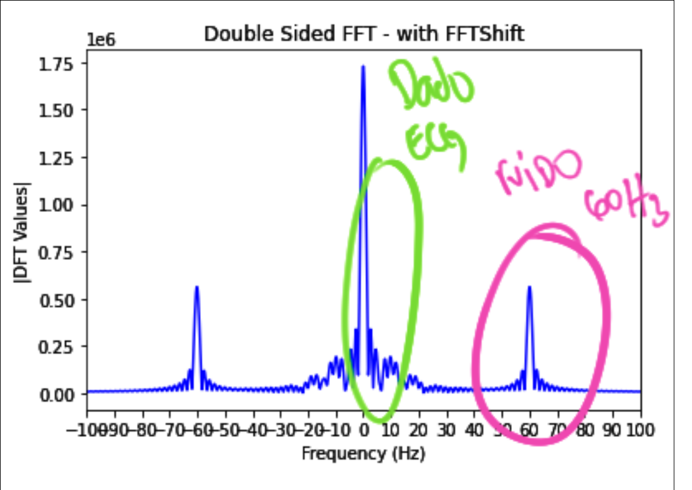
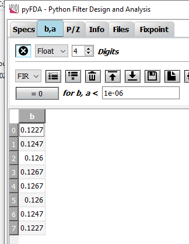

# Lab 8 - FIR


>Fonte: https://www.mathworks.com/matlabcentral/mlc-downloads/downloads/submissions/53983/versions/5/previews/html/ExampleECGBitalino.html

Neste laboratório iremos processar o sinal de ECG que vocês precisam processar na APS2. Vocês podem e devem usar o código do laboratório na APS.

!!! note "Preencher ao finalizar o lab" 
    - TODO: MARCO 

## Lab    

| Exemplo base                                          | LAB                   |
|-------------------------------------------------------|-----------------------|
| `SAME70-Examples/ TODO: CODIGO EXEMPLO` :arrow_right: | `Labs-8-RTOS-ADC-FIR` |

!!! warning "Código exemplo"
    - Vamos modificar o código exemplo `TODO: CODIGO EXEMPLO`, faça uma cópia do seu lab para a nova pasta no seu repositório `Labs/9-RTOS-ADC-FIR`

!!! note "Terminal"
    Esse exemplo faz uso da comunicação UART para debug de código (via printf), para acessar o terminal no atmel estúdio clique em:  :arrow_right: View :arrow_right: Terminal Window
    
    Configure o terminal para a porta que (COM) correta (verificar no windows) e configure para operar com um BaudRate de `115200`.

!!! info
    Iremos utilizar os seguintes periféricos diretamente:
    
    - AFEC1 (EXT1 PC31)
    - TC1 canal 1
    
    Indiretamente (o projeto já usa):
    
    - DAC0 (PB13)
    - TC0 canal 0
    
### Conectando

Vamos conectar o pino PB13 que gera o sinal o sinal analógico do batimento cardíaco ao pino PC31 do EXT1 que possui o AFEC1 conforme imagem e diagrama a baixo:

=== "Imagem"
    - TODO INSERIR IMAGEM

=== "Diagrama"
    ```
    ┌───────────────────┐
    │           ┌─────┐ │
    │           │afec │◄├────┐
    │           └─────┘ │    │
    │                   │    │ ecg 
    │  ┌─────┐  ┌─────┐ │    │
    │  │ tc0 ├─►│dac  ├─x────┘
    │  └─────┘  └─────┘ │ PB13
    └───────────────────┘
    ```

!!! progress
    Click para continuar....

### ECG

O sinal ECG gerado no pino PB13 possui a forma de onda a seguir:

{width=300}

E se analisarmos o espectro do sinal via transformada de fourier, obtemos a seguinte composição espectral:

{width=300}

!!! question short
    O que você consegue extrair de informações dos gráficos anteriores?
    
    !!! details ""
        No primeiro (ecg no tempo) podemos ver claramente que existe uma
        alta frequência no sinal, mas que o envelope é a informação do ecg.
        
        Já no fourier somos capazes se distinguir que existem duas regiões 
        com bastante informações, uma de baixa frquência (0..25)Hz e outra
        de 60Hz.
        
        {width=300}

!!! progress
    Click para continuar....

#### 60 Hz

Notamos claramente que existe um sinal centrada em 60Hz, isso é muito comum quando trabalhamos com eletrônica e reflete o 60Hz da rede elétrica que é propagada de diversas formas para o transdutor responsável em amostrar o dado do pulso elétrico do corpo humano, causando um ruído no sinal não desejável. 

Para trarmos o dado corretamente teremos que filtar o ruído. ==Lembre que em alguns paises a frequência da rede elétrica é de 50Hz e não de 60Hz como no Brasil.==

!!! info
    O som desse ruído em 60hz é chamado de [Zumbido elétrico](https://pt.wikipedia.org/wiki/Zumbido_el%C3%A9trico) soa como:

    <audio controls>
    <source src="https://upload.wikimedia.org/wikipedia/commons/a/ab/Mains_hum_60_Hz.ogg" type="audio/ogg">
    </audio>
    
    > ref: wiki


!!! progress
    Click para continuar....

## Filtros digitais

Filtragem de sinal pertence a uma grande área do conhecimento que é processamento de sinais, nesse laboratório iremos tratar do tema de forma superficial. Mas exemplos de aplicação de filtragem digital são:

- Remoção de ruído
- Processamento de Áudio
- Extração de parâmetros 
- ...

!!! tip
    Para saber mais leia: [The Scientist and Engineer's Guide to Digital Signal Processing](http://www.dspguide.com/)

### FIR

O [`Finite Impulse Response` (FIR)](https://en.wikipedia.org/wiki/Finite_impulse_response) é uma técnica de processamento digital de sinais (DSP) que é capaz de realizar filtragens em um sinal. Com o FIR somos capazes de aplicar um filtro do tipo: 

- passa baixas: Elimina as altas frequências
- passa altas: Elimina as baixas frequências
- mata faixa: Elimina uma faixa de frequências do sinal

Filtros digitais do tipo FIR possuem as seguintes vantagens:

1. São estáveis por natureza (não importa o  parâmetro do filtro, o sinal de saída vai ser estável)
1. Podem ser projetados para ter fase linear
1. Possuem flexibilidade no seu projeto
1. São fáceis de implementar 

O filtro possui a seguinte estrutura:

$$y[n] = b_0*x[n] + b_1*x[n-1] + .... b_n*x[n-N]$$

Onde:

- $y[n]$: Valor filtrado
- $x[n-N]$: Valor do dado não filtrado, atrasado de N amostras
- $b_n$: Coeficiente do filtro
- $N$: Ordem do filtro

Podemos representar a equação graficamente:


> Fonte: https://en.wikipedia.org/wiki/Finite_impulse_response

- $Z^{-1}$: Significa um atraso na amostra

#### Projeto do filtro

Podemos realizar o projeto do filtro FIR (achar a ordem N e os coeficientes B) de diversas maneiras diferentes, cada um possui uma vantagem sobre a outra. Vamos utilizar o [`Equiripple Algorithm`](https://www.weisang.com/en/documentation/firfilterremezalgorithm_en/#) que possui `ripples` em torno da frequência de corte (`fc`).


> Fonte: https://www.recordingblogs.com/wiki/equiripple-filter

O projeto do filtro envolve vários parâmetros e diversas escolhas, vamos verificarmos os mais importantes:

- $f_s$: Frequência de amostragem do sinal 
- $f_c$: Frequência de corte, quando a componente espectral já possui um ganho baixo e não influencia 'tanto' no sinal. Na $f_c$ o ganho do sinal é geralmente -3dB, o que significa em volts, que o sinal possui $sqrt(1/2)=0.707$ do seu valor inicial.

!!! note
    A filtragem não só altera o valor absoluto de um sinal, como também afeta sua frequência! Dependendo do que estiver analisando isso pode afetar o resultado final.
    
!!! progress
    Click para continuar....
    
#### pyfda

Para o projeto do filtro vamos utilizar uma ferramenta em python [`pyfda`](https://github.com/chipmuenk/pyFDA/) que vai nos ajudar encontrar os coeficientes `b` e `N` do filtro. Para isso siga os passos de instalação a seguir:

```bash
git clone https://github.com/chipmuenk/pyFDA/
cd pyFDA
pip3 install -r requirements.txt --user
python3 -m pyfda.pyfdax
```

Configure o filtro para:

{width=300}

E agora clique em :arrow_right: **DESIGN FILTER**. Vá na aba **b,a** e ==salve os valores de b em um txt, vamos usar mais tarde !==

{width=200}

### firmware

Esse exemplo possui:

- `task_mxt`: Leitura do touch
- `task_lcd`: Para exibição dos dados no LCD
- `task_adc`: Inicia um TC para fazer a conversão do ADC, recebe o dado e envia por uma fila.
- `TC1`: Timer configurado em 50Hz para fazer gerar o trigger da conversão analógica
- `AFEC`: Para realizar a leitura do potenciometro 

!!! note
    Iremos usar o TC como trigger do AFEC (no lugar da task_adc fazer isso como no lab RTOS-ADC) pelos seguinte motivos:
    
    1. Garantir que a aquisição ocorra na taxa especificada
    1. Permitir uma taxa de aquisição maior que o tick do RTOS

#### Plotando ADC no tempo

Vamos modificar a `task_lcd` para exibir o valor da leitura do potenciometro no tempo. O resultado esperado é o seguinte:

<video controls width="450">
    <source src="http://54.162.111.146/shared/embarcados/lab9-lcd.mp4"
            type="video/mp4">
    Sorry, your browser doesn't support embedded videos.
</video>

!!! tip
    1. Você deve fazer essa implementação dentro do `if` que pega um dado da fila `xQueuePlot`:
    ``` c
    if (xQueueReceive( xQueuePlot, &(plot), ( TickType_t )  100 / portTICK_PERIOD_MS)) {
        // aqui dentro!!
    }
    ```
    1. O dado que deve ser plotado é o `plot.raw`
    1. Crie um contador que fará o incremento do eixo `x`
       - dica: use `x = x + 5`;
    1. Incremente esse contador até chegar no final do LCD (`ILI9488_LCD_WIDTH`)
       - zere o contador quando chegar no final
       - apague a tela quando chegar no final `draw_screen()`
    1. Plote um circulo no lcd para cada ponto, exemplo:
    ``` c
    ili9488_set_foreground_color(COLOR_CONVERT(COLOR_BLACK));
    ili9488_draw_filled_circle(x, ILI9488_LCD_HEIGHT - plot.raw / 16, 2 );
    ```

Agora você deve modificar o plot, para plotar além do `plot.raw` exibir o `plot.filtrado` que mais para frente no lab será o nosso dado do ADC filtrado com o filtro projetado anteriormente. Atualmente ele é o valor `plot.raw` deslocado de 100.

!!! tip
    Utilize outra cor para mostrar esse dado:
    
    ``` c
    ili9488_set_foreground_color(COLOR_CONVERT(COLOR_RED));
    ```

!!! example "Resumo Tarefas"
    1. Exibir o valor `plot.raw` graficamente no lcd 
        1. Exibir o valor `plot.filtrado` graficamente no lcd 

#### Filtrando dado

Vamos agora aplicar o filtro projetado anteriormente no dado `adc`, iremos utilizar uma biblioteca da ARM chamada de [CMSIS DSP 4](http://www.keil.com/pack/doc/CMSIS/DSP/html/index.html) que possui uma série de funções matemáticas e de processamento de sinais. Dentro dessa biblioteca, iremos utilizar a função [`arm_fir_init_f32`](http://www.keil.com/pack/doc/CMSIS/DSP/html/group__FIR.html#ga5afaa7b8e6735bbc19e582aa9755b0e1) e [`arm_fir_f32`](http://www.keil.com/pack/doc/CMSIS/DSP/html/group__FIR.html#ga0cf008f650a75f5e2cf82d10691b64d9) que respectivamente: inicializa o filtro FIR do tipo `float_32` e aplica o filtro (convolução) ao sinal.

!!! tip 
    De uma olhada como essas funções são implementadas, elas abusam bastante da topologia interna do ARM (bem sistema hardware software) para entregarem uma função bem otimizada:

    - https://github.com/ARM-software/CMSIS_5/blob/9a825ef26043a0648894f5bf155edc0219b8212f/CMSIS/DSP/Source/FilteringFunctions/arm_fir_f32.c 

#### Inicializando filtro

Crie os defines a seguir:

```c
#define NUM_TAPS   8  // ordem do filtro (quantos coefientes)
#define BLOCK_SIZE 1   // se será processado por blocos, no caso não.
```

Agora vamos copiar os coeficientes do filtro que foram gerados na etapa do projeto do filtro para a variável `firCoeffs32`: 

``` c
const float32_t firCoeffs32[NUM_TAPS] ={0.12269166637219883,
    0.12466396327768503,
    0.1259892807712678,
    0.12665508957884833,
    0.12665508957884833,
    0.1259892807712678,
    0.12466396327768503,
  0.12269166637219883};
```

Agora dentro da `task_adc` (apos o `TC_ini`), vamos iniciar o filtro:

``` c
/* Cria buffers para filtragem e faz a inicializacao do filtro. */
float32_t firStateF32[BLOCK_SIZE + NUM_TAPS - 1];
float32_t inputF32[BLOCK_SIZE + NUM_TAPS - 1];
float32_t outputF32[BLOCK_SIZE + NUM_TAPS - 1];
arm_fir_instance_f32 S;
arm_fir_init_f32(&S, NUM_TAPS, (float32_t *)&firCoeffs32[0], &firStateF32[0], BLOCK_SIZE);
```

!!! example "Resumo Tarefas"
    1. Criar define `NUM_TAPS`
    1. Criar define `BLOCK_SIZE`
    1. Criar constant com coefientes do filtro `firCoeffs32`
    1. Modificar `task_adc` e inicializar filtro

#### Processando

Modifique o while da task adc para realizar a filtragem e enviar para o LCD exibir.

```
int i = 0;

while(1){

if (xQueueReceive( xQueueADC, &(adc), 100)) {
        if(i <= NUM_TAPS){
          inputF32[i++] = (float) adc.value;
        } else{
          arm_fir_f32(&S, &inputF32[0], &outputF32[0], BLOCK_SIZE);
          plot.raw = (int) inputF32[0];
          plot.filtrado = (int) outputF32[0];
          xQueueSend(xQueuePlot, &plot, 0);
          i = 0;
        }
```

Resultado esperado:

<video controls width="450">
    <source src="http://54.162.111.146/shared/embarcados/lab9-lcd2.mp4"
            type="video/mp4">
    Sorry, your browser doesn't support embedded videos.
</video>

## B

- Criar um novo filtro de ordem 12 e trocar o atual

## A

No lugar de mostrar uma linha no tempo, fazer um ponto em um circulo 
