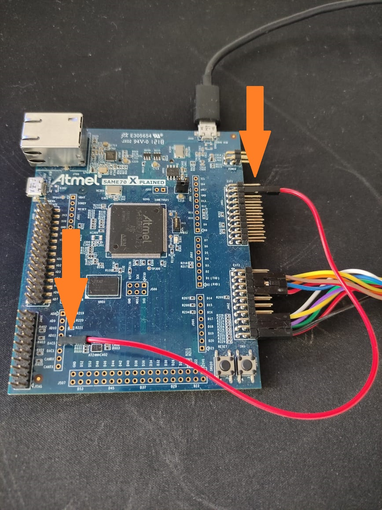
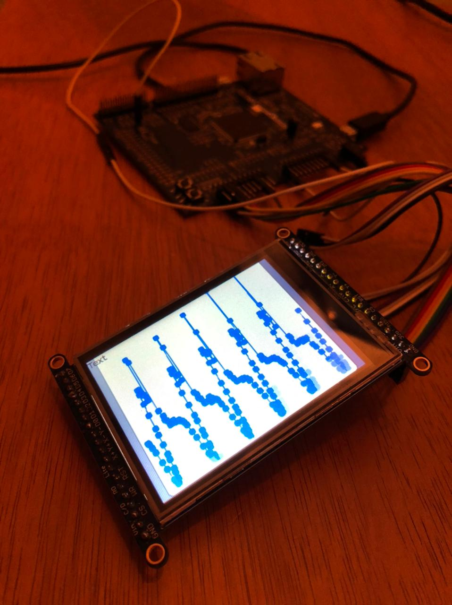
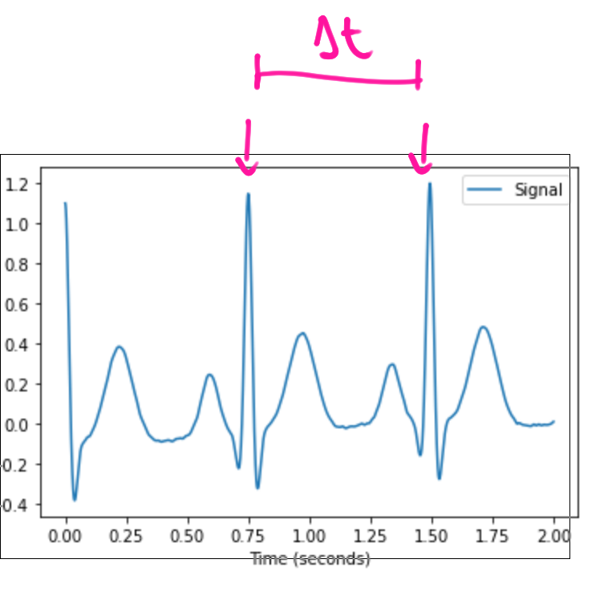
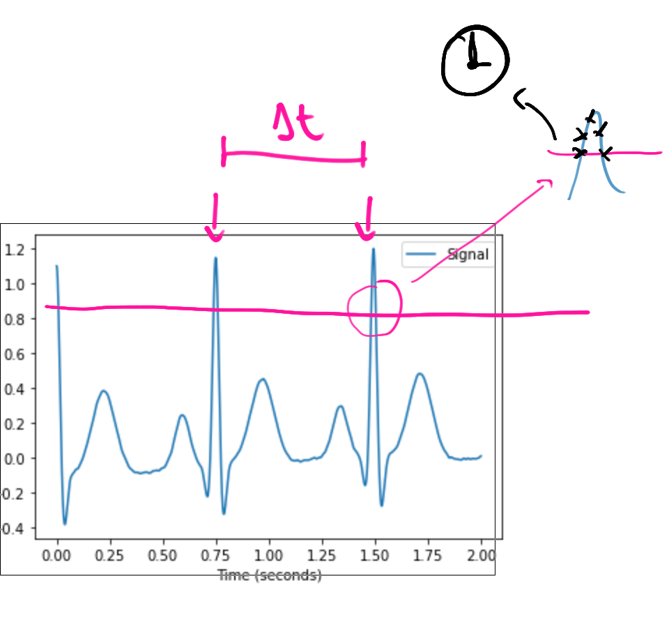
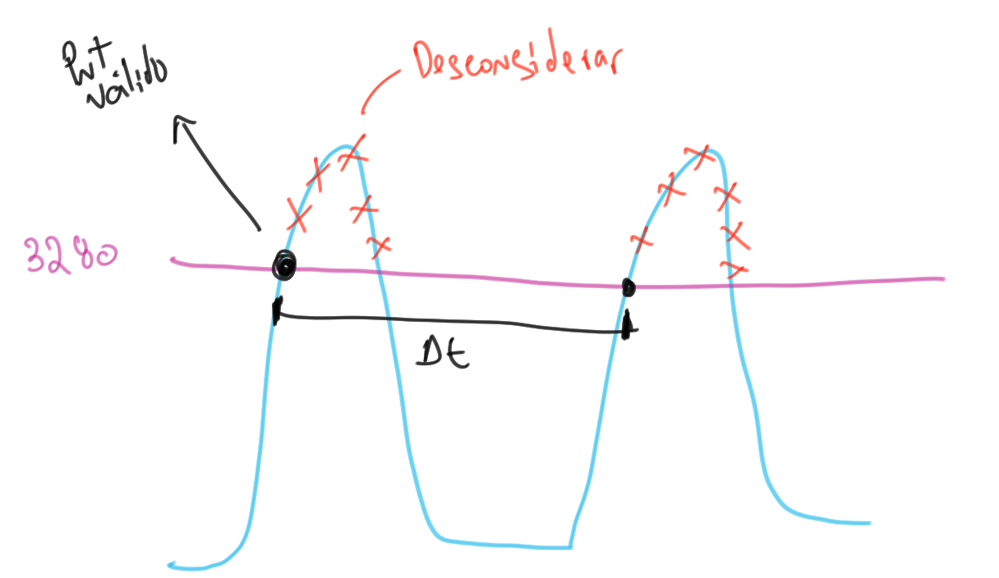

# Lab 8 - ECG

Neste laboratório iremos aquisitar e processar o sinal de ECG que vocês terão que usar na APS2. 


## Lab    

| Exemplo base                                          | LAB                   |
|-------------------------------------------------------|-----------------------|
| `SAME70-Examples/Demos/ECG` :arrow_right: | `Labs-8-RTOS-ADC-FIR` |

!!! warning "Código exemplo"
    - Vamos modificar o código exemplo [SAME70-examples/Demos/ECG/](https://github.com/Insper/SAME70-examples/tree/master/Demos/ECG), faça uma cópia para o seu repositório de laboratórios renomeando para `Labs/8-RTOS-ECG`.

!!! info "Periféricos"
    Iremos utilizar os seguintes periféricos diretamente:
    
    - AFEC1 (EXT1 PC31), canal 6
    - TC1 canal 1
    - RTT
    
    Indiretamente (o projeto já usa para gerar o ECG):
    
    - DAC0 (PB13)
    - TC0 canal 0
    
### Conectando

!!! info
    Você deve ter o LCD conectado na placa.

Vamos conectar o pino PB13 que gera o sinal o sinal analógico do batimento cardíaco ao pino PC31 do EXT1 que possui o AFEC1 conforme imagem e diagrama a baixo:

=== "Imagem"
    {width=400}

=== "Manual"
    {width=500}

=== "Diagrama"
    ```
    ┌───────────────────┐
    │           ┌─────┐ │
    │           │afec │◄├────┐
    │           └─────┘ │    │
    │                   │    │ ecg 
    │  ┌─────┐  ┌─────┐ │    │
    │  │ tc0 ├─►│dac  ├─x────┘
    │  └─────┘  └─────┘ │ PB13
    └───────────────────┘
    ```

!!! progress
    Click para continuar....

### ECG

O sinal ECG gerado no pino PB13 possui a forma de onda a seguir:

{width=300}

E se analisarmos o espectro do sinal via transformada de fourier, obtemos a seguinte composição espectral:

{width=300}

!!! question short
    O que você consegue extrair de informações dos gráficos anteriores?
    
    !!! details ""
        No primeiro (ecg no tempo) podemos ver claramente que existe uma
        alta frequência no sinal, mas que o envelope é a informação do ecg.
        
        Já no fourier somos capazes se distinguir que existem duas regiões 
        com bastante informações, uma de baixa frquência (0..25)Hz e outra
        de 60Hz.
        
        {width=300}

!!! progress
    Click para continuar....

#### 60 Hz

Notamos claramente que existe um sinal centrada em 60Hz, isso é muito comum quando trabalhamos com eletrônica e reflete o 60Hz da rede elétrica que é propagada de diversas formas para o transdutor responsável em amostrar o dado do pulso elétrico do corpo humano, causando um ruído no sinal não desejável. 

Para tararmos o dado corretamente teremos que filtra o ruído. ==Lembre que em alguns países a frequência da rede elétrica é de 50Hz e não de 60Hz como no Brasil.==

!!! info
    O som desse ruído em 60hz é chamado de [Zumbido elétrico](https://pt.wikipedia.org/wiki/Zumbido_el%C3%A9trico) soa como:

    <audio controls>
    <source src="https://upload.wikimedia.org/wikipedia/commons/a/ab/Mains_hum_60_Hz.ogg" type="audio/ogg">
    </audio>

!!! progress
    Click para continuar....

## Task process

Vamos criar uma tarefa no RTOS que será responsável por processar os dados do ECG, iremos chamar a tarefa de `task_process`. Essa tarefa irá receber os dados da conversão analógica, processar e extrair informações e retornar enviar os dados para a `task_main`.

!!! example "Tarefa: task_process"
    1. Crie uma tarefa chamada de `task_process`, ela pode estar vazia por hora. Não esqueça do while(1) e de criar ela na função main (`xTaskCreate`).

!!! progress
    Click para continuar....

## Leitura analógica

Para começarmos precisamos ler o valor do ECG que está sendo gerado no pino PB13, para isso iremos configurar a leitura analógica no AFEC1 canal 6. A leitura anlógica deve ser executada a 256 Hz, para garantirmos que estaremos lendo a uma taxa de amostragem fixa, vamos configurar um TC para fazer a conversão do sinal. O valor convertido deve ser colocado em uma fila para processamento futuro, como indicado a seguir:

{width=600}

!!! info
    Taxa de amostragem fixa simplifica muito o processamento de sinais digitais, muitas técnicas assumem que o valor é constante.
    
    A forma como fizemos no laboratório do AFEC não é boa aqui, porque lá usávamos uma tarefa do RTOS para gerar a taxa de amostragem (`vtaskDelay`) e isso não garante que tenhamos uma taxa fixa, pois não é garantido que a tarefá vá executar exatamente no delay proposto (outras taréfas de prioridade superior podem estar executando).
    
    Além disso, o uso de uma task para gerar a taxa de amostragem limita a taxa que podemos usar, o RTOS executa no máximo a 1000Hz.
    
!!! question choice
    Qual handler é referente ao TC1 canal 6?
    
    - [ ] `TC6_Handler`
    - [ ] `TC1_Handler`
    - [x] `TC3_Handler`
    
!!! example "Tarefa: Lendo dados"
    No começo da `task_process`:
    
    - [ ] Criar uma fila de inteiros `xQueueECG` de tamanho 256
    - [ ] Configurar TC1 canal 0 para gerar uma interrupção a cada 250Hz
    - [ ] Configurar leitura no AFEC 1 canal 6
    
    Handlers/Callbacks:
    
    - [ ] No TC3_Handler inicializar a conversão do AFEC1 canal 6
        - Isso vai fazer que com que tenhamos 250 amostras por segundo do ECG.
    - [ ] No callback do AFEC ler o dado e colocar na fila `xQueueECG`
    
    Dentro do while da `task_process`:
    
    - [ ] Ler o dado da fila `xQueueECG` e imprimir no terminal.

    ==Validar:==
    
    - [ ] Executar o programar, abrir o terminal e obter dados que variam no tempo (entre 0 e 3000).
    
!!! progress
    Click para continuar....
 
## Retransmitindo o dado

Uma boa prática é atualizar o LCD apenas em uma tarefa, o LVGL **não é thread-safe by default**, como o site indica na página página:

- https://docs.lvgl.io/latest/en/html/porting/os.html

Isso significa que não podemos chamar uma função do LVGL enquanto a anterior não tenha terminado de executar, e caso implementemos o acesso ao LCD em várias partes do nosso programa corremos grande risco disso acontecer (lembrem que o RTOS interrompe uma tarefa para permitir que outra execute, e isso pode ser no meio da função por exemplo de mudar o valor do label).

!!! info
    O site indica o uso de mutex para solucionar este problema, vocês terão isso em Sistemas Hw Sw.

Para não termos que usar mutex, vamos atualizar o LCD apenas em uma das tasks, eu sugiro fazermos isso na `task_main`.

Por conta disso iremos retransmitir o dado da fila do ECG para a `task_main` por outra fila: `xQueueEcgInfo` que será do uma struct contendo dois inteiros: `ecg` e `bpm`. 

A ideia aqui é que a `task_process` irá pegar os dados do ECG, processar e extrair o valor da frequência cardiaca (em batimentos por minuto) e retransmitir para a `task_main` exibir no LCD.

{width=500}

!!! example "Tarefa: Retransmitindo"
    Vamos restransmitir o dado do ecg da `task_process` para a `task_main`.
    
    `task_process`:
    
    - [ ] Cirei uma struct `ecgInfo` com dois parâmetros inteiros: ecg, bpm.
    - [ ] Crie uma fila `xQueueEcgInfo` capaz de armazenar até 32 valores do `ecgInfo`
        - ==Dica: Sugerirmos criar na função main, antes de iniciarem as tasks.==   
    - [ ] Faça o envio do dado do Ecg da `task_process` para a `task_main`, coloque qualquer valor no bpm.
    

    `task_main`:
    
    - [ ] Faça a leitura da fila `xQueueEcgInfo`
    - [ ] Altere o printf da `task_process` para `task_main` para validar a transmissão dos dados.

!!! progress
    Click para continuar....

## Exibindo gráfico

Agora que já temos o caminho do dado pronto vamos exibir no LCD usando o widget [lv_chart](https://docs.lvgl.io/latest/en/html/widgets/chart.html#overview). O site explica vários modos de fazer isso, eu irei sugerir um que fiz e funcionou bem.

Primeiro teremos que criar um vetor global (`int ser1_data[256]`) que irá armazenar os pontos do gráfico, o vetor precisa ter o tamanho da quantidade de pontos que queremos exibir. Vamos começar com 256, depois vocês podem ajustar até encontrarem um valor adequado. 

Depois precisamos criar o ponteiro para o gráfico (`lv_obj_t * chart;`) e para a série do (`ser1`) também global (assim como fazermos para os labels e botões). E então inicializar o gráfico. Aqui eu irei fazer na função `lv_screen_chart` que deve ser chamada no começo da `task_LCD`, como demonstrado a seguir:

!!! example "Tarefa: chart"

    Insira o código a seguir (variáveis globais e função):
    
    ```c
    // globais
    #define CHAR_DATA_LEN 256
    int ser1_data[CHAR_DATA_LEN];
    lv_obj_t * chart;
    lv_chart_series_t * ser1;

    // Desenha gráfico no LCD
    void lv_screen_chart(void) {
    chart = lv_chart_create(lv_scr_act(), NULL);
    lv_obj_set_size(chart, 300, 250);
    lv_obj_align(chart, NULL, LV_ALIGN_IN_BOTTOM_MID, 0, 0);
    lv_chart_set_type(chart, LV_CHART_TYPE_LINE);   
    lv_chart_set_range(chart, 0, 4095);
    lv_chart_set_point_count(chart, CHAR_DATA_LEN);
    lv_chart_set_div_line_count(chart, 0, 0);
    lv_chart_set_update_mode(chart, LV_CHART_UPDATE_MODE_SHIFT);

    ser1 = lv_chart_add_series(chart, LV_COLOR_BLUE);
    lv_chart_set_ext_array(chart, ser1, ser1_data, CHAR_DATA_LEN);
    lv_obj_set_style_local_line_width(chart, LV_CHART_PART_SERIES, LV_STATE_DEFAULT, 1);
    }
    ```
    
    Faça as modificações como indicado a seguir:

    ```diff
    static void task_lcd(void *pvParameters) {
    + lv_screen_chart();

    for (;;)  {
        lv_tick_inc(50);
        lv_task_handler();
        vTaskDelay(50);
    }
    }
    ```

!!! progress
    Click para continuar....

Agora temos que modificar a função `task_main` para toda hora que receber um novo valor na fila `xQueueEcgInfo` ela atualizar o gráfico. Para isso iremos usar a função `lv_chart_set_next(chart, ser1, value)`, após termos atualizado a série precisamos indicar ao LVGL que é para atualizar o gráfico, isso é feito pela função `      lv_chart_refresh(chart)`.

- Mais informções na página do widget: https://docs.lvgl.io/latest/en/html/widgets/chart.html#overview

Com isso vocês devem obter algo como:

{width=300}

!!! example "Tarefa: Exibindo"
    Agora modifique o firmware para atualizar o dado da série e exibir o dado toda vez que receber um dado novo na fila `xQueueEcgInfo`. Para isso vão precisar usar as duas funções a seguir:
    
    ```c
    //                    novo valor | 
    //                               v
    lv_chart_set_next(chart, ser1, value);
    lv_chart_refresh(chart);
    ```

    - Programe e teste na placa
    
!!! progress
    Click para continuar....

## Frequência cardiaca

Agora vamos modificar a `task_process` para detectar a frequência cardiaca, na literatura existem várias maneiras (bem mais correta da qual eu irei propor) o artigo a seguir explora algumas das maneiras:

- [Parák, Jakub, and Jan Havlík. "ECG signal processing and heart rate frequency detection methods." Proceedings of Technical Computing Prague 8 (2011): 2011. ](https://www2.humusoft.cz/www/papers/tcp11/091_parak.pdf)

A ideia principal é detectar o intervalo de tempo entre cada pico:

{width=300}

A implementação que iremos fazer aqui envolve aplicar um threshold no valor e esperar até o próximo pico, calculando o tempo entre os dois sinais.

{width=400}

!!! question choice
    No exemplo anterior qual o valor da frequência cardiaca em batimento por minuto?
    
    - [x] 80
    - [ ] 0.75
    - [ ] 75
    
    !!! details ""
        A conta a ser feita é

        1. Econtra **dT = 75s**
        1. Do dT calcula a frequência em Hz -> 1/dT: **1.33**
        1. Hz = 1/s, multiplica por 60 para encontrar a frequência em minuto: **1.33*60 = 80 bpm**

!!! progress
    Click para continuar....

### RTT

Para calcularmos o **dT** iremos usar o periférico RTT, que ficará gerando pulsos e depois iremos verificar quantos pulsos aconteceram no intervalo entre um pico e outro e então estimar o valor do **dT**. O RTT será configurado para operar a uma taxa de 1000Hz, ou seja, 1000 pulsos por segundo, isso nos dará uma boa resolução.

Neste caso não iremos usar a interrupção do RTT de alarme, mas sim a de tempo (que vai ocorrer 1000x por segundo). Sempre que ela ocorrer, iremos incrementar um contador global que será nosso dT. Esse contador será zerado a cada pulso.

!!! example "Tarefa: Inicialize o RTT"
    O RTT deve ser inicializado na `task_process`.
    
    - [ ] Crie uma variável global g_dT
    - [ ] Inicialize o RTT para operar a 1000Hz
        - não vamos usar o alarme, coloque qualquer valor.
    - [ ] A cada interrupção de tick do RTT, incremente a variável `g_dT`
    
!!! progress
    Click para continuar....

### Threshold

Iremos aplicar o threshold e procurar por valores que nos ajudem a encontra o pico, isso será feito sempre que um novo dado chegar na fila `xQueueEcg`. 

!!! example "Tarefa: threshold"
    Para cada dado recebido na fila do ecg aplique o threshold e imprima o valor encontrado e seu dT, lembre de zerar o dT.
   
    Sugerimos aplicar **3280** como threshold.

    ??? info "Exemplo"
        ```c
        if (xQueueReceive( xQueueAdc, &adc, 50 )) {
            // ...
            // ...
            if (adc > 3280 ){
                printf("%d: %d ms\n", adc, g_dT);
                // começamos a contar novamente
                g_dT = 0;
            }
        }
        ```

!!! progress
    Click para continuar....

### Melhorando

A implementação anterior não funciona muito bem, as vezes encontramos mais de um valor no mesmo pico dentro do range estipulado:

{width=500}

!!! example "Melhorando"
    Faça alguma mágica para desconsiderar mais de um ponto no mesmo pico.
    
    - Lembre de validar com os dados no terminal, seus dT devem ser no mínimo maior que 20 ms.

!!! tip 
    Para valorizar os picos do sinal vocês poderiam usar a energia dele (E(t) = ecg(t)^2), a energia de um sinal valoriza seus picos. 
    
    Se for usar energia lembre de ajustar o valor do threshold.

!!! progress
    Click para continuar....

### Calculando bpm

Agora com o dT correto conseguimos converter a informação para bpm.

!!! example "Tarefa: bpm"
    Calcule o bpm do ecg e imprima no terminal. Verifique se está dentro do range válido.
    
    - O valor deve variar ligeramente no tempo e ficar entre 60 bpm e 80.

!!! progress
    Click para continuar....

### Exibindo

Agora que temos o valor do bpm, vamos enviar essa informação junto com o ecg para a `task_main` via a fila `xQueueEcgInfo` (lembra que criamos uma struct?). Com a informação na tarefa que atualiza o LCD, conseguimos criar um label e exibir o valor na tela junto com o gráfico.

O resultado esperado é algo como:

{width=400}

!!! example "Tarefa: Exibindo"
    Execute:
        
    - [ ] Envie o dado do bpm para a task_main via a fila
    - [ ] Crie um label novo para exibir a informação
    - [ ] A cada novo dado na fila atualize o valor do label.
 
!!! tip
    Caso queira que o valor da frequência mude com maior periodicidade, altera o define `ECG_CHANGE_TIME` que está no arquivo `aps2/aps2.h`, este define especifica (em ms) a cada quanto tempo o valor do delay entre um pulso e outro será atualizado.
    
    Sugestão de valor: 1000 (1 segundo)

 !!! progress
    Click para continuar....
 
## Próximos passos?

- Filtrar o sinal
- Fazer o threshold ser dinâmico 
- Deixar gráfico maios bonito

