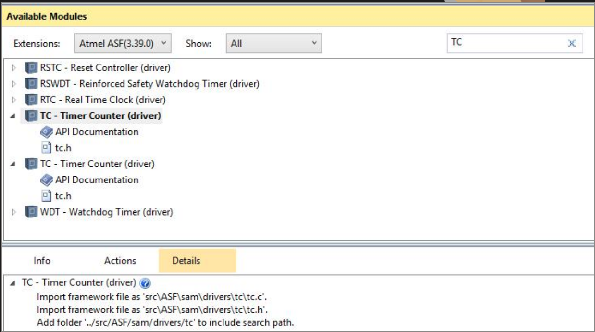

# LAB - TC - RTC - RTT  

Neste laboratório iremos trabalhar com os periféricos de contagem de tempo
do nosso microcontrolador.

<button class="button0" id="0:comencando" onClick="progressBut(this.id);">Começando Laboratório!</button>

| Pasta              |
|--------------------|
| `Lab4-TC-RTC-RTT` |

Os periféricos trazidos neste laboratório são:

- Real Time Clock - RTC
- Timer Counter - TC
- Real Time Timer - RTT

O laboratório é formado por duas partes:

- Parte 1 (mínimo): 
    1. Entender os exemplos (TC/RTT/RTC)
    1. Incorporar todos os exemplos em um único projeto
    1. Pisca pisca 
    
- Parte 2:
    - **C+**: fazer outro LED piscar com TC
    - **B** : Exibir a hora atual no OLED 
    - **A** : Usar IRQ do segundos do RTC

## Exemplos

!!! warning "SAME70-examples"
    Antes de continuar atualize o repositório de exemplos ele pode ter tido melhorias.

Nesse lab iremos trabalhar com três periféricos que lidam com 'tempo', o TimerCounter - TC (temos no total de quatro unidades TC (TC0 ~ TC3) e cada uma pode lidar com três contagens, totalizando 12) o Real-time Timer - RTT (temos uma) e o Real-time Clock RTC (temos uma). Cada um possui sua especifidade:

- TC: Faz várias coisas, neste lab iremos usar para gerar interrupções maiores que 2Hz (**ele não consegue gerar tempos muito lentos!**)
- RTT: É um contador que consegue gerar praticamente qualquer frequência (vamos usar para gerar frequências lentas)
- RTC: É um como um calendário com relógio, ele conta anos, meses, dias, horas, minutos e segundos.

Cada periférico está em um exemplo diferente:

| Periférico exemplos                                                                                   |
| ----------             ----                                                                           |
| [`Perifericos/TC-IRQ `](https://github.com/Insper/SAME70-examples/tree/master/Perifericos-uC/TC-IRQ)  |
| [`Perifericos/RTT-IRQ`](https://github.com/Insper/SAME70-examples/tree/master/Perifericos-uC/RTT-IRQ) |
| [`Perifericos/RTC-IRQ`](https://github.com/Insper/SAME70-examples/tree/master/Perifericos-uC/RTC-IRQ) |

Cada exemplo possui o seu próprio `README` que explica de forma ampla os periféricos. Note que todos esses exemplos estão operando por interrupção! Onde cada periférico possui o seu `handler` para resolver a interrupção.

!!! example "Tarefa"
    Para cada exemplo (TC,RTT e RTC):
    
    1. Leia o README
    1. Programe a placa (e veja os LEDs piscando!)
    1. Entenda o código

<button class="button0" id="1:exemplos" onClick="progressBut(this.id);">Cheguei Aqui!</button>

## Lab

O lab faz uso da placa `OLED1` e de um código exemplo. Para começar você deve copiar o código exemplo: [`SAME70-examples/Screens/OLED-Xplained-Pro-SPI/`](https://github.com/Insper/SAME70-examples/tree/master/Screens/OLED-Xplained-Pro-SPI) para a pasta da entrega do seu repositório `Lab4-TC-RTC-RTT`.

### C: TC, RTT e RTC 

Com o código do OLED1 copiado, vocês devem configurar os botões e os LEDs da placa OLED e então utilizando os periféricos fazer:

- Que o `LED1` pisque na frequência de 4Hz, para isso utilize o **TC**;
- Fazer com que o `LED2` pisque a uma frequência de 0.25Hz, para isso utilize o **RTT**;
- Piscar o `LED3` depois de 20 segundos do botão 1 da placa OLED ter sido pressionado, para isso utilize o alarme do RTC.

Fazer o uC entrar em sleepmode sempre que não tiver nada para fazer.

!!! example "Tarefa"
    No código do OLED1:
    
    1. Configurar os pinos e os LEDs da placa OLED1
    1. Fazer com que o `LED1` pisque a 4Hz usando o TC
    1. Fazer com que o `LED2` inverta seu estado a cada 4s usando o RTT
    1. Fazer com o que o `LED3` inicie apagado e pisque uma vez após 20 segundos do botão 1 ter sido pressionado, use o RTC.
    1. Entrar em sleepmode sempre que possível

!!! tip
    Abrir o código atual e o exemplo e ir trazendo as funções e defines que precisa usar, não esqueça de chamar as funções no `main`

!!! tip
    Você vai precisar incluir no `ASF WIZARD` os drivers do ~~TC~~, RTT e RTT
    
    ==O TC já foi adicionado no código exemplo (OLED-Xplained-Pro-SPI), não adicone o outro que vai dar problema!!!!==
    
    

!!! tip
    O RTC tem uma função que você consegue buscar no periférico a hora atual: [`rtc_get_time()`](https://asf.microchip.com/docs/latest/same70/html/group__sam__drivers__rtc__group.html#ga91b1a1ac85e5bb5effefe275b824fe6a), você pode então configurar um alarme para daqui 20s. 
    
    - Leia a função e entenda os seus parâmetros!! 

<button class="button0" id="2:rubrica-C" onClick="progressBut(this.id);">Cheguei Aqui!</button>

### C+: Piscar mais um LED

!!! example "Tarefa"
    Faça o LED da placa piscar a 5Hz usando um novo TC.

<button class="button0" id="2:rubrica-C+" onClick="progressBut(this.id);">Cheguei Aqui!</button>

### B: Exibindo HH:MM:SS

!!! example "Tarefa"
    Exiba a hora no formato (HH:MM:SS) no display OLED
    


!!! tip 
    Para executar isso você deverá ser capaz de saber quando que o segundo mudou, duas são as opções:
    
    1. Usar um novo TC configurado com 1hz
    1. Pedir para o RTC gerar uma IRQ a cada mudança de segunda
    
    A segunda opção você faz modificando a função de init_rtc:
    
    ```c
    RTC_init(RTC, ID_RTC, rtc_initial, RTC_IER_ALREN | RTC_IER_SECEN);
    ```
    
    E agora você consegue dentro do `RTC_handler` saber quando você entrou
    na IRQ pelo segundo:
    
    ```c
    /*  Verifica por qual motivo entrou
    *  na interrupcao, se foi por segundo
    *  ou Alarm
    */
    if ((ul_status & RTC_SR_SEC) == RTC_SR_SEC) {
        
        //    
        //  Entrou por segundo! 
        // 
    	rtc_clear_status(RTC, RTC_SCCR_SECCLR);
    }
    ```

!!! warning
    Você nunca deve atualizar display dentro de interrupção (**handler**)! Sempre no main.
    
<button class="button0" id="2:rubrica-B" onClick="progressBut(this.id);">Cheguei Aqui!</button>

### A: Melhorando

Quando o botão 1 da placa OLED for pressionado, após 20 segundos, faça o LED 3 piscar 
com um novo TC.

<button class="button0" id="2:rubrica-A" onClick="progressBut(this.id);">Cheguei Aqui!</button>

----------

!!! note "Preencher ao finalizar o lab"
    <iframe src="https://docs.google.com/forms/d/e/1FAIpQLSfuDhfKfPGbG-SHpCFSShFpK3Mp1d0GbCwYMGz--gydEU_zFQ/viewform?embedded=true" width="640" height="320" frameborder="0" marginheight="0" marginwidth="0">Carregando…</iframe>