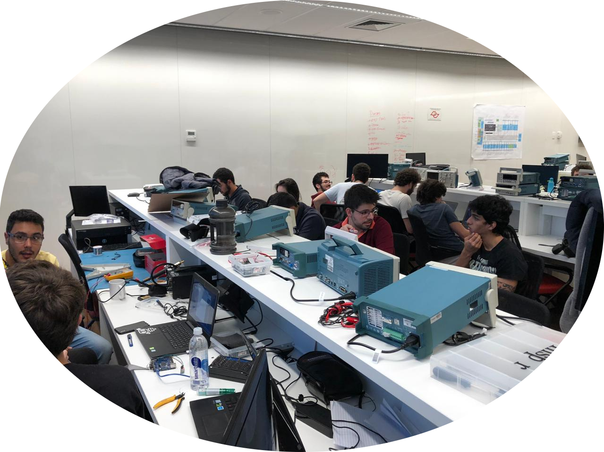

# Bem vindo a disciplina Computação Embarcada

!!! success "2020-2"
    Material atualizado.

- **Curso:** Engenharia Da Computação - Quinto Semestre
- **Disciplina:** Computação Embarcada [Insper](https://www.insper.edu.br/)
- **Repositório:** [http:/github.com/Insper/ComputacaoEmbarcada](http:/github.com/Insper/ComputacaoEmbarcada)
- **Local:** Laboratórios de Arquitetura de Computadores e Informática
- **Equipe:**
    - **Prof. Rafael Corsi** / rafael.corsi@insper.edu.br
    - Prof. Eduardo Marossi
    - Técnico Marco Mello
**© Todos os direitos reservados**

------------------

## Objetivos

Ao final da disciplina o estudante deve ser capaz de:

1.	Criar softwares para microcontroladores utilizando suas especificidades;
2.	Avaliar e melhorar soluções embarcadas integrando hardware/software levando em conta adequação a uma aplicação;
3.	Integrar em um protótipo hardware, software básico, sistema operacional de tempo real e módulos de interfaceamento com usuários, de comunicação e de alimentação.
4.	Compreender as limitações de microcontroladores e seus periféricos;
5.	Buscar e analisar documentação (datasheet) e extrair informações relevantes.

## Motivação

Sistemas embarcados movem o mundo!

### Alguns Projetos de 2019

<iframe width="560" height="315" src="https://www.youtube.com/embed/xfCjqsRxOO0" frameborder="0" allow="accelerometer; autoplay; encrypted-media; gyroscope; picture-in-picture" allowfullscreen></iframe>

<iframe width="560" height="315" src="https://www.youtube.com/embed/Rtngc9UBV-k" frameborder="0" allow="accelerometer; autoplay; encrypted-media; gyroscope; picture-in-picture" allowfullscreen></iframe>

<iframe width="560" height="315" src="https://www.youtube.com/embed/Xk86Dx85DUg" frameborder="0" allow="accelerometer; autoplay; encrypted-media; gyroscope; picture-in-picture" allowfullscreen></iframe>

<iframe width="560" height="315" src="https://www.youtube.com/embed/SbB6z_b_fc8" frameborder="0" allow="accelerometer; autoplay; encrypted-media; gyroscope; picture-in-picture" allowfullscreen></iframe>

<iframe width="560" height="315" src="https://www.youtube.com/embed/3MskQc6xw5s" frameborder="0" allow="accelerometer; autoplay; encrypted-media; gyroscope; picture-in-picture" allowfullscreen></iframe>

<iframe width="560" height="315" src="https://www.youtube.com/embed/nDGiS4ESHzE" frameborder="0" allow="accelerometer; autoplay; encrypted-media; gyroscope; picture-in-picture" allowfullscreen></iframe>

<iframe width="560" height="315" src="https://www.youtube.com/embed/cLzB3bGji-c" frameborder="0" allow="accelerometer; autoplay; encrypted-media; gyroscope; picture-in-picture" allowfullscreen></iframe>

## Começando 

Leia mais sobre o curso e a infra necessária em: [Sobre](Sobre-Curso.md)

## Histórico

Pequeno histórico da evolução da disciplina:

- 2020-2: 
    - full online: sai APS-1 e entra projeto 1, mantém APS-2 e APS-3.
    
- 2020-1: 
    - Devido ao corona o projeto foi cancelado, os alunos receberam um complemento do kit para trabalharem de casa. As APS foram: Musica, LCD bike e WIFI. As avaliaçòes individuais foram aprimoradas. A parte de UX foi bem trabalhada nesse semestre.
     
- 2019-2 (DP):
    - Troquei a APS 2 da máquina de lavar para a Bike. Como só tinha um aluno, as APS viraram projetos.

- 2019-1:
    - Introduzi as APS: Musical; Máquina de Lavar e Wifi (tinha uma de sensores também), os alunos tiveram que entregar 2 projetos: controle/ vending machine e projeto livre. Primeira vez que aparece 
      o projeto fechado do começo de semestre. **Estreia do lab de Arq.**
    
- 2018-1:
    - Um projeto ao longo do semestre todo. Introduzi avaliação individual.

- 2017-1 (primeira turma):
    - Um projeto ao longo do semestre todo.
