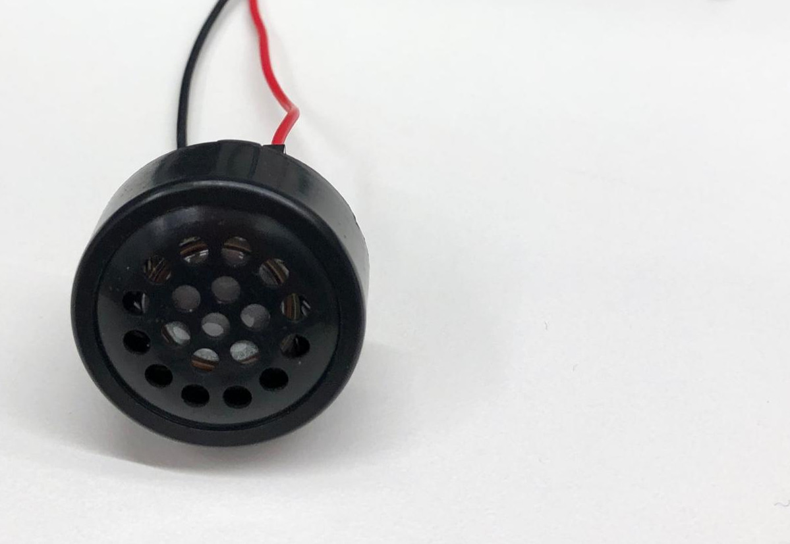

# APS 1 - Musical

| Entrega Final |
|---------------|
| 20/3/2022     |

Nesta APS vocês irão desenvolver um sistema embarcado que reproduz uma [música monofonia](https://en.wikipedia.org/wiki/Monophony), para isso irão utilizar um 
buzzer conectado a um pino do microcontrolador.

Veja um exemplo de entrega do semestre passado:

<iframe width="560" height="315" src="https://www.youtube.com/embed/zIaxAw1h3vM" title="YouTube video player" frameborder="0" allow="accelerometer; autoplay; clipboard-write; encrypted-media; gyroscope; picture-in-picture" allowfullscreen></iframe>

## Regras

Leia atentamente as regras a seguir:

!!! warning "Plágio"
    - Você não pode copiar código (parcial ou total) de outro grupo (do mesmo ou de outro semestre).
    - Você pode usar qualquer código fornecido pela equipe.
    - Código da internet? Você não pode copiar grandes trechos.
    - Código da internet? Se usou alguma coisa, referencie no README.
    
    A regra completa pode ser acessada em: https://www.insper.edu.br/portaldoaluno/wp-content/uploads/2018/08/orientacoes_integridade_intelectual-Engenharias.pdf

!!! info "Atraso"
    - Para cada 3 dias de atraso será descontado meia rubrica.

!!! tip "Dupla"
    - A APS pode ser realizada em dupla.
    - Você não vai poder repetir dupla na próxima APS.
    - O desenvolvimento do projeto deve ser feito no repositório criado
    pelo classroom:
        - https://classroom.github.com/a/GOKegD-O
    - Leia atentamente como trabalhar no repositório:
         - [APS HowTo](https://insper.github.io/ComputacaoEmbarcada/navigation/APS/APS-howto/)

!!! tip "Entrega"
    <iframe src="https://docs.google.com/forms/d/e/1FAIpQLSfkStwsTuXzp6LfsZWVsNskVRIVL0l7XTehNx_GsDPHE1aulA/viewform?embedded=true" width="640" height="320" frameborder="0" marginheight="0" marginwidth="0">Loading…</iframe>
    
## Descrição

A entrega final deverá ser um sistema embarcado que via a adição de um [`buzzer`](https://en.wikipedia.org/wiki/Buzzer) ao uC o mesmo deve ser capaz de reproduzir músicas 'conhecidas'. Além do buzzer deve-se adicionar dois botões ao kit, para ser usado para: 

- mudar de música
- pause / play.

> O pause deve interromper a música e o play retomar do ponto que parou.

## Materiais

Os materiais a seguir estão disponíveis no kit de embarcados e são necessários para realizar a APS:

- 2x botões (push buttons)
- 1x protoboard
- 1x buzzer 

{width=200}

## Referências

A seguir algumas referências:

- https://github.com/robsoncouto/arduino-songs/
- https://www.youtube.com/watch?v=-kkxs_fekWM
- https://www.princetronics.com/supermariothemesong/
- https://www.hackster.io/muhammed-shameel-k-v/how-to-play-music-with-a-buzzer-and-arduino-b9a25d
- https://github.com/xitangg/-Pirates-of-the-Caribbean-Theme-Song/blob/master/Pirates_of_the_Caribbean_-_Theme_Song.ino

## Dicas

A página [APS/APS 1 - Musical - Firmware](/ComputacaoEmbarcada/APS-1-Musical-software) possui
dicas valiosas de como realizar a implementação.

## Rubrica

A rubrica a seguir será aplicada a nota da entrega:

- https://forms.gle/ycM3f82Z7YhE9w9j7

- A+ 
    - Músicas organizadas em vetores de `structs` (ponteiros)
- A 
    - Utiliza interrupção nos botões
    - Cria um arquivo `.c` `.h` com as funções de reprodução musical
- B+
    - `README.md` explica como o software foi estruturado
    - Faz uso de `#define` sempre que possível 
    - Terceira música
    - ==Exibir uma barra com a indicação do progresso da música==
- B 
    - Música separadas em arquivos `.h`
    - Utiliza `struct` para organizar as músicas
    - Código organizado em funções e que recebem `struct` contendo música
    - ==Exibir o nome da música no OLED==
    - Fecha todos os `issues` que forem abertos após a entrega
- C+
    - LED piscando de acordo com a música (adicionar um LED ao projeto)
- C
    - Repositório contém `README.md`com ligações elétrica e passos de como usar o projeto, assim como link para o vídeo e **referência a outros códigos**
    - Funcionalidade de `PAUSE`/ `PLAY`
    - Botão de seleção musical
    - Indicação visual de qual música foi selecionada
    - Reproduz duas músicas (de forma inteligível)
    - Utiliza músicas do repositório indicado
    - Fecha todos os `issues` que forem abertos pela equipe
- D
    - Faltando um item de C
- I
    - Mais que dois itens de C faltando
