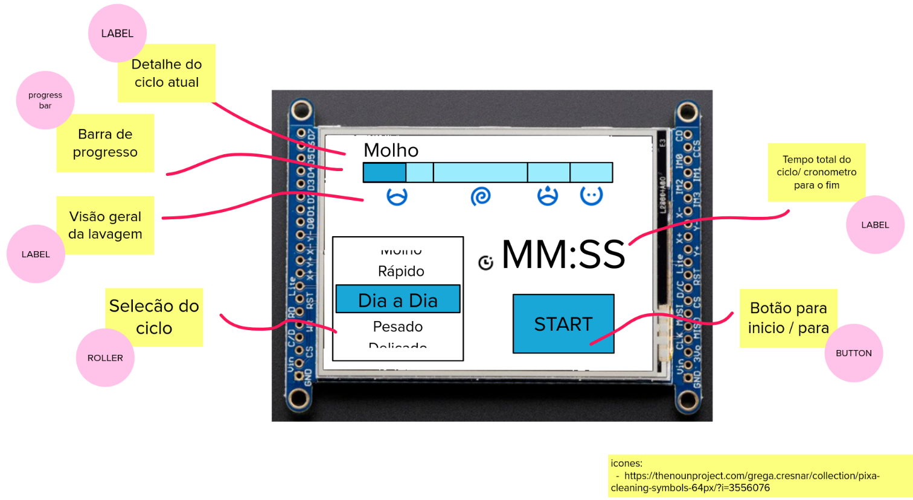

# Entrega 1: Design

| Entrega          | Data  |
|------------------|-------|
| Design interface | 13/11 |

!!! info  
    Criar o repositório pelo classroom:

    https://classroom.github.com/a/eAhMDHPo
    

A equipe de novos produtos disponibilizou alguns requisitos do protótipo e vocês devem propor uma interface que satisfaca as necessidades do projeto.

## Requisitos

A seguir a lista de requisitos de usabilidade e de funcionalidades para o projeto do ciclocomputador.

### Usabilidade

!!! tip "req. ux. 0 - Operacão"
    A interface a ser projetada deve ser tal que o usuário consigo operar com apenas uma mão (lembre que é algo para ser usado na bike) e que as informações devem ser exibidas de forma clara, considerando uma leitura e operação em movimento.

!!! tip "req. ux. 1 - Hardware"
     O hardware a ser utilizado será o LCD de `240`x`320`px touch colorido.
     
!!! tip "req. ux. 2 - Branding"
    A interface deve ser alinhada com o logo e nome da empresa que você escolheu (blanding)
     
!!! tip "req. ux. 3 - Exibir o logo"
    O logotipo da empresa deve estar presente na interface.
     
### Funcionalidade

O ciclocomputador irá exibir a velocidade instantânea da bicicleta assim como um relógio.

!!! info "req. fun. 1 - Relógio"
    Indicação da hora atual, no formato: **HH:MM:SS** atualizada a cada segundo.

!!! info "req. fun. 2 - Velocidade instantânea"
    Exibir a velocidade em km/h.

!!! info "req. fun. 3 - Indicação da aceleração"
    Deve ser um componente gráfico que indica a aceleração atual da bicicleta (positiva/ negativa ou constante).

O ciclista deve ser capaz de iniciar a contagem de um trajeto, isso irá exibir para o usuário informações referentes a distância, velocidade média e tempo no trajeto. O usuário iniciar um trajeto (informações são atualizadas), parar a contagem do trajeto (não atualiza mais as informações) ou comecar um novo trajeto.

!!! info "req. fun. 4 - Trajeto: Distância"
    Indicação em km da distância percorrida no trajeto.

!!! info "req. fun. 5 - Trajeto: Velocidade média"
    Indicação em km/h da velocidade média no trajeto.

!!! info "req. fun. 6 - Trajeto: Cronometro"
    Indicação em **HH:MM** do tempo gasto em um trajeto.

!!! info "req. fun. 7 - Trajeto: Controle"
    Deve possibilitar o usuário iniciar, parar ou reiniciar a contagem de um trajeto.

    Quando o usuário parar um percurso deve exibir apenas a velocidade instantânea e não deve atualizar outras informações referentes ao percurso (velocidade média/ distância no percurso/ tempo no percurso).

!!! info "req. fun. 8 - Trajeto: Indicador status"
    A tela deve possuir um indicador se a contagem da parte referente ao percurso está ou não ativada.

O ciclocomputador pode ser usado em diferentes tamanhos de bicicleta e o usuário deve poder configurar o raio de sua bicicleta.

!!! info "req. fun. 9 - Configuracão"
    Deve possibilitar o usuário configurar o diâmetro da roda.

## Entrega

!!! nota
    A entrega deve ser feita no projeto do mural que pode ser acessado no link a seguir:
    https://app.mural.co/t/elementos9119/m/elementos9119/1635464106423/6dbaa412b5111d6713484f536f014438d7ea217d?sender=ub569a9273c6e285461187641

Nessa etapa de design vocês devem apresentar uma versão inicial da interface que deve satisfazer os requisitos listados anteriormente. Na interface será necessário indicar qual widget do LVGL pretendem utilizar. Lembrem de consultar sempre a página do LVGL para saber o que está disponível:

- https://docs.lvgl.io/latest/en/html/widgets/index.html

Além do widget vocês devem informar qual ícones pretendem usar na interface, consultem o site a seguir para ideias:

- https://thenounproject.com/term/open/

### Exemplo

O exemplo a seguir é de uma interface de uma máquina de lavar roupa, vocês devem entregar algo parecido.

### Validando no LCD

Antes de sairmos implementando a interface no LVGL iremos validar a proposta que vocês desenvolveram no LCD. Para isso iremos gerar um PNG da interface do mural e exibir no LCD como uma imagem estática. A ideia aqui é apenas validar o conceito antes de gastarmos tempo programando algo que não ficou bom.

Para isso você deve:

1. Gerar uma imagem da interface fazendo screenshot da imagem do mural nas nas dimensões: `240x320`
1. Seguir o roteiro em `util/LVGL` para exibir a imagem no LCD: https://insper.github.io/ComputacaoEmbarcada/navigation/Dicas/Util-lvgl/

!!! info
    Importante gerar a imagem nas dimensões `240x320`, queremos ocupar o LCD todo com nossa imagem.
    
!!! tip
    Deixei a imagem desenhada no LCD e então vá construindo a interface o LVGL por cima. O LVGL trabalha com camadas e os widgets mais novos são alocados no topo:
    
    - https://docs.lvgl.io/master/overview/layer.html
    
    > By default, LVGL draws new objects on top of old objects.
    
    

<iframe width="560" height="315" src="https://www.youtube.com/embed/aMafQWIxyCg" title="YouTube video player" frameborder="0" allow="accelerometer; autoplay; clipboard-write; encrypted-media; gyroscope; picture-in-picture" allowfullscreen></iframe>

## Rubrica

Rubrica referente ao design da interface.

!!! warning ""

    Penalizacão de atraso

    | Atraso | Nota máxima |
    |--------|-------------|
    | 2 dias | C           |
    | 4 dias | D           |
    | 6 dias | I           |

As notas são incrementais. Por exemplo, Para atingir o B deve apresentar todos os itens do C, ou seja, os dois vídeos e as duas imagens! ==No mural vocês também devem manter as diferentes versões.==

#### A

- Especifica e justifica as cores a serem usadas na interface
- Pega feedback com duas pessoas externa e incorpora na interface
    - Grava em áudio as entrevistas
- Grava um vídeo atualizado explicando o que foi sugerido e o que fizeram para melhorar a interface
- Apresentar uma foto da interface sendo executada no LCD (imagem estática)

#### B

- Especifica e justifica quais vão ser as fontes (e tamanhos) a serem usadas na interface.
- Pega feedback com o Luiz do Fablab e incorpora na interface
    - Vai estar no atendimento da tarde de sexta feira.
- Grava um vídeo atualizado explicando o que foi sugerido e o que fizeram para melhorar a interface
- Apresentar uma foto da interface sendo executada no LCD (imagem estática)

#### C

- Mockup da interface:
    - Satisfaz todos os requisitos do projeto
    - Protótipo da interface satisfaz todos os requisitos
    - Indica quais são os widgets do LVGL 
    - Apresentar uma foto da interface sendo executada no LCD (imagem estática)
- Grava um vídeo explicando a interface
    - **Todos do grupo devem aparecer no vídeo (pode ser em call)**
