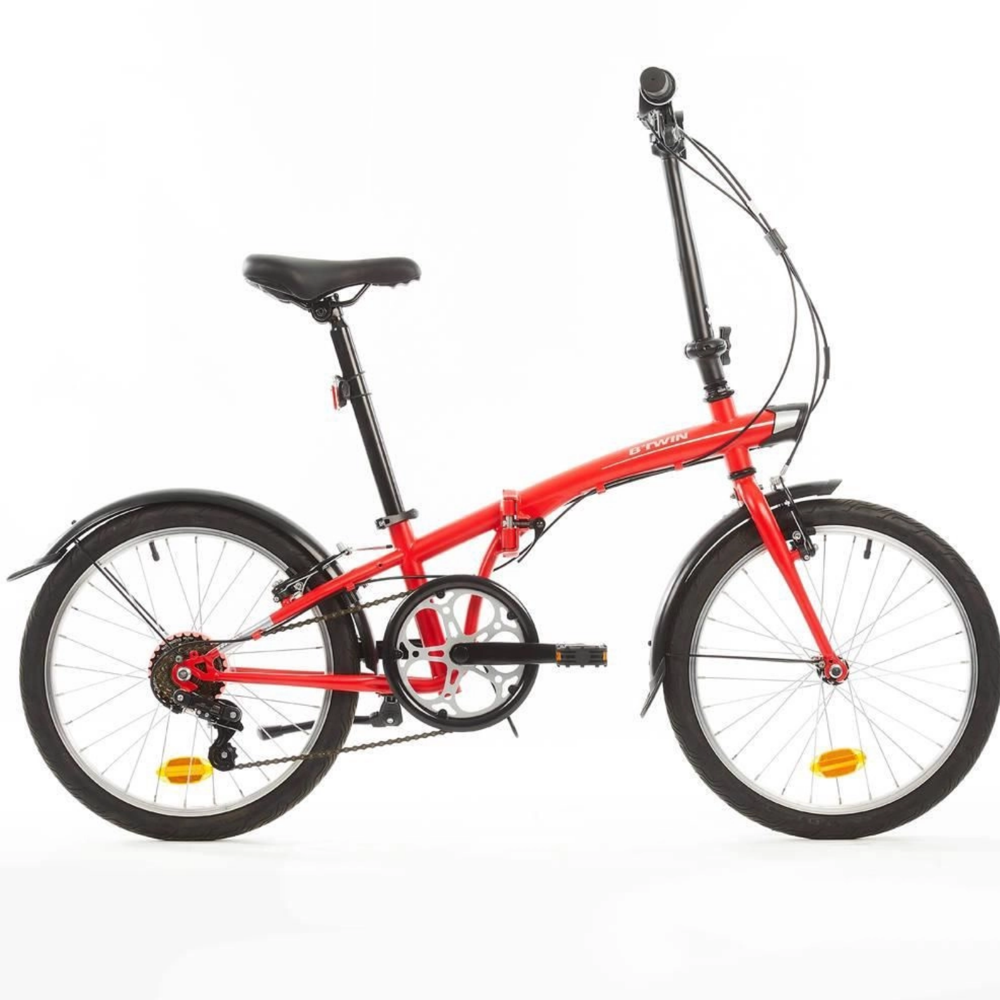
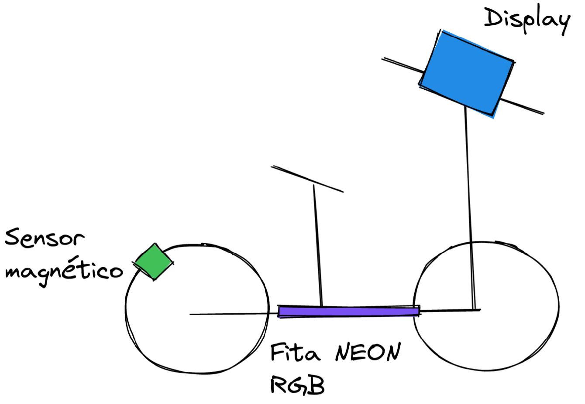
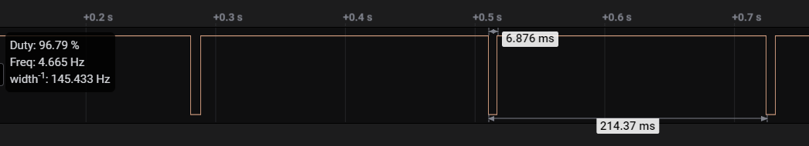
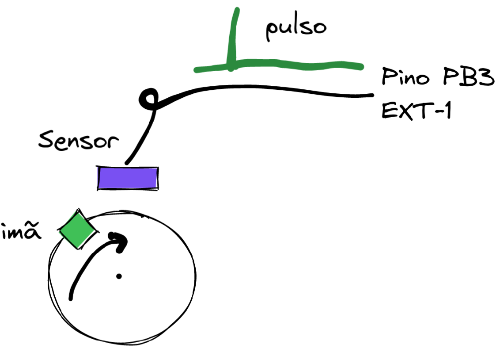

# Entrega 2: Engenharia

Além do design com o usuário, você deve ter os seguintes cuidados com a engenharia do protótipo. 

!!! info     
    Entregar pelo forms:
    
    <iframe src="https://docs.google.com/forms/d/e/1FAIpQLSdzpFdgPrL4hSOqXmpR8RL_U0vYk0sYrRmQZDvdg7TCEFakdg/viewform?embedded=true" width="640" height="320" frameborder="0" marginheight="0" marginwidth="0">Carregando…</iframe>

## Sobre a bicicleta

Iremos validar o projeto em uma bicicleta modelo [Tilt 100](https://www.americanas.com.br/produto/3087029593?epar=bp_pl_00_go_pla_teste_b2wads&opn=YSMESP&WT.srch=1&aid=6185afd7fe31a700171587e7&sid=2314041002202&pid=3087029593&chave=vnzpla_6185afd7fe31a700171587e7_2314041002202_3087029593&gclid=Cj0KCQiAkNiMBhCxARIsAIDDKNVfVowdYU_P6cwRM0FcRJMaNN_S35yhc55RV4zygtigrtenWDL29aMaAlnwEALw_wcB&tamanho=Unico&cor=Vermelha) que compramos para essa finalidade. Na bicicleta nós plugamos uma placa e um LCD, e também colocamos um sensor magnético na roda junto com um Imã (para detectar rotacão).


| Bike | Diagrama |
|------|----------|
|{width=300 } | {width=300} |


!!! info
    O raio da nossa bicicleta é 20"

Você deve assumir as conexões a seguir no seu projeto:

| Item             | Conexão   |
|------------------|-----------|
| LCD              | EXT-2     |
| Sensor magnético | EXT-1 PB3 |
| LED R            | ?         |
| LED G            | ?         |
| LED B            | ?         |

A seguir detalhes sobre cada um dos dispositivos da bicicleta.

<!-- 
Diagramas
https://excalidraw.com/#room=56e123c94e7a3b16142b,cIncslpx8LYY_6RmiTx-8A
-->

### Sensor magnético

O sensor magnético gera um pulso elétrico (em LOW) sempre que a roda fizer uma rotacão completa, você deve tratar esse pulso como um sinal digital. Considere que o sensor foi ligado no pino ==PB3 do EXT-1==.



Diagrama da montagem:

{width=500}

!!! info
    1. Quando for configurar o pino para realizar a leitura do sensor ==DESABILITAR== o PULL_UP.
    1. Configurar IRQ em borda de descida.

## Medições

A seguir detalhes de como podem ser realizadas a medições necessárias ao projeto:

### Velocidade instantânea 

Será necessário realizar a leitura da velocidade da bicicleta, existem algumas soluções que podem ser utilizadas:

A velocidade da bicicleta (v) é decorrente da velocidade angular (w) de sua roda, sendo calculado por: `v = w*r [m/s]`.

Existem duas maneiras de se calcular a velocidade angular: 

- mede-se o tempo (`t`) entre dois pulsos e a partir da frequência (`f=1/t`) calcula-se `w = 2*pi*f [rad/s]`
- acumula-se pulsos (`N`) em um determinado tempo (`dT`): `w = 2*pi*N/dT`

Como só conseguimos medir um pulso por rotação, é necessário que esse `dT` seja: suficiente alto  para medirmos uma velocidade relativamente baixa, mas não pode ser tão elevado, caso contrário teremos uma taxa de atualização da velocidade muito lenta.

!!! note
    Nesses dois casos não podemos utilizar o TC para medirmos a frequência (`f`) ou     gerar o `dT` pois  a menor frequência na qual o TC operar/medir é de 0.5Hz (o que daria uma velocidade mínima de 3.3Km/h).
    
    Vamos usar um novo periférico chamado de RTT (detalhes a seguir)

### Indicação de aceleração

É a derivada da velocidade, se positiva indica que a bicicleta está ganhando velocidade, negativa perdendo e próxima a zero a velocidade está estável. Para derivarmos a velocidade de forma discreta, utilizamos a equação a seguir:

`a(t) = K * (x[N] - x[N-1])/Ts`

onde:

- `a(t)`: é a aceleração instantânea 
- `K`: constante opcional (ganho)
- `x[N]` : valor da velocidade atual
- `x[N-1]` : valor da velocidade no instante passado
- `Ts`: Período de amostragem

Com essa informação, você será capaz de indicar na interface a indicação de aceleração.

### Velocidade média

Pode ser calculada por quantas revoluções a roda deu em um determinado delta de tempo:

`vm = Pulsos/dT`

- `dT` deve ser o valor na qual você deseja atualizar a informação de velocidade média.

### Distância

A distância (`d`) percorrida pela bicicleta é: `d = 2*pi*r*N [m]`.

### Testando

Para facilitar o teste da leitura do pulso eu escrevi um código que gera um pulso no pino PC31 (EXT1) e que 
simula os pulsos para uma velocidade fixa de 5km/h. O código também é capaz de ficar variando a velocidade
em uma rampa, para isso basta descomentar a linha que possui o `#define RAMP`.

Notem que estou gerando os pulsos com uma task do rtos, isso não garante uma boa precisão e pode gerar
um pouco de variação na leitura da velocidade.

??? note "Código"
    ```c
    #include "arm_math.h"
    
    #define TASK_SIMULATOR_STACK_SIZE (4096 / sizeof(portSTACK_TYPE))
    #define TASK_SIMULATOR_STACK_PRIORITY (tskIDLE_PRIORITY)
    
    #define RAIO 0.508/2
    #define VEL_MAX_KMH  5.0f
    #define VEL_MIN_KMH  1.0f
    //#define RAMP 
    
    /**
    * raio 20" => 50,8 cm (diametro) => 0.508/2 = 0.254m (raio)
    * w = 2 pi f (m/s)
    * v [km/h] = (w*r) / 3.6 = (2 pi f r) / 3.6
    * f = v / (2 pi r 3.6)
    * Exemplo : 5 km / h = 1.38 m/s
    *           f = 0.87Hz
    *           t = 1/f => 1/0.87 = 1,149s
    */
    float kmh_to_hz(float vel, float raio) {
        float f = vel / (2*PI*raio*3.6);
        return(f);
    }

    static void task_simulador(void *pvParameters) {
    
        pmc_enable_periph_clk(ID_PIOC);
        pio_set_output(PIOC, PIO_PC31, 1, 0, 0);

        float vel = VEL_MAX_KMH;
        float f;
        int ramp_up = 1;

        while(1){
            pio_clear(PIOC, PIO_PC31);
            delay_ms(5);
            pio_set(PIOC, PIO_PC31);
    #ifdef RAMP
            if (ramp_up) {
                printf("[SIMU] ACELERANDO: %d \n", (int) (10*vel));
                vel += 0.3;
            } else {
                printf("[SIMU] DESACELERANDO: %d \n",  (int) (10*vel));
                vel -= 0.3;
            }

            if (vel > VEL_MAX_KMH)
                ramp_up = 0;
            else if (vel < VEL_MIN_KMH)
                ramp_up = 1;
    #ifndef
            printf("[SIMU] CONSTANTE: %d \n", (int) (10*vel));
    #endif
            f = kmh_to_hz(vel, RAIO);
            int t = 1000*(1.0/f);
            delay_ms(t);
        }
    }

    int main(void) {
        // ...
        // ....
        if (xTaskCreate(task_simulador, "SIMUL", TASK_SIMULATOR_STACK_SIZE, NULL, TASK_SIMULATOR_STACK_PRIORITY, NULL) != pdPASS) {
            printf("Failed to create lcd task\r\n");
        }
    ```
    
    
### Interface

Nesta etapa vocês devem também implementar a interface que foi proposta na entrega de design, uma dica é a deixar a imagem desenhada no LCD e então ir construindo a interface o LVGL por cima. O LVGL trabalha com camadas e os widgets mais novos são alocados no topo:
    
- https://docs.lvgl.io/master/overview/layer.html
    
> By default, LVGL draws new objects on top of old objects.
    


## Rubrica

A seguir um resumo dos requisitos e da rubrica da entrega associada a eles. Lembrem que vocês devem utilizar os recursos do freeRTOS sempre que possível.

!!! info
    - A interface desenvolvida deve ser similar a interface prototipada, mesmo se você não for implementar alguns dos requisitos (pode apenas omitir eles da interface).
    - Qualidade de software? Consulte a página com regras de firmware: https://insper.github.io/ComputacaoEmbarcada/navigation/Dicas/Util-o-que-nao-pode/


| | Rubrica UX | |
| --- | --- | --- |
| req. ux. 1 - Operacão | A interface a ser projetada deve ser tal que o usuário consigo operar com apenas uma mão (lembre que é algo para ser usado na bike) e que as informações devem ser exibidas de forma clara, considerando uma leitura e operação em movimento. | ==C== |
| req. ux. 2 - Hardware | O hardware a ser utilizado será o LCD de 240x320px touch colorido. | ==C== |
| req. ux. 3 - Exibir o logo | O logotipo da empresa deve estar presente na interface. | ==C== |
| req. ux. 4 - Branding | A interface deve ser alinhada com o logo e nome da empresa que você escolheu (blanding) | ==B== |

| | Rubrica Funcional ||
| --- | --- | --- |
| req. fun. 1 - Relógio | Indicação da hora atual, no formato: HH:MM:SS atualizada a cada segundo. | ==C== |
| req. fun. 2 - Velocidade instantânea | Exibir a velocidade em km/h. | ==C== |
| req. fun. 3 - Indicação da aceleração | Indicação visual da aceleração da bicicleta (positiva/ negativa ou constante). | ==C== |
| req. fun. 4 - Trajeto: Distância | Indicação em km da distância percorrida no trajeto. | ==B== |
| req. fun. 5 - Trajeto: Velocidade média | Indicação em km/h da velocidade média no trajeto. | ==B== |
| req. fun. 6 - Trajeto: Cronometro | Indicação em HH:MM do tempo gasto em um trajeto. | ==B== |
| req. fun. 7 - Trajeto: Controle | Deve possibilitar o usuário iniciar, parar ou reiniciar a contagem de um trajeto. | ==B== |
| req. fun. 8 - Trajeto: Indicador status | A tela deve possuir um indicador se a contagem da parte referente ao percurso está ou não ativada. | ==B== |
| req. fun. 9 - Configuracão | Deve possibilitar o usuário configurar o diâmetro da roda. | ==A== |


|  | Rubrica extra | |
| --- | --- | --- |
| req. extra. 1 - Extra | Adicionar alguma coisa diferente na bicicleta, aqui você deve deixar a imaginação voar!! | ==B== |
