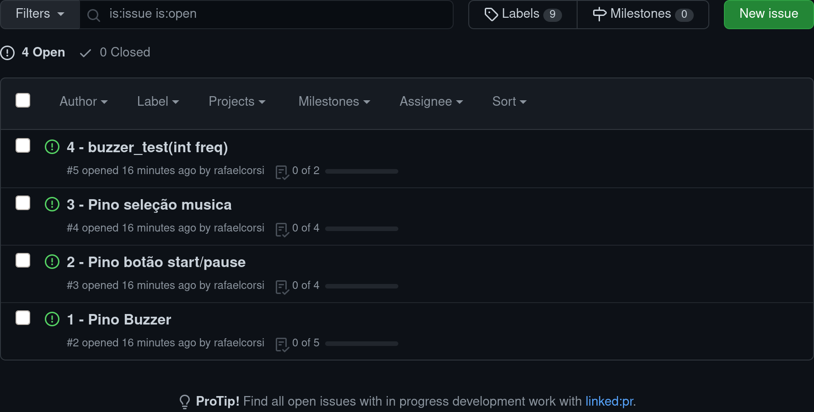
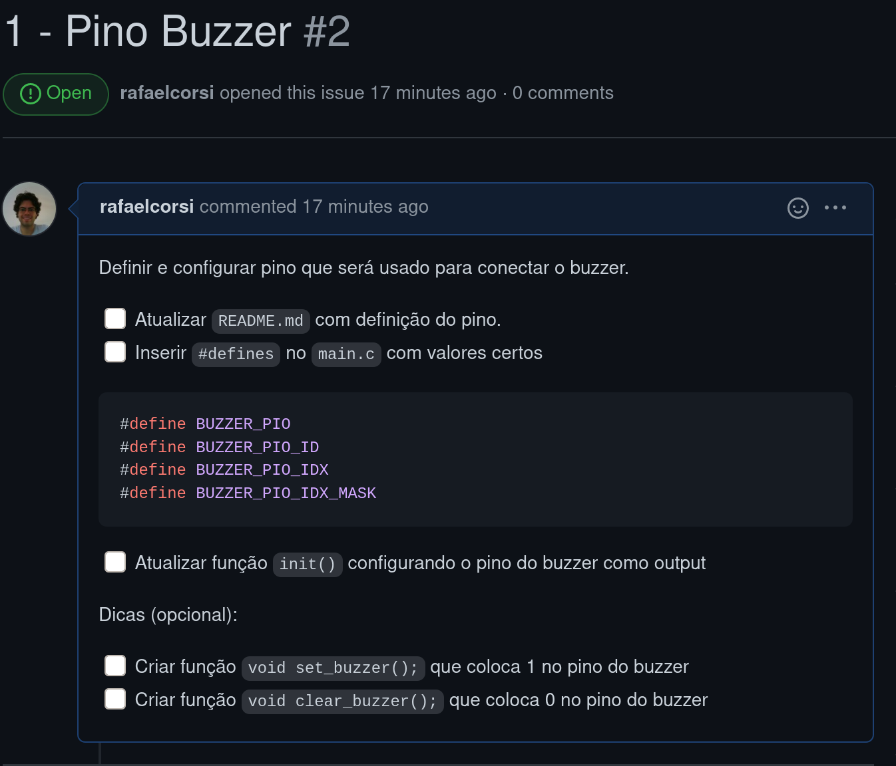
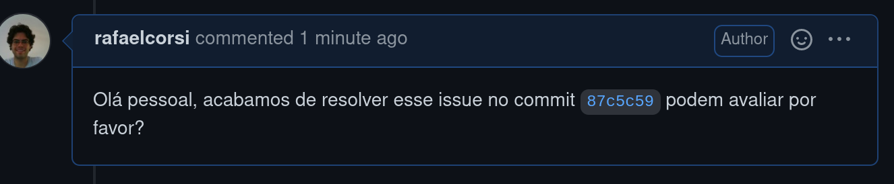

# HowTo

Neste semestre iremos tentar uma nova forma de trabalho
com as APS, a ideia é guiar vocês e introduzir boas práticas de desenvolvimento e gestão do tempo, temos o objetivo de adicionar uma maneira de verificarmos contribuição individual nas entregas.

Todas APS serão desenvolvidas em um repositório do github, os repositórios serão criados pelo `github classroom` (acessível por um link). Vocês devem clonar este repositório e iniciar o desenvolvimento por ele.

!!! info
    Muito importante que todos do grupo realizem commits no código, caso contrário
    não iremos considerar a entrega de quem não participou

## Issues

Os repositórios serão populados automaticamente (seu professor precisa
executar um [script local](https://github.com/rafaelcorsi/auto-gh-issue-create)) com issues que devem ser resolvidos pelo grupo, **o grupo não deve fechar os issues**  quem irá fazer
isso são os membros da equipe de avaliação (Corsi, Edu, Marco). Porém vocês devem 
referenciar nos issues quando necessitarem avaliação dos mesmos.

Exemplo de issue aberto automaticamente:

{width=500}

Detalhe de um issue:

{width=500}

Exemplo de como pedir feedback em um commit:

{width=500}

Após análise do código pela equipe o issue será encerrado.
