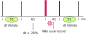

# 21b - EMB - AV1

- Manter o proctorio aberto o tempo todo!
- **A cada 30 minutos você deverá fazer um commit no seu código!**
    - Códigos que não tiverem commit a cada 30min ou que mudarem drasticamente entre os commits podem ter a entrega anulada.
    - Tente inserir mensagens condizentes nos commits!
- Duração total: 3h


!!! info
    Criar o repositório de entrega pelo link:
    
    - https://classroom.github.com/a/j8AgL-mu


    Usem como base o código disponível neste repositório.

Vocês vão precisar:

- ▶️ Conectar o OLED1 ao EXT-1

## Descrição

Vocês irão desenvolver um sensor/ sistema embarcado para leitura da roda fônica de uma injeção eletrônica, esse sensor é um dos muitos existentes em um automóvel. 

A roda fônica é um disco com dentes atrelada ao rotor do motor, um sensor magnético faz a leitura dos dentes do disco e gera um sinal elétrico (pulso) conforme os dentes vão passando por ele. Essa informação é utilizada pela injeção eletrônica para:

- Saber a fase atual do motor (ciclo oto)
- Identificar a velocidade de rotação do motor

A imagem a seguir ilustra uma roda fônica de um motor com 60 dentes e 2 faltando.

!!! info
    Notem que na figura a seguir existe um dente da roda "faltando", isso serve para identificar a posição ==ZERO== do disco. 

{width=450}

> Imagem adaptada de https://www.canaldapeca.com.br/blog/qual-diferenca-entre-distribuidor-e-roda-fonica/

O período dos pulsos indica a velocidade angular do disco e por consequência a velocidade de rotação do motor. A imagem a seguir é um exemplo dos pulsos gerados pelo sensor atrelado a uma roda fônica com ==10-1 dentes==, neste caso o motor está girando a uma rotação constante. ==Notem que existe um pulso faltando, isso é por conta do dente "faltando", esse pulso faltando que define o ponto zero.==


Vocês terão que desenvolver um sistema embarcado que:

1. Calcula a velocidade angula do motor e exibe no LCD.
1. Identifica o ponto Zero da roda.

## Sistema de testes

Iremos utilizar uma técnica de simulação chamada de Hardware-in-the-loop Simulation (HIL), que de forma simplificada é um sistema que simula em tempo real uma planta/ sinal. No nosso caso, iremos simular a rotação da roda fônica (gerando os pulsos).

Isso será feito no próprio uC que vocês estarão desenvolvendo o sensor, em um sistema mais completo talvez seja necessário uma eletrônica mais sofisticada. O projeto disponível no repositório gera os pulsos simulados de uma roda fônica no pino ==PD30== do EXT2, para isso utilizamos o timer 2 (==TC2==), conforme imagem a seguir:

``` 
     /-----------\
     |    | TC2  |  PD30
     |    |      |-----> | | | |  | | | | | | |  | | | | |
     |    ------ |                  pulsos
     |           |
     | uc        |
     \-----------/
```

!!! warning
    - Não usar nenhum canal do TC2!
    - Não usar o botão da placa (serve para desacelerar o disco)!
    - Não usar o LED da placa (pisco a cada pulso do Zero)!
    - Não tirar a função `roda_fonica_init` do main
    - Não modificar nada nos arquivos `abs.h` e `abs.c`

Utilizar os seguintes parâmetros como referência:

| Parâmetro                                                    | valor   |
|--------------------------------------------------------------|---------|
| n total de dentes da roda                                    | 10      |
| n de dentes faltando                                         | 1       |
| velocidade de rotação nominal dado roda (passagem pelo zero) | 120 rpm |
| velocidade máxima                                            | 500 rpm |

!!! tip
    - 600 rpm = 600/60 = 10 rotações da roda por segundo

    Mas temos que lembrar que teremos 10 pulsos -1 da roda a cada 
    rotacão total, com isso iremos obter uma frequência de pulsos de aproximadamente:
    
    - 10*10 = 90 Hz 

## Avaliacão

A seguir a rubrica da avaliação.

### C

Para obterem o conceito C, vocês devem entregar um firmware que:

- Faz a leitura dos pulsos simulados da roda fônica
- Identifica quando a roda passa pela origem. 
  - Piscar o LED 3 da placa OLED a cada pulso da roda!
  - Piscar os LED 1 e LED 2 da placa OLED a cada sinal de referência (Zero)!
  - usar `pin_toggler`!
- Exibe no OLED a velocidade de rotação média da roda em ==rotações por minuto - rpm== (atualizar valor após uma rotação completa)

Vocês devem utilizar um periférico de tempo para calcular o dT entre os pulsos e interrupção no pino para a leitura do sinal gerado no PD30.

### B/ A

Os pontos aqui valem apenas se o conceito C foi atingido (todos os itens!).

- (+1.0 conceito) Identifica quando a roda parou de girar e indicar velocidade de rotação: 0 rpm no LCD
- (+0.50 conceito) Organiza o código em funções:
    - Cálculo do rpm
    - Função para exibir o valor no LCD
- (+0.25 conceito) Só exibe a velocidade uma vez por rotação, quando encontrado 
- (+0.50 conceito) Utiliza média móvel para o cálculo do rpm
- (+0.50 conceito) Exibe graficamente a velocidade no LCD.

## Dicas

A seguir dicas para realizarem a entrega

!!! tip "Debug"
    Depurar é importante e ajuda bastante, mas tomem cuidado que os relógios não param de contar quando o programa estiver em "pause".

!!! tip "Terminal + printf"
    Eu habilitei o terminal para vocês, podem usar `printf`!. Só cuidado com o uso pois ele é lento e as vezes não podemos perder tempo...

### C - Osciloscópio 

A imagem a seguir é referente aos pulsos que são gerados no HIL, o tempo entre os pulsos é de 50 ms.

`50ms = 20Hz / 10 dentes = 2 rps ou 120 rpm`


### C - Lendo o sinal

Vocês devem escolher um pino qualquer do uC, configurar como entrada sem pull_up ou debounce (usar `PIO_DEFAULT`), configurar interrupção e atrelar uma função de callback.

Pisque o LED3 da placa OLED a cada pulso recebido, com isso sabemos que a função está funcionando e é um dos itens da rubrica!

!!! tip
    Usar a função `pin_toggle` que já foi definida!
    
    - ==Não usar IT_EDGE==
    - ==Não usar debounce==
    - ==Não usar PULL_UP==

### C - Calculando dT

Utilizem o RTT para calcular o tempo entre os pulsos, reiniciando o contador a cada novo pulso.

1. Detecta pulso e inicializa contagem de tempo
1. Lê o valor do tempo entre um pulso e outro

Como indicado na figura a seguir:

{width=300}

!!! info
    - A função RTT init fornecida não tem o IRQ de incremento! Apenas o alarme.
    - Se quiser fazer com o TC também da, mas ai tem que manter um contador global dos pulsos.

!!! tip
    1. Utilize 1000 como prescale para o RTT, é um bom valor (eu testei aqui)!
    1. Imprima no terminal sempre que obtiver um novo valor de dT, lembre de fazer a impressão no main e não dentro do callback!
    
    Vocês devem obter algo como:
    
    {width=150}
    
    Notem que temos um dT com valor 102 ms isso é referente ao pulso faltante, como ilustrado a seguir:
    
    ```
    ^     ^          ^     ^     ^ 
    |     |          |     |     |
    |     |          |     |     |
      51     102       51    51    ms
    ```

### C - Velocidade angular 

Agora com o dT você é capaz de:

1. Calcular a velocidade do disco em rps: $w = \frac{1}{dT}$
1. Converta de rotações por segundo para rotações por minuto (*60)
1. Exiba no LCD a velocidade

!!! warning
    Lembre de não atualizar o LCD dentro de interrupção / callback!

!!! tip
    - Lembre de converter dT para segundos!
    - Cuidado com a conversão float/ int/ ...

### C - Identificando Zero

Para identificar o dente faltante é necessário "prevermos" quando um pulso deveria acontecer, isso pode ser feito através do alarme do RTT que deve ser configurado utilizando como base o dT calculado do pulso anterior (ou de uma média).

{width=500}

Um cuidado que vocês devem ter é com o valor usado no timeout do RTT, ==não usar o valor do dT com o dente estimado, usar o último valor válido==.

{width=500}

!!! tip
    Definam uma tolerância para o pulso, eu experimentei aqui e 20% é um bom valor! Ou seja, o alarme para o pulso é `dT*1.2`. Podemos interpretar isso como: se passado 20% do tempo esperado para um pulso sem o recebimento do mesmo, esse slot é do dente faltante.
    
    Lembrem de zerar o RTT quando o pulso faltante for detectado.
    
    Vocês devem obter algo como:
    
    - Eu estou imprimendo um `*` toda vez que o pulso zero é detectado.
    
    {width=150}
 
--------------------
 
### A/B - Média móvel

A média móvel é um dos filtros mais simples que existe, suavizando o sinal no tempo e removendo ruídos (n), sua ideia é bem simples e vou explicar com um exemplo (filtro de janela 5).

``` c

      | sinal filtrado
      v
    y[1] = (x[1] + 0 + 0 + 0 + 0) / 5
    y[2] = (x[2] + x[1] + 0 + 0 + 0) / 5
    y[3] = (x[3] + x[2] + x[1] + 0 + 0) /5
    ...
    y[5] = (x[4] + x[3] + x[2] + x[1] + x[0]) / 5
    y[6] = (x[5] + x[4] + x[3] + x[2] + x[1]) / 5
           /                               
          /    ---------------------> shift
        Novo dado                          
```

Implemente o filtro em C e use para exibir o valor.

!!! info
    Existe uma versão recursiva do filtro onde não é necessário armazenar o buffer e fazer o shift.

### A/B - Identifica quando a roda parou de girar e indicar velocidade de rotação: 0 rpm no LCD

O botão da placa foi configurado para iniciar a frenagem do motor, uma vez apertado os pulsos vão se espaçando até parar. Se apertar novamente os pulsos voltam a velocidade padrão.

{width=700}
