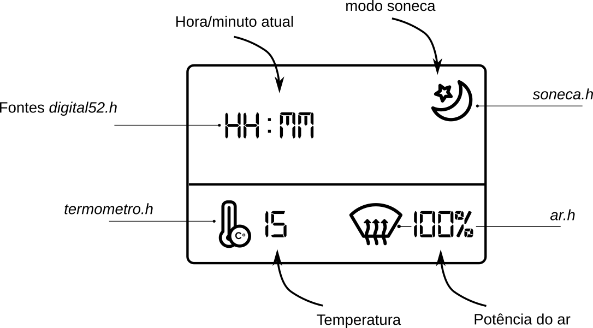

# Simulado P1

!!! note ""
    Termostato digital

Nesse simulado você deve desenvolver um protótipo de um termostato digital, com interface gráfica e controle da potência via PWM.

| Duração  |
| -------- |
| 3 horas  |

## Rubrica

!!! warning "Atenção"
    Lei o documento na integra antes de começar

#### A (+ 2 itens)
#### B (obrigatório +2 itens)

- (**obrigatório**) utiliza `queue` para comunicação entre AFEC e tarefa
- Adiciona um novo PWM para controle de velocidade do ventilador
    - LED2 OLED
    - Possibilita usuário definir potência do ventilador
- Possibilita usuário selecionar cenários pré definidos
    - Pelo menos dois (turbo frio / frio e circulação)
- Modo soneca (touch screen)
    - Desliga ar condicionado após 3 minutos.
    - Exibe que modo está ativado
- Exibe graficamente o valor da temperatura (não só numérico)

#### **C**

!!! tip "Dica"
    Foque primeiro no C!
    
- Faz uso de RTOS
      - Uma tarefa para o LCD
      - Semáforos para comunicação com a tarefa (não usar flags!!)
- Coleta o valor da temperatura a cada 4 segundos
      - **Não deve usar TC/ RTT!**
      - Usar funcionalidades do RTOS para isso
- Atua no ar condicionado via PWM (duty cicle)
    - LED1 OLED
    - Possibilita que o usuário controle a potência do ar condicionado (botões)
- Interface
    - Cria interface pré definida.
    - Exibe numericamente o valor da temperatura
    - Exibe numericamente a potência do ar condicionado
    - Exibe hora no display
    
#### D

- Dois itens de C faltando/errado
    
#### I

- Três ou mais itens de C faltando/errado

## Descrição

Você deve projetar um protótipo de um termostato, nesse protótipo deve exibir de forma gráfica a temperatura do ambiente e permitir ao usuário controlar a potência do ar condicionado, usando um RTOS.

### Começando

1. Atualize os dois repositórios da disciplina
1. Crie um repositório no github
1. Preencha o forms a seguir:
    - (no simulado não tem)
1. Copie o projeto exemplo:
    - `RTOS-LCD-maXTouch` para seu repositório    
1. Repositório: 

```bash
$ git add *
$ git commit -am "comecando"
```

### PWM 

Nessa APS iremos trabalhar com o periférico PWM, utilize de exemplo o projeto: 

!!! example ""
    `SAME70-examples/perifericos-uc/PWM`

1. Abra o projeto
1. Execute o exemplo
1. Entenda o que está acontecendo

### Interface

Você deve implementar a interface a seguir:



1. Os icones e a fonte já foram convertidos e estão na pasta do exemplo `RTOS-LCD-maxTouch`:

| Arquivo        | Img                                             |
|----------------|-------------------------------------------------|
| `soneca.h`     |      |
| `termometro.h` |  |
| `digital521.h` | Fonte a ser usada                               |


### Temperatura

A temperatura deve ser simulada por um potenciômetro conectado a placa, sendo o mínimo 0 graus célcios e o máximo 100.

## Dicas

!!! note
    Cada item deve ser testado e validado, não continue se não estiver funcionando!

1. Entendendo o periférico PWM
1. Desenvolva a interface proposta
    - Vá inserindo os icones, um a um
    - Insira os textos (valor padrão)
1. Incorpore a leitura analógica no projeto (AFEC)
    - Leia a temperatura a cada 4s
        - **Cuidado com a rubrica! Você não deve usar TC ou RTT**
        - Crie uma tarefa no RTOS para isso!
    - Altere para ler o potenciômetro externo a placa
1. Atualize a interface para exibir a `temperatura real`
1. Incorpore o PWM ao projeto (use como referência o demo)
1. Configure dois botões com interrupção para servir de controle da potência
    - Comunique os `callbacks` com a tarefa do LCD via semáforos
1. Na tarefa do LCD controle o `duty-cycle`
1. Exiba o novo valor do `duty-cycle`
    
