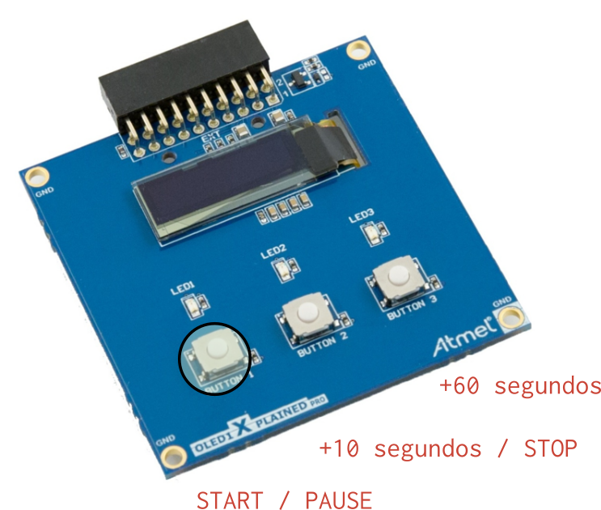
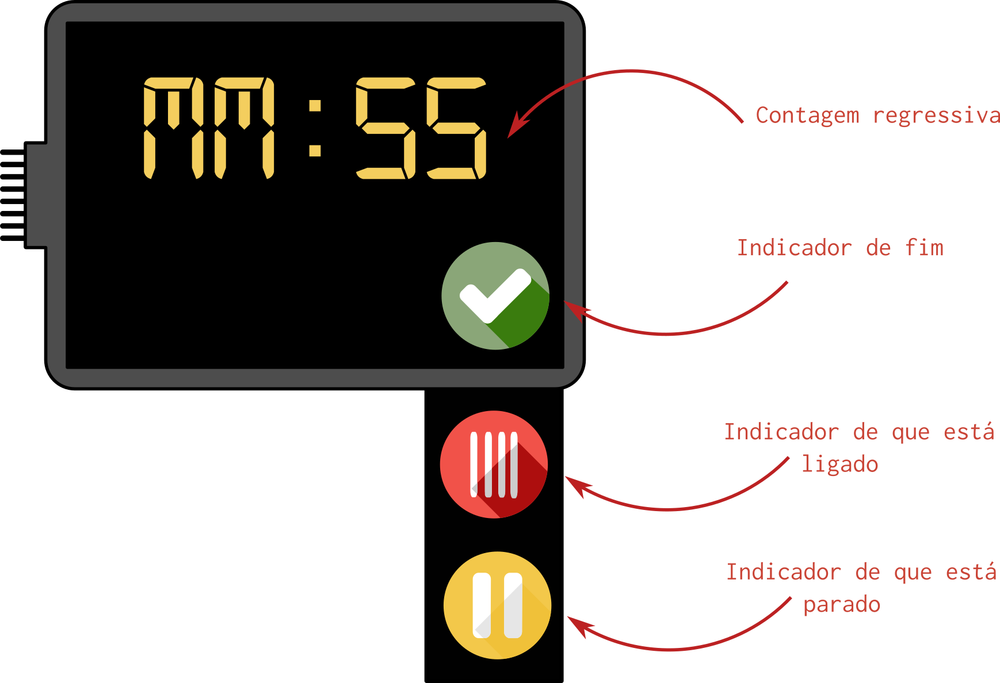

# Avaliação 1<<1


!!! note ""
    Microondas! 

Nessa avaliação você deve desenvolver um protótipo de um controlador para microondas, com interface gráfica e controle da potência via PWM.

| Duração  |
| -------- |
| 3 horas  |

## Começando

1. Atualize os dois repositórios da disciplina
1. Crie um repositório no github
1. Preencha o forms a seguir:
    - (no simulado não tem)
1. Copie o projeto exemplo:
    - `RTOS-LCD-maXTouch` para seu repositório    
1. Repositório: 

```bash
$ git add *
$ git commit -am "comecando"
```

## Rubrica

!!! warning "Atenção"
    Lei o documento na integra antes de começar

!!! waring "Perde conceito se:"
    1. Você não deve utilizar função de delay, que não a do RTOS
        - **-1/2 conceito**
    1. Você não deve utilizar variáveis globais, que não fila e queue
        - **-1/2 conceito**

#### C

- LCD exibe interface pré definida
    - Exibe icone de fim quando acaba 
    - Exibe icone de em progresso, quando o micro ondas estiver ligado
- Timer implementando
    - Botão: incrementa +10 segundos
    - Botão: incrementa +1  minuto
- Função de Start/ Stop

#### A (+ 4 pts) /  B (+ 2 pts)

- (2 pts) Interface touch 
- (1 pt ) Adicionar PWM para controlar potência do microondas
- (1 pt ) Adicionar relógio
- (2 pts) Adicionar ADC para controlar tempo do timer 
- (1 pt ) Start sem tempo, adiciona 30 segundos

#### D/ I

- (D) Dois itens de C faltando/errado
- (I) Três ou mais itens de C faltando/errado

## Descrição

Você deve projetar um protótipo de um controlador de microondas. Essa interface deve possuir 
um constador regressivo (timer) que indicará quanto tempo o micro ondas ficará ligado, e quanto
tempo vai levar para acabar o ciclo atual. Uma vez ligado, a interface deve exibir o icone de que está em funcionamento. E no fim, o icone de que acabou.

O microondas deve possuir três botões (placa OLED1), cada botão servirá para:

- `Botão 0`: Start / Pause/ Stop
- `Botão 1`: +10 segundos / Stop
- `Botão 2`: +60 segundos



Quando o microondas estiver funcionando, os LEDs da placa OLED devem estar ligados, quando acabar o ciclo, os leds devem apagarem.

### Interface

Você deve implementar a interface a seguir:



1. Os icones e a fonte já foram convertidos e estão na pasta do exemplo `RTOS-LCD-maxTouch`:

| `digital521.h`    | `done.h`               | `pause.h`               | `on.h`               |
| ----------------- | ---------------------- | ----------------------- | -------------------- |
| Fonte a ser usada |  |  |  |

### Firmware

Você deve desenvolver um firmware que possui duas tarefas: Uma responsável por atualizar o LCD e outra responsável pela contagem. A comunicação entre as tarefas e entre tarefas e interrupção deve ser realizada sempre com recursos do RTOS (fila/ semáforo ...).

#### Start/Stop/Pause

O botão de start/stop e pause deve ser da seguinte maneira: 

```
    Botao 0:  --> Run --> Pause --> Run --> \
    Botão 1:                                 \ Stop -->
```

```
    Botao 0:  --> Run --> Pause --> \
    Botão 1:                         \ Stop -->
```


