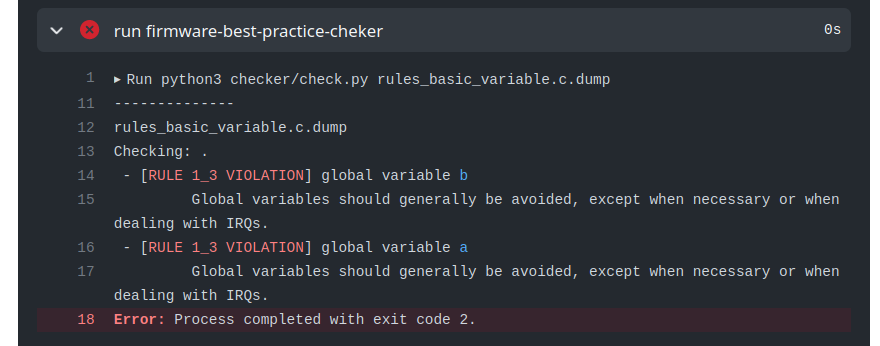

# Head File

!!! note "Rule 2.0" 
    Todo *head file* (`.h`) deve ser criado com include guard.
    
!!! note "Rule 2.1"
    Não ter implementação de código em *head file* (`.h`).

Headfile (`.h`) é um arquivo de texto com códigos C que será processado de forma diferente do arquivo `.c` e que possibilita a melhor estruturacão de um programa, sendo possível criar algo similar com bibliotecas python, só que na linguagem C. 

Todo `head` file deve possuir um recurso que iniba a inclusão redundante (mais de uma vez) no processo de compilacão, 

No arquivo `.h` não devemos ter código que gere instrucão!


### Exemplo

O exemplo a seguir demonstra um ==uso errado== do arquivo `.h`:

```c
int var; 

int foo(int b) {
    if (b > 2) 
        return 0;
    return 1;
}
```

O código anterior viola a regra **2.0** e a regra **2.1** gerando o seguinte erro:



!!! exercise choice two-cols
    Qual alternativa a seguir seria uma solucão válida para corrigir o código?
    
    === "Item (a)"
        - Declara `a` e `b` local e acessa `a` como global
        - Declara `foo` dentro da funcão `main` 
        
        ``` c 
        void main(void) {
            int a = 0;
            int b = 0;

            void foo(void) {
                a = a + 1; // acessa variavel global
            }

            while (1) {
                foo();

                if (a > 5) {
                    b = 1;
                }
            }
        }
        ```
    
    === "Item (b)"
        - Declara `a` e `b` local e acessa `a` como global

        ``` c 
        void foo(void) {
            global a;  // apenas a é global
            a = a + 1;
        }
        
        void main(void) {
            global int a = 0;
            int b = 0;

            while (1) {
                foo();

                if (a > 5) {
                    b = 1;
                }
            }
        }
        ```
     
    === "Item (c)"
        - Declara `a` e `b` local, e acessa `a` com ponteiro

        ``` c 
        void foo(int &a) {
            *a = *a + 1; // acessa ponteiro
        }
        
        void main(void) {
            int a = 0;
            int b = 0;

            while (1) {
                a = foo(&a);

                if (a > 5) {
                    b = 1;
                }
            }
        }
        ```
    
    - [ ] Declarar `foo` dentro da funcão `main`.
    - [ ] Declarar a variável `a` como `global`.
    - [x] Declara `a` e `b` local, e acessa `a` com ponteiro

### Praticando

Vamos praticar um pouco e corrigir as regras básicas de qualidade de código e boas práticas em sistemas embarcados, para isso crie um repositório pelo *github classroom* e então modifique os arquivos conforme indicado.

!!! exercise "Variáveis globais"
    1. Crie um repositório com o código exemplo acessando o github classroom [emb-rules-basic-variables]({{rules_variables_classroom}})
    1. Analise o log do actions e verifique que o cppcheck executou e encontrou alguns erros.
    1. Corrigir o código e verificar se ainda continuamos com erros.
 
    Dica: reescreva a funcão `foo` para um dos casos a seguir:
    
    - `int foo(int a)`
    - `void foo(int *a)`
