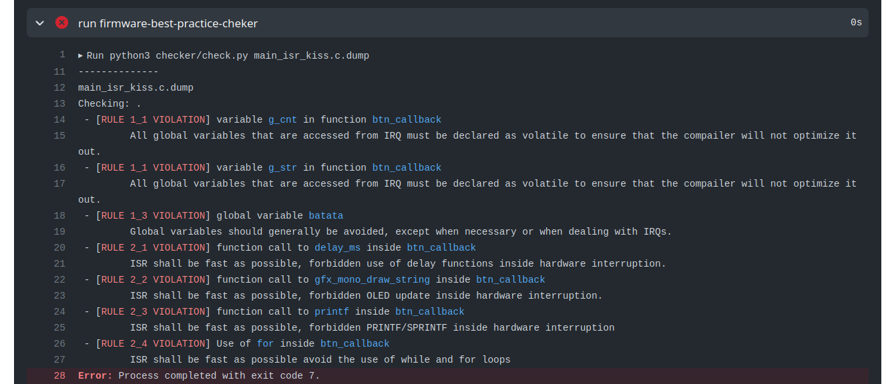

# ISR - Handler/ Callback 

Essas regras dizem respeito que a execução de uma ISR deve ser: a mais rápida possível e curta em tamanho de código. 

!!! info "RULE 3.0"
    Não pode usar / gerar `delay` de software dentro de uma ISR.

!!! info "RULE 3.1"
    Não pode acessar o OLED ou qualquer outro display de dentro de uma ISR.
   
!!! info "RULE 2.2"
    Não pode usar `printf` ou `sprintf` de dentro de uma ISR. 
    
!!! info "RULE 2.3"
    Não pode executar laços de código (`while`, `for`) de dentro de uma ISR.

Embora estas regras sejam padrão, elas podem ser flexibilizadas se for mitigado o impacto do uso desses recursos dentro de uma ISR. Por exemplo, se queremos modificar um vetor pequeno para armazenar mais um valor nele, então poderíamos usar um laço. No entanto, é melhor evitar tais práticas.

!!! info
    Alguns microcontroladores possuem tamanho de memória de código limitado para interrupção, fique atento a isso quando for desenvolver um firmware para uC mais simples ( com arquiteturas de 8/16 bits)!
    
    Alguns desenvolvedores de software usam o principio de: *Keep it simple, stupid!* [**KISS**](https://en.wikipedia.org/wiki/KISS_principle) nos seus projetos, isso tem alguma semelhança com o que estamos propondo aqui.

## Exemplo

A seguir um exemplo ==errado== de uso de interrupção.

```c
#include "asf.h"

int g_cnt = 0;
char g_str[10];

// This code creates a progress bar on an OLED screen that
// increases when the button is pressed.
void btn_callback(void) {
  printf("btn pressed \n"); // printf dentro de ISR

  if (g_cnt >= 8)
    g_cnt = 0;

  int i = 0;
  for (i = 0; i < g_cnt; i++) { // for dentro de ISR
    g_str[i] = '*';
    g_str[i + 1] = NULL;
    delay_ms(50); // delay dentro de ISR
    gfx_mono_draw_string(g_str, 0, 0, &sysfont); // oled dentro de ISR
  }
}

void main(void) {
  // ...

  while (1) {
  }
}
```

O código anterior viola gera os seguintes erros:



## Praticando

Vamos praticar um pouco e corrigir as regras básicas de qualidade de código e boas práticas em sistemas embarcados, para isso crie um repositório pelo *github classroom* e então modifique os arquivos conforme indicado.

!!! exercise "Simple and short"
    1. Crie um repositório com o código exemplo acessando o github classroom [emb-rules-isr]({{rules_isr_classroom}})
    1. Analise o log do actions e verifique que o checker executou e encontrou alguns erros.

    Agora vamos corrigir os códigos com erro, execute na ordem:
    
    1. `main_isr_kiss.c`
    1. `main_isr_practice.c`
    
    Dica: Crie uma `flag` para indicando que o btn foi pressionado e então reescreva o código na função `main`.
