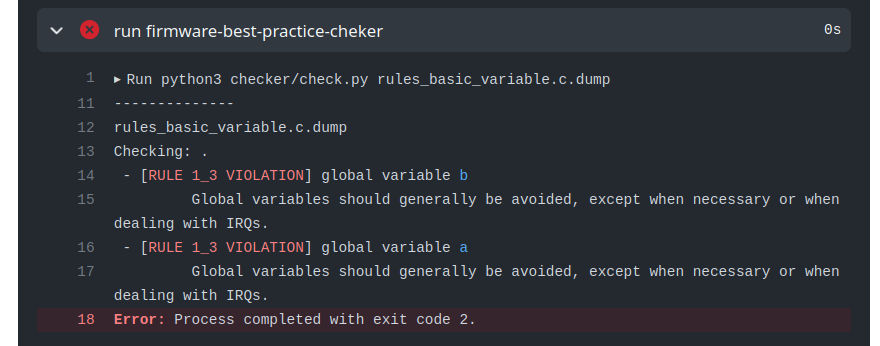

# Variáveis

Programas para sistemas embarcados devem seguir algumas diretrizes fundamentais de qualidade de código, refletindo as melhores práticas no uso de microcontroladores e da linguagem de programação C. É importante lembrar que um sistema embarcado interage diretamente com o mundo real, onde falhas podem impactar significativamente nossa realidade.

Existem varias normas estabelecidas para orientar os desenvolvedores na criação de firmwares mais confiáveis, abordando inclusive problemas associados à especificação da linguagem C. 

!!! info "underfined behaviors - linguagem C"
    Os comportamentos indefinidos (undefined behaviors) na linguagem de programação C ocorrem quando o padrão da linguagem não especifica como o programa deve se comportar em determinadas circunstâncias. Isso pode ser resultado de ações como: divisão por zero, acesso a ponteiros nulos, estouro de buffer, entre outros. Esses comportamentos podem levar a resultados imprevisíveis e causar problemas de segurança ou falhas no programa. Para minimizar tais riscos, é importante seguir as melhores práticas de programação e estar atento a possíveis comportamentos indefinidos ao escrever e revisar seu código.
    
Neste roteiro não vamos nos atentar a formatacão do código (nomenclatura, estilo). 

## Variáveis Globais

!!! tip "Rule 1.1"
    Somente usar variáveis globais para passar informacoes de uma interrupcão (ISR) para a funcão `main`. 

Em projetos mais complexos, essa regra pode ser flexibilizada, mas isso deve ser abordada com cautela e planejamento. Devido ao tempo limitado disponível para desenvolvermos boas práticas com vocês, estamos  o uso de variáveis globais apenas nessas situações. 

### Exemplo

O exemplo a seguir demonstra um ==uso errado== de variáveis globais:

- `void foo(void)`: A funcão `foo` acessa a variável global `a`
- `int b`: Poderia pertencer ao escopo da funcão `main`

```c
int a = 0; // var global
int b = 0; // var global

void foo(void) {
    a = a + 1; // acessa variavel global
}

void main(void) {
    while (1) {
        foo();
        
        if (a > 5) {
            b = 1;
        }
    }
}
```

O código anterior viola a regra **1.1** nas duas variáveis ( `a` e `b` ) gerando o seguinte erro:



!!! exercise choice two-cols
    Qual alternativa a seguir seria uma solucão válida para corrigir o código?
    
    === "Item (a)"
        - Declara `a` e `b` local e acessa `a` como global
        - Declara `foo` dentro da funcão `main` 
        
        ``` c 
        void main(void) {
            int a = 0;
            int b = 0;

            void foo(void) {
                a = a + 1; // acessa variavel global
            }

            while (1) {
                foo();

                if (a > 5) {
                    b = 1;
                }
            }
        }
        ```
    
    === "Item (b)"
        - Declara `a` e `b` local e acessa `a` como global

        ``` c 
        void foo(void) {
            global a;  // apenas a é global
            a = a + 1;
        }
        
        void main(void) {
            global int a = 0;
            int b = 0;

            while (1) {
                foo();

                if (a > 5) {
                    b = 1;
                }
            }
        }
        ```
     
    === "Item (c)"
        - Declara `a` e `b` local, e acessa `a` com ponteiro

        ``` c 
        void foo(int &a) {
            *a = *a + 1; // acessa ponteiro
        }
        
        void main(void) {
            int a = 0;
            int b = 0;

            while (1) {
                a = foo(&a);

                if (a > 5) {
                    b = 1;
                }
            }
        }
        ```
    
    - [ ] Declarar `foo` dentro da funcão `main`.
    - [ ] Declarar a variável `a` como `global`.
    - [x] Declara `a` e `b` local, e acessa `a` com ponteiro

### Praticando

Vamos praticar um pouco e corrigir as regras básicas de qualidade de código e boas práticas em sistemas embarcados, para isso crie um repositório pelo *github classroom* e então modifique os arquivos conforme indicado.

!!! exercise "Variáveis globais"
    1. Crie um repositório com o código exemplo acessando o github classroom [emb-rules-basic-variables]({{rules_variables_classroom}})
    1. Analise o log do actions e verifique que o cppcheck executou e encontrou alguns erros.
    1. Corrija o código (rules_basic_variable.c) e verifique se os erros ainda continuam.
 
    Dica: reescreva a funcão `foo` para um dos casos a seguir:
    
    - `int foo(int a)`
    - `void foo(int *a)`
