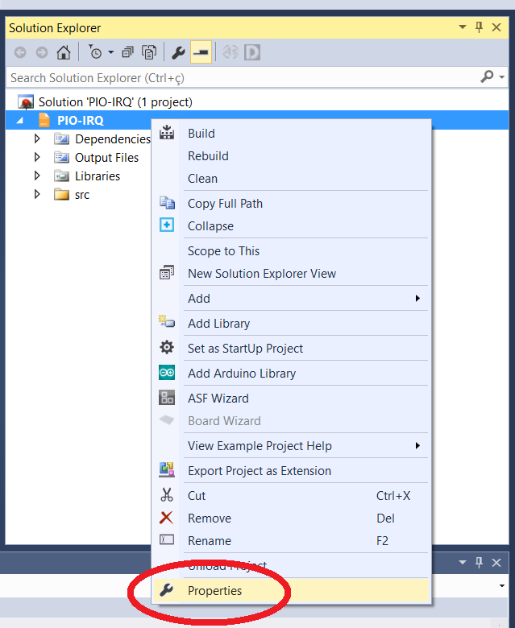
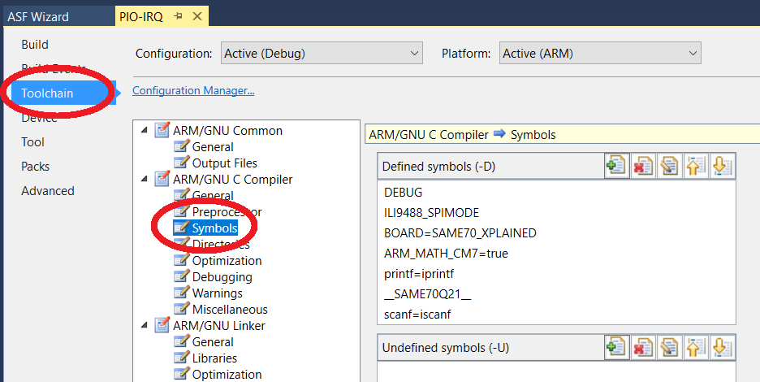
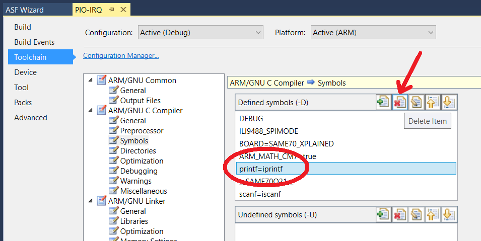

# Float Print (Atmel Studio)

Configurações necessárias para executar o código `printf("%f",var)` na IDE Atmel Studio

1. Vá na janela `Solution Explorer` e clique com o botão direito no seu `Project Properties` e depois clique em `Properties`

   

   

1. Vá na aba `Toolchain` e clique na opção `Symbols` dentro de `ARM/GNU C Compiler`

   

   

1. Selecione o define `printf=iprintf` e clique na opção `Delete Item`

   

   

1. Basta compilar seu código novamente que o comando `printf("%f",var)` irá funcionar.

