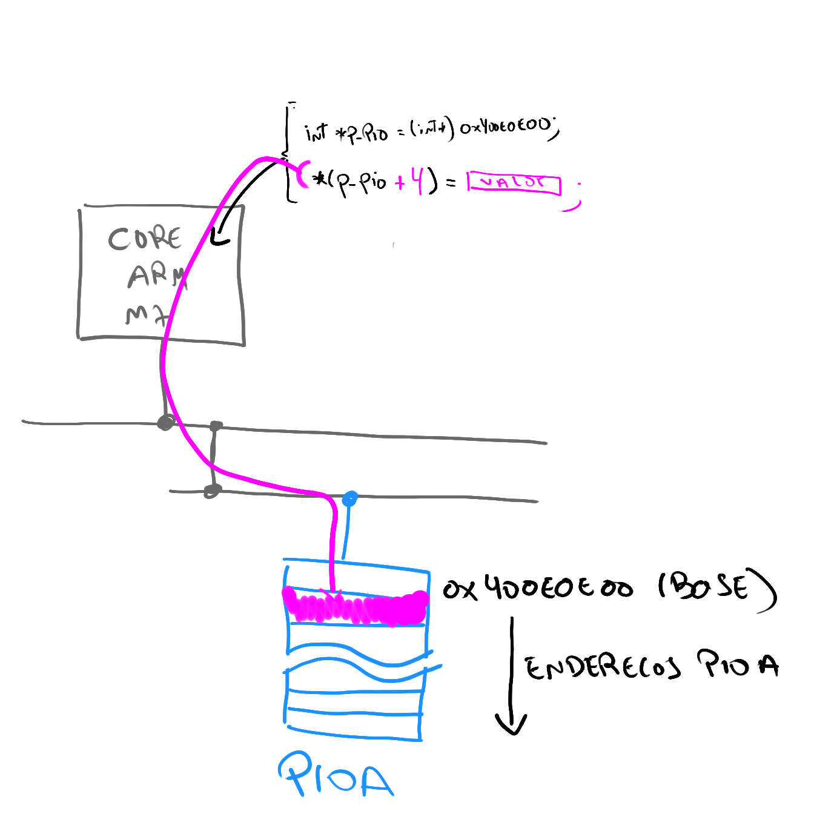

# LAB - PIO - DRIVER

Nessa aula iremos utilizar como projeto referência o LAB-1. 

## Entrega

| Pasta             |
|-------------------|
| `Lab2-PIO-Driver` |

!!! note "Como começar:"
    - Vocês devem realizar uma cópia do LAB-1 que está no seu repositório para a pasta `Lab2-PIO-Driver`, iremos modificar o que fizemos no laboratório passado.
    
    - A entrega continua sendo feita pelo repositório que foi gerado no laboratório passado.
    
O objetivo desse laboratório é o do entendimento das funções utilizadas para configurar o PIO. Como um pino é configurado como saída e entrada? Como o firmware manipula o periférico PIO? Entender o que o PIO é capaz de fazer. Para isso iremos aqui implementar nossas próprias funções de interface com o PIO.

Ao final do lab, deverão ter implementado as seguintes funções:

- C:
    - [ ] `_pio_set(...)`
    - [ ] `_pio_clear(...)`
    - [ ] `_pio_pull_up(...)`
    - [ ] `_pio_set_input(...)`
    - [ ] `_pio_set_output(...)`
- B:
    - [ ] `_pio_get(...)`
- A:
    - [ ] `_delay_ms(...)`

## Driver

Vamos implementar uma série de funções que irão configurar o periférico PIO via a escrita em seu banco de registradores. Para isso será necessário ler o manual do uC mais especificamente a [secção do PIO](https://pt.scribd.com/document/398420674/SAME70?start_page=344).

!!! progress
    Click para continuar....

### _pio_set(...)

Iremos começar com essa função que é uma das mais simples. Crie uma função no `main.c` com a seguinte estrutura:

```c
/**
 * \brief Set a high output level on all the PIOs defined in ul_mask.
 * This has no immediate effects on PIOs that are not output, but the PIO
 * controller will save the value if they are changed to outputs.
 *
 * \param p_pio Pointer to a PIO instance.
 * \param ul_mask Bitmask of one or more pin(s) to configure.
 */
void _pio_set(Pio *p_pio, const uint32_t ul_mask)
{

}
```

!!! tip
    Lembre que essa função serve para acionarmos um pino digital quando o mesmo é configurado como output (fazer ele virar `3.3V`).

Na primeira etapa iremos substituir a função que a Microchip já nos disponibiliza por uma criada por nós, em todo lugar no código que você faz o uso da função `pio_set(...)` substitua a chamada por essa recém criada  `_pio_set(...)`.

!!! example "Tarefa"
    1. Crie a função `_pio_set()`
    1. Substitua no código toda ocorrência de `pio_set()` pela `_pio_set()`. 
    1. Execute o código, **ele não deve funcionar :bangbang:.**
        - pois agora a função que aciona um pino não está implementada.
        
!!! progress
    Próxima etapa ....

Agora será necessário entender como o PIO controla os pinos e o que deve ser feito para que ele atue sobre o pino como desejamos. A parte da secção do manual que fala sobre o PIO e suas saídas/entradas é a **secção 32** do (`manual SAME70`), vamos analisar:

!!! note "SAME70-Manual: 32.5.4 Output Control"
    Texto extraído do manual:
    
    > The level driven on an I/O line can be determined by **writing** in the Set Output Data Register (**PIO_SODR**) and the Clear Output Data Register (PIO_CODR). These write operations, respectively, set and clear the Output Data Status Register (PIO_ODSR), which represents the data driven on the I/O lines**. Writing in PIO_OER and PIO_ODR manages PIO_OSR whether the pin is configured to be controlled by the PIO Controller or assigned to a peripheral function. This enables configuration of the I/O line prior to setting it to be managed by the PIO Controller.

Lendo o texto, podemos descobrir que  para termos `1` (`set`) no pino devemos escrever no registrador `PIO_SODR`, no manual tem mais detalhes sobre tudo do PIO. Vamos analisar a documentação especifica deste registrador (`SODR`):


Repare que esse registrador é do tipo **write-only** ou seja ele não pode ser lido, somente escrito. Cada bit desse registrador representa um pino, se pegarmos por exemplo o bit 30 desse registrador (pensando no PIOA) estaríamos nos referindo ao `PA30`, qualquer alteração **ESCRITA** nesse bit influenciará **SOMENTE** esse pino. 

!!! note
    Todos os registradores estão listados e explicados no datasheet, de uma olhada na página **362**, a descrição começa ai.

Agora que já sabemos o que deve ser feito para colocarmos acionarmos um pino (ativar) e considerando que ele já foi configurado como saída podemos escrever a implementação da função:

```c
void _pio_set(Pio *p_pio, const uint32_t ul_mask)
{
	p_pio->PIO_SODR = ul_mask;
}
```

- `*p_pio`: é um endereço recebido do tipo Pio, ele indica o endereço de memória na qual o PIO (periférico) em questão está mapeado (vamos ver isso em detalhes).
- `ul_mask`: é a máscara na qual iremos aplicar ao registrador que controla os pinos para colocarmos 1 na saída.

O que isso significa? Significa que estamos acessando o periférico passado como referência a função (um dos cinco PIO disponíveis no uc: *PIOA*,  *PIOB*, *PIOC*, ...) e estamos aplicando a máscara `ul_mask` no seu registrador `PIO_SODR`.

!!! note "Pio type?"
    O tipo `Pio` é uma struct alinhada com o endereço de memória do periférico, onde cada 'item' dessa struct representa um endereço da memória do periférico, essa é uma maneira em `C` de darmos *nome* a endereços de memória.  Isso já está definido no projeto quando usamos o asf (para facilitar nossa vida):
    
    O `PIOA` é um struct que aponta para o endereço `0x400E0E00`
    
    ``` c
    #define PIOA ((Pio    *)0x400E0E00U) /**< \brief (PIOA  ) Base Address */
    ```
    
    O struct possui a seguinte estrutura:
    
    ``` c
      typedef struct {
    __O  uint32_t PIO_PER;       /**< \brief (Pio Offset: 0x0000) PIO Enable Register */
    __O  uint32_t PIO_PDR;       /**< \brief (Pio Offset: 0x0004) PIO Disable Register */
    __I  uint32_t PIO_PSR;       /**< \brief (Pio Offset: 0x0008) PIO Status Register */
    __I  uint32_t Reserved1[1];
    __O  uint32_t PIO_OER;       /**< \brief (Pio Offset: 0x0010) Output Enable Register */
    __O  uint32_t PIO_ODR;       /**< \brief (Pio Offset: 0x0014) Output Disable Register */
    __I  uint32_t PIO_OSR;       /**< \brief (Pio Offset: 0x0018) Output Status Register */
    __I  uint32_t Reserved2[1];
    __O  uint32_t PIO_IFER;      /**< \brief (Pio Offset: 0x0020) Glitch Input Filter Enable Register */
    __O  uint32_t PIO_IFDR;      /**< \brief (Pio Offset: 0x0024) Glitch Input Filter Disable Register */
    ```
    
    Onde: `O`, `I` são macros que bloqueiam os endereços para:
    
    - `__O` : Apenas escrita (output)
    - `__I` : Apenas Leitura (input)
    - `__IO` : Leitura e Escrita (input/output)
    
    ```c
    #ifdef __cplusplus
      #define   __I     volatile        /*!< Defines 'read only' permissions                 */
    #else
      #define   __I     volatile const  /*!< Defines 'read only' permissions                 */
    #endif
      #define   __O     volatile        /*!< Defines 'write only' permissions                */
      #define   __IO    volatile        /*!< Defines 'read / write' permissions              */
    ```
    
    O diagrama a seguir ilustra o que acontece quando fazemos: `p_pio->PIO_SODR = ul_mask;`
    
    {width=500}

!!! example "Modifique e teste"
    A função está pronta, agora precisamos testar. Com a modificação no código faça a gravação do uC e ele deve voltar a piscar o LED quando você aperta o botão. Agora a função implementada possui a mesma funcionalidade daquela fornecida pelo fabricante.
    
    - Embarque o código e o mesmo deve funcionar normalmente caso a função implementada esteja correta.

!!! progress
    Próxima etapa ....

### _pio_clear(...)

Faça o mesmo para a função clear:

```c
/**
 * \brief Set a low output level on all the PIOs defined in ul_mask.
 * This has no immediate effects on PIOs that are not output, but the PIO
 * controller will save the value if they are changed to outputs.
 *
 * \param p_pio Pointer to a PIO instance.
 * \param ul_mask Bitmask of one or more pin(s) to configure.
 */
void _pio_clear(Pio *p_pio, const uint32_t ul_mask)
{

}
```

!!! question short
    Consultando a secção 32.5.4 do manual do microcontrolador, qual é o registrador que deve ser acessado para colocar zero no pino?

    !!! details ""
        - `pio_codr`
    
        > The level driven on an I/O line can be determined by writing in the Set Output Data Register (PIO_SODR) and the
        > ==Clear Output Data Register (PIO_CODR)==. These write operations, respectively, set and clear the Output Data
        > Status Register (PIO_ODSR), which represents the data driven on the I/O lines. Writing in PIO_OER and
        > PIO_ODR manages PIO_OSR whether the pin is configured to be controlled by the PIO Controller or assigned to
        > a peripheral function. This enables configuration of the I/O line prior to setting it to be managed by the PIO
        > Controller.
    
!!! example "Modifique e teste"
    1. Crie a função `_pio_clear()`
    1. Substitua no código toda ocorrência de `pio_clear` por `_pio_clear`
    1. Implemente a função.
    1. Compile, programe e teste

!!! progress
    Próxima etapa .... 

### _pio_pull_up(...)

!!! warning
    Só continue se a implementação anterior funcionou.

Vamos implementar uma função que faz a configuração do `pullup` nos pinos do PIO, esse pullup é utilizado no botão da placa. Para isso declare a função a seguir:

``` c
/**
 * \brief Configure PIO internal pull-up.
 *
 * \param p_pio Pointer to a PIO instance.
 * \param ul_mask Bitmask of one or more pin(s) to configure.
 * \param ul_pull_up_enable Indicates if the pin(s) internal pull-up shall be
 * configured.
 */
void _pio_pull_up(Pio *p_pio, const uint32_t ul_mask,
		const uint32_t ul_pull_up_enable){
        
 }
```

Essa função recebe o PIO que irá configurar, os pinos que serão configurados e como último parâmetro se o pullup estará ativado (1) ou desativado (0). 

!!! info
    Leia o manual do PIO, especificamente **a secção 32.5.1**.

!!! question short
    Consultando a secção 32.5.1 do manual do microcontrolador, qual é o registrador que deve ser acessado para ativar o pullup?
    
    !!! details ""
        `pio_puer`
    
        > Each I/O line is designed with an embedded pull-up resistor and an embedded pull-down resistor. ==The pull-up
        > resistor can be enabled or disabled by writing to the Pull-up Enable Register (PIO_PUER)== or Pull-up Disable
        > Register (PIO_PUDR), respectively.

        Note que a função `pio_pull_up` via o parâmetro `ul_pull_up_enable` ativa e desativa o pull-up. Por conta disso você terá que usar os dois registradores: 
    
        - `pio_puer` / `pio_pudr`

!!! example "Modifique e teste"
    1. Crie a função `_pio_pull_up`
    1. Substitua no código toda ocorrência de `pio_pull_up` por `_pio_pull_up`.
    1. Implemente
    1. Compile, programe e Teste
    
!!! progress
    Próxima etapa ....

### _pio_set_input(...)

Agora vamos criar uma nova função para configurar um pino como entrada, para isso inclua os seguintes defines que serão utilizados como forma de configuração da função:

``` c
/*  Default pin configuration (no attribute). */
#define _PIO_DEFAULT             (0u << 0)
/*  The internal pin pull-up is active. */
#define _PIO_PULLUP              (1u << 0)
/*  The internal glitch filter is active. */
#define _PIO_DEGLITCH            (1u << 1)
/*  The internal debouncing filter is active. */
#define _PIO_DEBOUNCE            (1u << 3)
```

Esses defines serão passados como configuração da função `_pio_set_input()` no parâmetro `ul_attribute`. Declare no seu código a seguinte função:

``` c
/**
 * \brief Configure one or more pin(s) or a PIO controller as inputs.
 * Optionally, the corresponding internal pull-up(s) and glitch filter(s) can
 * be enabled.
 *
 * \param p_pio Pointer to a PIO instance.
 * \param ul_mask Bitmask indicating which pin(s) to configure as input(s).
 * \param ul_attribute PIO attribute(s).
 */
void _pio_set_input(Pio *p_pio, const uint32_t ul_mask,
		const uint32_t ul_attribute)
{

}
```


Para testar essa função substitua o seguinte trecho de código que configura um pino como entrada + o pull-up

``` c
pio_set_input(BUT_PIO, BUT_PIO_MASK, _PIO_DEFAULT);
_pio_pull_up(BUT_PIO, BUT_PIN_MASK, 1);
```

Para:

``` c
_pio_set_input(BUT_PIO, BUT_PIO_IDX_MASK, _PIO_PULLUP | _PIO_DEBOUNCE);
```

!!! info
    Leia o manual do PIO, especificamente **a secção 32.5.9**.

!!! tip
    Utilize a função já implementada `_pio_pull_up()`

!!! example "Tarefa: Modifique e teste"
    1. Crie a função `_pio_set_input`
    1. Substitua no código toda ocorrência de `pio_set_input` por `_pio_set_input`.
    1. Implemente
    1. Compile, programe e teste
    
!!! progress
    Próxima etapa ....

### _pio_set_output(...) 

Na aula passada utilizamos a função `pio_set_output` para configurarmos que o pino é uma saída. Iremos aqui definir uma nova função chamada de `_pio_set_output()` que implementa essa função.

Defina no seu código a função a seguir:

``` c
/**
 * \brief Configure one or more pin(s) of a PIO controller as outputs, with
 * the given default value. Optionally, the multi-drive feature can be enabled
 * on the pin(s).
 *
 * \param p_pio Pointer to a PIO instance.
 * \param ul_mask Bitmask indicating which pin(s) to configure.
 * \param ul_default_level Default level on the pin(s).
 * \param ul_multidrive_enable Indicates if the pin(s) shall be configured as
 * open-drain.
 * \param ul_pull_up_enable Indicates if the pin shall have its pull-up
 * activated.
 */
void _pio_set_output(Pio *p_pio, const uint32_t ul_mask,
		const uint32_t ul_default_level,
		const uint32_t ul_multidrive_enable,
		const uint32_t ul_pull_up_enable)
{

}
```

Essa função é um pouco mais complexa, e deve executar as seguintes configurações:

1. Configurar o PIO para controlar o pino
     - secção 32.5.2
> When a pin is multiplexed with one or two peripheral functions, the selection is controlled with the Enable Register (PIO_PER) and the Disable Register (PIO_PDR). The Status Register (PIO_PSR) is the result of the set and clear registers and indicates whether the pin is controlled by the corresponding peripheral or by the PIO Controller.

2. Configurar o pino em modo saída
     - secção `32.5.4`
     
3. Definir a saída inicial do pino (`1` ou `0`)
     - aqui você pode fazer uso das duas funções recentes implementadas. 
     
4. Ativar ou não o multidrive :
     - Leia a secção `32.5.6`
     
5. Ativar ou não o pull-up :
     - utilize a função `_pio_pull_up()` recém declarada.
> Uma vez implementada a função, utilize ela no seu código substituindo a função `pio_set_output()` por essa função `_pio_set_output()`. Teste se o LED continua funcionando, se continuar quer dizer que sua função foi executada com sucesso.

!!! tip
    Utilize as funções já implementada `_pio_set()`, `_pio_clear()`, `_pio_pull_up()`

!!! example "Tarefa: Modifique e teste"
    1. Crie a função `_pio_set_output`
    1. Substitua no código toda ocorrência de `pio_set_output` por `_pio_set_output`.
    1. Implemente
    1. Compile, programe e teste

!!! note "Preencher ao finalizar o lab"
    <iframe src="https://docs.google.com/forms/d/e/1FAIpQLScB6CJGzACLzl45C0B47WA32Ft55casTQkqrLvW5Fp3rwe__Q/viewform?embedded=true" width="640" height="320" frameborder="0" marginheight="0" marginwidth="0">Carregando…</iframe>

!!! progress
    Até aqui já é C!! Lembre de preencher o forms...
    
### Conceito B: _pio_get(...)

Implemente a função `_pio_get()`:

``` c
/**
 * \brief Return 1 if one or more PIOs of the given Pin instance currently have
 * a high level; otherwise returns 0. This method returns the actual value that
 * is being read on the pin. To return the supposed output value of a pin, use
 * pio_get_output_data_status() instead.
 *
 * \param p_pio Pointer to a PIO instance.
 * \param ul_type PIO type.
 * \param ul_mask Bitmask of one or more pin(s) to configure.
 *
 * \retval 1 at least one PIO currently has a high level.
 * \retval 0 all PIOs have a low level.
 */
uint32_t pio_get(Pio *p_pio, const pio_type_t ul_type,
		const uint32_t ul_mask)
{}
```

!!! note "ul_type"
    - `PIO_INPUT`: quando for para ler uma `entrada`
    - `PIO_OUTPUT_0`: quando for para ler uma `saida`

!!! example "Tarefa: Modifique e teste"
    1. Crie a função `_pio_get()`
    1. Substitua no código todas as ocorrências de `pio_get` por `_pio_get()`
    1. Implemente
    1. Compile, programe e teste
    
!!! progress
    Próxima etapa ....


### Conceito A: _delay_ms(...)

Crie sua Própria função de `delay_ms`

!!! example "Tarefa: Modifique e teste"
    1. Crie a função `_delay_ms()`
    1. Substitua no código todas as ocorrências de `delay_ms` por `_delay_ms()`
    1. Implemente
    1. Compile, programe e teste

----------

