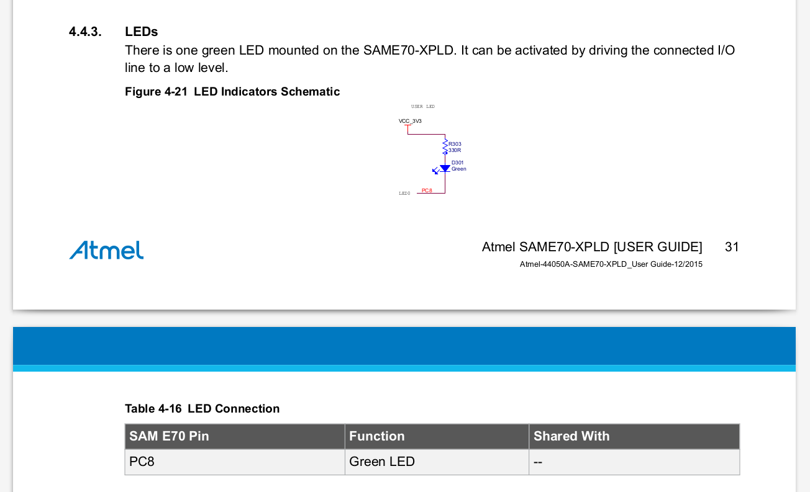

# LAB - PIO

| **Pasta:**   `/Lab1-PIO-IO` |
| :---: |
| **Data <span style="color:red">LIMITE</span> para entrega:** `{{lab01_deadline}}` |


!!! info
    Os laboratórios são individuais e cada aluno deve ter um repositório com todas as enteegas, o repositório deve ser criado pelo classroom usando o link a seguir: 
    
    https://classroom.github.com/a/xjegYr_C
 
!!! progress
    Click para continuar....

## Entrega

Ao final desse laboratório você deve ser capaz de controlar e ler pinos digitais do microcontrolador a fim de podermos acionar saídas (LEDs/ Buzzers/ motores) e lermos entradas (botões/ sensores/ ...). 

Ao final do laboratório vocês terão: 

- Um LED piscando a cada segundo
- A leitura de um botão (entrada)
- LED acionado pelo botão

!!! note ""
    Feito esse lab já da para começar a [APS 1](https://insper.github.io/ComputacaoEmbarcada/navigation/APS/APS-1-Musical/) onde vocês terão que desenvolver um sistema embarcado que reproduz uma música monofonia.

## Laboratório

O código exemplo que será utilizado nesse laboratório já se encontra no repositório criado pelo classroom (`1-PIO-IO`) e foi criado para ser o mais “limpo” possível, inclusive, faltando algumas bibliotecas básicas para a compilação. 

O Laboratório será feito em duas partes:

Parte 1: 

  1. Inserir drivers no projeto (ASF) 
  1. Configurações básicas do microcontrolador (uC): clock e watchdog timer
  1. Configurar PIO para ACIONAR o pino conectado ao LED 
  1. Controlar pino para fazer o LED piscar

Parte 2: 

  1. Configurar o PIO para LER o pino do botão em modo entrada
  1. Ler o botão e agir sobre o LED

!!! exercise self "Task: Començando"
    1. Clone o repositório criado pelo classroom
    1. Conecte a placa ao computador 
    1. Abra o projeto `1-PIO-IO` no microchip studio
    
!!! progress
    Click para continuar....

## Inicializando e configurando ASF

Já com o Microchip Studio aberto verifique o conteúdo do arquivo `main.c` o mesmo deve estar praticamente vazio salvo comentários, inclusão do arquivo `asf.h` e duas função `init` e `main`.

```c title="main.c"
#include "asf.h"

// CÓDIGO OMITIDO 

// Função de inicialização do uC
void init(void) {

}

/************************************************************************/
/* Main                                                                 */
/************************************************************************/

// Funcao principal chamada na inicalizacao do uC.
int main(void) {
  init();

  // super loop
  // aplicacoes embarcadas não devem sair do while(1).
  while (1)
  {

  }
  return 0;
}
```

O arquivo header `asf.h` é criado e atualizado automaticamente pelo Microchip Studio e contém os frameworks/drivers inseridos no projeto. O [Advanced Software Framework (ASF)](https://www.microchip.com/en-us/development-tools-tools-and-software/libraries-code-examples-and-more/advanced-software-framework-for-sam-devices#Documentation) que é uma camada de abstração do acesso ao hardware, possibilitando que configuremos partes específicas do uC em um nível de abstração intermediário.

{width=400}

!!! note
    Pense no ASF como uma biblioteca de códigos, nela podemos encontrar
    drivers para os diversos periféricos do microcontrolador e outras coisas que vão nos ajudar a desenvolver diferentes projetos.

A função `init` será utilizada para inserirmos códigos que farão a inicialização do uC e configuração correta dos periféricos e pinos. Já a função `main` é a primeira função a ser executada no uC (devido a linguagem C) e será a orquestradora de todo o sistema, como ilustrado a seguir:

```c title="main.c"
  main(){
    // inicialização CLK
    // inicialização PMC
    // inicialização PIO
    init();
    
    while(1){
      // Lógica
    }
  }
```

### Modificando o ASF

No Microchip Studio abra o **ASF Wizard** clicando na barra superior em: `ASF` :arrow_right: `ASF Wizard`. Após um tempo (sim demora para abrir) uma janela deve abrir contendo: a esquerda uma lista dos possíveis drivers que podem ser utilizados para o microcontrolador e na coluna da direita os drivers/bibliotecas já inseridas na solução.

!!! info
    No Microchip Studio um projeto contém uma cópia dos códigos das bibliotecas utilizadas, se você editar essa cópia novos projetos não serão impactados.

As seguintes bibliotecas já estão selecionadas e incluídas no projeto:

- **Generic board support (driver)**
    - drivers de compilação para o uC da placa
- **System Clock Control (service)**
    - funções para controle do clock do uC

Será necessário adicionar as seguintes bibliotecas (APIs/ drivers) a esse projeto:

!!! exercise sefl "Task: Incluir bibliotecas no projeto"
    Você deve inserir as bibliotecas a seguir no projeto!

    - **GPIO - General purpose Input/OutPut (service)**
        - funções para configuração do PIO
    - **IOPORT - General purpose I/O service (service)**
        - funções para controle dos pinos
    - **MPU - Memory Protect Unit (driver)**
        - funções para gerenciamento de memória
    - **PMC - Power Management Controller (driver)**
        - funções para configuração do periférico PMC e controle de clock dos periféricos
    - **PIO - Parallel Input/Output Controller (driver)**
        - funções para controle do periférico PIO e controle dos pinos
    - **Delay routines**
        - funções de delay (por software)

    ??? info "Dica extra"
        Para adicionar ou remover bibliotecas da solução utilize a barra inferior:

        {width=500}

        ==Ao final clique em APPLY para salvar as alterações.==

!!! progress
    Click para continuar....

## Inicialização do uC

Antes da execução do nosso código é necessário realizarmos configurações no uC que irão preparar o core. Essas configurações variam de uC para uC e podem incluir a configuração de:

- clock
- memória de execução / cache
- Desativar funcionalidades específicas 
- terminal para debug (printf)

No nosso caso iremos começar configurando o clock do uC e desativando o `WatchDog Timer`.

!!! exercise self "Task: Função `init()`"
    Modifique a função `init()` para ficar como a seguir:
    
    ```c
    // Função de inicialização do uC
    void init(void){
      // Initialize the board clock
      sysclk_init();
    
      // Desativa WatchDog Timer
      WDT->WDT_MR = WDT_MR_WDDIS;
    }
    ```

!!! progress
    Click para continuar....

A função `sysclk_init()` é responsável por aplicar as configurações do arquivo [`config/conf_clock.h`](https://github.com/Insper/SAME70-examples/blob/master/SAME70-Clear/src/config/conf_clock.h) no gerenciador de clock do microcontrolador, que está configurado para operar em`300 MHz`.

Já a linha [`WDT->WDT_MR = WDT_MR_MDDIS`](https://pt.scribd.com/document/398420674/SAME70#page=188) faz com que o watchdog do microcontrolador seja desligado.

!!! info 
    WatchDog Timer como o próprio nome diz é um cão de guarda do microcontrolador. Ele é responsável por verificar se o código está 'travado' em alguma parte, causando o reset forçado do uC.
    
    O whatchdog timer deve ser ativado só nos estágios finais de desenvolvimento
    de um produto.
    
     

!!! progress
    Click para continuar....

##  Pino como saída (output)

Para configurarmos um pino como saída será necessário seguirmos os passos a seguir:

1. Identificar o pino a ser controlado (extrair dados do manual/ placa/ projeto)
1. Exportar para o código informações do pino
1. Ativar/Energizar o periférico (PIO) responsável pelo pino 
1. Configurar o PIO para controlar o pino como saída
1. Controlar o pino (high/low).

### Dados do pino

Antes de configurarmos um pino como entrada (botão) ou saída (LED) é necessário descobrimos qual pino iremos controlar, para isso devemos verificar o manual da placa ([`manuais/SAME70-XPLD.pdf`](https://github.com/Insper/ComputacaoEmbarcada/blob/master/Manuais/SAME70-XPLD.pdf)) para saber quais pinos possuímos disponíveis para uso. No caso da nossa placa, possuímos um pino conectado a um botão e outro pino conectado ao LED (já vieram montados na placa).

 

Todos os pinos digitais desse microcontrolador (em outros uC pode ser diferente) são conectados ao um periférico chamado de `Parallel Input/Output Controller (PIO)`, esse periférico é responsável por configurar diversas propriedades desses pino, inclusive se será entrada ou saída (configurado individualmente). Cada PIO pode controlar até 32 pinos (depois veremos o porque disso), e cada ==pino== está conectado a um único PIO. 

Cada PIO possui um nome referenciado por uma letra: PIO **A** ; PIO **B**; PIO **C**;.... E cada pino possui um número único dentro desse PIO, por exemplo ==PIOA11== referencia o "pino 11" do "PIOA". Outra notação utilizada no manual é ==PA11==, que representa a mesma coisa.

!!! tip "SAME70-XPLD.pdf"
    A secção [`4.4.3 LED` do SAME70-XPLD](https://pt.scribd.com/document/398492442/SAME70-XPLD#page=31) 
    descreve como o LED do  **kit de desenvolvimento** foi utilizado na placa.
    
    

!!! exercise choice
    Usando a informação anterior responda (de um zoom na imagem):
    
    Qual pino e qual PIO é responsável por controlar o LED?
    
    - [ ] PIO D pino 0
    - [x] PIO C pino 8
    - [ ] PIO VCC pino 3v3
    
    !!! answer 
        A tabela [Table 4-16 LED Connection](https://pt.scribd.com/document/398492442/SAME70-XPLD#page=32) descreve qual o pino e qual PIO o LED do kit foi conectado, podemos a partir dos dados do manual extrair que o LED foi conectado ao pino ==PC8== do microcontrolador;

        "O periférico PIO C, 'bit' 8 é responsável por controlar o Liga/Desliga do LED verde da placa."

!!! exercise choice
    Se colocarmos energia no pino (`1`/ `High`/ vcc/ ligado) no pino conectado ao LED, ele irá acender ou apagar? 
    
    - [x] Apagar
    - [ ] Acender
    
    !!! answer 
        O LED apaga quando o pino é acionado (pino ligado/ um no pino/ high) e acende quando aterrado (pino desligado/ zero no pino/ low)

!!! progress
    Só continue se tiver realmente entendido.


Podemos sintetizar as informações do PIO que controla o pino na tabela a seguir:

| **SAME70-XPLD** | **PIO** | **Index** | **ID_PIO** |
|-----------------|---------|-----------|------------|
| LED             | PIOC    |         8 |         12 |

Agora será necessário transcrever essas informações para o nosso código em C, para isso iremos usar um recurso de C chamado [`define`](https://www.pucsp.br/~so-comp/cursoc/aulas/c830.html)

!!! exercise self "Task: Modifique `main.c`"
    Iremos incorporar essa informação no nosso código via os `#defines` no começo do `main.c`:

    ```c
    #include "asf.h"
    
    #define LED_PIO           PIOC                 // periferico que controla o LED
    // # (1) 
    #define LED_PIO_ID        ???                  // ID do periférico PIOC (controla LED)     
    #define LED_PIO_IDX       8                    // ID do LED no PIO
    #define LED_PIO_IDX_MASK  (1 << LED_PIO_IDX)   // Mascara para CONTROLARMOS o LED
    ```

    1.  :man_raising_hand: Notem que o `LED_PIO_ID` está incompleto (???), não se preocupe vamos preencher na sequência.

!!! info "#define"
    `#define` em C é uma macro, ou seja, é um recurso de C que só existe
    em tempo de compilação, o `define` é diferente de uma costante
    pois o compilador não irá alocar um endereço de memória para ela. 
    
    Antes de compilar o programa, o compilador irá varrer o seu código fonte
    e substituir todos os `defines` pelos valores definidos. 
    Pense nisso como um recurso que facilita a vida do programador.

!!! progress
    Click para continuar....

### Função `init()`

Vamos implementar os códigos necessários para configurarmos o pino como saída na função `init`

#### PMC

Antes de podemos configurar um PIO para controlar um pino é necessário ativarmos esse periférico. A maioria dos periféricos do SAME70 inicializam desligados, isso é feito para: diminuir o gasto energético; e impedir a execucão de um periférico que não foi configurado.

!!! info
    O Power Managament Controller (PMC) é o periférico responsável por gerenciar energia de outros periféricos, isso é feito via a liberação ou não do clock para os periféricos. O PMC possui também diversas outras funcionalidades, como descrito no manual do microcontrolador ([`SAME70 Datasheet`](https://github.com/Insper/ComputacaoEmbarcada/blob/master/Manuais/SAME70.pdf)):

    

Cada periférico do uC possui um ID de identificação ([sec 13 `SAME70 Datasheet`](https://github.com/Insper/ComputacaoEmbarcada/blob/master/Manuais/SAME70.pdf)) que é utilizado para indicar ao PMC e ao NVIC (veremos futuramente) qual periférico estamos nos referindo. A seguir uma parte dessa tabela extraída do datasheet.


!!! exercise choice
    Qual o ID que representa o PIOC?
    
    - [ ] 10
    - [ ] 11
    - [x] 12

    !!! answer 
        Pela tabela verificamos que o **PIOC** (aquele que irá controlar o LED) possui ID 12, agora precisamos transpor isso para o nosso código! Vamos editar a linha do nosso `main.c` que possuia o **???**:

!!! progress
    Click para continuar....

!!! exercise self "Task: Modifique `main.c`"
    Insira o valor `12` no lugar do **???** no define `LED_PIO_ID`
    
    ```c
    #define LED_PIO_ID  12  // ID do periférico PIOC (controla LED)
    ```

Para evitar esse processo de ficar verifincando no manual o ID do periférico, podemos usar `ID_PIOC` no código:

```c
#define LED_PIO_ID  ID_PIOC  // ID do periférico PIOC (controla LED)
```

O ASF possui esses defines que facilitam muito o desenvolvimento e
minimizam erros.

!!! exercise self "Tarefa: Modifique `main.c`"
    Troque o número ==12== do define por `ID_PIOC`

!!! progress
    Click para continuar....

O PMC possui diversas funções, estamos agora interessados naquela que ativa um periférico. Essa função é a [`pmc_enable_periph_clk(uint32_t ul_id)`](https://asf.microchip.com/docs/latest/sam.drivers.pmc.pmc_clock_switching_example.same70_xplained/html/group__sam__drivers__pmc__group.html#gad09de55bb493f4ebdd92305f24f27d62) que recebe como parâmetro o ID do periférico que queremos ativar. 

!!! exercise self "Task: Modifique `init()`"
    Insira o seguinte trecho de código na nossa função de inicialização (`init()`) logo após desativarmos o `WDT`:

    ```c
    // Ativa o PIO na qual o LED foi conectado
    // para que possamos controlar o LED.
    pmc_enable_periph_clk(LED_PIO_ID);
    ```

!!! tip 
    Notem que estamos usando o define `LED_PIO_ID` e não o valor **12** (id do periférico), a questão é que no fim é a mesma coisa, mas o uso de `LED_PIO_ID` deixa o código mais claro.

!!! progress
    Click para continuar....


#### Configurando o pino do LED

Todo pino no PIO é inicializado em modo entrada, para usarmos como saída será necessário indicarmos ao PIO. Para isso, usaremos a seguinte função [`pio_set_output(...)`](https://asf.microchip.com/docs/latest/sam.drivers.spi.spi_dmac_slave_example.sam3x_ek/html/group__sam__drivers__pio__group.html#gaf3727cdc71e8b6c88a4069a90b72a78d), definida no [`ASF do SAME70`]( https://asf.microchip.com/docs/latest/search.html?device=same70).

!!! exercise self "Task: Modifique `init()`"
    Inseria a seguinte chamada de função na inicialização. Isso configura o PIOC para tratar o bit 8 (index 8) como saída.

    ```c
    //Inicializa PC8 como saída
    pio_set_output(LED_PIO, LED_PIO_IDX_MASK, 0, 0, 0);
    ```
    
    Podemos ler essa função da seguinte forma:
    
    > Configura o **index 8** (LED_PIO_IDX) do **PIOC** como sendo saída inicializada com o valor '0', sem [multidrive](https://embeddedartistry.com/blog/2018/6/4/demystifying-microcontroller-gpio-settings) e sem [resistor de pull-up](https://en.wikipedia.org/wiki/Pull-up_resistor).

!!! note ""
     Notem que a função recebe como parâmetro o PIO e a máscara `LED_PIO_IDX_MASK` (que representa qual pino do PIO será configurado). Veremos mais detalhes disso no próximo laboratório.

!!! progress
    Click para continuar....

A função [`pio_set_output()`](https://asf.microchip.com/docs/latest/sam.drivers.spi.spi_dmac_slave_example.sam3x_ek/html/group__sam__drivers__pio__group.html#gaf3727cdc71e8b6c88a4069a90b72a78d) possui os seguintes parâmetros:

```c
void pio_set_output (    Pio * 	p_pio,
		        const uint32_t  ul_mask,
		        const uint32_t  ul_default_level,
		        const uint32_t  ul_multidrive_enable,
		        const uint32_t  ul_pull_up_enable 
	); 		
```

Sendo:

- **p_pio**	            Pointer to a PIO instance.
- **ul_mask**	            Bitmask indicating which pin(s) to configure.
- **ul_default_level**	    Default level on the pin(s).
- **ul_multidrive_enable**  Indicates if the pin(s) shall be configured as open-drain.
- **ul_pull_up_enable**	    Indicates if the pin shall have its pull-up activated. 

!!! tip 
    Após todas as etapas anteriores sua função `init()` deve ter ficado como a seguir:

    ```c
    // Função de inicialização do uC
    void init(void){
      // Initialize the board clock
      sysclk_init();
    
      // Disativa WatchDog Timer
      WDT->WDT_MR = WDT_MR_WDDIS;
    
      // Ativa o PIO na qual o LED foi conectado
      // para que possamos controlar o LED.
      pmc_enable_periph_clk(LED_PIO_ID); 
    
      //Inicializa PC8 como saída
      pio_set_output(LED_PIO, LED_PIO_IDX_MASK, 0, 0, 0);
    }
    ```

!!! progress
    Click para continuar....

### Controlando o LED

Uma vez que as configurações gerais do uC já foram realizadas (clock e WDT) e que o periférico **PIOC8** já está pronto para acionar o LED (ou o que estiver conectado nele) podemos começar a fazer nossa implementação na função `main`. Duas são as funções que iremos usar para **acionar** ou **limpar** um determinado pino:

```c
// coloca 1 no pino do LED.
pio_set(LED_PIO, LED_PIO_IDX_MASK);

// coloca 0 no pino do LED
pio_clear(LED_PIO, LED_PIO_IDX_MASK);
```

!!! tip "Documentação das funções"

    - [pio_set](https://asf.microchip.com/docs/latest/sam.drivers.spi.spi_dmac_slave_example.sam3x_ek/html/group__sam__drivers__pio__group.html#gaff11c04817b1f7279971d1bada01184a)
    - [pio_clear](https://asf.microchip.com/docs/latest/sam.drivers.spi.spi_dmac_slave_example.sam3x_ek/html/group__sam__drivers__pio__group.html#ga4857b3d94c0517d54eeff7da85af2518)

!!! exercise choice ""
    Selecione a funcão correta que faz o LED **acender**.
    
    - [ ] `pio_set(LED_PIO, LED_PIO_IDX_MASK);`
    - [x] `pio_clear(LED_PIO, LED_PIO_IDX_MASK);`
    
    !!! answer
        
        Lembre que para acender o LED devemos colocar nível 0 no pino, para isso
        usamos a funcão `pio_clear()`. Já para apagar o LED devemos colocar valor `1`, 
        usando a funcão `pio_set()`

!!! exercise self "Task: Modifique `main()`"
    Modifique a função `main` para fazermos o LED piscar interruptamente (1 -> delay 200 ms -> 0 -> delay 200 ms -> ....):
    
    Lembre de:
 
    1. Compilar o código e programar o uC
    1. Verifique o resultado esperado
    1. Brinque com os valores da função `delay_ms` 
    
    ```c
    // Funcao principal chamada na inicalizacao do uC.
    int main(void) {
      // inicializa sistema e IOs
      init();
    
      // super loop
      // aplicacoes embarcadas não devem sair do while(1).
      while (1)
      {
        pio_set(LED_PIO, LED_PIO_IDX_MASK);      // Coloca 1 no pino LED
        delay_ms(200);                        // Delay por software de 200 ms
        pio_clear(LED_PIO, LED_PIO_IDX_MASK);    // Coloca 0 no pino do LED
        delay_ms(200);                        // Delay por software de 200 ms
      }
      return 0;
    }
    ```

!!! exercise self "Task: Praticando"
     Agora faça o LED ficar aceso por 3 segundos e ficar apagado por 1 segundo.

     1. Programe o uC
     1. Verifique o resultado esperado

!!! progress
    Click para continuar....

!!! note "Analogia com o Arduino"

    No arduino esse mesmo código seria escrito da seguinte forma:
    
    ```c
    // the setup function runs once when you press reset or power the board
    void setup() {
      // initialize digital pin LED_BUILTIN as an output.
      pinMode(LED_BUILTIN, OUTPUT);
    }
    
    // the loop function runs over and over again forever
    void loop() {
      digitalWrite(LED_BUILTIN, HIGH);   // turn the LED on (HIGH is the voltage level)
      delay(1000);                       // wait for a second
      digitalWrite(LED_BUILTIN, LOW);    // turn the LED off by making the voltage LOW
      delay(1000);                       // wait for a second
    }
    ```
    
    O Arduino esconde a função main(), que seria:
    
    ```c
    void main(void){
      init();
      setup();
    
      while(1){
        loop();
      }
    }
    ```
    
    Note que a função `setup()` do arduino precede de uma oura função `init()` que possui funcionalidade parecidas com a nossa de inicializar o clock do sistema e desabilitar o WDT.

!!! progress
    Click para continuar....

## Pino como entrada (input)

Para configurarmos um pino como entrada será necessário:

1. Identificar o pino a ser controlado (extrair dados do manual)
1. Exportar para o código informações do pino
1. Ativar o periférico (PIO) responsável pelo pino
1. Configurar o PIO para controlar o pino como entrada
1. Ler o valor do pino.

### Extraindo dados do manual

O kit de desenvolvimento SAME7-XPLD possui dois botões, um deles reservado para o reset do microcontrolador e outro de uso geral. 

!!! exercise long
    
    Utilizando o manual do kit de desenvolvimento ([SAME70-XPLD.pdf](https://github.com/Insper/ComputacaoEmbarcada/blob/master/Manuais/SAME70-XPLD.pdf)) preencha a tabela a seguir:

    | Perif. SAME70-XPLD    |   PIO(A,B,C,D,...) |     INDEX       |   ID_PIO      |
    |-----------------------|--------------------|-----------------|---------------|
    | Botão SW300           |                    |                 |               |
    
    DICA: Ver novamente como foi feito com o LED.

    !!! answer
        Solução:
        
        | Perif. SAME70-XPLD    |   PIO(A,B,C,D,...) |     INDEX       |   ID_PIO      |
        |-----------------------|--------------------|-----------------|---------------|
        | Botão SW300           |   PIO A            |      11         |     10        |

!!! progress
    Click para continuar....

### Exportando informações para o código 

Agora precisamos fazer a ponte entre o mundo externo e o firmware que será executado no microcontrolador, pela tabela anterior insira e complete os defines a seguir no `main.c` (perto dos defines do LED).

!!! exercise self "Task"
    Com a tabela preenchida agora conseguimos passar a informacao para o código com novos defines, da mesma maneira que foi feito o LED:
    
    Criei os defines no `main.c` e coloque os valores extraídos da tabela:

    ```c
    // Configuracoes do botao
    #define BUT_PIO
    #define BUT_PIO_ID
    #define BUT_PIO_IDX 
    #define BUT_PIO_IDX_MASK (1u << BUT_PIO_IDX) // esse já está pronto.
    ```

!!! progress
    Click para continuar....

### Função `init()`

Agora é necessário: 

1. Ativarmos o PIO no PMC
1. Configurarmos o novo pino como entrada
1. Ativamos PULL-UP no pino 

#### PMC PIO

Com os defines "definidos" podemos ativar o clock do **PIO** que gerencia o pino, para isso insira na função de inicialização `init()` após a inicialização do LED.

!!! exercise self "Task"
    Modifique a função `init()` inserindo a inicialização do novo PIO:

    ```c
    // Inicializa PIO do botao
    pmc_enable_periph_clk(BUT_PIO_ID);
    ```

#### Configurando o pino como Input

Agora é necessário configurarmos o `BUT_PIO` para gerenciar o `BUT_PIO_IDX` como uma entrada, para isso usaremos a função `pio_set_input()` definida na biblioteca da ASF:

```c
// configura pino ligado ao botão como entrada com um pull-up.
pio_set_input(ARG0, ARG1, ARG2);
```

!!! exercise self "Task"
    Você deve fazer a chamada da função `pio_set_input` na funcão `init`, substituindo os argumentos pelos valores corretos.
    
    Para isso você deve ler a descrição da função: [`pio_set_input()`](https://asf.microchip.com/docs/latest/sam.drivers.spi.spi_dmac_slave_example.sam3x_ek/html/group__sam__drivers__pio__group.html#ga2908ec92df470e6520c6f5c38211ca0b)
 

    ```c
    pio_set_input(ARG0, ARG1, PIO_DEFAULT);
    ```
    
    - No `ul_attribute` utilize: `PIO_DEFAULT`. 

!!! progress
    Click para continuar....

#### PULL-UP

Para esse pino funcionar é necessário que ativemos o `pull-up` nele. `Pull-up` é um resistor alimentando para `VCC`, ele faz com que o valor padrão do pino seja o energizado.

Para ativarmos o `pull-up` basta chamar a função: [`pio_pull_up()`](https://asf.microchip.com/docs/latest/sam.drivers.spi.spi_dmac_slave_example.sam3x_ek/html/group__sam__drivers__pio__group.html#gaa9aa20867544ff93c6527b799b3dfcec) com os parâmetros correto. A função está detalhada na documentação do ASF.

!!! exercise self "Task: Modifique: `init()`"
    Você deve fazer uso da função `pio_pull_up()` na função `init()` 

!!! progress
    Click para continuar....

### Lendo o botão

Para lermos um valor de um pino, que já foi configurado como entrada, devemos utilizar alguma das funções fornecidas no ASF de interface com o PIO, procure por ela na documentação do PIO.

!!! exercise short
    Qual função pode ser utilizada para ler o valor digital do pino PA11? Consulte as funções disponíveis na documentação do [ASF PIO](https://asf.microchip.com/docs/latest/sam.drivers.spi.spi_dmac_slave_example.sam3x_ek/html/group__sam__drivers__pio__group.html)
    
    !!! answer
        A função a ser utilizada é a [pio_get()](https://asf.microchip.com/docs/latest/sam.drivers.spi.spi_dmac_slave_example.sam3x_ek/html/group__sam__drivers__pio__group.html#ga370c08649d026fbe46cef9434526edf9)

!!! progress
    Click para continuar....

### Implementando a lógica

Vamos usar o botão para fazer alguma coisa? Agora conseguimos acionar um pino (LED) e ler um pino (botão). 

!!! exercise self "Task"
    Faca um código que o LED pisca 5 vezes na sequência somente quando o botão da placa for pressionado. 
    
    Lembre de usar a função `pio_get()`, você vai precisar realizar uma condição com o valor que ela retorna.

    Utilize [`PIO_INPUT`](https://asf.microchip.com/docs/latest/sam.drivers.spi.spi_dmac_slave_example.sam3x_ek/html/pio_8h.html#a5b347a9dbe228bdc43e90cd4ac4889e0) no parâmetro `ul_type` da função. 

    **Não funcionou? De uma olhada como eu implementei:**
    
    - https://github.com/Insper/SAME70-examples/blob/96fb17e758e7eef9273ca2ddfb8dcd33ebcb4eb7/Perifericos-uC/PIO-IO/PIO-IO/src/main.c#L66

!!! progress
    Click para continuar....

## Praticando (entrega obrigatória)

!!! exercise self "Task"
    Muito bom! Agora vamos pegar a placa OLED1 (que você recebeu no kit) e usar os LEDs e Botoẽs dela? Para isso você vai ter que entender quais pinos configurar como entrada e saída.
    
    A placa possui três botões e três LEDs que podem ser lidos e controlados pelo microcontrolador. A ideia da atividade é que cada botão controle o LED associado a ele (Botão 1 - Led 1/ Botão 2 - Led 2/ ...) fazendo piscar da mesma maneira como feito com o botão da placa (cada botao controla um LED).
    
    Para isso, vocês devem conectar a placa OLED na entrada EXT-1 do seu kit e então consultar os manuais no link a seguir para saber qual pino devem configurar como saída (LEDs) e quais devem configurar como entrada (Botões)
    
    ==Dica: Comece pelos LEDs (fazendo piscar) e depois vá implementando os botões um a um.==
    
    Link para os documentos: https://insper.github.io/ComputacaoEmbarcada/navigation/Util/Util-Documentos/

    - OLED1 Xplained Pro User Guide: Explica a placa OLED
    - SAME70-XPLD.pdf: Explica a placa de desenvolviment
    
<span style="color:white">!!! note "Preencher ao finalizar o lab"
    <iframe src="https://docs.google.com/forms/d/e/1FAIpQLSdAiI2TaOgFPQXLASi_acn8R71vFAyxpuAr3bWZhmiEJW62Uw/viewform?embedded=true" width="640" height="800" frameborder="0" marginheight="0" marginwidth="0">Carregando…</iframe></span>
