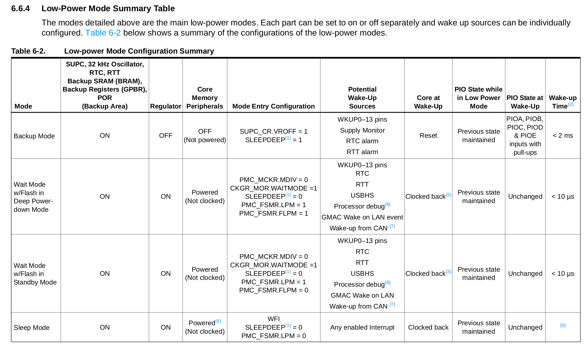

# LAB - PIO - IRQ

Esse laboratório possui duas entregas, a primeira é um passo a passo do laboratório e a segunda é parte de prática que coloca em uso o que foi visto na aula. As duas devem ser entregues até a data limite.

## Entrega

|   **Pastas:** `/Lab3-PIO-IRQ` |
|   ----------------------------   |
|   **Data <span style="color:red">LIMITE</span> para entrega:** `04/09/22 - 23h59` |

!!! tip "Teoria"
    Antes de seguir leia a teoria sobre [IRQ](/ComputacaoEmbarcada/navigation/Labs/Lab_PIO_IRQ/Lab-PIO-IRQ-Teoria/)

A disciplina possui um repositório de códigos exemplos, que será bastante utilizado ao longo do curso:

- https://github.com/Insper/SAME70-examples

O repositório está organizado por categorias: comunicação, demos, periféricos, screens, sensores, ... e assim por diante.

Neste laboratório iremos trabalhar com o código exemplo [`SAME70-exemples/Perifericos-uC/PIO-IRQ`](https://github.com/Insper/SAME70-examples/tree/master/Perifericos-uC/PIO-IRQ) que demonstra como configurar o botão da placa utilizando interrupção. Esse código será a base do laboratório.

!!! exercise self
    1. Copie o código exemplo `SAME70-examples/Perifericos-uC/PIO-IRQ` para a pasta`Lab3-PIO-IRQ` do seu repositório.
    1. Estude o [README](https://github.com/Insper/SAME70-examples/blob/master/Perifericos-uC/PIO-IRQ/README.md) desse exemplo!
    1. Execute o exemplo na placa!
    1. Analise o código fonte.

!!! progress
    Click para continuar....

Iremos entender melhor e começar a implementar mudanças no código de exemplo.

## Bordas

Agora vamos modificar o código um pouco, o exemplo está funcionando com interrupção em borda de descida no pino, ou seja, a função de `callback` é chamada quando você aperta o botão (High -> Low). Iremos modificar o comportamento para operar com borda de subida, fazendo com que a função de callback seja chamada quando soltarmos o botão (Low -> High).

!!! exercise self 
    1. Mude a função que configura a interrupção do pino para operar em `PIO_IT_RISE_EDGE`. 
    1. Teste na placa.
    1. Percebeu a diferença?

!!! exercise short   
    As vezes pode acontecer que quando voc aperta o botão o LED pisca e quando você solta também? O comportamento teria que ser de piscar apenas quando solta o botão. Por que isso acontece?
    
    (Não são todas as vezes que isso acontece).
    
    !!! answer
        Isso acontece por conta do bounce de quando apertamos o botão, o PIO detecta esse movimento e gera uma interrupção na descida e na subida. ==Um comportamento indesejável.==
        
        Para corrigir isso devemos ativar o ==debounce== no pino do botão, isso é feito através das funções a seguir:
        
        ```diff
        -pio_configure(BUT_PIO, PIO_INPUT, BUT_IDX_MASK, PIO_PULLUP);
        +pio_configure(BUT_PIO, PIO_INPUT, BUT_IDX_MASK, PIO_PULLUP | PIO_DEBOUNCE);
        +pio_set_debounce_filter(BUT_PIO, BUT_IDX_MASK, 60);
        ```

!!! exercise self
    1. Modifique a função init com o trecho de código anterior e ative o debounce no pino.
    1. Teste na placa

!!! progress
    Click para continuar....

## IRQ - Keep it short and simple 

O tempo que um firmware deve ficar na interrupção deve ser o menor possível, pelos principais motivos:

1. Outras interrupções de mesma prioridade irão aguardar o retorno da interrupção. O firmware irá deixar de servir de maneira rápida a diferentes interrupções se gastar tempo nelas.
2. Nem todas as funções [são reentrantes](https://en.wikipedia.org/wiki/Reentrancy_(computing)). Funções como `printf` podem ==não operar== corretamente dentro de interrupções por poderem ser chamadas mais de uma vez, sem terem terminado de executar.
3. RTOS: As tarefas devem ser executadas em tasks e não nas interrupções, possibilitando assim um maior controle do fluxo de execução do firmware (vamos ver isso mais para frente).

> Para maiores informações acesse: https://betterembsw.blogspot.com/2013/03/rules-for-using-interrupts.html

Existem algumas soluções para essa questão, a mais simples delas é a de realizar o processamento de uma interrupção no loop principal (`while(1)`), essa abordagem é muito utilizada em sistemas embarcados. E deve ser feita da forma a seguir:

- Define-se uma variável global que servirá como `flag` (`true` ou `false`) [^1] e **importante, essa variável precisa ser do tipo `volatile`**)
- Interrupção altera o status da `flag` para True
- `while(1)` verifica status da `flag` para realizar ação.
- `while(1)` volta a `flag` para o estado original False.

Analise o exemplo a seguir que ilustra o uso de flags para tratar o evento no botão:

``` c
/* flag */
volatile char but_flag; // (1)

/* funcao de callback/ Handler */
void but_callBack(void){
  but_flag = 1;
}

void main(void){
  /* inicializacao */
  // ....
  // ...

  while(1){
  
   if (but_flag) {  // (2)
       pisca_led(5, 200);    
       but_flag = 0; // (3)
   }
  }
}
```

1. :man_raising_hand: Note que a variável que será utilizada como flag foi declarada como `volatile`
2. O bloco de código dentro do `if` só será processado quando o `but_flag` for True
3. :warning: Essa linha é muito importante pois sem ela o bloco do if seria executuado novamente sem o evento externo do botão.

!!! info "True/False"
    A linguagem C não define True/False, indicamos usando o valor 1 para verdadeiro e 0 para falso.

!!! info "volatile"
    Sempre que uma interrupção alterar uma variável global, essa deve possuir o 'pragma'/modificador [`volatile`](https://barrgroup.com/Embedded-Systems/How-To/C-Volatile-Keyword).
    
    Exemplo: `volatile int valADC;`
    
    Esse pragma serve para informar o compilador (no nosso caso GCC) que essa variável será modificada sem que o compilador saiba, evitando assim que a variável não seja compilada. 
    
    Compiladores são projetados para otimizar programas removendo trechos ou variáveis desnecessárias. Como a função de `Handler` (interrupção) nunca é chamada diretamente pelo programa, o compilador pode supor que essa função não vai ser executada nunca e pode optimizar a variável que nela seria atualizada (já que não é chamada diretamente, mas sim pelo hardware quando ocorre um evento). 
    
    - Leia mais sobre [volatile](https://barrgroup.com/Embedded-Systems/How-To/C-Volatile-Keyword)
    
    ==ATENÇÃO: só usar `volatile` quando necessário uma IRQ altera o valor de uma variável==.

!!! exercise self
    Agora modifique o código do Lab3 para usar flag e processar o evento do botão na funcão main. Lembre que dentro do callback do botão não pode mais ter a função `pisca_led`!
    
    1. Modifique o exemplo para piscar o led no `while(1)` utilizando `flag` vindo da interrupção. 
    1. Programe e teste no HW

!!! progress
    Click para continuar....

## Low power modes

Trabalhar por interrupção possui várias vantagens, e uma delas é a possibilidade de fazer o uC entrar em modos de operação de baixo consumo energético (`sleep modes`).

No caso do uC utilizado no curso, são 4 modos distintos de lowpower, cada um com sua vantagem / desvantagem:

- *Active Mode: Active mode is the normal running mode with the core clock running from the fast RC oscillator, the main crystaloscillator or the PLLA. The Power Management Controller can be used to adapt the core, bus and peripheral frequencies and to enable and/or disable the peripheral clocks.*

- *Backup mode: The purpose of Backup mode is to achieve the lowest power consumption possible in a system which is performing periodic wake-ups to perform tasks but not requiring fast startup time.*

- *Wait mode: The purpose of Wait mode is to achieve very low power consumption while maintaining the whole device in a powered state for a startup time of less than 10 us.*

- *Sleep Mode: The purpose of sleep mode is to optimize power consumption of the device versus response time. In this mode, only the core clock is stopped. The peripheral clocks can be enabled. The current consumption in this mode is application-dependent*

!!! note "Informações importantes"
    - Não é qualquer interrupção que consegue tirar o uC de modos de sleep mais profundos
    - Quanto mais profundo o sleep, mais tempo o uC leva para 'acordar'
    - Alguns modos podem perder informações da memória RAM
    
    
    
    Mais informações na secção 6.6 do datasheet

!!! exercise choice
    Na tabela anterior aparece na coluna do **Potential Wake-Up Sources** um item chamado de ==WKUP0-13 pins==, o que você acha que isso significa?
    
    - [x] Pinos específicos do uc
    - [ ] Pinos do RTT
    - [ ] Pinos de um PIO
    - [ ] Não faço ideia
    
    !!! answer
        WKUP (wake-up) pins: são pinos específicos do SAME70 que além de irem para o PIO vão também para o Supply Controller e que possibilita re-energizar o uC após um evento externo.


!!! exercise choice
    Quais sleep-modes podemos usar se desejamos acordar o uC com eventos do PIO (sem usar os pinos com as funções especiais de WKUP)?:

    - [x] Sleep Mode 
    - [ ] Sleep Mode / Wait Mode
    - [ ] Sleep Mode / Wait Mode/ Deep-Power-mode
    - [ ] Sleep Mode / Wait Mode/ Deep-Power-mode/ Backup Mode
    
    !!! answer
        Podemos usar apenas o ==Sleep Mode== pois o uC é acordado por qualquer interrupção. Para entrarmos em um modo de menor nível energéticos temos que usar um dos WKUP pins ou algum outro periférico da lista para poder acordar o uC (entrar nós podemos, mas nunca vamos sair do sono).

### Adicionando a lib de lowpower mode (ASF Wizard)

Para termos acessos as funções da Microchip que lidam com o `sleep mode` devemos adicionar a biblioteca **Sleep manager (service)** no Microchip Studio:

- `ASF` :arrow_right: `ASF Wizard` :arrow_right: 

Agora basta adicionar a biblioteca **Sleep manager (service)** ao projeto.

!!! tip ""
    Lembre de dar apply.

#### Entrando em lowpower

Agora podemos usar as funções de low power, primeiramente iremos utilizar somente o modo `sleep mode` via a chamada da função `pmc_sleep()` conforme exemplo a seguir:

``` c
void main(void){ 
  while(1){
     if (but_flag) { ... }
  
     // Entra em sleep mode    
     pmc_sleep(SAM_PM_SMODE_SLEEP_WFI); // (1)
  }
}
```

1.  Código 'trava' aqui até ser 'acordado' 

Uma vez chamada essa função o uC entrará em modo sleep WFI (WaitForInterrupt), ou seja, o CORE para a execução do código e retoma as atividades normais somente quando uma interrupção "acordar" o CORE.

!!! exercise self 
    1. Modifique o exemplo para entrar em modo sleep
    1. Programe e teste no HW

!!! info "Como testar o sleepmode?"
    No laboratório temos um multímetro de bancada que é capaz de medir com até 5 dígitos uma corrente elétrica. Podemos usar esse equipamento para medir a corrente consumida pelo uC durante os diferentes ciclos de operação.

!!! progress
    Click para continuar....

## Pensando um pouco

!!! exercise long
    Vamos imaginar o cenário a seguir: 
    
    Você está desenvolvendo uma interface na qual um usuário pode configurar por meio de um botão, a quantidade desejada de um 
    determinado item (açúcar da máquina de café, temperatura do forno, ....). É muito comum que a interface possibilite manter o botão pressionado para alterar mais rapidamente o contador, ou seja:
    
    1. O usuário apertar e soltar o botão para cada vez que ele quer incrementar o contador 
    1. O contador aumenta enquanto o usuário mantiver o botão pressionado
    
    A solução de código para a primeira opção é trivial e conseguimos fazer com o que já temos, mas e a solução para o outro caso (botão apertado), alguma ideia de como fazer?
    
    (solução a seguir)
    
    !!! answer   
    
        A ideia é simples: configurar a interrupção do pino para descida e subida, assim sabemos quando o usuário apertou o botão e depois quando
        ele soltou. Mas temos um problema, ==só podemos configurar uma função de callback por o pino!==
        
        Para ativarmos a interrupção nos dois casos (subida/ descida) devemos usar o `PIO_IT_EDGE`. A chamada de função que configura interrupção no pino ficaria assim:
        
        ```diff
        pio_handler_set(BUT_PIO,
                        BUT_PIO_ID,
                        BUT_IDX_MASK,
        +               PIO_IT_EDGE,
                        but_callback);
        ```

        Notem que a mesma função `but_callback` será chamada para os dois casos de evento.

        ```
          ----   
              \____ Fall-Edge
                              ==> but_callback()    
              _____ High-Edge
          ___/
        ```

!!! exercise long
    Legal! mas agora a função `but_callback` será chamada pelo HW quando ocorrer uma mudança de nível de qualquer tipo. Alguma ideia de como vamos saber se entramos na função `but_callback` pela borda de descida (usuário apertou o botão) ou plea borda de subida (usuário soltou o botão)?

    (solução a seguir)

    !!! answer
        A solução é verificamos imediatamente dentro da função de callback o valor atual do pino: se ele for '0' quer dizer que entramos por uma borda de descida e se for '1' por uma borda de subida!
        
        O código a seguir indica como fazer isso:
        
        ```c
        void but_callback (void) {
            if (pio_get(BUT_PIO, PIO_INPUT, BUT_IDX_MASK)) {
                // PINO == 1 --> Borda de subida
            } else {
                // PINO == 0 --> Borda de descida
            }       
        }
        ```
        
        Sacada legal né?

!!! progress
    Click para continuar....

Agora siga para a página: Praticando, que faz parte desse lab.
