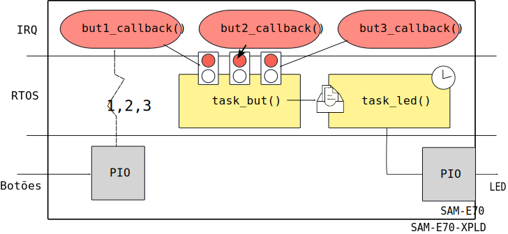
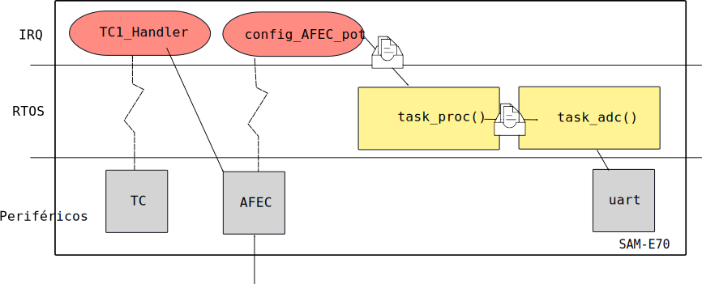
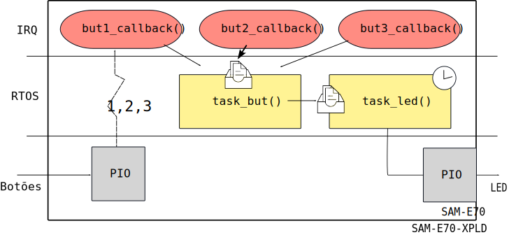

# LAB - RTOS (freeRTOS)

| Lab 4                                                                      |
|----------------------------------------------------------------------------|
| **Data limite para entrega**: =={{lab04_deadline}}==                       |
| Entregue o código pelo repositório do ==[Classroom]({{lab04_classroom}})== |
| ^^Procurando o link para FORMS?^^ Leia o box a seguir                      |

!!! info "Forms ???"
    Vamos testar um novo formato nesta entrega, issues foram criadas no seu repositório, você deve fechar as issues de acordo com o que realizou nesta entrega, iremos verificar os códigos com as issues que foram fechadas.
    
    - Você só deve fechar as issues do que foi concluido.
    - Se não concluiu 100% a issues, você pode fazer um comentário que ireimos analisar!

Neste laboratório iremos trabalhar com os seguintes códigos exemplos que foram fornecidos no repositório do classroom (você também pode encontrar eles no repositório SAME70-examples):

1. `RTOS-PIO-IRQ`
2. `RTOS-AFEC-IRQ`

Neste laboratório iremos trabalhar com o uso de um sistema operacional de tempo real (RTOS). O sistema operacional a ser utilizado é o [FreeRtos (www.freertos.org)](http://freertos.org), um sistema operacional muito utilizado pela industria, sendo o segundo sistema operacional (**20%**) mais utilizado em projetos embarcados, perdendo só para o [Linux](https://m.eet.com/media/1246048/2017-embedded-market-study.pdf).

!!! tip
    Para dicas de como usar o RTOS acesse:

    [Util/Freertos](https://insper.github.io/ComputacaoEmbarcada/navigation/Dicas/Util-freertos/)

## Parte 1: RTOS-PIO-IRQ

Nesta etapa iremos

1. Executar uma demo de RTOS (`RTOS-PIO-IRQ`)
1. Entender e modificar o exemplo
1. Praticar

### Setup

!!! exercise "OLED1"
    Plugue a placa OLED1 no EXT1, vamos usar seus botões e LEDs.

!!! exercise "Terminal" 
    Esse exemplo faz uso da comunicação UART para debug de código (via printf), para acessar o terminal no microchip estúdio clique em:

    1. No microchip studio: :arrow_right: View :arrow_right: Terminal Window
    1. Configure o terminal para a porta COM correta (verificar no windows) para operar com um BaudRate de 115200.

    Caso não tenha essa opção, instale o [pacote extra do microchip studio](https://gallery.microchip.com/packages/EFC4C002-63A3-4BB9-981F-0C1ACAF81E03/2.8.4)

Iremos usar o código exemplo `RTOS-PIO-IRQ` para aprenderemos os principais recursos do RTOS, neste exemplo criamos duas tasks: `task_but` e `task_led` que se comunicam via uma fila. O botão da placa é configurado para operar com interrupção de borda, liberando um semáforo para a `task_but`, que processa a informação e envia um novo valor de delay para a `task_led`:

!!! exercise "Executando"
    1. Abra o código `RTOS-PIO-IRQ` no microchip studio
    1. Compile e grave o código no uC
    2. Abra o  e configure a UART (baudrate 115200).
    1. Veja o LED piscar! 
    1. Aperte o botão da placa e veja a frequência mudar.

Antes de seguir analise um pouco o código e tente entender o que está acontecendo, para isso consulte a página desse lab chamada de Teoria.

!!! exercise "Praticando - semáforo"

    | Projeto |
    | ------| 
    | `RTOS-PIO-IRQ`|   
    
    A ideia aqui é possibilitar diminuirmos a frequência através de outro botão! Para 
    isso teremos que adicionar mais um semáforo que irá se comunicar com a `task_but`.
 
    Dicas:
    
    - Você ==NÃO== deve criar outra task, tem que fazer tudo na `task_but`
    - ==Por conta do FreeRTOS as interrupções de HW devem possuir prioridade maior que 4.==
    - Temos um resumo de como usar os recursos do RTOS:
        - Util/Freertos ^^CONSULTE ESSE MATERIAL^^

    Tarefa:
    
    1. Modifique o código adicionando um botão da placa OLED:
       - interrupcao e callback
    1. Crie um novo semáforo e libere ele quando o botão novo for apertado.
    1. Na task but processe o semáforo aumentado o valor da frequência
    
    Qualidade de Código:

    - Lembre de verificar se os testes de qualidade de código estão passando (push para o repositório).

    Esperado:
    
    

!!! exercise

    | Projeto |
    | ------| 
    | `RTOS-PIO-IRQ`|   
    
    Agora vamos usar os outros dois botões da placa OLED, cada botão vai decrementar a frequência por uma constante diferente:
    
    - BTN1: 10
    - BTN2: 5
    - BTN3: 1
      
    Para isso você deverá:
    
    1. configurar o callback para cada botão novo
    1. Criar um novo semáforo para cada botão
    1. Ler os semáforos na `task_but` e processar os valores
    
    Tarefa:
    
    1. Agora faca o mesmo para os outros dois botões da placa OLED que faltaram, cada um modificando a frequência com um valor diferente.
    
    Qualidade de Código:

    - Lembre de verificar se os testes de qualidade de código estão passando.

    Esperado:
    
    

!!! progress 
    Continuar ...

## Parte 2: ADC-IRQ-RTOS

Outro exemplo que vamos usar como base é o `RTOS-AFEC-IRQ` que faz a leitura de um valor analógico do pino do uC, você deve ler o README que possui o diagrama de ligações e uma pequena explicação do código. 

!!! exercise "Executando"
    1. Leia o README do exemplo e ligue conforme indicado
    1. Abra o código no microchip studio
    1. Compile e grave o código no uC
    2. Abra o terminal e configure a UART (baudrate 115200).
    1. Aperte o botão da placa e veja a frequência mudar.

Antes de seguir analise um pouco o código e tente entender o que está acontecendo, analise a task, as interrupções e também o uso da fila.

!!! exercise "Praticando"
    | Projeto |
    | ------| 
    | `RTOS-AFEC-IRQ`|    

    A ideia agora é criarmos uma task intermediária (`task_proc`) que irá fazer o processamento dos dados 
    recebidos pelo ADC.
    
    A `task_proc` deverá calcular a média móvel (N=10) dos dados do ADC e então enviar esses dados para para a task `task_adc` via uma nova fila, com o objetivo de ser exibido. A ideia da média móvel é aplicar um filtro passa baixas para remover ruídos do sinal.
    
    - Referência: https://www.analog.com/media/en/technical-documentation/dsp-book/dsp_book_ch15.pdf
    
    Tarefas/dicas:
    
    1. Modifique o código adicionando a task_proc
    1. Faça a leitura do dado do AFEC nessa nova tarefa 
    1. Crie uma nova fila, e envie o dado da task_proc para a task_adc (dado bruto, ainda sem processamento)
    1. Na task_adc exiba o dado via printf
    1. Agora na task proc calcule a média móvel e o envie para a task_adc.

    Qualidade de Código:

    - Lembre de verificar se os testes de qualidade de código estão passando.

    Esperado:
    
    

### Conceito C

Até aqui é C, você deve fechar as issues que foram abertas no seu repositório (não vamos usar mais o google forms!) referentes ao que foi feito.

!!! info
    Lembre de verificar se os testes de qualidade de código estão passando.

### Conceito B

!!! exercise "Praticando - queue"

    | Projeto |
    | ------| 
    | `RTOS-PIO-IRQ`|       
    
    No código dos botões, no lugar de usar um semáforo para cada botão, vamos usar uma única fila que irá realizar a comunicação entre os callbacks dos botões e a task `task_but`. 
    
    Tarefa:
    
    1. Crie mais uma uma fila
    1. Cada callback deve colocar o valor referente ao ID do botão que foi apertado
    1. A `task_but` recebe o valor e repassa para a `task_led`

    Qualidade de Código:

    - Lembre de verificar se os testes de qualidade de código estão passando.

    Esperado:
    
    

    ==Você saberia informar na fila se o botão foi apertado ou liberado?==
    
    
### Conceito A

!!! exercise "Praticando - queue"

    | Projeto |
    | ------| 
    | `RTOS-AFEC-IRQ`|       
    
    No código do AFEC, vamos adicionar mais um potênciometro e para isso vamos precisar de mais uma entrada analógica. 
    
    Tarefa:
    
    1. Configure um novo pino para funcionar com AFEC (No README do exemplo tem uma explicação)
    1. Crie um novo [`Timer`](https://insper.github.io/ComputacaoEmbarcada/navigation/Dicas/Util-freertos/#software-timer)
    1. Envio de dados: 
       - Você pode criar uma nova fila para enviar os dados do novo AFEC
       - Você pode modificar o tipo da fila e enviar os dados usando uma única fila
    1. A `task_process` recebe o valor dos dois afecs e faz uma média com eles:
       - $valor = (AFEC1 + AFEC0)/2$

    Qualidade de Código:

    - Lembre de verificar se os testes de qualidade de código estão passando.
