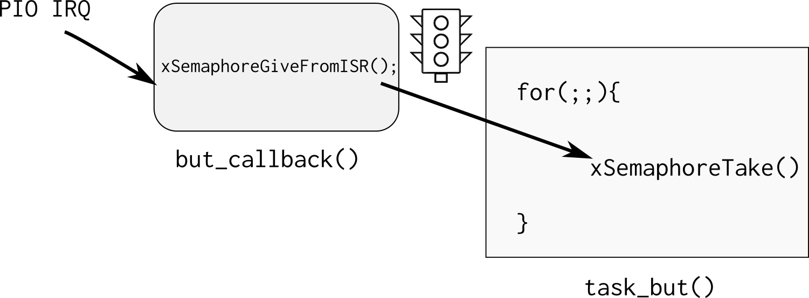

# PIO-IRQ-RTOS

Vamos usar esse código exemplo para aprenderemos os principais recursos deo RTOS, nele criamos duas tasks: `task_but` e `task_led` que se comunicam via uma fila. O botão da placa é configurado para operar com interrupcão de boarda, liberando um semáforo para a `task_but`, que processa a informacão e envia um novo valor de delay para a `task_led`:


!!! exercise "Executando"
    1. Compile e grave o código no uC
    2. Abra o terminal e configure a UART (baudrate 115200).
    1. Veja o LED piscar! 
    1. Aperte o botão da placa e veja a frequência mudar.

Antes de seguir analise um pouco o código e tente enteder o que está acontecendo.

## Tasks

Tasks são pequenos programas executados pelo sistema operacional, cada tarefa possui uma stack reservada para ela e é gerenciada pelo sistema operacional. Notem que toda task é uma função que não retorna e possui laço infinito (`for (;;){}`), ==tasks em um RTOS não devem retornar==, elas executam como se estivessem exclusividade da CPU (assim como um código bare-metal que não deve retornar da função `main`).

A função [vTaskDelay()](https://www.freertos.org/a00127.html) faz com que a tarefa fique em estado de **blocked** (permitindo que outras tarefas utilizem a CPU) por um determinado número de **ticks**. Essa função é diferente da `delay_ms()` que bloqueia a CPU para sua execução. Deve-se evitar o uso de funções de delay baseadas em "queimar" clocks na tarefas de um RTOS, já que elas agem como um trecho de código a ser executada.

A função `vTaskDelay()` faz com que o RTOS libere processamento para outras tarefas durante o tempo especificado em sua chamada. Esse valor é determinado em `ticks`. Podemos traduzir ticks para `ms`, usando o define `portTICK_PERIOD_MS` como no exemplo a seguir }

```
    /* suspende por delayMs */
    vTaskDelay(delayTicks / portTICK_PERIOD_MS);
```

O Tick de um RTOS define quantas fezes por segundo o escalonador irá executar o algoritmo de mudança de tarefas, no ARM o tick é implementado utilizando um timer do próprio CORE da ARM chamado de `system clock` ou [`systick`](http://infocenter.arm.com/help/index.jsp?topic=/com.arm.doc.dai0179b/ar01s02s08.html), criado para essa função.

Por exemplo, um RTOS que opera com um tick de 10ms irá decidir pelo chaveamento de suas tarefas 100 vezes por segundo, já um tick configurado para 1ms irá executar o escalonador a uma taxa de 1000 vezes por segundo. Trechos de código que necessitam executar a uma taxa maior que 1000 vezes por segundo (tick = 1ms) não devem ser implementados em tasks do RTOS mas sim via interrupção de timer.

!!! note
    - O impacto do tick na função `vTaskDelay` é que a mesma só pode ser chamada com múltiplos inteiros referente ao tick.
    
    - Não temos uma resolução tão boa quanto o TimerCounter ou RTT.
    
    - Quanto maior a frequência de chaveamento mais vezes/segundo o OS necessita salvar e recuperar o contexto, diminuindo assim sua eficiência.
    
    - Frequência máxima recomendada para o freertos em uma ARM e a de 1000 Hz
!!! info "Estados de uma task"
    A máquina de estados a seguir ilustra os possíveis estados de uma
    task assim como as transições. Para saber mais a respeito acesse:
    
    - https://www.freertos.org/RTOS-task-states.html
    
    
    
!!! progress 
    Continuar ...

## Criando tarefas

Criar uma tarefa é similar ao de inicializar um programa em um sistema operacional, mas no caso devemos indicar para o RTOS quais "funções" irão se comportar como pequenos programas (tarefas). Para isso devemos chamar a função `xTaskCreate` que possui a seguinte estrutura:

!!! info "Leitura necess[aria]"
    Acesse e leia a documenta;áo do freertos sobre cria;áo de tasks:
    
    https://www.freertos.org/a00125.html

A função utilizada para criar uma task no freertos é:

```c
/**
 * task. h
 *
 BaseType_t xTaskCreate(
							  TaskFunction_t pvTaskCode,
							  const char * const pcName,
							  uint16_t usStackDepth,
							  void *pvParameters,
							  UBaseType_t uxPriority,
							  TaskHandle_t *pvCreatedTask
						  );
 *
 * Create a new task and add it to the list of tasks that are ready to run.
 *
 * xTaskCreate() can only be used to create a task that has unrestricted
 * access to the entire microcontroller memory map.  Systems that include MPU
 * support can alternatively create an MPU constrained task using
 * xTaskCreateRestricted().
 *
*/
```

A criação das tasks but e LED são feitas da seguinte maneira (na função `main`):

```c
 /* Create task to make led blink */
  if (xTaskCreate(task_led, "Led", TASK_LED_STACK_SIZE, NULL,
                  TASK_LED_STACK_PRIORITY, NULL) != pdPASS) {
    printf("Failed to create test led task\r\n");
  }

  /* Create task to monitor processor activity */
  if (xTaskCreate(task_but, "BUT", TASK_BUT_STACK_SIZE, NULL,
                  TASK_BUT_STACK_PRIORITY, NULL) != pdPASS) {
    printf("Failed to create UartTx task\r\n");
  }
```

O primeiro parâmetro da `xTaskCreate` é o ponteiro da função que será lidada como uma task. A segunda é o nome dessa tarefa, a terceira é o tamanho da stack que cada task vai possuir, o quarto seria um ponteiro para uma estrutura de dados que poderia ser passada para a task em sua criação, o quinto a sua prioridade e o último é um ponteiro e retorna uma variável que pode ser usada para gerencias a task (deletar, pausar).

O tamanho da stack da tarefa e sua prioridade estão definidos no próprio `main.c`:

``` c
#define TASK_LED_STACK_SIZE (1024 / sizeof(portSTACK_TYPE))
#define TASK_LED_STACK_PRIORITY (tskIDLE_PRIORITY)
#define TASK_BUT_STACK_SIZE (2048 / sizeof(portSTACK_TYPE))
#define TASK_BUT_STACK_PRIORITY (tskIDLE_PRIORITY)
```

A cada tarefa pode ser atribuída uma prioridade que vai de **0** até `configMAX_PRIORITIES - 1`, onde `configMAX_PRIORITIES` está definido no arquivo de configuração `FreeRTOSConfig.h`, **0 é menor prioridade**.

!!! info "taskIDLE_PRIORITY"
    É a menor prioridade!

    - `#define tskIDLE_PRIORITY	( ( UBaseType_t ) 0U )`
    
    Caso queira definir uma task de maior prioridade faça da seguinte maneira:
    
    - `#define TASK_LED_PRIORITY (taskIDLE_PRIORITY + 1)`

!!! note "Stack size"
    Uma das dúvidas mais comum no uso de RTOS é o quanto de espaço devemos alocar para cada tarefa, e essa é uma pergunta que não existe um resposta correta, caso esse valor seja muito grande podemos estar alocando um espaço extra que nunca será utilizado e pode fazer falta para a aplicação. E se caso pequena, podemos ter um stack overflow e o firmware parar de funcionar. 

    A melhor solução é a de executar o programa e analisar o consumo da stack pelas tasks ao longo de sua execução, tendo assim maiores parâmetros para a sua configuração.

    ==No curso vamos usar 2048 como padrão para o stack size==


## Power Save mode?

Uma forma muito simples de conseguirmos diminuir o consumo energético de um sistema embarcado com RTOS é o de ativar os modos de baixo consumo energético (powersave/ sleep mode) quando o SO estiver na tarefa `idle`. A tarefa idle é aquela executada quando nenhuma outra tarefa está em execução. Sempre que essa tarefa `idle` for chamada a o RTOS irá executar a função a seguir já definida no `main.c`: 


``` c
/**
 * \brief This function is called by FreeRTOS idle task
 */
extern void vApplicationIdleHook(void) { 

}
```

Note que devemos entrar em um modo de sleep que o timer utilizado pelo tick consiga ainda acordar a CPU executar, caso contrário o RTOS não irá operar corretamente já que o escalonador não será chamado. O timer usado pelo escalonador é o [System Timer, SysTick](http://infocenter.arm.com/help/topic/com.arm.doc.dui0552a/Babieigh.html).

##  Comunicacao RTOS

Uma das principais vantagens de usar um sistema operacional é o de usar ferramentas de comunicação entre tarefas ou entre ISR e tarefas, em um código baremetal fazemos esse comunicação via variáveis globais (buffers, flags, ...), essa implementação carece de funcionalidades que o RTOS irá suprir, tais como:

- Semáforo (semaphore) É como uma flag binária, permitindo ou não a execução de uma task, funciona para sincronização de tarefas ou para exclusão mútua (multual exclusion), sem nenhum tipo de prioridade.

- Mutex: Similar aos semáforos porém com prioridade de execução (mutex alteram a prioridade da tarefa)
  
- MailBox ou Queues: Usado para enviar dados entre tarefas ou entre ISR e Tasks

[5] : https://www.freertos.org/Embedded-RTOS-Binary-Semaphores.html

## Semaphore

No nosso exemplo o semáforo serve para avisar a task_but que um botão foi apertado:



- Consulta: [xSemaphoreGiveFromISR](https://www.freertos.org/a00124.html)

Agora vamos modificar a função `task_led` para inicializar um semáforo, e configura
o botão da placa OLED para funcionar com interrupção chamanado a função: `but1_callback`
sempre que houver uma borda de descida no pino que lê o botão.

A tarefa agora fica no `while(1)` aguardando o semáforo `xSemaphore` que será
liberado pelo callback. Sempre que houver a leitura do semáforo, o mesmo torna-se
vermelho.

!!! tip "Visão geral"
    Para implementarmos um semáforo precisamos primeiramente definir uma variável global que será utilizada pelo sistema operacional para definir o endereço desse semáforo (global):

    ``` c
    SemaphoreHandle_t xSemaphoreBut;
    ```
    
    Devemos antes de usar o semáforo, fazermos sua criação/inicialização. De preferência na main:
    
    ``` c
    /* Attempt to create a semaphore. */
    xSemaphoreBut = xSemaphoreCreateBinary();
    ```
    
    Uma vez criado o semáforo podemos esperar a liberação do semáforo via a função:
    
    ``` c
    xSemaphoreTake(xSemaphoreBut, Tick);
    ```
    
    - xSemaphoreBut  O semáforo a ser utilizado
    - Tick : timeout (em ticks) que a função deve liberar caso o semáforo não chegue. Se passado o valor 0, a função irá bloquear até a chegada do semáforo.
    
    Para liberarmos o semáforo devemos usar a função de dentro da interrupção/callback:
    
    ``` c
    xSemaphoreGiveFromISR(...);
    ```

!!! note 
    Note o ISR no final da função, isso quer dizer que estamos liberando um semáforo de dentro de uma interrupção. Caso a liberação do semáforo não seja de dentro de uma interrupção, basta utilizar a função `xSemaphoreGive`

## Queues

Mailbox/ `queue` é uma das maneiras de enviarmos dados entre tarefa em um sistema operacional, com ele podemos comunicar interrupção com tarefa e tarefa com tarefa, enviando valores (diferente do semáforo que só funciona de forma binária).

!!! note
    Queues are the primary form of intertask communications. They can be used to send messages between tasks, and between interrupts and tasks. In most cases they are used as thread safe FIFO (First In First Out) buffers with new data being sent to the back of the queue, although data can also be sent to the front. 
    
    Writing to and reading from a queue. In this example the queue was created to hold 5 items, and the queue never becomes full.
    
     
    
    > Material retirado do site: https://www.freertos.org/Embedded-RTOS-Queues.html

!!! tip
    Para mais informações ler o site do freeRTOS sobre filas:
    
    - https://www.freertos.org/Embedded-RTOS-Queues.html
    - https://freertos.org/a00018.html 

    Também temos uma secção na nossa página de dicas com exemplo de fila:
    
    https://insper.github.io/ComputacaoEmbarcada/Util-freertos/#fila

No nosso exemplo usamos a queue para comunicar a t`task_but` com a `task_led` passando por ela o valor do delay a ser processado.


Uma fila pode ser de diversos tamanhos e largura, a ser definida na criacão! Isso permite o envio de mais de um dado por ela, como por exemplo um struct, ou um array.


## Material externos

Deixo aqui materiais externos a matéria para você que está curioso ou com dúvidas. Não precisa assistir agora antes de comećar o lab. 

!!! tip "Embedded FM - episódio 175"
    **How Hard Could It Be?**
    
    Jean Labrosse of Micrium (@Micrium) spoke with us about writing a real time operating system (uC/OS), building a business, and caring about code quality.
    
    - https://embedded.fm/episodes/175

!!! video
    
