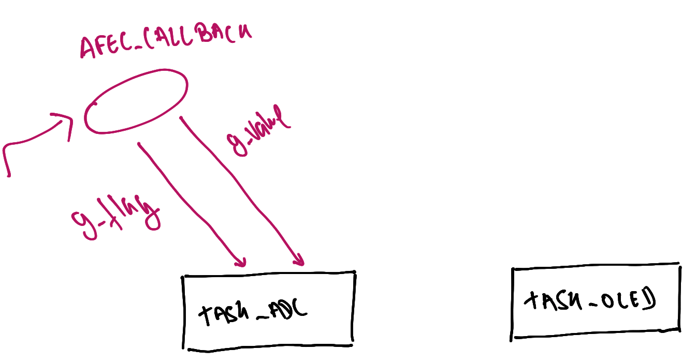
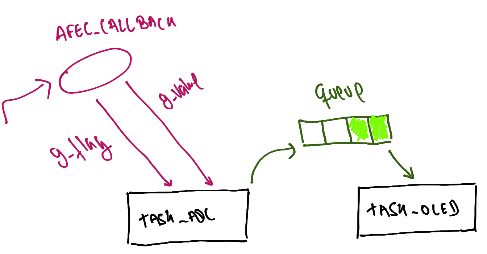

#  LAB - RTOS - ADC

Neste laboratório iremos trabalhar com conversão analógica digital, vamos aprender como usar um recurso do rtos chamado de fila.

<iframe width="560" height="315" src="https://www.youtube.com/embed/EnfjYwe2A0w" title="YouTube video player" frameborder="0" allow="accelerometer; autoplay; clipboard-write; encrypted-media; gyroscope; picture-in-picture" allowfullscreen></iframe>

## LAB

| Pasta           |
|-----------------|
| `Lab6-RTOS-ADC` |

1. Executar exemplo conversão analógica
1. Incorporar exemplo ADC no RTOS com OLED
1. Estruturar tasks
1. Criar `queue` de comunicação entre IRQ e tasks

### Início

!!! info "Conexões"
     - EXT1: OLED
     - Potenciômetro no PD30 conforme exemplo [`SAME70-examples/Perifericos-uC/AFEC-Pin/`](https://github.com/Insper/SAME70-examples/tree/master/Perifericos-uC/AFEC-Pin)
     
!!! warning "Código exemplo"
    1. ==Atualizem o repositório SAME70-Examples== antes de continuar
    1. Vamos usar como base o código [Screens/RTOS-OLED-Xplained-Pro](https://github.com/Insper/SAME70-examples/tree/master/Screens/RTOS-OLED-Xplained-Pro), copie para o seu repositório de entregas e renomeia para: `Lab6-RTOS-ADC`
    
### Exemplo AFEC

Abra o exemplo do AFEC-Pin localizado em [`SAME70-examples/Perifericos-uC/AFEC-Pin/`](https://github.com/Insper/SAME70-examples/tree/master/Perifericos-uC/AFEC-Pin), leia o `README` desse exemplo e o execute na sua placa. 

!!! note
    Note que será necessário conectar o potenciômetro ao kit, conforme indicação do README.

## Incorporando AFEC ao RTOS

Vamos incorporar o exemplo do AFEC ao código do OLED com RTOS, para isso iremos criar uma tarefa que será responsável por ler o valor do AFEC.

!!! example "Modifique"
    1. Adicione no ASF o driver do `AFEC`
    1. Traga as funções, defines e variáveis globais do exemplo `AFEC-PIN`
        - variáveis globais: `g_`
        - `defines`
        - `config_afec`
        - `AFEC_pot_Callback()`
    1. Compile o código para ver se está ok
    
Agora vamos criar uma task no RTOS para lidar com a leitura do AFEC, a tarefa vai ter a implementação a seguir:

```c
void task_adc(void){
  
  /* inicializa e configura adc */
  config_AFEC_pot(AFEC_POT, AFEC_POT_ID, AFEC_POT_CHANNEL, AFEC_pot_Callback);
  
  /* Selecina canal e inicializa conversão */
  afec_channel_enable(AFEC_POT, AFEC_POT_CHANNEL);
  afec_start_software_conversion(AFEC_POT);
  
  while(1){
    if(g_is_conversion_done){
      g_is_conversion_done = 0;
      printf("%d\n", g_ul_value);
      delay_ms(500);
      
      /* Selecina canal e inicializa conversão */
      afec_channel_enable(AFEC_POT, AFEC_POT_CHANNEL);
      afec_start_software_conversion(AFEC_POT);
    }
  }
}
```

Note que a task é praticamente igual ao `main()` do exemplo sem RTOS, isso está errado pois ainda usa `delay_ms` e fica verificando uma flag (`g_is_conversion_done`) no lugar de usar semáforo, mas serve como um bom começo.

Agora é necessário modificar a função `main` para que o freeRTOS crie essa tareafa:

```c
  /* Create task to handler LCD */
  if (xTaskCreate(task_adc, "adc", TASK_LCD_STACK_SIZE, NULL, TASK_LCD_STACK_PRIORITY, NULL) != pdPASS) {
    printf("Failed to create test adc task\r\n");
  }
```

!!! example "Modifique"
    1. Crie a task `task_adc` conforme exemplo
    1. Inicialize a task no `RTOS`
    1. Abra o terminal e note que está funcionando!
    
!!! warning
    1. Essa task continua usando uma flag que é alterada do callback do AFEC para indicar quando o valor está pronto, isso não é bom e vamos mudar mais para frente!
    1. Usa `delay_ms` no lugar do vstaskDelay.

!!! info "Diagrama"
    

## Melhorando

Agora vamos melhorar isso, começando por trocar o delay pelo delay do freertos.

!!! example "Tarefa"
    1. Substitua o `delay_ms` pelo delay do freeRTOS
    
    ==Por que isso é importante?==

### queue 

Mailbox/ `queue` é uma das maneiras de enviarmos dados entre tarefa em um sistema operacional, com ele podemos comunicar interrupção com tarefa e tarefa com tarefa, enviando valores (diferente do semáforo que só funciona de forma binária).

!!! note
    Queues are the primary form of intertask communications. They can be used to send messages between tasks, and between interrupts and tasks. In most cases they are used as thread safe FIFO (First In First Out) buffers with new data being sent to the back of the queue, although data can also be sent to the front. 
    
    Writing to and reading from a queue. In this example the queue was created to hold 5 items, and the queue never becomes full.
    
     
    
    > Material retirado do site: https://www.freertos.org/Embedded-RTOS-Queues.html

!!! tip
    Para mais informações ler o site do freeRTOS sobre filas:
    
    - https://www.freertos.org/Embedded-RTOS-Queues.html
    - https://freertos.org/a00018.html 

!!! tip
    Temos uma secção na nossa página de dicas com exemplo de fila:
    
    https://insper.github.io/ComputacaoEmbarcada/Util-freertos/#fila

<iframe width="560" height="315" src="https://www.youtube.com/embed/pHJ3lxOoWeI" title="YouTube video player" frameborder="0" allow="accelerometer; autoplay; clipboard-write; encrypted-media; gyroscope; picture-in-picture" allowfullscreen></iframe>

## Modificando firmware

Iremos agora começar a modificar o firmware criando um fila para comunicar a tarefa `task_adc` com a tarefa `task_oled`.

### Fila

Vamos criar um `queue` chamado de `xQueueADC` essa variável deve ser global (assim como fazíamos com o semáforo):

```diff
/************************************************************************/
/* RTOS                                                                 */
/************************************************************************/
#define TASK_OLED_STACK_SIZE            (6*1024/sizeof(portSTACK_TYPE))
#define TASK_OLED_STACK_PRIORITY        (tskIDLE_PRIORITY)

+typedef struct {
+  uint value;
+} adcData;

+QueueHandle_t xQueueADC;
```

!!! example "Tarefa"
    1. Criei a struct `adcData` e a variável global `xQueueADC`
    1. Compile para ver se possui erros.

### Modificando task_oled

Agora modifique a tarefa `task_oled` para alocar uma fila nesse "endereço", vamos também criar uma variável local da task chamada de `adc` para recebimento de dados dessa fila, e imprimir na tela o resultado:


```diff
void task_oled(void){
	gfx_mono_ssd1306_init();
  gfx_mono_draw_string("Exemplo RTOS", 0, 0, &sysfont);

+ xQueueADC = xQueueCreate( 5, sizeof( adcData ));
+ adcData adc;
  
  for (;;) {
    
+   // Busca um novo valor na fila do ADC!
+   // formata e imprime no LCD o dado
+   if (xQueueReceive( xQueueADC, &(adc), ( TickType_t )  100 / portTICK_PERIOD_MS)) {
+     char b[512];
+     sprintf(b, "%04d", adc.value);
+     gfx_mono_draw_string(b, 0, 20, &sysfont);
+   }
  }
}
```

!!! example "Tarefa"
    1. Modifique a `task_oled`
        1. Compile para ver se possui erros.

!!! info "Diagrama"
    

### Modificando task_adc

Agora precisamos modificar a `task_adc` para enviar o dado por essa fila:

```diff
void task_adc(void){
  
  /* inicializa e configura adc */
  config_AFEC_pot(AFEC_POT, AFEC_POT_ID, AFEC_POT_CHANNEL, AFEC_pot_Callback);
  
  /* Selecina canal e inicializa conversão */
  afec_channel_enable(AFEC_POT, AFEC_POT_CHANNEL);
  afec_start_software_conversion(AFEC_POT);
  
+  adcData adc;
  
  while(1){
    if(g_is_conversion_done){
      printf("%d\n", g_ul_value);
      
+     adc.value = g_ul_value;
+     xQueueSend(xQueueADC, &adc, 0);

      vTaskDelay(500);
      
      /* Selecina canal e inicializa conversão */
      afec_channel_enable(AFEC_POT, AFEC_POT_CHANNEL);
      afec_start_software_conversion(AFEC_POT);
    }
  }
}
```

!!! task "Tarefa"
    1. Modifique o código como indicado anteriormente
    1. Programe o uC 
    1. Teste mudando o valor do potênciometro e verificando se o valor no oled muda.

!!! info "Diagrama"
    

### semáforo 

Agora vamos modificar o código para usar um semáforo para substituir a flag: `g_is_conversion_done`, esse semáforo precisa ser liberado na `AFEC_pot_Callback` e recebido na `task_adc`.

!!! example "Tarefa"
    Substitua a flag `g_is_conversion_done` por um semáforo.
    
    Dica: Você deve criar um semáforo, inicializar e enviar.

!!! info "Diagrama"
    

## C - Dado direto do IRQ AFEC para a task_oled

Podemos fazer o envio do dado direto do `AFEC_pot_Callback` para a `task_oled`, para isso teremos que usar a função [`xQueueSendFromISR`](https://freertos.org/a00119.html) no lugar da `xQueueSend`.

!!! tip 
    Você sabia que pode alterar a fonte do OLED? De uma olhada no arquivo: `src/config/conf_sysfont`:
    
    ```c
    //#define USE_FONT_BPMONO_10x16
    #define USE_FONT_BPMONO_10x14 
    /* #define USE_FONT_MONO_MMM_10x12 */
    //#define USE_FONT_BASIC_6x7
    ```
    
    Basta escolher entre `define` diferente.

!!! task "Tarefa"
    1. Faça o envio direto do callback do AFEC para a `task_oled`
    1. Programe e teste.
    1. Teste mudando o valor do potênciometro e verificando se o valor no oled muda.

!!! info "Diagrama"
    

## B - Exibindo graficamente

Faça a exibição do potenciômetro de forma gráfica no oled.

## A - Adicionando mais uma entrada analógica

No lugar de fazer apenas uma entrada analógica vamos fazer a leitura de dois valores,
para isso vocês podem utilizar o joystick analógico que vocês possuem no kit.

----------

!!! note "Preencher ao finalizar o lab"

   <iframe src="https://docs.google.com/forms/d/e/1FAIpQLSci4k9eempzAus1-L9gLUfEov9nRv4DBVuNL3tTTy7Zl6kISQ/viewform?embedded=true" width="640" height="320" frameborder="0" marginheight="0" marginwidth="0">Carregando…</iframe>