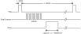

# LAB - RTOS HC-SR04

| Pasta          |
|----------------|
| `Lab5-HC-SR04` |

Neste laboratório iremos trabalhar com o sensor de distância HC-SR04, que é muito utilizado em projetos de robótica e similares. O sensor é um módulo ultrassônico e que possibilita medirmos a distância entre o sensor e um objeto.


Para realizarmos a leitura correta do sensor, iremos utilizar os seguintes periféricos (com interrupção):

- PIO: Acionamento do sensor (pino TRIG) e leitura do pulso de echo (pino ECHO)
- TC: Para contarmos a duração do pulso.

## HC-SR04

Refs:

- http://wiki.sunfounder.cc/index.php?title=Ultrasonic_Module
- https://www.filipeflop.com/produto/sensor-de-distancia-ultrassonico-hc-sr04/

O Sensor de Distância Ultrassônico HC-SR04 é capaz de medir distâncias de 2cm a 4m com ótima precisão e baixo custo. Este módulo possui um circuito pronto com emissor e receptor acoplados e 4 pinos (VCC, Trigger, ECHO, GND) para medição.

Para começar a medição é necessário alimentar o módulo e colocar o pino Trigger em nível alto por mais de 10us. Assim, o sensor emitirá uma onda sonora que, ao encontrar um obstáculo, rebaterá de volta em direção ao módulo. Durante o tempo de emissão e recebimento do sinal, o pino ECHO ficará em nível alto. Logo, o cálculo da distância pode ser feito de acordo com o tempo em que o pino ECHO permaneceu em nível alto após o pino Trigger ter sido colocado em nível alto.

Distância = [Tempo ECHO em nível alto * Velocidade do Som] / 2

A velocidade do som pode ser considerada idealmente igual a 340 m/s, logo o resultado é obtido em metros se considerado o tempo em segundos. Na fórmula, a divisão por 2 deve-se ao fato de que a onda é enviada e rebatida, ou seja, ela percorre 2 vezes a distância procurada.

Especificações:

- Alimentação: 5V DC
- Corrente de Operação: 2mA
- Ângulo de efeito: 15°
- Alcance.: 2cm ~ 4m
- Precisão.: 3mm

> Descricão extraída do site do filipflop: https://www.filipeflop.com/produto/sensor-de-distancia-ultrassonico-hc-sr04/

!!! info
    No Brasil o sensor custa em torno de R$14 (https://www.filipeflop.com/produto/sensor-de-distancia-ultrassonico-hc-sr04/)

### Interagindo

Após feita a montagem você deverá escrever um programa que faz o controle do sensor ultrassônico, para iniciar uma nova leitura você deve gerar um pulso de `10us` no pino de Trig (**Pin Y**) e então aguardar pela subida do sinal do Echo (**Pin X**) e então contar o tempo (**dT**) que ele fica em alto. O valor de **dT** é proporcional ao tempo que o som levou para chegar até o obstáculo e voltar.

A figura a seguir demonstra como funciona a leitura do sensor.

{width=600}

!!! exercise short
    Calcule o tempo **mínimo** e **máximo** que o sinal de **Echo** pode ficar em '1'? Lembre de verificar o range do sensor (você vai precisar saber a velocidade do som).
    
    !!! answer
        
        Das informações fornecidas do sensor:
        
        - Distância mínima: 0.02 m
        - Distância máxima: 4.00 m
        
        Sabendo que a velocidade do som é aproximadamente 340 m/s, portanto $x [s] = dist / 340$. Lembre que o sensor fornece a distância dobrado (tempo de ir e voltar)!
        
        Ou seja:
        
        - Tempo mínimo: $2 \times 0,000058$s 
        - Tempo máximo: $2 \times 0,011764$s

!!! exercise long
    Com as informações coletadas até aqui você consegue imaginar como deve ser o firmware para fazer a leitura do sensor? Não existe uma única maneira de fazer, mas algumas soluções podem não ser muito boas!
    
    Descreva aqui como você geraria o sinal do Trig e como você faria a leitura do sinal do Echo e quais periféricos usaria para isso?
    
    !!! answer
        Uma das soluções possíveis (e indicadas) é:
        
        Sinal do **Trigger** gerar via `pio_set(), delay_us(10), pio_clear()`. Como o sinal do pino de Trigger pode ser aproximadamente 10 us, não tem muito problema em usar a função de delay para isso!
        
        Já o sinal do **Echo** carrega informações importantes e devemos contar corretamente o tempo. Para isso sugerimos configurar uma interrupção de borda no pino do ECHO e inciar o RTT quando ocorrer uma borda de descida e parar a contagem do tempo quando ocorrer uma borda de subida, informando a função main via flag que uma nova leitura aconteceu. 
        
## Contado tempo

Para fazermos a leitura correta do sensor, será necessário conseguirmos contar o tempo na qual o pulso do `echo` fica em alto. Para isso iremos usar um novo periférico do nosso microcontrolador chamado de `REAL TIME TIMER`, que possibilita contarmos tempo (usando o clock do sistema como base). 

!!! warning
    Atualize o repositório de exemplo (nova versão do exemplo publicada 21/9)

!!! exercise
    - Leia o REAME do código exemplo: [SAME70-examples/Perifericos-uC/RTC-IRQ/](https://github.com/Insper/SAME70-examples/tree/master/Perifericos-uC/RTC-IRQ)
    - Abra o código no microchip studio, análise e rode o código na placa.

## Lab

Comecem copiando o exemplo do OLED-RTOS para o seu repositório e renomeiem para: `Lab5-HC-SR04`, ou se preferir, podem usar um dos labs passados que possui OLED-RTOS e já tem os botões configurados, só lembrem de fazer uma cópia e renomear.

### Montagem

O sensor possui dois pinos (TRIG e ECHO) que devem ser ligados no uC os outros são para alimentação (GND e VCC), como o módulo opera com 5V teremos que fazer um divisor de tensão no pino do ECHO para não danificar o nosso uC que possui tensão máxima nos pinos de 3v3.

Você deve seguir a montagem a seguir, sugerimos utilizar uma protoboard para isso. Os pinos X e Y podem ser qualquer um do EXT-2.

=== "Esquemático"
    {width=600}

=== "Protoboard"
    {width=600}

!!! warning
    Você deve escolher os pinos X e Y que irão ligar no uC.

!!! exercise
    Montar a protoboard como indicado.

### C

A entrega do Lab deve ser um sistema que possui um HC-SR04 e faz periodicamente a leitura da distância e exibe a informacão no OLED, vocês devem estruturar a solução utilizando os recursos do RTOS.

### Extras:

> Cada item vale como um conceito a mais.

- Mostre um gráfico da distância no tempo!.
- Ler dois sensores em paralelo (exibe dois pontos no gráfico)

!!! info "Ao terminar o lab preencha:"
    <iframe src="https://docs.google.com/forms/d/e/1FAIpQLSd_MJvkFWEtgMhBF5g9st3sLwGsVSEfy9aPH-WhFXUUiCoX9w/viewform?embedded=true" width="840" height="320" frameborder="0" marginheight="0" marginwidth="0">Carregando…</iframe>

### Dicas

```
                  ________                                       ________
    TRIG   ______|////////|_____________________________________|////////|_____
                                                                     ^ 
                    10us                                             |
                                                                     | 
                            _____________                            | 6.inicia nova leitura
    ECHO  _________________|/////////////|_________                  |  
                           |             |                           |
                           V             V                           |
                      1.callback_echo  3.callback_echo               |
                             |               |                       |
                             V               V                       |
                       2.RTT_init        4.rtt_read_timer_value      |
                                                |                    |
                                                V                    |      
                                           5.valor para main + cálculo da distância
```


Setup: 

1. Fazer a montagem na protoboard
1. Escolher dois pinos para Echo e Trig
1. Configurar Trig como output e Echo como input
1. Configurar irq de boarda no pino Echo
    - Lembre de criar a função de callback.
    
!!! warning
    Não ative PULL_UP no pino do ECHO!

Trig:

1. Gerar o pulso no pino de **Trig** com `delay_us`.

Echo:

1. Iniciar o RTT na borda de subida do pino Echo
    - Qual prescale usar?
1. Ler valor do RTT em borda de descida do pino Echo
   - Consulte [a documentaćão do ASF-RTT](https://asf.microchip.com/docs/latest/same70/html/rtt_8c.html) para saber como ler o valor atual do contador.

!!! tip "Dicas RTT"
    - Nessa primeira etapa não precisamos de nenhuma interrupção do RTT, ele vai funcionar apenas como um relógio. Passe 0 no último parâmetro da função `RTT_Init()`.
    
    - Para consultarmos o valor atual do RTT, utilize a funcão `rtt_read_timer_value`
    
    ```
    uint32_t rtt_read_timer_value 	( 	Rtt *  	p_rtt	) 	

    Read the current value of the RTT timer value.

    Parameters
        p_rtt	Pointer to an RTT instance.

    Returns
        The current Real-time Timer value. 

    Referenced by configure_rtt(), gpbr_test_configure_rtt(), main(), and refresh_display().
    ```

Conta: 

1. Realizar o cálculo da distância usando o valor do RTT 
1. Lembre de usar como base de tempo o valor que configurou no RTT.
1. Exiba nos no OLED a distância atual em cm.

