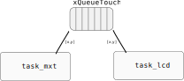

# RTOS - LCD

Nesse lab iremos trabalhar com o uso de um sistema operacional de tempo real (RTOS) para gerenciar o LCD max Touch, o forte desse lab será a linguagem C e como estruturar um firmware.

!!! note "Preencher ao finalizar o lab"
    <iframe src="https://docs.google.com/forms/d/e/1FAIpQLSfZNzzwcY__zmi7JeQV8hfEYT_Y1WaYgVp9tHCH0KUQW8aCdQ/viewform?embedded=true" width="640" height="320" frameborder="0" marginheight="0" marginwidth="0">Carregando…</iframe>


## LAB

| LAB                            |
|-----------------|
| `Labs/RTOS-LCD-maxTouch-Switch` |

1. Executar demo do LCD com RTOS
1. Trabalha com dados de touch e LCD

### Início 

!!! info "LCD max Touch"
    Plugue o LCD max Touch no EXT2.

!!! warning "Código exemplo"
    - Copie o código exemplo `SAME70-examples/Screens/RTOS-LCD-maxTouch-Switch-Toggle/` para a pasta da entrega do seu repositório `Labs/RTOS-LCD-maxTouch-Switch`
        - Vamos modificar esse código exemplo.

!!! note "Terminal"
    Esse exemplo faz uso da comunicação UART para debug de código (via printf), para acessar o terminal no atmel estúdio clique em:

    :arrow_right: View :arrow_right: Terminal Window
    
    Configure o terminal para a porta que (COM) correta (verificar no windiows) e para operar com um BaudRate de 115200.

## Entendendo o exemplo

Vamos entender o exemplo e como ele funciona! Nesse projeto temos duas tasks:

- `task_mxt`: Gerencia o touch do LCD
- `task_lcd`: Gerencia a escrita de informação no LCD

Essas tarefas se comunicam por uma fila chamada: `xQueueTouch`, onde a task `mxt` envia dados relativos ao touch (`x`, `y`) e a tarefa `lcd` coleta esses dados e processa o evento.

Os dados da fila são um struct do tipo:

```c
typedef struct {
  uint x;
  uint y;
} touchData;
```

O diagrama a seguir ilustra o firmware:



!!! example "Execute"
    1. Programe o uC com o firmware exemplo
    1. Analise o resultado
    1. Entenda o código
    
## Modificando

Vamos modificar esse código, ele não foi implementando de uma forma que suporta expansão.

### struct

Vamos organiza os botões em uma struct, para ficar mais fácil de criarmos novos botões, ou modificar os que já existem. Para isso, crie uma struct como a seguir:

```c
typedef struct {
    uint32_t width;     // largura (px)
    uint32_t height;    // altura  (px)
    uint32_t colorOn;   // cor do botão acionado
    uint32_t colorOff;  // cor do botão desligado
    uint32_t x;         // posicao x 
    uint32_t y;         // posicao y
  } t_but;
```

!!! note
    Estamos assumindo que o botão é um retângulo.

Na `task_lcd` vamos criar o primeiro botão (`but0`):

```c
t_but but0= {.width = 120, .height = 75, 
                .colorOn = COLOR_TOMATO, .colorOff = COLOR_BLACK, 
                .x = ILI9488_LCD_WIDTH/2, .y = 40 };
```

!!! note
    Esses dados foram copiados da configuração dos botões já existentes no código.

### draw_button_new

E agora vamos criar uma função que recebe o tipo `t_but` e desenha o botão na tela:

```c
void draw_button_new(t_but but, int status){
    uint32_t color;
    if(status) 
      color = but.colorOn;
    else
      color = but.colorOff;
      
    ili9488_set_foreground_color(COLOR_CONVERT(color));
    ili9488_draw_filled_rectangle(but.x-but.width/2, but.y-but.height/2,
                                  but.x+but.width/2, but.y+but.height/2);    
} 
```

Vamos editar a `task_lcd` para chamar essa função recém criada com o `but0`, ela deve ficar:

```c
void task_lcd(void){
  xQueueTouch = xQueueCreate( 10, sizeof( touchData ) );
  configure_lcd();
  draw_screen();
  font_draw_text(&digital52, "DEMO - BUT", 0, 0, 1);

  t_but but0 = {.width = 120, .height = 75,  
                .colorOn = COLOR_TOMATO, .colorOff = COLOR_BLACK, 
                .x = ILI9488_LCD_WIDTH/2, .y = 40 };
  uint8_t but0_status = 1;
  draw_button_new(but0, but0_status);
  
  // struct local para armazenar msg enviada pela task do mxt
  touchData touch;
    
  while (true) {
    if (xQueueReceive( xQueueTouch, &(touch), ( TickType_t )  500 / portTICK_PERIOD_MS)) {
      //update_screen(touch.x, touch.y);
      but0_status = ! but0_status;
      draw_button_new(but0, but0_status);
      printf("x:%d y:%d\n", touch.x, touch.y);
    }
  }
}
```

!!! example "Execute"
     1. Faça as alterações no código
         - crie a struct `t_but`
         - crie o `but0`
         - crie a função `draw_button_new`
         - modifique a tarefa `task_lcd`
          1. Compile e programe o código
          1. Verifique a funcionalidade do programa
         - toque na tela, o botão deve mudar!

#### melhorando a `draw_button_new`

Já que possuímos uma struct que guarda a informação do botão, porque não guardar nela o status (`but0_status`)? Vamos fazer, modificar a `t_but` inserindo um campo a mais `uint8_t status` e modificar a função que desenha o botão para não termos mais que passar o argumento `on`.

```
void draw_button_new(t_but but){}
```

!!! example "Execute"
     1. Faça as alterações no código
         - modifique `t_but`
         - modifique a função `draw_button_new()`
         - modifique a `task_lcd` para usar esse novo campo
     1. Programe e teste


### Novos botões

Vamos criar dois novos botões (`but1`, `but2`), com as seguintes propriedades:

- `but1`: 
    - colorOn: [Escolher uma](https://github.com/Insper/SAME70-examples/blob/0819e835bcc9b29c841c97f848002d01ea2bbe37/Demos/Fita%20de%20LED%20-%20WS2812%20-%20(SAMe70)/src/ASF/sam/components/display/ili9488/ili9488.h#L247)
    - posição y `140`

- `but2`:  
    - colorOn: [Escolher uma](https://github.com/Insper/SAME70-examples/blob/0819e835bcc9b29c841c97f848002d01ea2bbe37/Demos/Fita%20de%20LED%20-%20WS2812%20-%20(SAMe70)/src/ASF/sam/components/display/ili9488/ili9488.h#L247)
    - posição y `240`

> o que não foi definido, copiar do botão 0 (`but0`)

Agora exiba os novos botões, e faça com que eles mudem o status quando toque na região deles na tela!

!!! example "Execute"
     1. Faça as alterações no código
         - crie `but1` e `but2`
         - exiba os botões e faça eles mudarem o status
     1. Programe e teste
     
### Detectando botão

Vamos agora criar uma função que detecta qual botão foi pressionado, para isso, vamos criar um vetor de structs (cada index representa um botão) e passar para essa função o vetor e também o valor recebido pela fila do toque referente a `x` e `y`.

> na `task_lcd`

Para criar o vetor de structs:

```c
  t_but botoes[] = {but0, but1, but2};
```

??? tip
    Você tem no seu código algo como isso:
    
    ```
      draw_button_new(but0);
      draw_button_new(but1);
      draw_button_new(but2);
    ```
    
    Pode mudar para um for varrendo o nosso novo vetor `botoes`. O código vai ficar mais clean.


Com o vetor criado, vamos criar a função que processa o touch, ela será chamada de `processa_touch` e terá a seguinte implementação:

```
int process_touch(t_but botoes[], touchData touch, uint32_t n){

}
```

Essa função recebe o vetor de structs e também a posição na tela de onde ocorreu o toque (`touch.x`, `touch.y`). A função deve retornar (`int`) um valor (`0`, `1`, `2`, ...) que indica qual botão que foi pressionado **ou** -1, indicando que nenhum botão satisfez o toque. 

- `n` é o tamanho do vetor `botoes`.

!!! warning
    A função tem que ser genérica, suportando quantidade diferentes de botões e configurações diferentes de botões! 
    
    - Não pode isso:
    
    {width=400}


​    

??? tip
    Abra o terminal uart do atmel, lá você consegue ver os dados do touch:
    
    {width=400}

Com a função vamos agora alterar somente o status do botão que foi pressionado, para isso, vocês devem alterar o  `while(1)` da função `task_lcd`, para chamar a `process_touch`. Uma sugestão de  como implementar isso a seguir:

``` c
 if (xQueueReceive( xQueueTouch, &(touch), ( TickType_t )  500 / portTICK_PERIOD_MS)) {
      int b = process_touch(botoes, touch);
      if(b >= 0){
        botoes[b].status = !botoes[b].status;
        draw_button_new(botoes[b]);
      }

      printf("x:%d y:%d\n", touch.x, touch.y);
    }
```

!!! example "Execute"
     1. Crie o vetor de botões
     1. Declare a função `process_touch`
     1. Implemente a função `process_touch`
     1. Programe e teste
        - Só o botão que for tocado deve mudar de status

!!! tip
    Chegou até aqui? Não esqueça de [preencher o forms](https://docs.google.com/forms/d/e/1FAIpQLSfZNzzwcY__zmi7JeQV8hfEYT_Y1WaYgVp9tHCH0KUQW8aCdQ/viewform?embedded=true%22) com a entrega!
    
## Extras (C+)

- Adicione 2 novos botões!

## Extras (B)

Que tal que para cada botão associar uma função de `callback`, toda vez que o botão for encontrado, a função de `callback` pode ser executada!

- Modificar struct
- Criar uma função de `callback` por botão
- Modificar inicialização associando essa função
    - ponteiro de função
- Validar

!!! tip
   [Function Pointer in C](https://www.geeksforgeeks.org/function-pointer-in-c/)

## Extras (A)

No lugar dos botões terem cor podemos fazer com que eles tenham uma imagem associada! Que tal fazer isso?

!!! tip
    [SAME70-examples/Screens/RTOS-LCD-maxTouch-Images/](https://github.com/Insper/SAME70-examples/tree/master/Screens/RTOS-LCD-maxTouch-Images)


