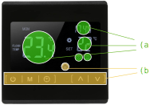
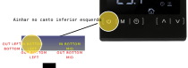
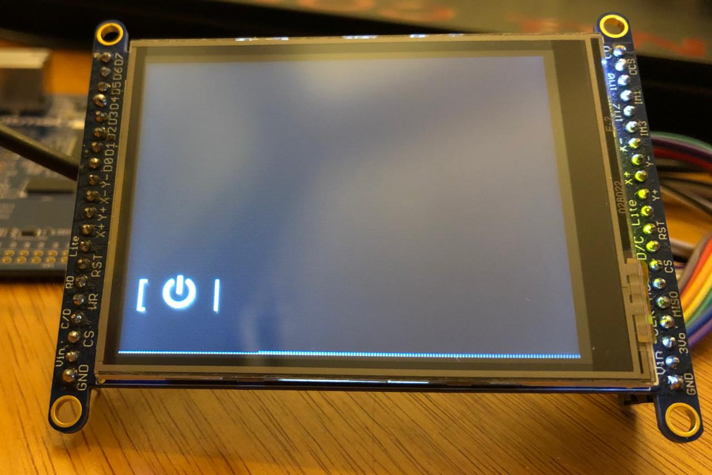
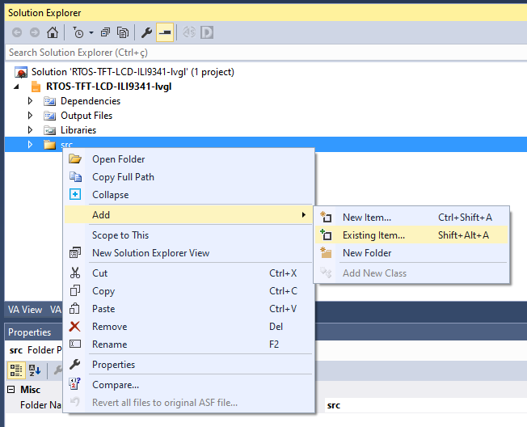
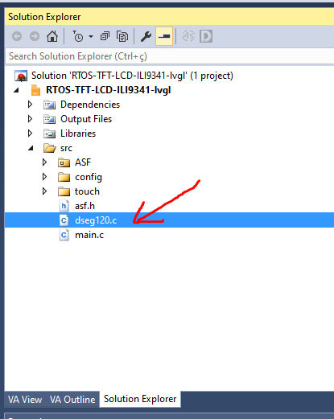
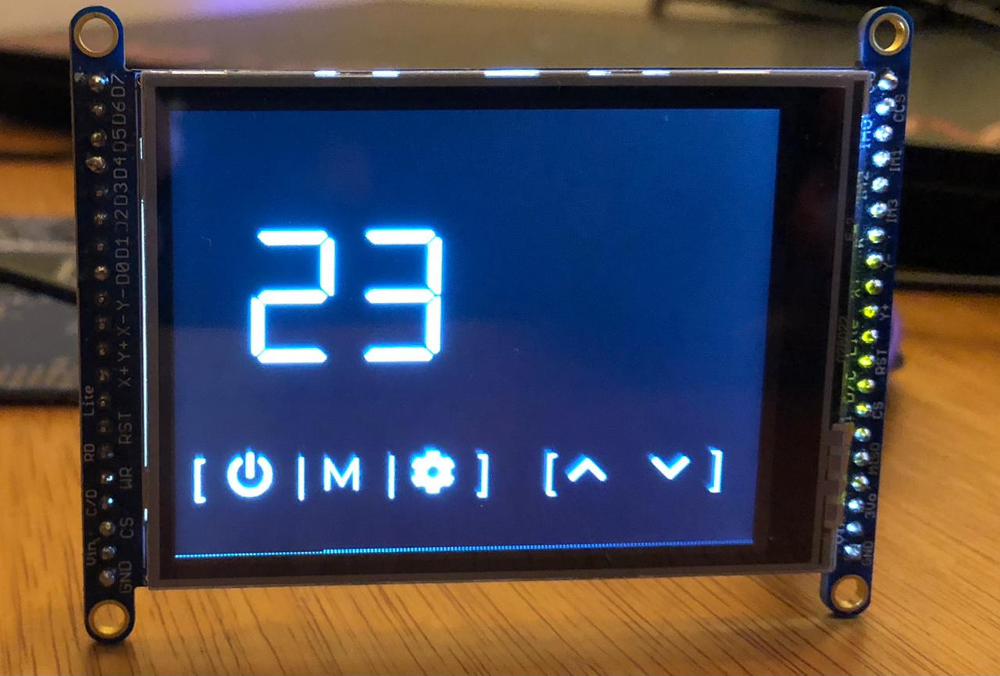

# Lab

Agora vamos começar mexer com o LVGL e criar nossa interface. A ideia é recriar uma interface de um termostato inspirado no produto a seguir:

!!! info ""
     KKmoon LCD Touch Screen Termostato Sistema de Aquecimento de Piso Elétrico Aquecimento de Água Termorregulador AC85-240 V Controlador de Temperatura Preto 
    
     - https://www.amazon.com.br/KKmoon-Aquecimento-Termorregulador-Controlador-Temperatura/dp/B07X3CDM83

{width=500}

## Etapas

Quando começamos projetar uma [interface homem máquina (IHM)](https://en.wikipedia.org/wiki/Human%E2%80%93computer_interaction) é necessário analisarmos várias frentes:

- Usabilidade
- Acessibilidade
- Branding
- Implementação

A usabilidade irá indicar como as funções do produto estarão disponíveis e serão exibidas aos usuários, isso deve estar atrelada aos conceitos da marca do produto. O público alvo deve ser analisado e o produto deve ser acessível, para isso, muitos testes de usabilidade devem ser feitos para validar o conceito.

Muitas vezes o protótipo da interface esbarra em problemas técnicos e de implementação, muitas imagens e fontes impactam no tamanho total do firmware que pode impossibilitar a implementação da interface proposta, ou necessitar a adição de formas alternativas de armazenamento de dados. Microcontroladores de forma geral não possuem GPU (alguns sim, exemplo: [STM32MP157](https://www.st.com/en/microcontrollers-microprocessors/stm32mp157.html) ) e isso impacta na performance da interface e muito provavelmente no gasto energético.

## Implementando

!!! tip
    Vamos usar muito a documentação do lvgl é importante que você tenha o site aberto e a consulte sempre:
    
    - https://docs.lvgl.io/latest/en/html/overview/index.html

O LVGL possui vasta documentação e muitos bons exemplos (testamos vários e todos funcionaram no embarcado), neste laboratório iremos usar alguns widgets do LVGL e aos poucos vamos customizando eles.

### Preparando firmware

Vamos criar uma nova função chamada de `void lv_termostato(void){ }` onde iremos fazer a implementação da interface do termostato. Além de criarmos esta função, teremos que modificar a `task_lcd` para chamar a nova função.

!!! example "Tarefa"
    Modifique o fimrware original incluindo a função e modificando a `task_lcd`:
    
    ```diff
    
    +void lv_termostato(void) {
    +
    +}


​    
​    static void task_lcd(void *pvParameters) {
​    
    -  lv_ex_btn_1();
    +  lv_termostato();
    
      ....
      ....
    }
    ```

#### Background

Notem que a interface a ser recriada possui fundo preto, isso é ajustado no LVGL pela função `lv_obj_set_style_local_bg_color`, para um fundo preto basta passarmos `LV_COLOR_BLACK` no ũltimo argumento da função, como indicado a seguir:

!!! example "Tarefa"
    1. Modifique a função `lv_termostato` para definirmos o fundo como preto
    1. Teste no uC
    
    ```c
    void lv_termostato(void) {
        lv_obj_set_style_local_bg_color(lv_scr_act(), LV_OBJ_PART_MAIN, LV_STATE_DEFAULT, LV_COLOR_BLACK);
    }
    ```

#### Tamanho fonte

Para recriar a interface iremos usar um tamanho de fonte um pouco maior que o padrão (14) do LVGL, para isso teremos que modificar o arquivo de configuração: `src/config/lv_conf.h`
    
As fontes padrões são definidas nas linhas:

```c
#define LV_THEME_DEFAULT_FONT_SMALL         &lv_font_montserrat_14
#define LV_THEME_DEFAULT_FONT_NORMAL        &lv_font_montserrat_14
#define LV_THEME_DEFAULT_FONT_SUBTITLE      &lv_font_montserrat_14
#define LV_THEME_DEFAULT_FONT_TITLE         &lv_font_montserrat_14
```

O LVGL não inclui todas as fontes por padrão, a lista das fontes que irão ser compiladas está neste mesmo arquivo:

```c
/* Montserrat fonts with bpp = 4
 * https://fonts.google.com/specimen/Montserrat  */
#define LV_FONT_MONTSERRAT_8     0
#define LV_FONT_MONTSERRAT_10    0
#define LV_FONT_MONTSERRAT_12    0
#define LV_FONT_MONTSERRAT_14    1
```

!!! example "Tarefa"
    Modifique o arquivo `lv_conf.h` para:
    
    1. Incluir a a fonte tamanho 24
    1. Tornar a fonte tamanho 24 padrão em tudo
    
    ```c
    #define LV_FONT_MONTSERRAT_12    0
    #define LV_FONT_MONTSERRAT_14    0
    ...
    #define LV_FONT_MONTSERRAT_24    1
    ...
    ...
    #define LV_THEME_DEFAULT_FONT_SMALL         &lv_font_montserrat_24
    #define LV_THEME_DEFAULT_FONT_NORMAL        &lv_font_montserrat_24
    #define LV_THEME_DEFAULT_FONT_SUBTITLE      &lv_font_montserrat_24
    #define LV_THEME_DEFAULT_FONT_TITLE         &lv_font_montserrat_24
    ```

## Identificando widgets

A primeira etapa após ter a interface definida é identificar quais widgets podem ser utilizados para montar a interface. 

!!! question short
    Identifique quais widgets você usaria para reconstruir a imagem a seguir:
    
    {width=400}
    
    !!! details ""
        O correto é:
        
        - (a): lv_label
        - (b): lv_button

!!! progress
    Click para continuar....
    
## Botões

!!! info ""
    https://docs.lvgl.io/latest/en/html/widgets/btn.html

O `lv_button` permite que criemos um ou mais botões, os botões podem ou não ter label, podemos associar para cada botão uma função de handler que será chamada assim que um evento neste botão for detectado, os eventos disponíveis são:

- `LV_BTN_STATE_RELEASED`
- `LV_BTN_STATE_PRESSED`
- `LV_BTN_STATE_CHECKED_RELEASED`
- `LV_BTN_STATE_CHECKED_PRESSED`
- `LV_BTN_STATE_DISABLED`
- `LV_BTN_STATE_CHECKED_DISABLED`

O exemplo fornecido na função (`lv_ex_btn_1`) cria um botão chamado `btn1` e o alinha no centro da tela, a função `event_handler` foi associada como callback deste widget, assim que um evento ocorrer a mesma será executada.

``` c
lv_obj_t * btn1 = lv_btn_create(lv_scr_act(), NULL);
lv_obj_set_event_cb(btn1, event_handler);
lv_obj_align(btn1, NULL, LV_ALIGN_CENTER, 0, -40);
```

Depois cria um `label` e o associa ao botão:

``` c
lv_obj_t * label;
label = lv_label_create(btn1, NULL);
lv_label_set_text(label, "Button");
```

Conforme a [documentação do lvgl para objetos](https://docs.lvgl.io/latest/en/html/widgets/obj.html) Podemos alinhar um objeto em vários locais diferentes na tela. Isso é feito pela função `lv_obj_align(obj, obj_ref, LV_ALIGN_..., x_ofs, y_ofs)` que recebe como parâmetro:

- `obj` is the object to align.
-  `obj_ref` is a reference object. obj will be aligned to it. If `obj_ref = NULL`, then the parent of `obj` will be used.
-  The third argument is the type of alignment. These are the possible options: 

{width=500}

> Extraído da documentação.

!!! progress
    Click para continuar....

### Botão de power

Agora vamos criar os botões da interface proposta, primeiro iremos criar o botão de **power**, para isso iremos alinhar-lho no canto inferior esquerdo, conforme figura a seguir:

{width=500}

A implementação será realizada dento da função `lv_termostato` conforme indicado a seguir:

```c
void lv_termostato(void) {
    //-------------------
    // POWER
    //-------------------
    
    // cria botao de tamanho 60x60 redondo
    lv_obj_t * btnPower = lv_btn_create(lv_scr_act(), NULL);
    lv_obj_set_event_cb(btnPower, event_handler);
    lv_obj_set_width(btnPower, 60);  lv_obj_set_height(btnPower, 60);
    
    // alinha no canto esquerdo e desloca um pouco para cima e para direita
    lv_obj_align(btnPower, NULL, LV_ALIGN_IN_BOTTOM_LEFT, 10, -15);
    
    // altera a cor de fundo, borda do botão criado para PRETO
    lv_obj_set_style_local_bg_color(btnPower, LV_OBJ_PART_MAIN, LV_STATE_DEFAULT, LV_COLOR_BLACK );
    lv_obj_set_style_local_border_color(btnPower, LV_OBJ_PART_MAIN, LV_STATE_DEFAULT, LV_COLOR_BLACK );
    lv_obj_set_style_local_border_width(btnPower, LV_OBJ_PART_MAIN, LV_STATE_DEFAULT, 0);
```

!!! info
    O exemplo de botão fornecido modifica:
    
    - width e height do botão: `lv_obj_set_width` e `lv_obj_set_height`
    - cor de fundo: `lv_obj_set_style_local_bg_color`
    - cor da borda: `lv_obj_set_style_local_border_color`
    - largura da borda: `lv_obj_set_style_local_border_width`

Vamos agora criar um label para ele, no LVGL podemos utilizar alguns símbolos já pré definidos, os detalhes estão na [documentação de fonts](https://docs.lvgl.io/latest/en/html/overview/font.html), mas serão listados aqui:

{width=300}

Notem que podemos usar o símbolo `LV_SYMBOL_POWER` para recriar o botão da interface planejada:

```c
    labelPower = lv_label_create(btnPower, NULL);
    lv_label_set_recolor(labelPower, true);
    lv_label_set_text(labelPower, "#ffffff [  " LV_SYMBOL_POWER "  |#");
```

Vocês devem definir o label como variável glogal, permitindo assim que outra parte do código altera o valor escrito:

```c
// global
static  lv_obj_t * labelPower;
```

!!! info
    Com o [`recolor`](https://docs.lvgl.io/latest/en/html/widgets/label.html#text-recolor) ativado podemos definir a cor `#ffffff` (branco) do texto que será exibido no label.

!!! example "Tarefa: Botão power"
    Conforme descrito anteriormente, você deve executar os seguintes passos:
    
    1. Inicialize o btnPower
    1. Inicialize o label e o configure
    1. Crie a variável global: `labelPower`
    1. Teste na placa
    
    Resultado esperado:
    
    {width=300}
    
    ??? tip "Código completo do lv_termostato()"
        ```c
        void lv_termostato(void) {
            lv_obj_set_style_local_bg_color(lv_scr_act(), LV_OBJ_PART_MAIN, LV_STATE_DEFAULT, LV_COLOR_BLACK);
    
            // POWER
            lv_obj_t * btnPower = lv_btn_create(lv_scr_act(), NULL);
            lv_obj_set_event_cb(btnPower, event_handler);
            lv_obj_set_width(btnPower, 60);  lv_obj_set_height(btnPower, 60);
            lv_obj_align(btnPower, NULL, LV_ALIGN_IN_BOTTOM_LEFT, 10, -15);
    
            lv_obj_set_style_local_bg_color(btnPower, LV_OBJ_PART_MAIN, LV_STATE_DEFAULT, LV_COLOR_BLACK );
            lv_obj_set_style_local_border_color(btnPower, LV_OBJ_PART_MAIN, LV_STATE_DEFAULT, LV_COLOR_BLACK );
            lv_obj_set_style_local_border_width(btnPower, LV_OBJ_PART_MAIN, LV_STATE_DEFAULT, 0);
    
            labelPower = lv_label_create(btnPower, NULL);
            lv_label_set_recolor(labelPower, true);
            lv_label_set_text(labelPower, "#ffffff [  " LV_SYMBOL_POWER "  |#");
        ```

!!! progress
    Click para continuar....

### Demais botões

!!! example "Tarefa: Demais botões"
    Agora você é capaz de recriar os demais botões da interface, para cada botão criei uma função de callback (similar ao `event_handler`). 
    
    Implemente:
    
    - `M` (`btnMenu`/ `menu_handler`): Menu 
    - `Clock` (`btnClk`/ `clk_handler`): Relógio 
    - `^` (`btnUp`/ `up_handler`): Aumentar (temperatura/ alarme): 
    - `v` (`btnDown`/ `down_handler`): Baixar (temperatura/ alarme)
      
    ==Lembre de testar na placa! Vai precisar de ajustes.==
    
    !!! tip 
        
        Handlers:
        
        - ==Crie um handler diferente por botão.==
    
        Alinhamento:
        
        - Pense em como usar o alinhamento a seu favor.
    
        Símbolos:
        
        - Relógio: Você pode usar um outro símbolo no lugar.
        - v, ^: Tem símbolos prontos para isso
        
    Resultado esperado:
    
    ==(o seu pode ficar diferente, mas lembre que a ideia é recriar o display e não criar um novo!)==
    
    {width=300}

!!! progress
    Click para continuar....

## Labels

Vamos agora implementar os labels, mas antes será preciso escolhermos a fonte que iremos usar na interface, o lvgl possui algumas fontes disponíveis por padrão, mas nem sempre atendem a necessidade da interface. As fontes padrões do LVGL estão no link a seguir:

- https://docs.lvgl.io/latest/en/html/overview/font.html

!!! info
    Para usar as fontes padrões do LVGL é necessário editar o arquivo: `config/lv_conf.h`

Para a interface proposta sugiro usarmos a fonte DSEG (open source) e que lembra um display de sete segmentos:

https://github.com/keshikan/DSEG

{width=500}

!!! example "Tarefa"
    1. Baixe a fonte para o seu computador
       - https://github.com/keshikan/DSEG/releases/download/v0.46/fonts-DSEG_v046.zip
    1. Extrai a pasta

!!! progress
    Click para continuar....

### Floor Temp

Vamos agora implementar o label da temperatura atual do chão, e iremos seguir os passos a seguir:

1. Converter fonte
1. Adicionar no lvgl/ Microchip studio
1. Criando label e usando fonte

#### 1. Convertendo

Com a fonte escolhida precisamos agora converter para o formato que o LVGL consegue interpretar (bitmap), para isso usaremos a ferramenta online do LVGL. Acesse o site:

- https://lvgl.io/tools/fontconverter

Vamos criar uma fonte de **tamanho 70** -> **DSEG7-Modern/DSEG7Modern-Regular.ttf**, esse arquivo será usada no site e foi extraído na etapa anterior. Configure a interface como no exemplo a seguir:

- Name: `dseg70`
- Size: `70`
- Bpp: `1 bit-per-pixel`
- TTF: `DSEG7-Modern/DSEG7Modern-Regular.ttf`
- Symbols: `-./0123456789 :` (o espaço  é necessário pq ele é um caráter)

!!! info "Symbols"
    A fonte gerada terá somente esses símbolos, se você quiser usar por exemplo a letra C não vai poder. Gerar somente os símbolos que vai usar é importante porque o uC possui pouca memória e não seria possível ter várias fontes diferentes com todos os símbolos.

O site irá gerar um arquivo `dseg70.c` salve o mesmo dentro da pasta `src/` do projeto (a mesma que contém o arquivo main.c) que estamos trabalhando.

!!! progress
    Click para continuar....

#### 2. Adicionando no Microchip Studio

Agora é necessário adicionar o arquivo ao MS:

1. Clique com o botão direito em src e clique em Add > Existing Item...
1. Encontre o arquivo dseg120.c que foi baixado e clique em Add
1. Verifique se o arquivo dseg120.c foi adicionado

{width=400}

{width=400}

{width=300}
    
!!! info
    O exemplo foi feito para a fonte de tamanho 120, mas depois resolvemos trocar por uma menor, note que onde na imagem tem dseg120 você deve colocar a dseg70.
    
!!! progress
    Click para continuar....
    

#### 3. Criando label e usando fonte

Agora podemos utilizar a nova fonte no nosso projeto, ainda dentro da `lv_termostato` vamos criar um novo label que irá exibir o valor da temperatura atual. Fazemos isso similar ao botão, porém agora iremos associar o label a tela e não ao botão e também iremos customizar a fonte para usarmos o `dseg70`.

Crei a variável global que irá apontar para o label:

```c
lv_obj_t * labelFloor;
```

E então modifique a função termostato:

```c
  void lv_termostato(void){
    // ....
    // ....
    
    labelFloor = lv_label_create(lv_scr_act(), NULL);
    lv_obj_align(labelFloor, NULL, LV_ALIGN_IN_LEFT_MID, 35 , -45);
    lv_obj_set_style_local_text_font(labelFloor, LV_OBJ_PART_MAIN, LV_STATE_DEFAULT, &dseg70);
    lv_obj_set_style_local_text_color(labelFloor, LV_OBJ_PART_MAIN, LV_STATE_DEFAULT, LV_COLOR_WHITE);
    lv_label_set_text_fmt(labelFloor, "%02d", 23);
   }
```

Para usarmos a fonte devemos indicar ao LVGL que a fonte existe, para isso adicione a linha a seguir no topo (após os #include) do arquivo `main.c`:

```c
LV_FONT_DECLARE(dseg70);
```

Antes de continuar temos que editar o começo arquivo da fonte `dseg70`, incluindo o define a seguir:

```diff
+#define LV_LVGL_H_INCLUDE_SIMPLE
#ifdef LV_LVGL_H_INCLUDE_SIMPLE
#include "lvgl.h"
#else
#include "lvgl/lvgl.h"
#endif
```

!!! example "Tarefa"
    1. Crie o novo label como indicado anteriormente
    1. Edite o arquivo `dseg70.h`
    1. Teste na placa

    Resultado esperado:
    
    {width=300}

!!! progress
    Click para continuar....

#### Demais labels

Agora vocês precisam criar os outros dois labels: Relógio e Temperatura configurada, para isso será necessário gerar outras duas fontes de tamanhos diferentes e criar os labels.

!!! example "Tarefa"
    1. Crie o label temperatura referência: `labelSetValue`
    1. Crie o label para o relógio: `labelClock`
    
    ==Para cada label você terá que converter uma nova fonte de tamanho diferente, consulte os passos anteriores.==
    
    Resultado esperado:
    
    {width=300}

!!! progress
    Click para continuar....

## Handlers

Até agora estávamos apenas criando a interface no LCD, agora precisamos adicionar inteligência a ela. Isso será feito pelos callbacks dos botões. Vamos focar apenas nos botões UP e DOWN que configuram a temperatura de referência (da direita).

Vamos implementar o código para o `up_handler`, callback do botão de aumento de temperatura.

!!! info 
    Eu dei o nome de `up_handler` você pode ter dado outro nome, precisa ficar atento a isso.
    
### up_handler

Existem várias maneiras de fazermos com que o handler altera o valor do label, eu sugiro o código a seguir:

```c
static void up_handler(lv_obj_t * obj, lv_event_t event) {
  
  char * c;
  int temp;
  if(event == LV_EVENT_CLICKED) {
      c = lv_label_get_text(labelSetValue);
      temp = atoi(c);
      lv_label_set_text_fmt(labelSetValue, "%02d", temp + 1);
  }
}
```

!!! info
    A vantagem da implementação sugerida é que não precisamos de uma variável global para armazenar o valor da temperatura, nós recuperamos o valor lendo o que estava salvo no label e convertendo para inteiro.
    
    
!!! example "Tarefa"
    1. Implemente o handler
    1. Teste na placa
       - Aperte o botão de up e verifique se a referência muda.
    
    !!! warning
        A fonte utilizada tem um problema, o caracter vázio (espaço: ` `) não apaga 100% o último valor, por exemplo: Quando o digito muda de 2 para 1 acontece de ficar uma barra em baixo.
        
        Depois vemos como resolver isso! Eu ainda não sei =/

!!! progress
    Click para continuar....

### down_handler

Agora implemente a ação do botão down.

!!! example "Tarefa"
    1. Implemente o `down_handler`
    1. Teste na placa

### relógio 

Temos um relógio na interface, vamos fazer ele funcionar? Para isso terão que incluir o RTC no projeto e fazer uso dele.

!!! example "Tarefa"
    Inclua o RTC no projeto e faça o relógio funcionar!
    
    O relǵio deve exibir HH:MM, o **:** deve piscar uma vez por segundo.
    
    Dicas:
    
    1. Incluir RTC
    1. Criar task dedicada para atualizar o RTC
    1. Inicializar RTC na task
    1. Task fica esperando semáforo do tick de segundos e atualiza o label do relógio.

!!! progress
    ==Até aqui é C!==

## Extras

Temos muito o que fazer na interface, vou sugerir algumas coisas que irão dar nota a mais para vocês neste lab, ==cada item é meio conceito a mais.==

- [ ] Implementar o digito da Temperatura: 23 **.4**
     - Dica: use uma das fontes menores para isso
- [ ] O botão de `settings` deve possibilitar o usuário configurar a hora certa (usando as setas v e ^).
- [ ] Incluir demais labels e logos
- [ ] Gerar um logo para o relógio e usar no lugar do de `settings`
- [ ] Implementar o botão de `Power` que desliga a tela
- [ ] Colocar um potenciômetro que altera o valor da temperatura atual.

!!! note "Preencher ao finalizar o lab"
   <iframe src="https://docs.google.com/forms/d/e/1FAIpQLSf52OFKZi-QRgQ7CRX97pEWQlZhsgcvPO--jlU7vI6BagmL5g/viewform?embedded=true" width="640" height="320" frameborder="0" marginheight="0" marginwidth="0">Carregando…</iframe> 

