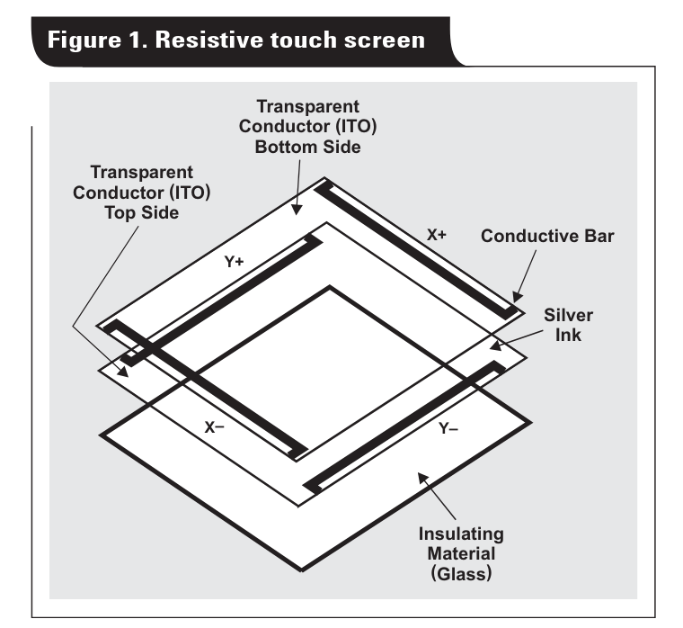
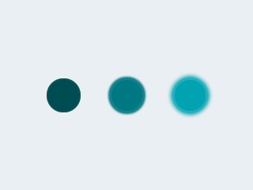
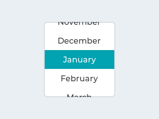

# Começando

Nesse lab iremos trabalhar com o uso de um sistema operacional de tempo real (RTOS) para gerenciar o LCD max Touch.

!!! warning
    ==Atualizem o repositório SAME70-Examples antes de continuar==

| LAB                  |
| -------------------- |
| `Lab7-RTOS-LCD-LVGL` |

Neste laboratório iremos:

1. Conectar o LCD no kit de desenvolvimento
1. Executar e modificar o exemplo do lvgl

### Início 

Antes de começarmos será necessário realizarmos a conexão do LCD no kit e então validarmos a conexão do LCD e depois do touch.

!!! exercise "Conectando LCD"
    Primeiro faça as ligações como indicado no README a seguir:
    
    1. Plugue o LCD max Touch no ==EXT2== seguindo as instruções em: [SAME70-examples/Screens/2.8-TFT-LCD-ILI9341-Hardware](https://github.com/Insper/SAME70-examples/tree/master/Screens/2.8-TFT-LCD-ILI9341-Hardware)
    
    Depois valide: 
 
    1. Copie o código exemplo `SAME70-examples/Screens/RTOS-LCD-maxTouch-Switch-Toggle/` para a pasta da entrega do seu repositório: `Lab7-RTOS-LCD-LVGL`
    1. Execute o código, você deve visualizar dois botões e eles devem ser interativos.

!!! note "Terminal"
    O segundo exemplo faz uso da comunicação UART para debug de código (via printf), para acessar o terminal no atmel estúdio clique em:

    :arrow_right: View :arrow_right: Terminal Window
    
    Configure o terminal para a porta que (COM) correta (verificar no windiows) e para operar com um BaudRate de 115200.

!!! progress
    Execute os exemplos antes de continuar!

## LCD

O LCD que iremos usar nas próximas atividades da disciplina é fabricado pela adafruit com o nome de: [`2.8" TFT LCD with Touchscreen Breakout Board w/MicroSD Socket - ILI9341`](https://www.adafruit.com/product/1770) ele possui um LCD de `240x320` pixels operando em RGB e com uma sensor touch resistivo. O LCD é controlado por um controlador chamado de [**ILI9341**](https://cdn-shop.adafruit.com/datasheets/ILI9341.pdf) ele é responsável por atualizar e exibir as informações na tela. 

{width=500}

### ILI9341

O LCD utiliza o circuito integrado [ILI9341](https://cdn-shop.adafruit.com/datasheets/ILI9341.pdf) como controlador do display, este CI é responsável por toda parte de baixo nível de acesso ao LCD, este chip possui duas formas de interface com o uC: Paralelo e SPI. Iremos utilizar ele operando via SPI como ilustrado a seguir:

```
  x---------x           x---------x
  |         |           |         |
  | uc      |           | LCD     |
  |   ------|    spi    |-------  |
  |   | spi | <---/---> | ili  |  |
  x---------x           x---------x
```

!!! note
    Para realizar a interface com o LCD portei o código de referência da ATMEL   
    [ILI9341 Display Controller Component Driver](https://asf.microchip.com/docs/latest/xmegaa/html/group__ili9341__group.html) para o SAME70.

!!! info "ILI9341"
    **a-Si TFT LCD Single Chip Driver 240RGBx320 Resolution and 262K color**

    LI9341 is a 262,144-color single-chip SOC driver for a-TFT liquid crystal display with resolution of 240RGBx320 dots,  comprising  a  720-channel  source  driver,  a  320-channel  gate  driver,  172,800 bytes  GRAM  for  graphic display data of 240RGBx320 dots, and power supply circuit.
    
    ILI9341  supports  parallel  8-/9-/16-/18-bit  data  bus  MCU  interface,  6-/16-/18-bit  data  bus  RGB  interface  and 3-/4-line serial peripheral interface (SPI). The moving picture area can be specified in internal GRAM by window address  function.  The  specified  window  area  can  be updated  selectively,  so  that  moving  picture  can  be displayed simultaneously independent of still picture area. 
    
    ILI9341  can  operate  with  1.65V  ~  3.3V  I/O  interface  voltage  and  an  incorporated  voltage  follower  circuit  to generate voltage levels for driving an LCD. ILI9341 supports full color, 8-color display mode and sleep mode for precise power control by software and these features make the ILI9341 an ideal LCD driver for medium or small size portable products such as digital cellular phones, smart phone, MP3 and PMP where long battery life is a major concern.  
    
    > Extraído do manual.

### Touch

O LCD possui um "película" de [touchscreen resistivo](https://en.wikipedia.org/wiki/Resistive_touchscreen) que possibilita detectarmos toques na tela.

{width=300} 
{width=300}

A película fornece dois valores de resistência: X e Y e via duas leituras analógicas conseguimos estimar onde aconteceu o toque na tela, e inclusive a pressão do toque.

> Fonte das figuras: https://www.ti.com/lit/an/slyt209a/slyt209a.pdf

A Conexão do touch resistivo com o uC acontece da seguinte maneira:

```
  x---------x          x----------- x
  |     dx  | -------> |  t  | LCD |
  | uc  dy  | -------> |  o  |     |
  |    AFEC | <------- |  u  |     |
  |    AFEC | <------- |  c  |     |
  x---------x          x-----------x
```

!!! note
    Para realizar a leitura do touch resistivo portei o código da [adafruit TouchScreen](https://github.com/adafruit/Adafruit_TouchScreen) para o SAME70.

!!! tip
    Telas resistivas não são tão boas quanto as capacitivas que apenas com o toque na tela o contato já é detectado, nas resistivas é necessário um pouco mais de pressão.

## LVGL

Uma coisa é conseguir acessar o LCD e transmitir pixels outra é ter uma biblioteca capaz de desenhar coisas no LCD (botões, imagens, textos, gráficos, ...). Existem várias bibliotecas gráficas para sistemas embarcados, o site a seguir possui uma lista e um comparativo entre elas: 

- https://itnext.io/top-five-libraries-for-creating-gui-on-embedded-linux-5ce03903be32

Nós iremos usar o [LVGL -  LVGL - Light and Versatile Graphics Library](https://lvgl.io/), uma biblioteca livre liberada na licença MIT feita para sistemas embarcados, 100% em C, bastante customizável de boa documentação e com suporte a vários tipos de displays e interface com usuário (touch screen, mouse, ...).

Com esse software seremos capazes de desenvolver interfaces similares ao exemplo a seguir:

{width=500}

### Base

Iremos trabalhar com o código base: [RTOS-TFT-LCD-ILI9341-LVGL](https://github.com/Insper/SAME70-examples/tree/master/Screens/RTOS-TFT-LCD-ILI9341-LVGL) que já possui configurado:

- FreeRTOS v8
- Driver ili9341
- Driver Touch resistivo
- lvgl

!!! progress
    Antes de começarmos a mexer com o LVGL vamos entender um pouco o código de exemplo e como o lvgl trabalha.

### Porting lvgl

O [site do LVGL](https://docs.lvgl.io/latest/en/html/porting/index.html) descreve o passo a passo de como incorporar a biblioteca em um novo projeto/ microcontrolador, além de criar um arquivo de configuração `lv_conf.h` com as propriedades do LCD e com configurações de como a biblioteca irá trabalhar, temos que implementar duas funções:

- `my_flush_cb`  : Função chamada pelo lvgl sempre que necessita atualizar a tela
    - Depende do driver ili9341
- `my_input_read`: Função chamada pelo lvgl sempre que quer ler uma informação de touch
    - Depende do driver do touch resistivo

=== "my_flush_cp"
    Note que o LVGL apenas atualiza no LCD a região que sofreu alteração.
    ```c
    void my_flush_cb(lv_disp_drv_t * disp_drv, const lv_area_t * area, lv_color_t * color_p) {
        ili9341_set_top_left_limit(area->x1, area->y1);   ili9341_set_bottom_right_limit(area->x2, area->y2);
        ili9341_copy_pixels_to_screen(color_p,  (area->x2 - area->x1) * (area->y2 - area->y1));
    
        /* IMPORTANT!!!
        * Inform the graphics library that you are ready with the flushing*/
        lv_disp_flush_ready(disp_drv);
    }
    ```
    
=== "my_input_read"
​    Esta função retorna no `*data` se um toque foi encontrado e o valor X Y lido.
    ```c
    bool my_input_read(lv_indev_drv_t * drv, lv_indev_data_t*data) {
        int px, py, pressed;

        if (readPoint(&px, &py)) {
            data->state = LV_INDEV_STATE_PR;
        }
        else {
            data->state = LV_INDEV_STATE_REL;
        }
    
        data->point.x = px;
        data->point.y = py;
        return false; /*No buffering now so no more data read*/
    }
    ```

E isso é tudo o que deve ser feito para incorporar o lvgl em um novo projeto.

!!! info 
    Eu devo ter demorado umas 10h de trabalho para sair de um projeto zerado e conseguir fazer o exemplo que vocês irão utilizar hoje. Foram necessárias várias etapas: 
    
    1. Escolher LCD
    1. Entender conexão de hardware
    1. Implementar driver ili9341
    1. Implementar driver touch
    1. Entender LVGL e como porta
    1. Executar LVGL 

### framebuffer

O LVGL opera com no mínimo um framebuffer, [framebuffer](https://en.wikipedia.org/wiki/Framebuffer) é uma região contínua de memória usada para armazenar a imagem que será exibida na tela, essa tecnologia é usado em vários lugares, inclusive no [linux](https://en.wikipedia.org/wiki/Linux_framebuffer). Em alguns casos é necessário dois framebuffers operando no modo [ping pong buffer](https://embedded.fm/blog/2017/3/21/ping-pong-buffers)

No LVGL devemos declarar esse frame buffer como global ou estático:

```c
/*Static or global buffer(s). The second buffer is optional*/
static lv_color_t buf_1[LV_HOR_RES_MAX * LV_VER_RES_MAX];
```

O LVGL irá então manter uma cópia do que será exibido no LCD nesta região continua de memória e de tempos em tempos atualizar o LCD chamando a função `my_flush_cb`.

### Função main

Agora com tudo configurado devemos realizar as seguintes inicializações antes de podemos usar o lvgl controlando o display:

!!! info
    Tudo isso já está no código exemplo, você não precisa modificar nada.

=== "passos"
    1. Board e Sysclock
    1. LCD e driver ili9341
    1. Touch
    1. lvgl buffer e display
    1. lvgl input
    
=== "Código"
    ```c
    /* board and sys init */
    board_init();
    sysclk_init();
    configure_console();

    /* LCd int */
    configure_lcd();
    ili9341_init();
    configure_touch();
    ili9341_backlight_on();
    
    /*LittlevGL init*/
    lv_init();
    lv_disp_drv_t disp_drv;                 /*A variable to hold the drivers. Can be local variable*/
    lv_disp_drv_init(&disp_drv);            /*Basic initialization*/
    lv_disp_buf_init(&disp_buf, buf_1, NULL, LV_HOR_RES_MAX * LV_VER_RES_MAX);  /*Initialize `disp_buf` with the buffer(s) */
    disp_drv.buffer = &disp_buf;            /*Set an initialized buffer*/
    disp_drv.flush_cb = my_flush_cb;        /*Set a flush callback to draw to the display*/
    lv_disp_t * disp;
    disp = lv_disp_drv_register(&disp_drv); /*Register the driver and save the created display objects*/
    
    /* Init input on LVGL */
    lv_indev_drv_t indev_drv;
    lv_indev_drv_init(&indev_drv);      /*Basic initialization*/
    indev_drv.type = LV_INDEV_TYPE_POINTER;
    indev_drv.read_cb = my_input_read;
    /*Register the driver in LVGL and save the created input device object*/
    lv_indev_t * my_indev = lv_indev_drv_register(&indev_drv);
    ```

### task_lcd

Com o lvlg configurado devemos chamar periodicamente a função que atualiza o lvgl (`lv_task_handler`), no exemplo criamos uma task dedicada a isso:

```c
static void task_lcd(void *pvParameters) {

  lv_ex_btn_1();

  for (;;)  {
    lv_tick_inc(50);
    lv_task_handler();
    vTaskDelay(50);
  }
}
```

### Criando tela

Note que na `task_lcd` chamamos a função `lv_ex_btn_1()` está função cria os widgets no LCD, os widgets estão listados na página: 

- https://docs.lvgl.io/master/widgets/index.html

Podemos listar alguns aqui como exemplo:

| Widget               | Example                            |
| -------------------- | ---------------------------------- |
| Button (`lv_btn`)    | {width=100} |
| LED (`lv_led`)       | {width=100}   |
| Roller (`lv_roller`) | {width=100} |
| Bar (`lv_bar`)       | {width=100}    |

O exemplo fornecido cria dois tipos de botões diferentes um do push button e outro do tipo toggle, notem que tudo é realizado pela API do lvgl. Podemos associar um handler (`event_handler`) ao botão, este handler sera chamado (pela `lv_task_handler`) sempre que acontecer um evento neste widget (botão aprtado, botão liberado, ...).

=== "lv_ex_btn_1"
    ```c
    void lv_ex_btn_1(void) {
        lv_obj_t * label;

        lv_obj_t * btn1 = lv_btn_create(lv_scr_act(), NULL);
        lv_obj_set_event_cb(btn1, event_handler);
        lv_obj_align(btn1, NULL, LV_ALIGN_CENTER, 0, -40);
    
        label = lv_label_create(btn1, NULL);
        lv_label_set_text(label, "Button");
    
        lv_obj_t * btn2 = lv_btn_create(lv_scr_act(), NULL);
        lv_obj_set_event_cb(btn2, event_handler);
        lv_obj_align(btn2, NULL, LV_ALIGN_CENTER, 0, 40);
        lv_btn_set_checkable(btn2, true);
        lv_btn_toggle(btn2);
        lv_btn_set_fit2(btn2, LV_FIT_NONE, LV_FIT_TIGHT);
    
        label = lv_label_create(btn2, NULL);
        lv_label_set_text(label, "Toggled");
    }
    ```

=== "event_handler(...)"
    ```c
    static void event_handler(lv_obj_t * obj, lv_event_t event) {
        if(event == LV_EVENT_CLICKED) {
            printf("Clicked\n");
        }
        else if(event == LV_EVENT_VALUE_CHANGED) {
            printf("Toggled\n");
        }
    }
    

    ```
