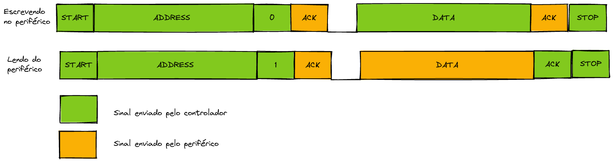
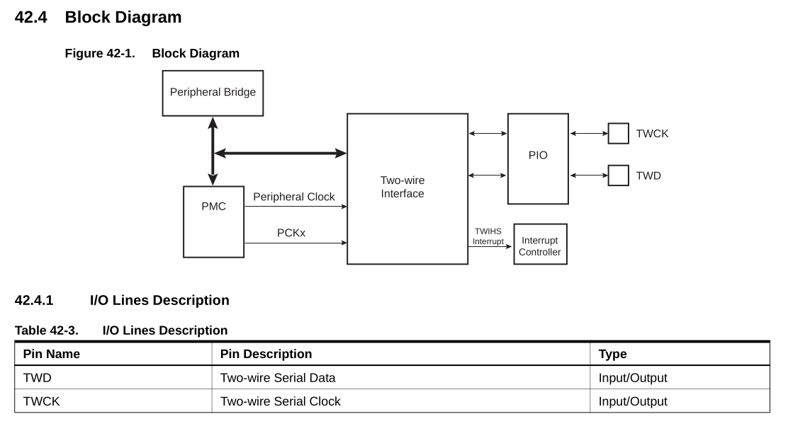
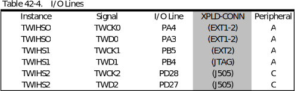
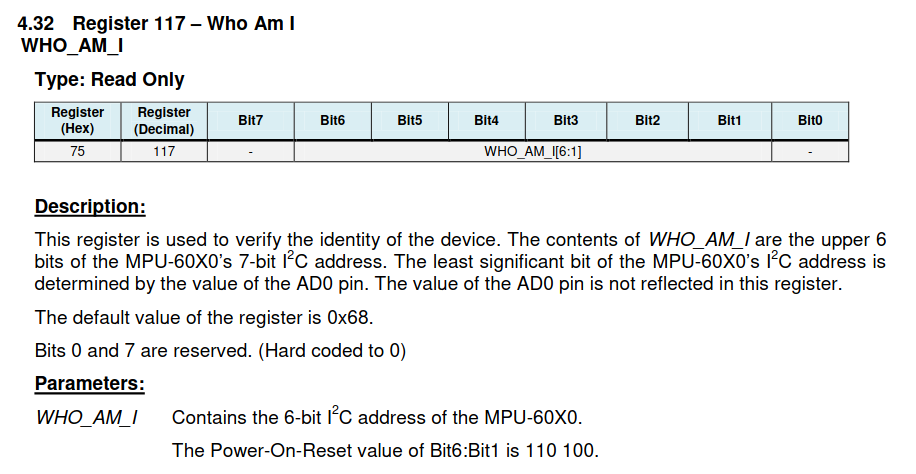

# LAB - RTOS - IMU

| Pasta           |
|-----------------|
| `Lab6-RTOS-IMU` |

Neste laboratório iremos realizar uma comunicação I2C com um sensor inercial, e aplicar um processamento de fusão de dados para obtermos a localização no espaço do sensor.

!!! info
    Usar como base o código do OLED com RTOS.

## Teoria


I2C (*eye-squared-C*) é um protocolo de comunicação do tipo Machine-to-machine muito utilizado para comunicação entre microcontrolador e um dispositivo (sensor ou atuador) externo, criado pela Philips Semiconductor em **1982** e liberado para uso sem licença em **2006**. O i2c é uma comunicação síncrona e utiliza duas vias: **serial data line** (SDA) e **serial clock line** (SCL), a comunicação é sempre inicializada pelo Controlador (o microcontrolador) e respondida pelo Target (componente).

A imagem a seguir é um exemplo de como utilizar o i2c para conectar múltiplos dispositivos em um controlador:


!!! tip
    Cuidado, usaremos o termo periférico não só para referenciar os componentes do microcontrolador, da placa, mas agora também novos componentes plugados no kit.
 
Existem no mercado vários sensores que possuem comunicação i2c, no lab temos vários:

- IMU
- Câmera
- temperatura
- pressão
- batimento cardíaco 
- Dê uma olhada nos sensores da adafruit i2c: https://www.adafruit.com/?q=i2c+sensor&sort=BestMatch

### Protocolo

!!! info
    Apenas uma breve apresentação, o I2C é um protocolo mais complicado do que aparenta ser:
    
    - https://learn.sparkfun.com/tutorials/i2c/all
    - https://www.i2c-bus.org/i2c-primer/common-problems/
 
A comunicacão i2c faz uso de dois sinais: clk e data, o clock é sempre gerado pelo controlador, diferente da UART (a de camada física, e a que usamos para o módulo bluetooth) o i2c usa um tipo de sinal chamado de **open drain**, que significa que o sinal na linha é sempre positivo (`vcc`) e os dispositivos quando querem enviar o valor zero, apenas aterram a linha, notem que para isso é necessário um **pull-up** na linha. 

{200}
 
!!! info
    A ideia do dreno aberto é permitir que mais de um dispositivo controle a linha, como o controle é apenas aterrando o sinal, não há risco de queimar o pino.

O protocolo do I2C é mais complexo que a da UART (o de camada física, e o usado para comunicação com o módulo bluetooth), no I2C cada dispositivo possui um endereço que deve ser enviado no começo da comunicação, a cada envio de dado pelo controlador, o dispositivo responde com um sinal de **ACK** (um bit no final do pacote). O controlador pode executar duas tarefas diferente:

- Requisitar um dado 
- Enviar um dado

As tarefas são definidas pelo último bit no pacote de endereço. 

!!! info
    O envio de dado pode ser utilizado para a configuração de um sensor, uma vez configurado, podemos requisitar dados.

Após o envio do endereço, o controlador começa enviar o pacote de dados, o envio só termina quando um **STOP** é enviado. A seguir uma visão geral bem simplificada da comunicação 



Informações importantes:

- O i2c pode operar com pacotes de 8 ou 10 bits
- O controlador deve enviar o endereço do periférico no início da comunicação
- O controlador deve definir se irá ler ou escrever no periférico (W/R)
- Tanto na leitura quanto na escrita quem gera o **clock** é o controlador
- Ao final de cada pacote um **ACK** deve ser gerado
- Uma comunicação pode transmitir um ou mais pacotes
- O fim de uma comunicação é definido pelo **STOP** bit

### Two-wire Interface (TWIHS)

O nosso microcontrolador possui um periférico chamado de **TWIHS** que implementa a comunicação i2c, notem que o periférico precisa controlar os pinos do PIO (para gerar o clock, escrever no pino, ler um valor), o diagrama extraído do manual mostra como o periférico interfaceia com o PIO:



No nosso uC possuímos um total de 3 **TWIHS** e cada um possui pino do PIO pré definido:




!!! warning
    Na placa que utilizamos (SAME70-XPLD), nem todos os pinos do uC que tem acesso ao perífico TWIHS estão disponíveis. Na coluna **XPLD-CONN** da tabela acima está indicado quais e onde os pinos estão disponíveis.

### MPU-6050

!!! todo
    Arnaldo (um parágrafo por item)
    
    - o que é IMU e como ela funciona
    - a onde é usado
    - MEMS
    - Explicar um pouco o sensor 
        - accelerometro e para que serve
        - imu e para que serve
        - bussola e para que serve 
        - talvez uma ou duas perguntas para eles terem que abrir o manual e buscar informacoes.
    - fusão de dados?


### Módulo GY-521

{width=300}

Para termos acesso ao `MPU6050` iremos usar um módulo GY-521, no Brasil é possível achar por [R$24](https://www.filipeflop.com/produto/acelerometro-e-giroscopio-3-eixos-6-dof-mpu-6050/).

Um módulo com maior precisão pode ser comprado e importado pela [sparkfun](https://www.sparkfun.com/products/11028):

> "Our breakout board for the MPU-6050 makes this tiny QFN package easy to work into your project. Every pin you need to get up and running is broken out to 0.1" headers, including the auxiliary master I2C bus which allows the MPU-6050 to access external magnetometers and other sensors."

## LAB

Agora que já vimos um pouco sobre o I2C e sobre o chip que iremos interagir, podemos começar o lab.

> Lab usar apenas printf

- conectar sensor placa
- i2c wizard
- configurar pio mux 
- configurar TWIHS
- ler manual do MPU6050 e achar endereço I2C
- usar valor para ler **MPU6050_RA_WHO_AM_I**
    - explicar 
- dar código pronto que configura e lê giro e accel
- importar código fusão de dados
- implementar fusão de dados

> manual:  https://invensense.tdk.com/wp-content/uploads/2015/02/MPU-6000-Datasheet1.pdf

### task imu

Vamos criar uma `task` para realizar a leitura da IMU.

!!! exercise
    Crie uma task chamada de `task_imu`, lembre de:
    
    1. Inicializar na main
    1. Task devem possuir while(1) e nunca retornar


#### TWIHS

Para fazermos uso periférico TWIHS será necessário adicionarmos ele no asf wizard:

!!! exercise
    Adicione o TWIHS no ASF Wizard
    
Com a biblioteca adicionada agora devemos criar uma função para configurar o periférico:

1. Ativar o clock do PMC
1. Operar como controlador
1. Definir a frequência de operação
1. Permitir que o TWIHS controle os pinos do PIO

!!! exercise
    Adicione a função a seguir no código:
    
    ```c
    void mcu6050_i2c_bus_init(void)
    {
        twihs_options_t mcu6050_option;
        pmc_enable_periph_clk(TWIHS_MCU6050_ID);

        /* Configure the options of TWI driver */
        mcu6050_option.master_clk = sysclk_get_cpu_hz();
        mcu6050_option.speed      = 40000;
        twihs_master_init(TWIHS_MCU6050, &mcu6050_option);
    }
    ```
    
!!! exercise
    Agora temos que configurar para que o PIO permita que o TWIHS acesse os pinos, adicione as duas linhas de código a seguir na função `mcu6050_i2c_bus_init`

    ```c
	ioport_set_pin_peripheral_mode(TWIHS0_DATA_GPIO, TWIHS0_DATA_FLAGS);
	ioport_set_pin_peripheral_mode(TWIHS0_CLK_GPIO, TWIHS0_CLK_FLAGS);
    ```
  
!!! exercise
    Chame a função `mcu6050_i2c_bus_init` na `task_imu`
    
    ```diff
    task_imu ( void * pvParameters ) {
        mcu6050_i2c_bus_init();
    ```

#### Biblioteca MCU6050

Para facilitar o controle da IMU iremos importar um arquivo `mcu6050.h` que possui dados extraídos do manual e que irá facilitar o acesso ao sensor:


!!! exercise
    Inclua o arquivo `mcu6050.h` no projeto:
    
    1. Faça o [download](https://gist.githubusercontent.com/rafaelcorsi/0a5cbb23db50a9828bee4a5781717d0e/raw/c2fed1e12a4b61561508d604a2228eba30f1fcbd/mcu6050.h) de [muc6050.h](https://gist.githubusercontent.com/rafaelcorsi/0a5cbb23db50a9828bee4a5781717d0e/raw/c2fed1e12a4b61561508d604a2228eba30f1fcbd/mcu6050.h) para a pasta Downloads 
    1. Arraste o arquivo para dentro do `src/` 
    1. Abra e de uma olhada no arquivo
    1. Lembre de incluir no `main.c`
    
    ```c
    #include mcu6050.h
    ```

#### Funções auxiliares 

Iremos declarar duas funções que irão facilitar a escrita e leitura do I2C:

- `int8_t mcu6050_i2c_bus_write(uint8_t dev_addr, uint8_t reg_addr, uint8_t *reg_data, uint8_t cnt)`
- `int8_t mcu6050_i2c_bus_read(uint8_t dev_addr, uint8_t reg_addr, uint8_t *reg_data, uint8_t cnt)`

Onde:

- `dev_addr`: Endereço do dispositivo que pretendemos manipular
- `reg_addr`: Endereço do registrador que pretendemos escrever/ler
- `reg_data`: Vetor com os valores que serão escritos/lidos
- `cnt`: Quantidade de dados que serão escritos/lidos

!!! exercise
    Declare as funções a seguir no código, lembre
    de fazer os **protótipos** das funções para evitar erros de compilação.

    ```c
    int8_t mcu6050_i2c_bus_write(uint8_t dev_addr, uint8_t reg_addr, uint8_t *reg_data, uint8_t cnt)
    {
        int32_t ierror = 0x00;

        twihs_packet_t p_packet;
        p_packet.chip         = dev_addr;
        p_packet.addr[0]      = reg_addr;
        p_packet.addr_length  = 1;
        p_packet.buffer       = reg_data;
        p_packet.length       = cnt;

        ierror = twihs_master_write(TWIHS_MCU6050, &p_packet);

        return (int8_t)ierror;
    }
    ```

    ```c
    int8_t mcu6050_i2c_bus_read(uint8_t dev_addr, uint8_t reg_addr, uint8_t *reg_data, uint8_t cnt)
    {
        int32_t ierror = 0x00;

        twihs_packet_t p_packet;
        p_packet.chip         = dev_addr;
        p_packet.addr[0]      = reg_addr;
        p_packet.addr_length  = 1;
        p_packet.buffer       = reg_data;
        p_packet.length       = cnt;

    // TODO: Algum problema no SPI faz com que devemos ler duas vezes o registrador para
    //       conseguirmos pegar o valor correto.
        ierror = twihs_master_read(TWIHS_MCU6050, &p_packet);
        ierror = twihs_master_read(TWIHS_MCU6050, &p_packet);

        return (int8_t)ierror;
    }
    ```
    
Para usar as funções será necessário utilizarmos dois buffers (um para recebimento e outro para envio de dados) além de uma variável para armazenarmos o valor do retorno da função, que informa se o comando no i2c foi bem sucedido ou não.

!!! exercise
    Declare os buffers a seguir na `task_imu`
    
    ```c
	/* buffer para recebimento de dados */
	uint8_t bufferRX[10];
	uint8_t bufferTX[10];
    
    /* resultado da função */
	uint8_t rtn;
    ```

### Lendo ID sensor

A maioria dos módulos que operam por algum tipo de comunicação (uart, i2c, spi) possuem um registrador que tem um ID único que referencia o módulo, a ideia deste registrador é a de:

1. Confirmar que a comunicação i2c está funcionando
1. Garantir que o controlador está acessando o periférico certo

!!! exercise short
    Acesse o documento que descreve os registradores do IMU e procure pelo endereço do registrador **WHO_AM_I**, e responda:
    
    1. Qual endereço deve ser lido
    1. Qual valor esperado da leitura
    
    !!! answer
        - Endereço: x75
        - Valor: `110 100` bits[6..1]
    
        
    
Para facilitar a nossa vida, importamos o arquivo `mcu6050.h` no nosso projeto, se derem uma olhada nele vão encontrar as seguintes informações:

```h
#define MPU6050_ADDRESS_AD0_LOW     0x68 // address pin low (GND), default for InvenSense evaluation board
#define MPU6050_DEFAULT_ADDRESS     MPU6050_ADDRESS_AD0_LOW

...

#define MPU6050_RA_WHO_AM_I         0x75
```

Com isso conseguirmos usar a função que realiza uma leitura no I2C (`mcu6050_i2c_bus_read`) e validar a comunicação.

!!! exercise
    Na `task_imu` faça a leitura do registrador `WHO_AM_I`:

    ```c
	// Lê registrador WHO AM I
	rtn = mcu6050_i2c_bus_read(MPU6050_DEFAULT_ADDRESS, MPU6050_RA_WHO_AM_I, bufferRX, 1);
	if(rtn != TWIHS_SUCCESS){
		printf("[ERRO] [i2c] [read] \n");
	} else {
        printf("[DADO] [i2c] %x:%x", MPU6050_RA_WHO_AM_I, bufferRX[0]);
    }
    
    
    while(1) {
    
    }
    ```

Vamos analisar os parâmetros do comando anterior:

- `MPU6050_DEFAULT_ADDRESS`: Endereço do IMU no i2c
- `MPU6050_RA_WHO_AM_I`: Endereço do registrador `WHO_AM_I`
- `bufferRX`: Buffer para armazenar o resultado da leitura
- `1`: Quantidade de bytes a serem lido no I2C

!!! exercise 
    Execute o código e no terminal analise o resultado da leitura i2c.
    
    - ==Se obter a saída [ERRO], análise novamente a conexão da placa e o código==

Com a leitura realizada, agora temos que analisar o conteúdo do buffer RX e verificar se estamos lendo a coisa certa.

!!! exercise
    Escreva um código que verifica o conteúdo do `bufferRX` e verifica se o valor lido é o correto (dado extraído do manual).
    
    - Se for incorreto, exiba uma msg de erro
    - Se for correto, exiba uma msg de sucesso

### Configurando IMU e lendo informações

Agora temos que configurar a IMU para fornecer as informações necessárias: **Giroscópio** e **Acelerômetro**, isso tudo está na documentação do sensor.

O código configura o acelerômetro para operar com escala máxima de 2G (o que é ok para nossa aplicação, mas se estivessem desenvolvendo alguma aplicação para uma montanha russa, um carro ou um míssil poderia não funcionar.), mas também poderiamos escolher entre: `± 2G, ± 4G, ± 8G e ± 16G`.

!!! tip
    Ler a documentação pode ser muito difícil e trabalhoso, uma outra opção é a de ver como outras pessoas usam o sensor, e uma boa referencia são códigos de arduino ou bibliotecas de fabricantes de placa de desenvolvimento.

!!! exercise
    Inclua o código a seguir na `task_imu` ainda fora do `while`, mas apenas depois de ter validado a comunicacão com o sensor:
    
    ```c
    // Set Clock source
	bufferTX[0] = MPU6050_CLOCK_PLL_XGYRO;
	rtn = mcu6050_i2c_bus_write(MPU6050_DEFAULT_ADDRESS, MPU6050_RA_PWR_MGMT_1, bufferTX, 1);
	if(rtn != TWIHS_SUCCESS)
		printf("[ERRO] [i2c] [write] \n");

    // Aceletromtro em 2G
    bufferTX[0] = MPU6050_ACCEL_FS_2 << MPU6050_ACONFIG_AFS_SEL_BIT; 
    rtn = mcu6050_i2c_bus_write(MPU6050_DEFAULT_ADDRESS, MPU6050_RA_ACCEL_CONFIG, bufferTX, 1);
	if(rtn != TWIHS_SUCCESS)
		printf("[ERRO] [i2c] [write] \n");
        
    // Configura range giroscopio para operar com 250 °/s
    bufferTX[0] = 0x00; // 250 °/s
    rtn = mcu6050_i2c_bus_write(MPU6050_DEFAULT_ADDRESS, MPU6050_RA_GYRO_CONFIG, bufferTX, 1);
	if(rtn != TWIHS_SUCCESS)
		printf("[ERRO] [i2c] [write] \n");
        
    while(1) {
    
    }
    ```
    
Agora com tudo configurado podemos fazer a leitura do sensor (acelerômetro e imu):

!!! exercise
    Declare as seguintes variáveis na `task_imu`:

    ```c
	int16_t  raw_acc_x, raw_acc_y, raw_acc_z;
	volatile uint8_t  raw_acc_xHigh, raw_acc_yHigh, raw_acc_zHigh;
	volatile uint8_t  raw_acc_xLow,  raw_acc_yLow,  raw_acc_zLow;
	float proc_acc_x, proc_acc_y, proc_acc_z;

	int16_t  raw_gyr_x, raw_gyr_y, raw_gyr_z;
	volatile uint8_t  raw_gyr_xHigh, raw_gyr_yHigh, raw_gyr_zHigh;
	volatile uint8_t  raw_gyr_xLow,  raw_gyr_yLow,  raw_gyr_zLow;
	float proc_gyr_x, proc_gyr_y, proc_gyr_z;
    ```
    
!!! exercise
    Inclua o código a seguir no `while`
    
    ```c
    while(1) {
		// Le valor do acc X High e Low
        mcu6050_i2c_bus_read(MPU6050_DEFAULT_ADDRESS, MPU6050_RA_ACCEL_XOUT_H, &raw_acc_xHigh, 1);
        mcu6050_i2c_bus_read(MPU6050_DEFAULT_ADDRESS, MPU6050_RA_ACCEL_XOUT_L, &raw_acc_xLow,  1);

        // Le valor do acc y High e  Low
        mcu6050_i2c_bus_read(MPU6050_DEFAULT_ADDRESS, MPU6050_RA_ACCEL_YOUT_H, &raw_acc_yHigh, 1);
        mcu6050_i2c_bus_read(MPU6050_DEFAULT_ADDRESS, MPU6050_RA_ACCEL_ZOUT_L, &raw_acc_yLow,  1);

        // Le valor do acc z HIGH e Low
        mcu6050_i2c_bus_read(MPU6050_DEFAULT_ADDRESS, MPU6050_RA_ACCEL_ZOUT_H, &raw_acc_zHigh, 1);
        mcu6050_i2c_bus_read(MPU6050_DEFAULT_ADDRESS, MPU6050_RA_ACCEL_ZOUT_L, &raw_acc_zLow,  1);

        // Dados são do tipo complemento de dois
        raw_acc_x = (raw_acc_xHigh << 8) | (raw_acc_xLow << 0);
        raw_acc_y = (raw_acc_yHigh << 8) | (raw_acc_yLow << 0);
        raw_acc_z = (raw_acc_zHigh << 8) | (raw_acc_zLow << 0);

        // Le valor do gyr X High e Low
        mcu6050_i2c_bus_read(MPU6050_DEFAULT_ADDRESS, MPU6050_RA_GYRO_XOUT_H, &raw_gyr_xHigh, 1);
        mcu6050_i2c_bus_read(MPU6050_DEFAULT_ADDRESS, MPU6050_RA_GYRO_XOUT_L, &raw_gyr_xLow,  1);

        // Le valor do gyr y High e  Low
        mcu6050_i2c_bus_read(MPU6050_DEFAULT_ADDRESS, MPU6050_RA_GYRO_YOUT_H, &raw_gyr_yHigh, 1);
        mcu6050_i2c_bus_read(MPU6050_DEFAULT_ADDRESS, MPU6050_RA_GYRO_ZOUT_L, &raw_gyr_yLow,  1);

        // Le valor do gyr z HIGH e Low
        mcu6050_i2c_bus_read(MPU6050_DEFAULT_ADDRESS, MPU6050_RA_GYRO_ZOUT_H, &raw_gyr_zHigh, 1);
        mcu6050_i2c_bus_read(MPU6050_DEFAULT_ADDRESS, MPU6050_RA_GYRO_ZOUT_L, &raw_gyr_zLow,  1);

        // Dados são do tipo complemento de dois
        raw_gyr_x = (raw_gyr_xHigh << 8) | (raw_gyr_xLow << 0);
        raw_gyr_y = (raw_gyr_yHigh << 8) | (raw_gyr_yLow << 0);
        raw_gyr_z = (raw_gyr_zHigh << 8) | (raw_gyr_zLow << 0);
        
        // Dados em escala real
        proc_acc_x = (float)raw_acc_x/16384;
		proc_acc_y = (float)raw_acc_y/16384;
		proc_acc_z = (float)raw_acc_z/16384;
        
        proc_gyr_x = (float)raw_gyr_x/131;
		proc_gyr_y = (float)raw_gyr_y/131;
		proc_gyr_z = (float)raw_gyr_z/131;
        
        // uma amostra a cada 1ms
        vTaskDelay(1);
      }
    ```

!!! exercise
    Você sabia que no nosso terminal não conseguimos imprimir números floats por padrão? Mas da para habilitar:  

    - https://insper.github.io/ComputacaoEmbarcada/navigation/Dicas/Util-FloatPrint/
    
    ==HABILITE==

!!! exercise
    ==Só funciona se habilitar a impressão de float==

    1. Imprima os valores da aceleração (`proc_acc_`) e giroscópio (`proc_gyr_`).
    1. Execute o código na placa
    1. Movimente a placa, os valores mudam?
        - da para entender alguma coisa?
    1. Incline a placa, o valor do acc muda?
        
### Trabalhando com os dados

Legal, teoricamente agora temos tudo pronto e funcionado. Mas como usar esses dados para fazer alguma coisa útil? Conseguimos estimar a orientação da placa no espaço? Para isso existem algorítimos de processamento de sinais, isso foi uma área muito fértil em meados de 2010, quando este tipo de sensor se popularizou, e agora tem ganhado mais estudos sendo utilizado com redes neurais.

!!! exercise
    ==Detectando queda==
    
    - Crie uma tarefa `task_house_down` que possui um semáforo, e que quando liberado a task pisca o led da placa
    - Utilizando os dados do acelerômetro, libere o semáforo quando uma queda for detectada. 
    
    Dica: 
    
    - A IMU sempre mede o valor da gravidade, em uma queda esse valor deve se aproximar de zero (queda anula a gravidade)
    - Você pode calcular o módulo de todos os eixos e verificar a condição.
    
### Fusão de dados
    
Agora vamos fazer algo mais valioso, que inclui realizarmos uma fusão de dados e obter a orientação no espaço 3D do acelerômetro, para isso iremos utilizar uma biblioteca em C desenvolvida pela https://x-io.co.uk/ chamada de **FUSION**:

 - https://github.com/xioTechnologies/Fusion

A biblioteca implementa o filtro de orientação chamado [Madgwick](https://ahrs.readthedocs.io/en/latest/filters/madgwick.html), notem que a nossa IMU não possui magnetômetro, isso atrapalha um pouco a correção do giroscópio que possui *drift* no tempo.

!!! tip
    Existem diversos algoritmos diferentes que fazem isso, se quiserem se aprofundar eu indico a eletiva de Drones do Fábio Bobrow que trabalha mais a fundo com isso.
    
!!! exercise
    1. Faça o download da última versão da biblioteca:
    
    - https://github.com/xioTechnologies/Fusion/tags
    
    1. Extraía a pasta 
    1. Inclua no projeto a pasta `Fusion-1.0.6/Fusion` (arrastando para dentro da solução `src/`)

!!! exercise
    Inclua o `Fusion.h` no `main`:
    
    ```c
    #include "Fusion/Fusion.h"
    ```

    E na `main` antes do loop inicialize a biblioteca de fusão:
    
    ```c
    /* Inicializa Função de fusão */
	FusionAhrs ahrs;
	FusionAhrsInitialise(&ahrs); 
    ```

Agora que já temos a biblioteca no nosso projeto, temos que preparar o dados para utilizarmos nela.

!!! exercise
    Adicione o código a seguir no final da função `loop`:
    
    ```c
    const FusionVector gyroscope = {proc_gyr_x, proc_gyr_y, proc_gyr_z}; 
    const FusionVector accelerometer = {proc_acc_x, proc_acc_y, proc_acc_z};    
    ```


!!! exercise
    Agora podemos realizar o processamento e obter a orientação:
    
    ```c
    // Tempo entre amostras
    float dT = 0.1
    
    // aplica o algoritmo
    FusionAhrsUpdateNoMagnetometer(&ahrs, gyroscope, accelerometer, dT);

    // dados em pitch roll e yaw
    const FusionEuler euler = FusionQuaternionToEuler(FusionAhrsGetQuaternion(&ahrs));
    
    printf("Roll %0.1f, Pitch %0.1f, Yaw %0.1f\n", euler.angle.roll, euler.angle.pitch, euler.angle.yaw); 
    ```

!!! exercise long
    O que é roll, pitch e yaw?
    
    !!! answer
        

!!! exercise
    1. Execute o código
    1. Abra o terminal e analise o resultado


### Trabalhando com os dados - parte 2


Vamos detectar para onde o sistema está apontando, a ideia é acender os LEDs da placa OLED da seguinte maneira:
    
- LED1: Apontando para esquerda
- LED2: Apontando para frente
- LED3: Apontando para direita

!!! exercise
 
    1. Crie um `enum` chamado `orientacao` com os seguintes itens: `ESQUERDA, FRENTE, DIREITA`
    1. Crie uma task (`task_orientacao`) que possui uma fila e que recebe um dado do tipo `orientacao` e que dependendo do valor recebido, acende o LED conforme descrição anterior.
    1. Na task da IMU, detecta a orientação e envie o dado para a fila.
    
    ==A referência da orientação é a posição de quando a placa liga!==
