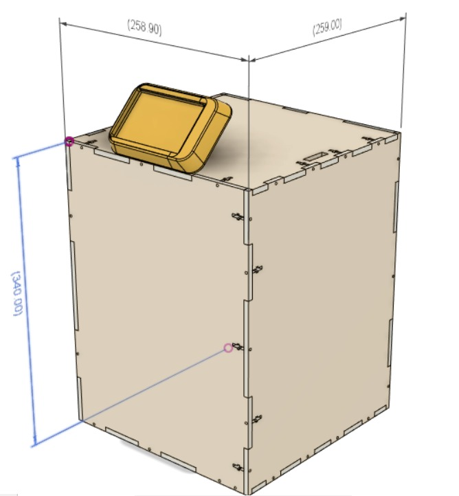

# Projeto 1 

!!! note "Entrega"
    Entregar primeira aula após AI.
    
!!! info 
    - Em dupla
    - Não pode repetir dupla, mas pode fazer par com colega do outro lab.

    Cria repositório via classroom: https://classroom.github.com/g/0M_7xFQT
    
O projeto de computação Embarcada é de escopo fechado e tem como principal objetivo fazer com que vocês passem por todo o ciclo de desenvolvimento de um protótipo de um dispositivo embarcado: especificação :arrow_right: implementação :arrow_right: problemas :arrow_right: teste :arrow_right: problemas :arrow_right: finalização.

Neste projeto vocês terão que criar um controle remoto bluetooth, controlado pelo kit de desenvolvimento usado na disciplina (SAME70-XPLD), com a adição de um módulo externo bluetooth HC-05.

Algumas restrições serão impostas ao projeto com a finalidade de facilitar o desenvolvimento, pois estamos trabalhando de casa e não temos muitos recursos (componentes, equipamentos de testes, ...).

A entrega do projeto deve ser um protótipo funcional, e deve possuir todas as funcionalidades esperadas (e especificadas), descrito no folder do controle.

<!--
## Máquina de venda automática

A máquina de venda deve ser um sistema autônomo que permite a um usuário escolher entre **dois** ou mais itens e comprar **uma** ou mais unidades desse item. O "pagamento" será realizada via um `app android` com pagamento via `bluetooth`. A seleção dos itens deve ser feita na própria máquina via uma interface homem máquina (IHM). 

Características principais:

- Autônoma 
- Pagamento via `app - bluetooth`
- Ao menos dois produtos diferentes
- Mais de um item do mesmo produto disponível.

A seguir algumas ideias de venda:

- Filamento impressora 3D
- Materiais de papelaria (lápis/ caneta/ ...)
- Criptomoedas
- Doces
- Poesias 
- ....

Rubricas e detalhes de projeto no [folder Vending Machine](https://github.com/Insper/ComputacaoEmbarcada/blob/master/Projeto%201/Folder-VendingMachine.pdf)

<embed src="https://insper.github.io/ComputacaoEmbarcadaa/Projeto-1/Folder-VendingMachine.pdf" type="application/pdf" width="500" height="375">

!!! tip
    Para acelerar o desenvolvimento desse projeto, disponibilizamos um projeto mecânico 'padrão', que pode ser editado para adequação a ideia de vocês. Esse projeto está no repositório da disciplina: `Projeto-1/VendingMachine` (3D e pdf para corte na laser).
    
    {width=300}
    
    O material a ser utilizado é [foam board](https://www.printi.com.br/blog/foam-board-o-que-e-e-como-utilizar)
    
    > Esse protótipo foi desenvolvido pelo Luiz do FabLab
-->

## Controle remoto

O controle deve ser um dispositivo que permita controlar remotamente um programa (pode ser um jogo) que estará sendo executado em um PC e deve ser feito específico para a aplicação em questão. A interface do controle com o computador será via `bluetooth` com um exemplo em `python` que emula um teclado/ mouse/ joystick. O controle deve possuir entradas (botões/ analógicos/ ....) e saídas (vibra/ LCD/ áudio/ ....).

Características principais:

- Ao menos 4 entradas digitais e uma analógica
- Deve fornecer feedback (saídas digitais) ao usuário no próprio controle
- Customizado para a aplicação 
- Interface via bluetooh 

A seguir algumas ideias de controle:

- Vídeo (youtube/ netflix/ VLC)
- Música (spotify)
- ROS (robô robótica/ drone)
- Jogos (emulador)
    - Mario
    - Minecraft 
    
- ...

<!--
!!! note
    Junto com a apresentação do sistema embarcado deve-se entregar um estudo (protótipo) do design mecânico do controle (ergonomia), vocês poderam utilizar ajuda do pessoal do fablab para isso.
-->

Rubricas e detalhes de projeto no [folder Controle](https://github.com/Insper/ComputacaoEmbarcada/blob/master/Projeto%201/Folder-controle.pdf)

## Começando

Vamos começar pensando um pouco no controle! Para isso, faça em dupla a atividade no mural:

https://app.mural.co/invitation/mural/elementos9119/1632086605145?sender=ub569a9273c6e285461187641&key=1815cea8-8e6e-4084-9be6-8b68d02a306b
