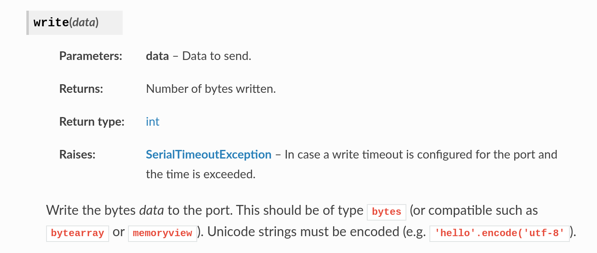

# Dicas

Dicas referente ao projeto 1

## Comunicação PC (python) -> microcontrolador

Umas das rubricas da entrega pede que o computador envie dados para o microcontrolador,
esse envio é feito da mesma maneira do recebimento dos dados, via a porta virtual COM gerado na comunicação com o bluetooth. 

### **python**

Para enviar um dado do python para a porta COM e então para o bluetooth utilize a função [self.ser.write()](https://pyserial.readthedocs.io/en/latest/pyserial_api.html#serial.Serial.write)



!!! tip
    Codifique em ASCII o dado a ser enviado pela serial em ASCII:`'hello'.encode('ascii')` ou em byte: `b'h'`.


### **Potenciômetro Logaritmico** (0% ~ 100%)

x = round(((data0 * (-65.25) - 255*65.25) /255)+65.25,2)

100 -> 4095

0 -> 0


### **microcontrolador**

Para receber um byte no firmware devemos usar a função `usart_read(USART_COM, &rx)` onde o primeiro parâmetro é a USART a ser lida e o segundo uma variável para salvar o valor, a função retorna `0` caso tenha lido um byte, conforme descrição da documentação a seguir:

```c
/**
 * \brief Read from USART Receive Holding Register.
 *
 * \note Before reading user should check if rx is ready.
 *
 * \param p_usart Pointer to a USART instance.
 * \param c Pointer where the one-byte received data will be stored.
 *
 * \retval 0 on success.
 * \retval 1 if no data is available or errors.
 */
uint32_t usart_read(Usart *p_usart, uint32_t *c) { .... }
```

Para verificar se existe um byte a ser lido na USART utilize a função a seguir:

```c
/**
 * \brief Check if the received data are ready.
 * Check if Data have been received and loaded into USART_RHR.
 *
 * \param p_usart Pointer to a USART instance.
 *
 * \retval 1 Some data has been received.
 * \retval 0 No data has been received.
 */
uint32_t usart_is_rx_ready(Usart *p_usart) {...}
```

