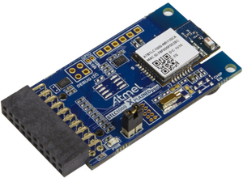
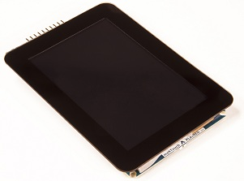

# Ferramental

Sobre o hardware e software utilizados no curso.

- Software: Microchip Studio
- Hardware: SAME70 (Cortex M7)

## Softwares

!!! warning "Linux e MAC"
    - A infra só funciona no Windows!
    - Se for virtualizar, não funciona no VirtualBox! Deve utilizar o **VMware** como máquina virtual (ou parallels).

O MicrochipStudio, IDE utilizado para programação dos microcontroladores ARM da microchip (usado no curso), é nativo **Windows**.

Se for virtualizar, utilizar o [VMware Player](https://my.vmware.com/en/web/vmware/free#desktop_end_user_computing/vmware_workstation_player/12_0) pois o VirtualBox possui problemas com o driver USB do gravador.

!!! note
    Até 2021 o nome do programa era AtmelStudio, mas recentemente mudou de nome para **Microchip** Studio .
    
{width=800}

Para mais infomrações sobre o software, acesse:

- https://www.microchip.com/en-us/development-tools-tools-and-software/microchip-studio-for-avr-and-sam-devices

### Windows 10

!!! note ""
    reservar **2h** para instalação
    
Instalar os seguintes softwares no Windows:

1. [Microchip Studio 7](https://www.microchip.com/content/dam/mchp/documents/parked-documents/as-installer-7.0.2542-web.exe) - Instalar a *versão WEB*
1. [Serial Port for MicrochipStudio](https://gallery.microchip.com/api/v2/package/EFC4C002-63A3-4BB9-981F-0C1ACAF81E03/2.8.4)
1. [git/github](https://desktop.github.com/)
        
### Linux/ MAC

!!! note ""
    reservar **4h** para instalação

1. Instalar o VMWare player e instalar o Windows 10 na máquina virtual.
    - MAC, pode usar o Parallels para virtual.
    - **NÃO USAR VIRTUALBOX, [USAR VMWARE PLAYER](https://www.vmware.com/products/workstation-player.html)**
1. Efetuar o boot no pendrive.
1. Instalar os softwares listados na secção Windows.

!!! warning "Alerta para usuários de Linux e Windows"
    Não funciona no VirtualBox! Deve utilizar o VMware como máquina virtual

## Kit de desenvolvimento - ATSAME70-XPLD

O kit de desenvolvimento escolhido para o curso é o *SAM E70 Xplained*
[^3] desenvolvido pela Microchip e possui como principais características:

- SAM-E70 high-performance ARM Cortex-M7 core-based MCU
- Ethernet, HS USB, SD card
- Embedded debugger

{width=300}

### Arquitetura do uC

1.  **Processador ARM:** Possui ampla dominação do mercado de
    microprocessadores/controladores[^1]; não é exclusivo de um único
    fabricante[^2]; arquitetura de 32 bits.

2.  **Cortex M:** família M é classificada como a de
    microcontroladores, possuindo uma arquitetura interna menos
    sofisticadas das demais (A,R), possibilitando um melhor entendimento
    de seu funcionamento.

## Hardware extras

Periféricos extras podem ser adicionados ao kit para incluir
funcionalidades tais como : bluetooth 4.0; wifi; LCD.

#### Bluetooth - BTLC1000 Xplained Pro Evaluation Kit

<http://www.atmel.com/pt/br/tools/ATBTLC1000-XPRO.aspx>\
Periférico para adicionar a comunicação bluetooth 4.0 ao kit de
desenvolvimento.

Especificação :

-   The Microchip® ATBTLC1000-MR110CA BLE module with 2.4GHz BLE4.1
    compliant ATBTLC1000A SoC (System on Chip)
-   On Board Temperature Sensor

{width=300}

#### WIFI - ATWINC1500-XPRO

- https://www.microchip.com/developmenttools/ProductDetails/ATWINC1500-XPRO

Módulo necessário para acrescentar comunicação wifi ao kit.

Especificação:

-   IEEE 802.11 b/g/n 20MHz (1x1) solution
-   Supports IEEE 802.11 WEP, WPA, and WPA2 Security
-   SPI, UART, and I2C host interface

#### LCD maXTouch Xplained Pro

https://www.microchip.com/developmenttools/ProductDetails/ATMXT-XPRO

Módulo para adicionar LCD colorido com touch screen ao kit de
desenvolvimento.

Especificação :

-   ILI9488 LCD Driver
-   480x320 Resolution
-   Parallel interface (up to 18-bits)
-   3 & 4 wire SPI interface
-   maXTouch capacitive touch screen controller

#### OLED1 Xplained Pro

- https://www.microchip.com/developmenttools/ProductDetails/atoled1-xpro

Módulo com OLED de 32 linhas.

-   OLED display 128x32 (SPI)
-   3 LEDs
-   3 push buttons

[^1]: <http://www.investopedia.com/stock-analysis/061115/3-key-numbers-arm-holdings-investors-need-know-armh.aspx>

[^2]: ARM não produz CIs mas fornece a arquitetura para fabricantes de
    chips (Microchip, Texas, Nvidia,...)

[^3]: https://www.microchip.com/developmenttools/ProductDetails/atsame70-xpld
