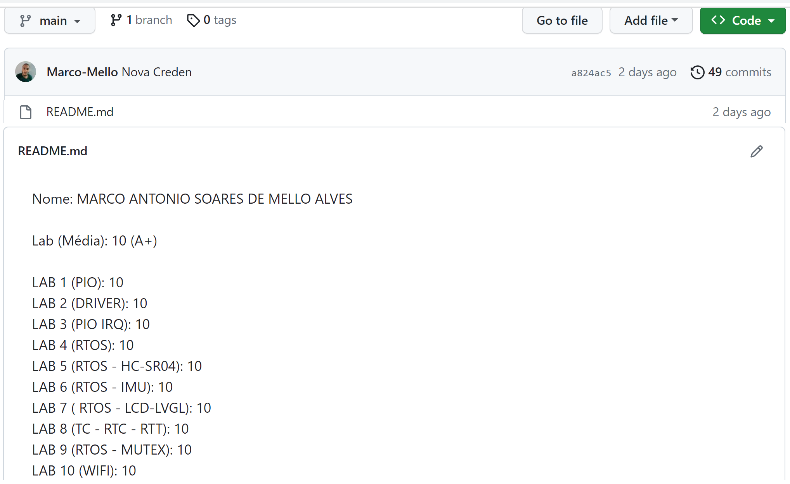

# Sistema de Notas 2023/2 (23b)

Sobre o sistema de notas.

## Repositório

!!! 23b-emb-notas
    Acesse o repositório e crie um classroom para seu usuário:
	https://classroom.github.com/a/pLhJ0KPj
	
O sistema de notas permite que você faça o acompanhamento das notas de suas entregas, por enquanto estamos liberando apenas as notas dos Labs.

Uma vez por semana (aproximadamente) rodamos um script que faz a aquisição das notas das entregas e realiza o commit no repositório respectivo do aluno, conforme a imagem abaixo:

