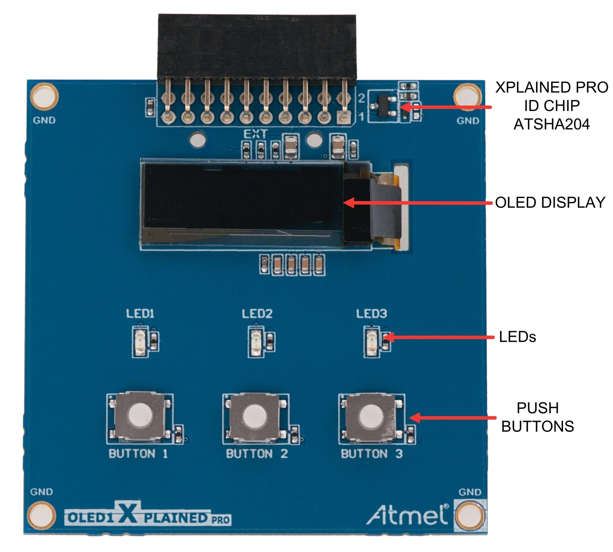

# AV1

Nesta avaliação iremos trabalhar com o módulo OLED1 (botões/ LEDs e Display), o mesmo já está disponível no repositório da avaliação. 

- Atualize o arquivo `ALUNO.json` com seu nome e e-mail e faça um commit imediatamente.

> Faça o seu trabalho de maneira ética!
> Você não deve consultar seus colegas
> Consulta liberada ao material da disciplina

- **A cada 30 minutos você deverá fazer um commit no seu código!**
    - Códigos que não tiverem commit a cada 30min ou que mudarem drasticamente entre os commits serão descartados (conceito I).
    - Você deve inserir mensagens condizentes nos commits!
- Duração: 3h

:triangular_flag_on_post: **Ao finalizar a entrega preencher o formulário (uma única vez!):**

- INSERIR LINK

## Descrição


Nessa avaliação vocês devem desenoliver um protótipo do jogo **Genius**, 
usando os três botões/Leds da placa OLED1.

{width=400}

O jogo deve ter o seguinte comportamento:

- Acender os LEDs em uma sequência pré definida
- Esperar que o jogador faça a mesma sequência nos botões e indicar quando:
    - houver uma sequência certa: Todos os LEDs acesos por um tempo e então começa uma nova sequência
    - houver uma sequência errada: Todos os LEDs piscam até o jogador apertar algum botão.
- O jogo deve possuir um nível de dificuldade com cinco estados.

Vocês devem seguir a estrutura de código a seguir:

- Interrupção nos botões
- Timeout: Usar RTT para implementar um TimeOut de 3 segundos na parte em que o jogador tem que fazer a sequência, se o jogador não apertar nenhum botão nesse tempo, o jogo trata como erro.

A sequência deve ser definida por um vetor, onde cada termo do vetor representa
qual LED será acionado:

``` c
 
 // leds
 enum LED {LED1 = 1, LED2, LED3} LEDS;

 // sequência: LED1, LED2, LED2, LED3, LED1, LED3
 int seq0[] = {LED1, LED2, LED2, LED3, LED1, LED2};
 int seq0_len = sizeof(seq0)/sizeof(seq0[0])-1;
```

Vocês devem desenvolver e usar as seguintes funções no código de vocês:

``` c
/**
 * Função para tocar a sequência 
 * seq[]  : Vetor contendo a sequencia (exe: seq0)
 * seq_len: Tamanho da sequência (exe: seq0_len)
 * delay  : Tempo em ms entre um led e outro
 *
 * Return 0 em caso de sucesso e 1 em caso de erro
*/
int genius_play(int seq[], int seq_len, int delay);

/**
 * Função que aguardar pelos inputs do usuário
 * e verifica se sequencia está correta ou houve
 * um erro.
 *
 * A função deve retornar:
 *  0: se a sequência foi correta
 *  1: se teve algum erro na sequência (retornar imediatamente)
 */
int user_play(int seq[], int seq_len);

/**
 * Função que exibe nos LEDs que o jogador acertou
 * Deve manter todos os LEDs acesos por um tempo
 * e então apagar
 */
void player_sucess(void){

}

/**
 * Função que exibe nos LEDs que o jogador errou
 * Deve piscar os LEDs até o usuário apertar um botão
 */
void player_error(void){

}
```

Em caso de:

- **sucesso**, os LEDs devem ficar todos acesos por um tempo e então apagar e começar o jogo com a nova sequência.

- **erro**, os LEDs devem ficar piscando até o usuário apertar um botão, e então começar novamente o jogo.
 
## Rubricas

Vocês devem gravar um vídeo do firmware funcionando na placa para submeter o projeto.

### C

- Jogo possui um nível de dificuldade (uma única sequência)
- Jogo exibe a sequência nos LEDs
- Jogo aguardar por usuário e verifica sequência
- Desenvolveu e usou as funções: `genius_play` e `user_play`
- Timeout de 3 segundos na função `user_play` (entre um botão e outro o jogador não pode levar mais de 3 segundos).
- Em caso de acerto: Mantém os LEDs acesos e depois apaga e começa uma nova sequência
- Em caso de erro: Pisca todos os LEDs até o usuário apertar algum botão
- Botões funcionando com interrupção

### Extras (cada item + meio conceito):

- Mais um nível de dificuldade
- Se usuário apertar qualquer botão durante a vez do genius (`genius_play()`), interrompe e exibe que o jogador errou
- LEDs piscam com TC
- LED acende quando jogador aperta o botão
- N sequência, sendo N configurável por código
- Exibe no OLED a quantidade de acertos e erros
- A cada jogo, gera uma sequência nova
    - dica: use a função [`rand()`](https://www.tutorialspoint.com/c_standard_library/c_function_rand.htm)
