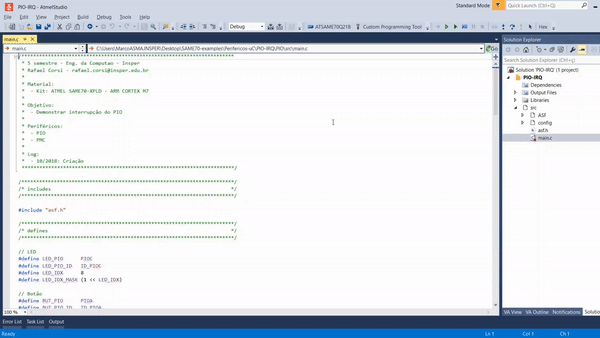
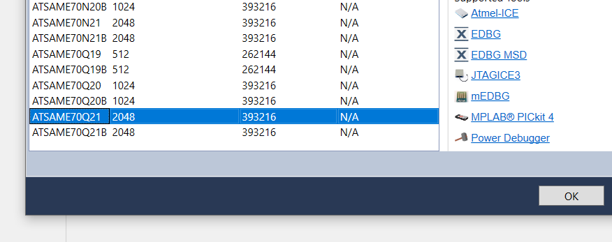

- Marco Mello

- 24/03/2020
- Computação Embarcada

# SAME70-XPLD - Erros de Utilização

Aqui estão listados os erros mais frequentes na utilização da placa SAME70-XPLD.

## 1) DEBUG USB x TARGET USB

### - Debug USB

Interface USB utilizada para transferir o programa, e também para realizar o Debug via EDBG.

### - Target USB

Interface USB de alta velocidade (USB high speed interface).

OBS: Essa interface USB não realizar a gravação do chip.

## 2) ATSAME70Q21 (Rev. A e Rev. B)

As placas SAME70-XPLD possuem o Microcontrolador ATSAME70Q21, contudo ele possui 2 versões, a ATSAME70Q21 (Rev. A) e a versão ATSAME70Q21**B** (Rev. B). Caso a versão não esteja correta na IDE Atmel Studio, o código a ser transferido para a placa pode não ser gravado corretamente e pode até nem ser reconhecida pela IDE.

### - Identificando a versão de sua placa SAME70-XPLD

Basta olhar o código impresso em cima do CI do Microcontrolador:

|                            REV. A                            |                            REV B                             |
| :----------------------------------------------------------: | :----------------------------------------------------------: |
| .jpg) | .jpg) |

### - Alterando a versão na IDE Atmel Studio

Para alterar a versão do chip dentro do Atmel Studio basta realizar os seguintes passos:

1. Clique no botão Device:

2. Clique no botão Change Device:

3. Selecione a versão correta do chip e clique em OK, agora seu gravador(EDBG) deverá ser reconhecido pela IDE:

5. Dentro da aba Tools, vá até o menu drop-down **Select debugger/programmer** e selecione o seu gravador, no caso desse gif:

## 3) J200 - Chip Erase Header

_2.jpg)

Esse jumper quando conectado apaga o conteúdo da memória flash do chip (programa). Ele deve ficar conectado somente para essa finalidade, caso o jumper esteja conectado e tente-se transferir o programa para a placa, o mesmo não será gravado:

> 
