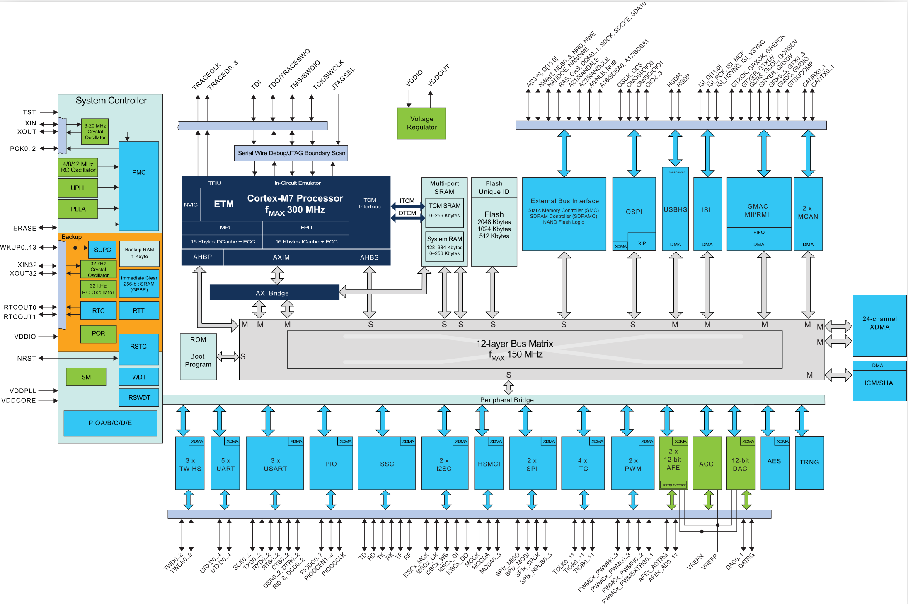

Quando trabalhamos com computação embarcada, devemos ter um conhecimento mais profundo do alvo do programa (hardware) já que não existe uma camada de abstração de hardware (HAL) tal como em um sistema operacional  de alto nível (Linux, Windows, Android, ...).

O correto entendimento do sistema é crucial para o bom funcionamento do programa, pois a aplicação interfaceia diretamente com o mundo externo, manipulando entradas e saídas do sistema (Input e Output = I/O). Esses I/Os podem estar conectados a atuadores, sensores, memórias, interface com o usuário, protocolos de comunicação e muito outros dispositivos que em conjunto formam um sistema embarcado.

Podemos classificar esse entendimento em 3 níveis:

1. Hardware (Placa de circuito Impresso - PCB)
2. Microcontrolador
3. Programa (firmware)
4. Aplicação 

O hardware é um conjunto de componentes eletrônicos (microcontrolador inclusive) que forma uma eletrônica embarcada. No hardware estão partes como: fonte de alimentação, memórias externas, conectores, LCD.

O microcontrolador é o dispositivo central do hardware, sendo o responsável pelo controle e supervisão dos demais componentes da placa. O firmware é o código executado pelo microcontrolador que é capaz de manipular e processar sinais do mundo externo.

## SAME70 (microcontrolador Arm)

Com um mercado de 16.5 bilhões de dólares em 2013 [^1] existe uma enorme diversidade de microcontroladores, cada um com uma especificidade. Conhecer o alvo do seu código é um fator primordial para o funcionamento correto do sistema.

Os microcontroladores ofertados pelo mercado diferenciam-se principalmente pela sua arquitetura (CORE), quantidade de memória interna (RAM, ROM), e pelos periféricos que o compõem.

## Periféricos

Periféricos são pequenos dispositivos eletrônicos que junto com a unidade de processamento (CORE) e memórias compõem um microcontrolador. Os periféricos são responsáveis por executar tarefas simples simultaneamente ao processamento principal do CORE, muitas vezes, adicionam funcionalidades extras ao sistema, tais como: conversor analógico digital (A/D), protocolo de comunicação I2C, USB, ... .

A boa utilização dos periféricos torna o código mais robusto e permite a otimização da utilização do processamento do microcontrolador, um mau uso desses periféricos pode tornar o projeto inviável, mesmo com o melhor processador do mercado. Fig. [fig:cortexE70] ilustra a arquitetura interna do microcontrolador SAM-E70, e seus periféricos.

## SAM-E70-XPLD hardware

Utilizaremos ao longo do curso um kit de desenvolvimento (hardware) desenvolvida pela Atmel chamada de SAM-E70 XPLD, esse kit possui em seu núcleo o processador ARM Cortex-M7, e algumas outras funcionalidades tais como: memória externa, SD-Card, Ethernet, USB. Essas funcionalidades extras são também chamadas de periféricos, mas agora não sendo referido aos periféricos do uC mas sim aos periféricos da placa.
